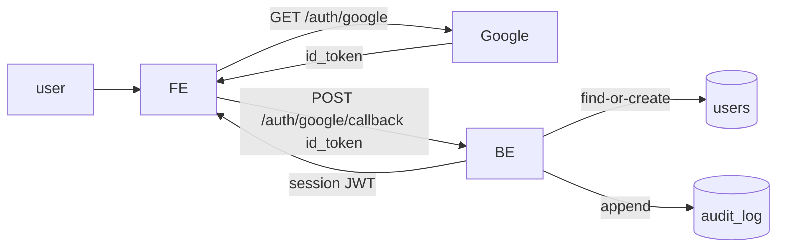

# SP3 — Google OAuth Sign-In

> **This is a worked example.** Filled-in counterpart to `.claude/examples/example-discovery.md`. Three vertical-slice tasks at varying point levels.

## Metadata
| Field | Value |
|-------|-------|
| **Sprint** | SP3 |
| **Status** | planning |
| **Start Date** | 2026-04-22 |
| **End Date** | 2026-05-06 |
| **Team** | flame, jordan |
| **Epic Owner** | flame |
| **Origin** | docs/discovery/disc-007-google-oauth-signin.md |

## Team Capacity
| Person | Available days | Notes |
|--------|---------------|-------|
| flame | 8 | -2d for on-call rotation |
| jordan | 9 | full availability |

- **Total SP committed:** 11
- **Buffer:** 20% (~2pt) — kept for issue rounds

## Problem Statement

38% of free-tier signups abandon at password creation; password-reset is the most-frequent support ticket category. Adding "Continue with Google" removes the friction for new users and gives returning users a recognized re-entry point.

## Goals
1. Ship production-ready Google OAuth on signup + login screens.
2. Auto-link existing email/password accounts when the Google email matches.
3. Reduce support load on password resets in the 30-day window after launch.

## Success Metrics
| Metric | Target | Measurement |
|--------|--------|-------------|
| Free-tier signup completion | ≥ 78% (baseline 62%) | `signup_started → signup_completed` funnel |
| Forgot-password tickets / week | ≤ 40% of pre-launch baseline | Support tag count |
| Auth-related incidents | 0 | SecOps incident log |

## Design References
- Figma: [oauth-signin-2026-04-21.fig]

## Scope

### In Scope
- "Continue with Google" button on `/signup` and `/login`.
- BE callback handler that creates-or-links the user, issues session JWT.
- Email auto-link logic when Google email matches existing user's email.
- Audit log entry for every link / signup / login event.

### Out of Scope
- Apple / GitHub providers (post-launch).
- Account-linking UI in user settings.
- SSO/SAML.

## Stories

| Task ID | User Story | Type | Depends On | Points | Status |
|---------|-----------|------|------------|--------|--------|
| SP3-T031 | As a prospective user, I want to sign up with my Google account, so that I don't have to create another password | feat | — | 5 | `todo` |
| SP3-T032 | As a returning user, I want clicking "Continue with Google" to log me in if my Google email matches my existing account, so that I don't end up with duplicate accounts | feat | SP3-T031 | 3 | `todo` |
| SP3-T033 | As an admin, I want every OAuth signup / login / link event written to the audit log, so that I can investigate incidents | feat | SP3-T031 | 3 | `todo` |

### E2E Validation Scenarios

**SP3-T031 — Google sign-up happy path**
1. GIVEN a fresh user with a Google account on `/signup`
   WHEN they click "Continue with Google" and grant consent
   THEN they land on `/onboarding` with an authenticated session
2. GIVEN a user denies Google consent
   WHEN they return from the consent screen
   THEN they land back on `/signup` with an inline message "Google sign-in cancelled"

**SP3-T032 — Email auto-link**
1. GIVEN an existing user `priya@example.com` with email/password
   WHEN she clicks "Continue with Google" using her `priya@example.com` Google account
   THEN she is logged in to her existing account, no duplicate created, audit log records `oauth_link` event
2. GIVEN a user whose Google email differs from any existing account
   WHEN they sign in
   THEN a new account is created with the Google email

**SP3-T033 — Audit log coverage**
1. GIVEN any OAuth event (signup, login, link)
   WHEN the event completes
   THEN an entry exists in `audit_log` with `actor_id`, `event_type`, `provider`, `timestamp`, `ip`
2. GIVEN the audit log write fails
   WHEN the OAuth flow is otherwise successful
   THEN the user's session is still issued, the failure is logged at WARN level, and SecOps gets a paged alert

## Architecture Overview

## Architecture Decision Records

### ADR-1: Use NextAuth Google Provider
- **Status:** accepted
- **Context:** We need Google OAuth on the web. We already use NextAuth for email/password.
- **Decision:** Adopt `GoogleProvider` from `next-auth`. BE exposes a single `/auth/google/callback` endpoint.
- **Consequences:** We rely on NextAuth's PKCE / state handling. We must monitor for breaking changes in major versions.

## Technical Constraints
- Refresh tokens encrypted at rest (existing `crypto/aes` helper).
- No tokens in localStorage — HttpOnly cookie only.
- `users.email` retains uniqueness invariant.

## Risks & Mitigations
| Risk | Likelihood | Impact | Mitigation |
|------|-----------|--------|------------|
| Email collision with case mismatch (`Priya@…` vs `priya@…`) | medium | medium | Lowercase email at lookup; backfill existing rows. |
| Google API outage on launch day | low | high | Feature-flag the button; email/password stays available. |

## Definition of Done (Sprint Level)
- [ ] All 3 stories `done`.
- [ ] Free-tier signup completion measurable in production analytics.
- [ ] Audit log coverage verified for all 3 event types.
- [ ] No new dependencies flagged by `/dependency-update` audit.
- [ ] Sprint retro written and brain entries reviewed.
