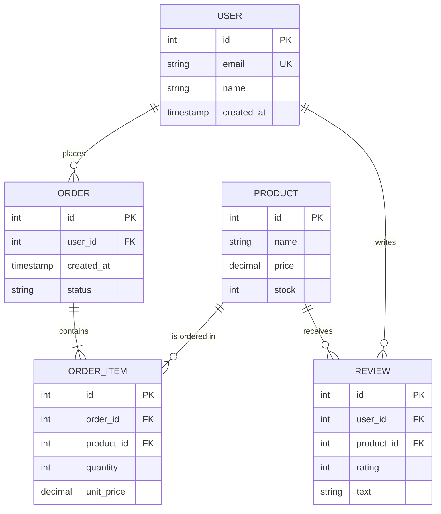

# Data Modeling

Principles and patterns for designing effective database schemas.

## Entity-Relationship (ER) Diagrams

ER notation represents entities, attributes, and relationships:

```
Entity (Box):
┌─────────────┐
│    User     │
├─────────────┤
│ id (PK)     │
│ email       │
│ created_at  │
└─────────────┘

Cardinality Indicators:
────  One
───O  Zero or One
───∞  Many (N)

Example:
  User (1) ───── (∞) Order
  One user can have many orders
```

### Mermaid ER Diagram Example



## Normalization

Process of organizing data to reduce redundancy and improve integrity.

### 1NF (First Normal Form)
- All values are atomic (no repeating groups)
- Each column has only one value per row

❌ **Not 1NF**:
```
User | Tags
1    | ['admin', 'editor']
```

✓ **1NF**:
```
User | Tag
1    | admin
1    | editor
```

### 2NF (Second Normal Form)
- Must be 1NF
- All non-key columns depend on the **entire** primary key, not just part of it

❌ **Not 2NF** (assuming PK is user_id + tag_id):
```
user_id | tag_id | tag_name | user_email
1       | 5      | admin    | alice@example.com
```

Problem: tag_name depends only on tag_id, not the full key.

✓ **2NF**:
```
-- user_tags table
user_id | tag_id
1       | 5

-- tags table
tag_id | tag_name
5      | admin

-- users table
user_id | email
1       | alice@example.com
```

### 3NF (Third Normal Form)
- Must be 2NF
- Non-key columns depend only on the primary key, not on other non-key columns

❌ **Not 3NF**:
```
user_id | email | city | country
1       | alice | NYC  | USA
```

Problem: country is derivable from city (transitive dependency).

✓ **3NF**:
```
-- users
user_id | email | city_id
1       | alice | 42

-- cities
city_id | name | country
42      | NYC  | USA
```

### BCNF (Boyce-Codd Normal Form)
- Stricter than 3NF
- Useful for edge cases; rarely needed in practice

## Denormalization

When to relax normalization:

| Reason | Trade-off | Example |
|--------|-----------|---------|
| **Read-Heavy Workload** | Write complexity for read speed | Cache user_count on Team |
| **Analytics** | Query simplicity over storage | Star schema (pre-joined data) |
| **NoSQL Transition** | Fit document structure | Embed order_items in order doc |
| **Reporting** | Separate OLTP from OLAP | Denormalize to data warehouse |

```sql
-- Denormalized for fast reads
CREATE TABLE team_stats AS
SELECT
  team_id,
  COUNT(DISTINCT user_id) as user_count,
  SUM(total_revenue) as revenue
FROM users u
JOIN teams t ON u.team_id = t.id
GROUP BY team_id;

-- Update on every user change (write cost)
-- But fast dashboard queries (read benefit)
```

## Schema Design Patterns

### Single Table Design

Store multiple entity types in one table with a discriminator:

```sql
CREATE TABLE entities (
  id BIGINT PRIMARY KEY,
  type VARCHAR(50), -- 'user', 'product', 'order'
  data JSONB, -- flexible attributes
  created_at TIMESTAMP
);

-- Queries filter by type
SELECT * FROM entities WHERE type = 'user' AND data->>'email' = 'test@example.com';
```

**Pros**: Flexible, no joins. **Cons**: Type safety, indexing complexity.

### Polymorphic Associations

Store relationships to multiple entity types:

```sql
CREATE TABLE comments (
  id BIGINT PRIMARY KEY,
  commentable_type VARCHAR(50), -- 'post', 'photo'
  commentable_id BIGINT, -- ID in posts or photos table
  content TEXT
);

-- Get comments on Post #5
SELECT * FROM comments
WHERE commentable_type = 'post' AND commentable_id = 5;
```

**Caution**: No FK constraints across types; requires application-level logic.

## NoSQL Data Modeling

### Document (MongoDB)

```javascript
{
  "_id": ObjectId("..."),
  "user_id": 123,
  "items": [
    { "product_id": 1, "qty": 2, "price": 50 },
    { "product_id": 3, "qty": 1, "price": 30 }
  ],
  "total": 130,
  "status": "pending",
  "created_at": ISODate("2026-03-25")
}
```

**When**: Read-heavy, nested data, flexible schema. **Cost**: Duplication, updates harder.

### Key-Value (Redis)

```
user:123 → {name: "Alice", email: "alice@example.com"}
user:123:orders → [5, 10, 15]
```

**When**: Real-time, caching, sessions. **Cost**: No complex queries.

### Wide-Column (Cassandra)

```
Row Key: user_123
  ├─ name: "Alice"
  ├─ email: "alice@example.com"
  ├─ 2026-03-25: {action: "login"}
  └─ 2026-03-24: {action: "purchase"}
```

**When**: Time-series, write-heavy, distributed. **Cost**: Complex queries hard.

### Graph (Neo4j)

```
(User {name: "Alice"})
  -[:PLACED]->
(Order {id: 123})
  -[:CONTAINS]->
(Product {name: "Widget"})
```

**When**: Relationships, recommendations, social networks. **Cost**: Not for simple CRUD.

## Data Warehouse Schemas

### Star Schema

```
           ┌─────────────┐
           │  Fact Table │
           │   (Sales)   │
           └─────────────┘
              /   |   \
             /    |     \
        Dim Time  |  Dim Store
                Dim Product
```

- **Fact table**: central (transactions, sales)
- **Dimension tables**: context (date, location, product)
- **Fast for**: OLAP queries, dashboards

### Snowflake Schema

Dimension tables are normalized (reduces redundancy, slower queries).

```
Fact Table → Dim Product → Dim Category
                        → Dim Supplier
```

**Star vs Snowflake**: Star is denormalized (faster), Snowflake is normalized (smaller).

## Practical Guidelines

1. **Start normalized**: Design for 3NF, then denormalize only where measured beneficial
2. **Identify access patterns**: OLTP vs OLAP, read/write ratio, query patterns
3. **Plan for growth**: Partitioning strategy early (date-based, hash-based)
4. **Choose the right tool**: SQL for structured, NoSQL for flexible, Graph for relationships
5. **Use surrogate keys**: INT/BIGINT PKs instead of natural keys (easier to change business rules)
6. **Avoid soft deletes unless required**: Hard delete simpler; soft delete adds query complexity

## See Also

- [[CON-sql-fundamentals]] — queries, indexes
- [[CON-database-patterns]] — caching, replication
- [[CON-scalability-patterns]] — sharding, partitioning
