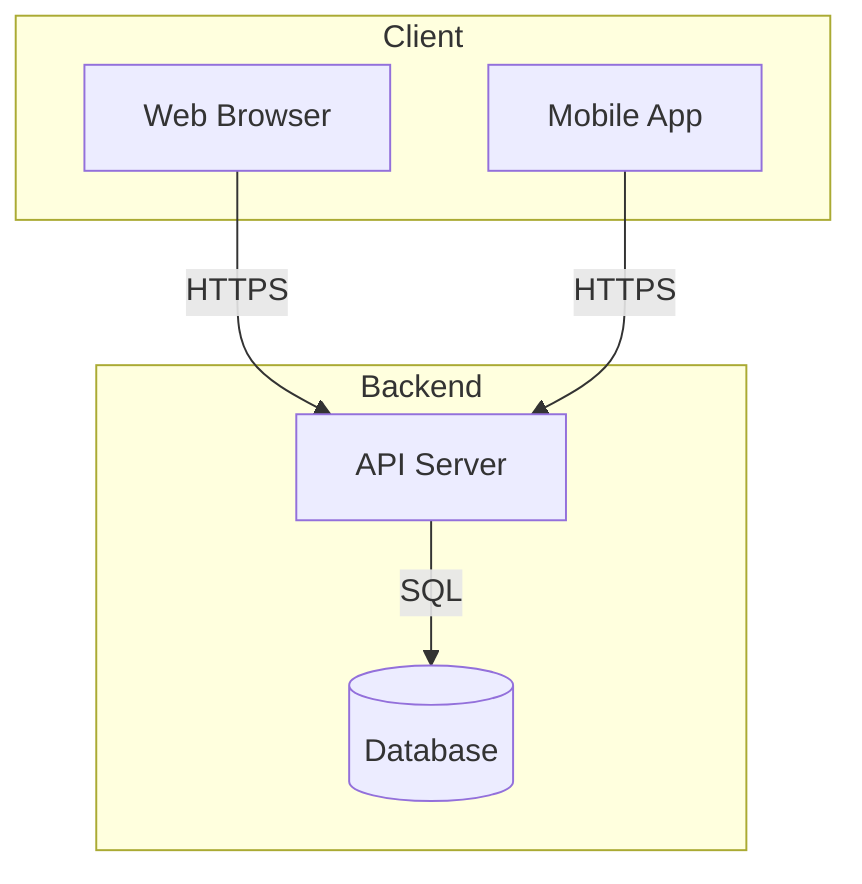
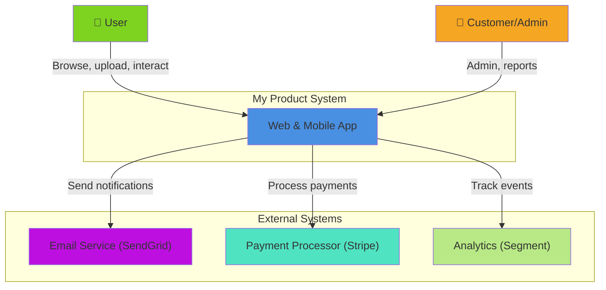

# Architecture Diagrams: C4 Model

Good diagrams communicate architecture to both technical and non-technical audiences. The C4 Model provides a structured approach at four levels of abstraction.

## The C4 Model Overview

**C4 = Context, Container, Component, Code**

Each level zooms in; use the appropriate level for your audience:

```
Level 1: Context (What is the system?)
Level 2: Container (How is it decomposed?)
Level 3: Component (What are the internal pieces?)
Level 4: Code (Class diagrams, sequence flows)
```

## Level 1: Context Diagram

**Audience:** Everyone (executives, customers, architects)

**Shows:** System boundaries, external systems, users

**Elements:**
- Your system (center)
- Users/actors (left)
- External systems (right)
- Data flows (arrows)

**Example Diagram:**

```
[User]
   |
   | Opens browser, uploads data
   v
[========== MyApp System ==========]
   |
   | Fetches reports, stores data
   v
[Reports Database]

[Customer]
   |
   | Calls API
   v
[========== MyApp System ==========]
   |
   | Sends notifications, logs data
   v
[Email Service] [Analytics Service]
```

**When to use:** Initial discovery, pitches, stakeholder alignment.

## Level 2: Container Diagram

**Audience:** Technical and product teams

**Shows:** Major components, technologies, connections

**Elements:**
- Containers (frontend, backend, database, etc.)
- Technologies used
- Data flow
- External dependencies

**Example Diagram:**

```
[Web Browser]
   |
   | HTTPS (JSON/REST)
   v
[Frontend React App]
   |
   | HTTPS API calls
   |
   +---> [API Server (Node.js)]
         |
         +---> [PostgreSQL Database]
         |
         +---> [Redis Cache]
         |
         +---> [Message Queue (RabbitMQ)]
              |
              +---> [Email Worker]
```

**When to use:** Technical design, deployment planning, scaling decisions.

## Level 3: Component Diagram

**Audience:** Developers and architects

**Shows:** Internal system structure, responsibilities, dependencies

**Elements:**
- Components (logical groupings)
- Interfaces/contracts
- Dependencies between components
- Technology details

**Example Diagram:**

```
[API Server]
├─ [Auth Controller]
│  └─ Uses: AuthService
├─ [Report Controller]
│  └─ Uses: ReportService
├─ [User Controller]
│  └─ Uses: UserService
├─ [Services]
│  ├─ AuthService (handles JWT, OAuth)
│  ├─ ReportService (generates, caches reports)
│  └─ UserService (CRUD, validation)
└─ [Data Access]
   └─ UserRepository, ReportRepository
```

**When to use:** System design reviews, before implementation, onboarding new engineers.

## Level 4: Code Diagram

**Audience:** Developers implementing

**Shows:** Classes, methods, detailed sequences

**Elements:**
- Classes and interfaces
- Method signatures
- Inheritance hierarchy
- Execution flow

**When to use:** Complex algorithms, interaction patterns, before deep implementation.

## Diagram Types Beyond C4

### Sequence Diagrams

Show step-by-step interactions over time.

**Use:** Complex workflows, error scenarios, integrations

```
User -> Frontend: Click "Login"
Frontend -> API: POST /login (credentials)
API -> AuthService: validate(email, password)
AuthService -> Database: Query user
Database --> AuthService: User found
AuthService --> API: JWT token
API --> Frontend: {token: "..."}
Frontend -> User: Redirect to dashboard
```

### Data Flow Diagrams (DFD)

Show data movement without technology specifics.

```
[User] -> (1.0 User Registration) -> [User DB]
[User] -> (2.0 Login) -> [Auth Service] -> [Session Store]
[Batch Job] -> (3.0 Generate Reports) -> [Report Cache]
```

### Deployment Diagram

Show how components run on infrastructure.

```
[Development]
├─ Frontend running on localhost:3000
├─ Backend running on localhost:8000
└─ PostgreSQL running on localhost:5432

[Production]
├─ Frontend on CloudFront CDN
├─ API servers (3) behind ALB
├─ RDS Multi-AZ Database
└─ ElastiCache for Redis
```

## Tool Recommendations

### Mermaid (Code-as-Diagram)

Write diagrams in Markdown; renders to images.

**Pros:** Version control friendly, no license, integrates with docs
**Cons:** Limited styling, steep learning curve

**Example:**


### Draw.io

Free, browser-based diagramming tool.

**Pros:** Easy to use, powerful, free
**Cons:** Requires UI tool; harder to version control

### Structurizr

Dedicated C4 diagramming tool.

**Pros:** Built for C4, beautiful output, modeling language
**Cons:** Paid, learning curve

## Diagram-as-Code Philosophy

Keep diagrams in code (Mermaid, PlantUML) for several reasons:

✅ **Version controlled** — Track changes, diffs visible
✅ **Reviewable** — PR comments on architecture
✅ **Maintainable** — Update once, renders everywhere
✅ **CI/CD friendly** — Generate docs automatically

❌ **Don't:** Store .pptx or .drawio files in repo (large, binary, unmergeable)

## Creating Effective Diagrams

### Do's
- ✅ One diagram per level (don't mix contexts and containers)
- ✅ Label edges with data/protocol (JSON, HTTP, SQL)
- ✅ Include a legend for technologies
- ✅ Add timestamps; diagrams age quickly
- ✅ Show external dependencies (email, payment gateways)

### Don'ts
- ❌ No dead-end systems (if it's there, it's used)
- ❌ No ambiguous arrows (label what data flows)
- ❌ No "magic" (if X talks to Y, show it)
- ❌ No old versions (delete outdated diagrams)

## Mermaid Example: C4 Context



## Related References

See [[CON-solution-design-process]] for when diagrams fit in the design process, [[CON-system-integration-patterns]] for common architectural patterns to diagram, and [[CON-technical-requirements]] for capturing requirements alongside architecture.
