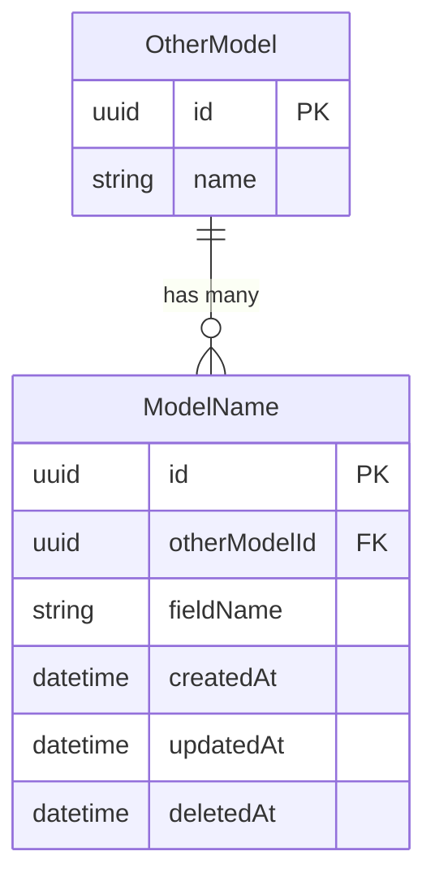
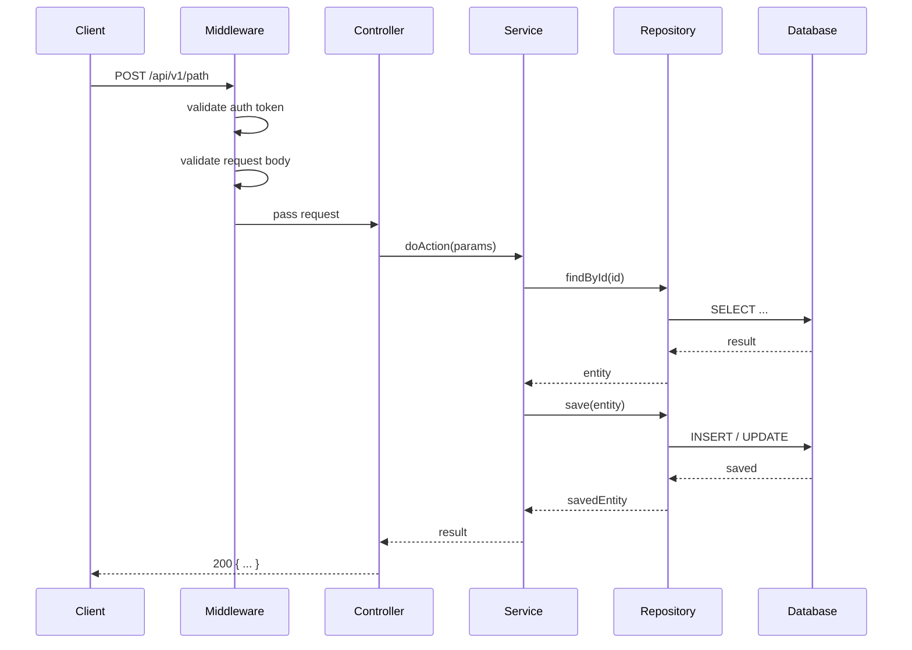
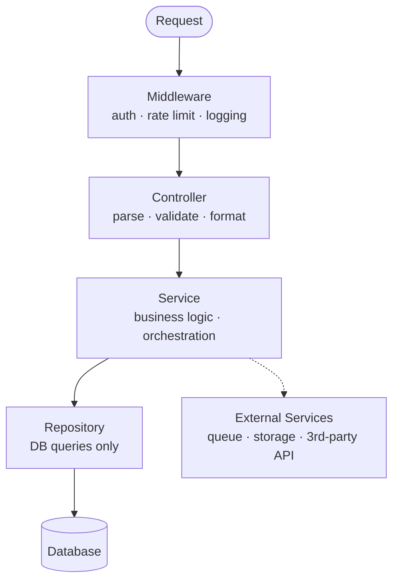

# [task-id] — [Title] — Backend Design

## Metadata
| Field | Value |
|-------|-------|
| **Requirement** | `docs/sprints/[sprint-id]/[task-id]/[task-id]-requirement.md` |
| **FE Design** | `docs/sprints/[sprint-id]/[task-id]/[task-id]-frontend.md` |
| **Assignee** | - |
| **Status** | draft / ready / implemented |

---

## API Endpoints
<!-- Define every endpoint this task introduces or modifies. Repeat block for each endpoint. -->

### `METHOD /api/v1/path`
- **Purpose:**
- **Auth required:** yes / no
- **Roles allowed:** admin / user / public
- **Idempotent:** yes / no _(for POST/PUT — can the same request be safely retried?)_
- **Rate limit:** X requests / minute per user

**Request body:**
```json
{
  "field": "type — description"
}
```

**Response (200):**
```json
{
  "field": "type — description"
}
```

**Error responses:**

| Code | Condition | Response body |
|------|-----------|---------------|
| 400 | Validation failed | `{ "error": "...", "code": "VALIDATION_ERROR", "fields": [...] }` |
| 401 | Not authenticated | `{ "error": "Unauthorized", "code": "UNAUTHORIZED" }` |
| 403 | Insufficient role | `{ "error": "Forbidden", "code": "FORBIDDEN" }` |
| 404 | Resource not found | `{ "error": "Not found", "code": "NOT_FOUND" }` |
| 409 | Conflict / duplicate | `{ "error": "...", "code": "CONFLICT" }` |
| 429 | Rate limit exceeded | `{ "error": "Too many requests", "code": "RATE_LIMITED" }` |
| 500 | Unexpected error | `{ "error": "Internal server error", "code": "INTERNAL_ERROR" }` |

---

## Authorization & Roles
<!-- Permission matrix — which roles can access which endpoints. -->

| Endpoint | public | user | admin | notes |
|----------|--------|------|-------|-------|
| `GET /api/v1/...` | ✓ | ✓ | ✓ | |
| `POST /api/v1/...` | ✗ | ✓ | ✓ | owner only |
| `DELETE /api/v1/...` | ✗ | ✗ | ✓ | |

---

## Input Validation Rules
<!-- Explicit validation per field. These map directly to 400 error cases and TDD test cases. -->

| Field | Type | Required | Rules | Error message |
|-------|------|----------|-------|---------------|
| `fieldName` | string | yes | min 3 chars, max 100 chars | "fieldName must be 3–100 characters" |
| `email` | string | yes | valid email format | "Invalid email address" |
| `amount` | number | yes | > 0, <= 1,000,000 | "Amount must be between 0 and 1,000,000" |

---

## Data Models
<!-- New or modified DB schemas. Include all fields, types, constraints, indexes, and relationships. -->



**Indexes:**
- `idx_modelname_field` on `(field)` — for lookup by field
- `idx_modelname_field_date` on `(field, createdAt DESC)` — for sorted queries

---

## Sequence Diagram



---

## Service / Layer Breakdown



| Layer | Responsibility |
|-------|---------------|
| **Middleware** | Auth token validation, rate limiting, request logging |
| **Controller** | Parse request, call service, format response |
| **Service** | Business logic, orchestration, validation rules |
| **Repository** | DB queries only — no business logic |
| **DB** | Persistence |

---

## Business Logic
<!-- Non-obvious rules, calculations, and decision flows. Number each rule. -->

1.
2.

---

## Event Publishing
<!-- Does this task emit any domain events or messages? Define topic, payload, and trigger. -->

| Event | Topic / Queue | Trigger | Payload | Consumer |
|-------|--------------|---------|---------|----------|
| `user.created` | `user-events` | after user saved to DB | `{ userId, email, createdAt }` | notification-service |
| - | - | - | - | - |

_If no events: write "None — this task does not emit events."_

---

## Error Handling Strategy
<!-- Where errors are caught and how they're returned. -->

- All errors return `{ "error": "message", "code": "ERROR_CODE" }`.
- Validation errors (400) include a `"fields"` array with per-field messages.
- Business logic errors thrown from Service layer, caught in Controller.
- Unexpected errors caught by global error handler → logged → return 500.
- Never expose internal error details or stack traces to the client.

---

## Security Considerations
<!-- Beyond auth/roles — input safety, rate limiting, data exposure. -->

- [ ] All user input sanitized before DB queries (no raw string interpolation)
- [ ] Rate limiting applied on write endpoints
- [ ] Sensitive fields (passwords, tokens) never returned in responses
- [ ] PII fields identified: [list fields] — ensure not over-exposed in logs
- [ ] File uploads (if any): type whitelist, size limit, stored outside webroot

---

## Logging & Observability
<!-- What to log, at what level, and which fields. -->

| Event | Level | Fields logged |
|-------|-------|--------------|
| Request received | `info` | method, path, userId, requestId |
| Validation error | `warn` | path, fields, userId, requestId |
| Business logic error | `warn` | message, code, userId, requestId |
| Unexpected error | `error` | message, stack, userId, requestId |
| Slow query (> 500ms) | `warn` | query, duration, table |
| Event published | `info` | topic, eventId, payload summary |

---

## Environment Variables
<!-- Every new env var this task requires. -->

| Variable | Description | Required | Default |
|----------|-------------|----------|---------|
| `VAR_NAME` | What it controls | yes / no | - |

---

## Caching Strategy
<!-- What is cached, cache key pattern, TTL, and how the cache is invalidated. -->

| Data | Cache key | TTL | Invalidated when |
|------|-----------|-----|-----------------|
| - | `prefix:id` | 5m | on update or delete |

_If no caching: write "None — this task does not introduce caching."_

---

## Database Migrations

**Up:**
```sql
-- describe what this migration does
```

**Down (rollback):**
```sql
-- revert the above change exactly
```

---

## TDD Test Plan
<!-- Write these BEFORE implementing. Integration tests use a real DB — no mocks. -->

| Test Case | AC | Type | Description |
|-----------|----|------|-------------|
| returns 200 with valid input | AC-1 | unit | |
| returns 400 when required field missing | AC-2 | unit | |
| returns 400 when field fails validation rule | AC-2 | unit | |
| returns 401 when token missing | — | unit | |
| returns 403 when role insufficient | — | unit | |
| returns 429 when rate limit exceeded | — | unit | |
| persists correct data to DB | AC-1 | integration | real DB |
| does not persist on validation failure | AC-2 | integration | real DB |
| publishes correct event after success | AC-1 | integration | check queue |

---

## External Dependencies
<!-- Third-party APIs, queues, storage, or services this task calls. -->

| Service | Purpose | Failure behavior | Timeout |
|---------|---------|-----------------|---------|
| - | - | fallback / error 503 | Xms |

---

## Performance & Scalability Notes

| Concern | Detail |
|---------|--------|
| Expected data volume | X rows/day, Y total |
| Query N+1 risk | [endpoint or query at risk] → use eager loading |
| Index strategy | [which fields need indexes and why] |
| Rate limiting | [X req/min per user on which endpoints] |
| Background job | [if any heavy operation should be async] |
