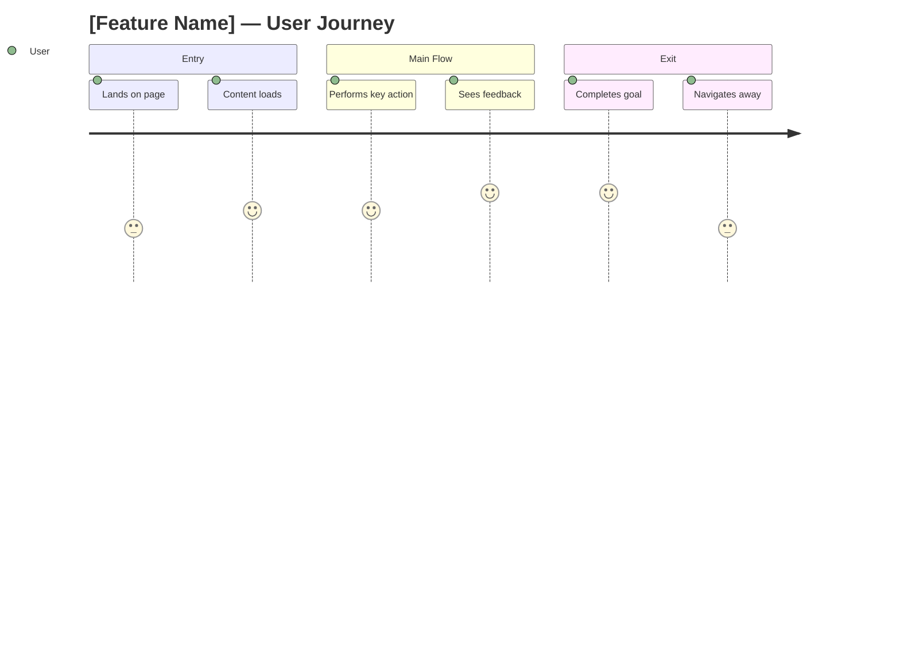
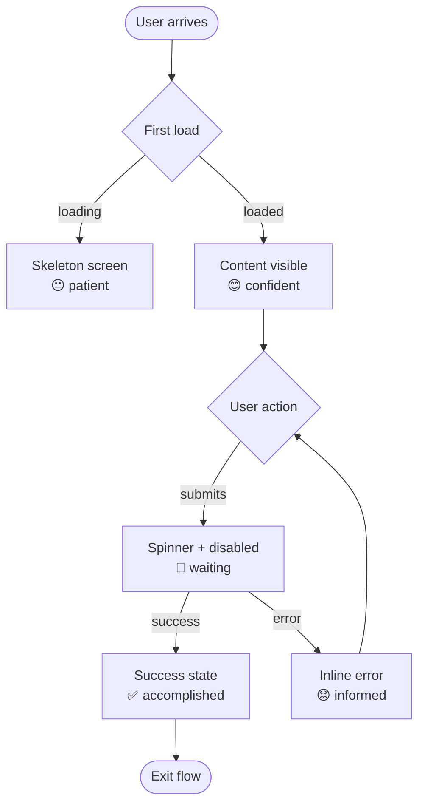
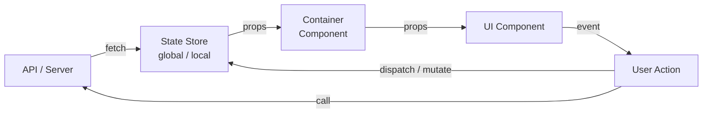

# [task-id] — [Title] — Frontend Design

## Metadata
| Field | Value |
|-------|-------|
| **Requirement** | `docs/sprints/[sprint-id]/[task-id]/[task-id]-requirement.md` |
| **Assignee** | - |
| **Status** | draft / ready / implemented |

## Design References
<!-- Figma frames, Storybook links, or screenshots. Be specific — link to the exact frame. -->
- Figma: [link]
- Storybook: [link]

## UI/UX Overview
<!-- Describe each screen, modal, or user flow this task introduces or changes. -->

## User Journey Map
<!-- Map the desired user journey (to-be state). Score 1–5 per step: 1=frustrated, 5=delighted. -->

**Entry point:** where does the user come from before this flow?
**Exit point:** where does the user go after this flow?

## Behavior Mapping
<!-- For each interaction: what the user does → what the UI does → intended feeling. -->

**Key behavioral goals:**
<!-- What habits to reinforce? What friction to remove? -->
-

## Routing & Navigation
<!-- List any new routes or changes to existing routes. -->

| Route | Component | Auth required | Notes |
|-------|-----------|---------------|-------|
| `/path` | `PageComponent` | yes / no | |

## Component Breakdown
<!-- List every component to create or modify. -->

| Component | File path | Type | Description |
|-----------|-----------|------|-------------|
| `ComponentName` | `src/components/...` | new / modify | |

## State & Data Flow
<!-- How does data move through this feature? Where does state live? -->

## API Contracts Consumed
<!-- Every backend endpoint this feature calls. Must align with be-design. -->

| Method | Endpoint | Request | Response | Error handling |
|--------|----------|---------|----------|----------------|
| GET | `/api/...` | - | `{ ... }` | show toast / redirect |

## Loading & Skeleton States
<!-- Describe loading UX for every async operation. -->

| State | Behavior |
|-------|----------|
| Initial load | Skeleton screen |
| Submitting form | Button disabled + spinner |
| Error | Inline error message |
| Empty | Empty state illustration + CTA |

## Responsive Behavior
<!-- Define layout changes across breakpoints. -->

| Breakpoint | Behavior |
|------------|----------|
| Mobile (< 768px) | |
| Tablet (768–1024px) | |
| Desktop (> 1024px) | |

## Analytics Events
<!-- Events to fire. Must match Analytics & Tracking section in requirement. -->

| Event name | Trigger | Payload |
|------------|---------|---------|
| `event_name` | user clicks X | `{ userId, ... }` |

## Performance Considerations
<!-- Lazy loading, code splitting, memoization, image optimization. -->
-

## TDD Test Plan
<!-- Write these BEFORE implementing. One row per test case. Map each to an AC. -->

| Test Case | AC | Type | Description |
|-----------|----|------|-------------|
| renders correctly | AC-1 | unit | snapshot or visual assertion |
| shows skeleton while loading | AC-1 | unit | |
| displays error message on API failure | AC-2 | unit | |
| user action dispatches correct event | AC-3 | integration | |
| mobile layout renders correctly | - | unit | |

## Edge Cases & Error States
<!-- List scenarios that need explicit handling. -->
- Network timeout:
- Empty list:
- Unauthorized (401):
- Server error (500):

## Accessibility Notes
<!-- Keyboard nav, focus management, ARIA labels, color contrast. -->
-
