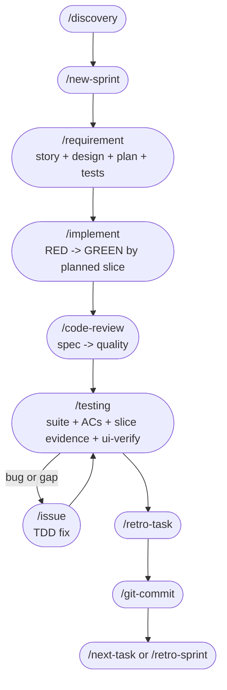

# Workflow Quick Reference

One-page manual for the current workflow template.
Authoritative command details live in `.claude/commands/`. The sequence contract lives in `.claude/rules/workflow.md`.

---

## A. Flow

### Canonical Single-Task Flow



### Plan-Driven Rule

After `/requirement`, one file becomes the task contract:
- `docs/sprints/[sprint-id]/[task-id]/[task-id]-requirement.md`

That doc must contain:
- story + ACs
- FE/BE design as applicable
- `Implementation Plan`
- `Execution Slices`
- `Plan Drift Guard`
- `TDD Test Plan`
- `E2E Test Plan` where applicable

From that point on:
- `/implement` works one slice at a time
- `/code-review` checks the diff against the plan
- `/issue` decides `in-plan bug` vs `return to /requirement`
- `/testing` requires both AC proof and slice proof
- `/git-commit` is blocked while slices remain open
- `/dev` uses the plan contract, not transcript memory, to keep going

### Parallel Flow

Use `/run-tasks` or `/run-tasks-p` only when stories are independent.

```text
/discovery -> /new-sprint -> /run-tasks [task-id...]
  Phase 1: /requirement per task
  Phase 2: /implement -> /code-review -> /testing per task
  Phase 3: /git-commit per task -> /retro-sprint
```

Never split one task across FE and BE agents. Split the task itself instead.

---

## B. Commands

| Command | Purpose | Output that must exist before next step |
|---------|---------|-----------------------------------------|
| `/discovery` | Understand problem, users, constraints, options | discovery doc with chosen approach |
| `/new-sprint` | Break discovery into sprint tasks, set Sprint Goal, draft estimates | sprint overview + BACKLOG update |
| `/requirement` | Read codebase and write the unified task doc | requirement doc with plan + slices + tests |
| `/implement` | Execute the next planned slice with TDD | code + green tests + closed slices |
| `/issue` | Fix a bug with verified RED before the fix | issue log + fix + updated slice/drift state |
| `/code-review` | Check spec compliance first, then quality/security | review summary with no unresolved criticals |
| `/testing` | Verify suite, AC coverage, slice proof, journey evidence | production readiness PASS |
| `/retro-task` | Capture what mattered from one task | retro doc |
| `/git-commit` | Stage selectively and commit with Conventional Commits | commit created; branch action chosen |
| `/next-task` | Load the next eligible todo task | task context card |
| `/retro-sprint` | Close sprint, evaluate outcomes, capture knowledge | sprint retro |
| `/dev` | Run the whole flow end-to-end with minimal interruption | completes sprint flow or stops on one of 3 official blockers |

Optional bridges:
- `/write-plan` if you want a second explicit plan file
- `/execute-plan` if you want superpowers-driven plan execution

---

## C. Hard Gates

These stop the workflow on purpose.

### 1. Discovery Gate

`/new-sprint` must not start until `/discovery` has:
- a chosen approach
- clear scope boundary
- blockers marked as either `blocking-for-planning` or `carry-forward-to-/requirement`

### 2. Requirement Gate

`/implement` must not start until `/requirement` has:
- measurable ACs
- real code-context paths
- non-empty `Implementation Plan`
- non-empty `Execution Slices`
- non-empty `Plan Drift Guard`
- planned tests

### 3. TDD Gate

No production code before:
- test written
- RED verified

### 4. Review Gate

`/testing` must not start while `/code-review` still has:
- unresolved critical findings
- unresolved material plan drift

### 5. Testing Gate

`/git-commit` must not start until `/testing` shows:
- `Production Readiness: PASS`
- every AC `READY`
- every execution slice `done`
- FE tasks: `ui-verify` evidence exists

### 6. Commit Gate

Never:
- `git add -A`
- `git add .`
- destructive branch cleanup

without explicit confirmation.

---

## D. `/dev` Autopilot

`/dev "intent"` runs:

```text
intent
-> /discovery
-> /new-sprint
-> for each task:
     /requirement
     /implement
     /code-review
     /testing
     /retro-task
     /git-commit
-> /retro-sprint
```

`/dev` asks only when:
- ambiguity remains
- a destructive operation is next
- `ui-verify` failed

If `Plan Drift Guard` clearly says the task must return to `/requirement`, reroute there automatically. Ask only if the drift decision itself is ambiguous.

Budget rule:
- target 30 minutes per sprint
- warn around 70% and 90%
- do not auto-pause; user decides whether to continue or scope down

---

## E. Plan Drift

Use `/issue` when the fix stays inside the current task contract:
- same ACs
- same user-visible outcome
- same API/public contract
- same rollout/risk shape

Return to `/requirement` when any of these changes:
- AC text
- user-visible workflow
- public/shared contract
- migration/auth/payment/risk surface
- task estimate or dependency shape
- file surface far beyond the planned slice

Shortcut rule:
- small bug = `/issue`
- changed task contract = `/requirement`

---

## F. Test Mix

Prefer:
- many small unit tests
- targeted integration tests with real dependencies
- a small number of end-to-end or journey tests

Do not rely mostly on E2E for feature completion. They are slower, harder to debug, and hide smaller bugs behind larger failures.

---

## G. Estimates

Sprint planning now captures both:
- story points for relative sizing
- draft ideal-day estimate for schedule awareness

Do not mechanically convert points to time.
Use the estimate to:
- compare against team capacity
- keep a 20% buffer
- split obviously oversized sprints before implementation starts

---

## H. Quick Decisions

**When do I read code deeply?**
- `/requirement` is the first deep code-reading step.

**When does design happen?**
- inside `/requirement`, not in separate `/design fe` or `/design be` commands.

**When do I run `ui-verify`?**
- in `/testing`, once the whole task is assembled.

**When do I commit?**
- after `/testing` PASS and closed slices.

**When do I use `/run-tasks`?**
- only when tasks are independent and do not share files/contracts.

**When do I use `/write-plan` / `/execute-plan`?**
- when the embedded Implementation Plan is not enough and you want a second explicit plan/executor flow.
