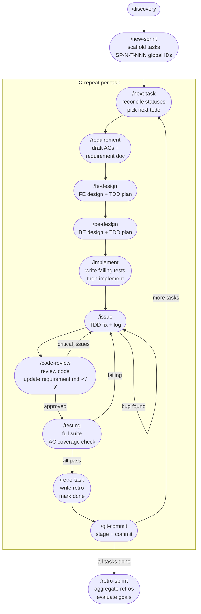

# Workflow Reference

## Full Flow



## ID Format

| Type | Format | Example |
|------|--------|---------|
| Sprint | `SP[N]` | `SP1`, `SP2` |
| Task | `SP[N]-T[NNN]` (global, never resets) | `SP1-T001`, `SP2-T003` |
| Branch | `SP[N]/SP[N]-T[NNN]-short-desc` | `SP1/SP1-T002-user-auth` |
| Commit | `SP[N]-T[NNN] type: description` | `SP2-T003 feat: add auth` |

## Status Lifecycle

```
discovery → backlog → todo → in-progress → review → testing → done
                                    ↕
                                 blocked
```

| Status | Set by |
|--------|--------|
| `discovery` | `/discovery` |
| `backlog` | `/discovery` (when open questions resolved) |
| `todo` | `/new-sprint` |
| `in-progress` | `/requirement`, `/next-task`, `/fe-design`, `/be-design`, `/implement` |
| `blocked` | `/issue` (when blocking other tasks) |
| `review` | `/code-review` |
| `testing` | `/testing` |
| `done` | `/retro-task` |

## Commands Quick Reference

| Command | Args | Purpose |
|---------|------|---------|
| `/discovery` | `[disc-id] [name]` | Understand problem before planning |
| `/new-sprint` | `[SP[N]] [epic description]` | Create sprint, scaffold all tasks |
| `/requirement` | `[task-id]` | Draft ACs + requirement doc before design |
| `/run-tasks` | `[task-id] [task-id] ...` | Run multiple tasks in parallel |
| `/fe-design` | `[task-id]` | FE design + TDD test plan |
| `/be-design` | `[task-id]` | BE design + TDD test plan |
| `/implement` | `[task-id]` | Write failing tests → implement |
| `/issue` | `[task-id] [desc]` | TDD fix + log bug |
| `/code-review` | `[task-id]` | Review code + update requirement.md ACs |
| `/testing` | `[task-id]` | Full suite + AC coverage check |
| `/retro-task` | `[task-id]` | Write retro, mark task done |
| `/git-commit` | `[task-id]` | Stage selectively + commit |
| `/next-task` | `[task-id]?` | Reconcile statuses → load next task |
| `/retro-sprint` | `[sprint-id]` | Sprint retro (after ALL tasks done) |
