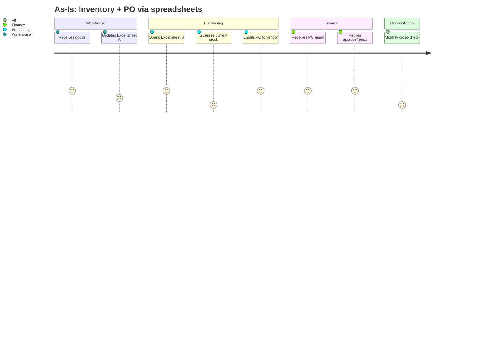
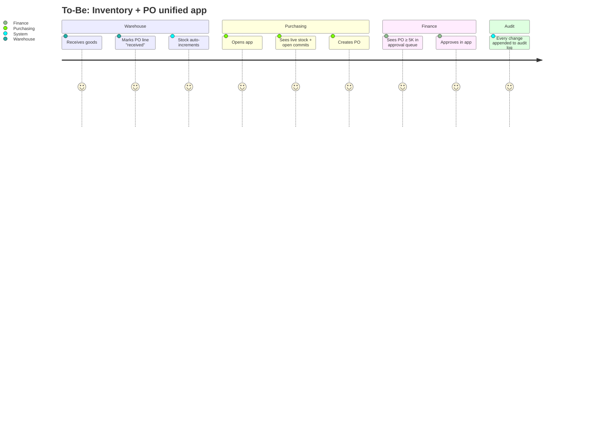
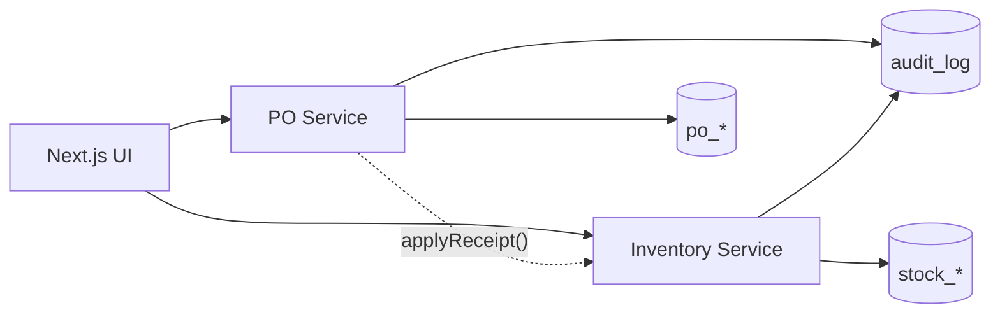

# disc-001 — ERP: Inventory + Purchase Order Slice

## Metadata
| Field | Value |
|-------|-------|
| **Discovery ID** | disc-001 |
| **Scenario** | new-feature |
| **Status** | backlog |
| **Date** | 2026-05-05 |
| **Requester** | Workflow-template test owner |
| **Facilitator** | Claude (simulated) |

---

## Clarifications
| # | Question | Answer |
|---|----------|--------|
| 1 | Quantitative success metrics? | Stock-count discrepancy < 2 %/month · 100 % of POs ≥ ฿5,000 require approval · 100 % stock movements logged in audit |
| 2 | As-Is journey step-by-step? | Warehouse logs receipts in own spreadsheet · Purchasing keeps separate PO spreadsheet · Finance approves POs ≥ ฿5K by email · monthly reconciliation reveals mismatches |
| 3 | To-Be happy path? | Purchasing creates PO seeing live stock & open-commit totals → if total ≥ ฿5K routes to Finance → on approval status=APPROVED → Warehouse marks received → stock auto-increments → every state change writes audit row |
| 4 | Approach options? | A) two domain modules sharing only `audit_log`; B) single unified domain, PO as aggregate, Inventory as event-driven projection |
| 5 | Biggest delivery risk? | Scope creep into supplier mgmt, multi-warehouse, GL posting — explicitly deferred |
| 6 | Open technical question? | Server Actions vs REST endpoints for mutations — defer decision to `/requirement` |

---

## 1. Problem Statement

**Problem:** A mid-sized company tracks inventory and purchase orders in two disconnected spreadsheets. Stock counts drift, POs get approved without visibility into current stock or remaining budget, and there is no audit trail when discrepancies surface.

**Who is affected:**
- Warehouse staff — manual recounts, blamed for "missing" stock that was never logged.
- Purchasing officers — order without knowing on-hand quantity, leading to over-buying.
- Finance — approves blind, only catches over-budget POs at month-end reconciliation.

**Current workaround:** Monthly reconciliation meeting where the three roles compare spreadsheets line-by-line.

---

## 2. Affected Users & Stakeholders

| Role | Impact | Notes |
|------|--------|-------|
| Warehouse staff | High — daily | Receives stock, performs counts |
| Purchasing officer | High — daily | Raises POs, picks suppliers |
| Finance approver | Medium — weekly | Approves POs ≥ ฿5,000 |
| IT (template-test owner) | Low — once | Hosts and runs the system |

---

## 3. Personas
<!-- Skipped — single-sprint scope, only 3 well-understood roles -->
*Not applicable for this scope (1-sprint slice, well-understood roles).*

---

## 4. Goals & Success Criteria

| Goal | Success Metric | How to Measure |
|------|---------------|----------------|
| Single source of truth for stock | Stock-count discrepancy < 2 % / month | Monthly cycle-count audit vs system |
| Enforce PO approval workflow | 100 % of POs ≥ ฿5K require finance approval before status=APPROVED | DB query: any APPROVED PO ≥ ฿5K w/o approval row = bug |
| Full audit trail | 100 % of stock movements + PO state changes have audit-log row | DB query: count(stock_movement) == count(audit_log where entity=stock) |
| Counter-metric — purchasing speed | Time-to-create-PO must not increase > 2× vs spreadsheet baseline | Self-reported timing, ≤ 90 s for typical PO |

---

## 5. Current User Journey (As-Is)

**Pain points identified:**
- Stock counts drift between sheet A and physical stock — no single source of truth.
- Purchasing officer has no live view of on-hand or already-committed stock when creating a PO.
- Finance approval happens by email — not auditable, easy to miss.
- Discrepancies only surface at month-end, weeks after the actual mistake.

---

## 6. Future User Journey (To-Be)

**Improvements over As-Is:**
- One DB → no drift between roles.
- Live stock + commits visible at PO creation time.
- Approval is a first-class state transition, not an email.
- Audit log gives instant root-cause when reconciliation flags an issue.

---

## 7. Context & Background

- No prior internal attempts — spreadsheets have been the de-facto system since the company started.
- Off-the-shelf ERPs (SAP, Odoo) were considered but ruled out: cost, lock-in, and overkill for current volume.
- This greenfield slice is also serving as a workflow-template smoke test (the meta-goal of this project).

---

## 8. Constraints

- **Technical:** Next.js 15 (App Router) · TypeScript · Prisma · SQLite · Vitest for unit, Playwright for E2E (lightweight, no external services).
- **Business:** ฿5,000 hard threshold for finance approval (configurable later, hard-coded for v1).
- **Timeline:** Workflow-template test → "as fast as possible while exercising the full pipeline end-to-end".
- **UX:** Minimal styling (TailwindCSS defaults) — UX is not the test target; workflow rigor is.
- **Location:** All implementation goes under `tmp/erp-test/` in this repo (sandbox, deletable).

---

## 9. Event Storming
<!-- Skipped — small slice, only 2 aggregates -->
*Not applicable — only 2 aggregates (Stock, PurchaseOrder); see Approaches §11 for the model.*

---

## 10. SIPOC — Process Boundaries
<!-- Skipped — single-system, no upstream/downstream integration -->
*Not applicable — no external suppliers/customers in v1.*

---

## 11. Proposed Approaches

### Option A: Two domain modules sharing only `audit_log`
- **Description:** `inventory/` and `purchase-order/` are independent modules. Each owns its own tables (`stock_item`, `stock_movement` for inventory; `purchase_order`, `purchase_order_line`, `approval` for PO). Both write to a shared `audit_log` table. Cross-module calls go through explicit service boundaries (e.g. `InventoryService.applyReceipt(poLineId, qty)`).
- **Pros:**
  - Each module is testable in isolation.
  - Maps cleanly to two vertical-slice tasks (one task = one module).
  - Easy to grow into separate services later.
- **Cons:**
  - Need explicit cross-module service contract (one extra interface).
  - Audit-log schema must be designed up-front to fit both domains.
- **Estimated effort:** 2 tasks × 5 pts = 10 pts total (1 sprint).

### Option B: Unified domain w/ PO as aggregate, Inventory as event-driven projection
- **Description:** Single `purchase-order/` module is the aggregate root. Stock levels are a read-only projection rebuilt from PO events (`POReceived`, `POCancelled`).
- **Pros:**
  - Single transaction boundary — no cross-module coordination.
  - Conceptually clean event-sourced model.
- **Cons:**
  - Heavyweight for a 2-task slice (event bus + projection rebuild infra).
  - Stock count for non-PO sources (manual adjustments, transfers) becomes awkward.
  - Hard to split into 2 vertical-slice tasks — one task would do almost everything.
- **Estimated effort:** ~13 pts (would need to be split per template's 13-pt rule).

---

## 12. Decision Log
| # | Date | Decision | Rationale | Alternatives Rejected | Decided by |
|---|------|----------|-----------|----------------------|------------|
| 1 | 2026-05-05 | Use Approach A (two modules + shared audit) | Cleanly splits into 2 vertical-slice tasks, each independently testable; matches template's vertical-slice rule | Option B — too heavy for 2-task slice; couples inventory to PO event stream | Simulated user |

**Current chosen approach:** **Option A — Two domain modules sharing `audit_log`** ✓ SELECTED

---

## 13. Unknowns & Open Questions

- [ ] Q1: Use Server Actions or REST endpoints for mutations? — defer to `/requirement` Step 1 (codebase exploration + context7 lookup).
- [ ] Q2: Should approval threshold be DB-configurable in v1, or hard-coded to ฿5,000? — leaning hard-coded for v1, decide in `/requirement`.

---

## 14. Risks
| Risk | Likelihood | Impact | Mitigation |
|------|-----------|--------|------------|
| Scope creep into supplier mgmt / multi-warehouse / GL posting | high | high | Explicitly listed as out-of-scope in §15; reject in `/requirement` |
| Audit-log schema doesn't fit both modules | med | med | Design `audit_log` first task, both tasks reuse |
| Time-to-create-PO regresses vs spreadsheet baseline | low | med | Counter-metric in §4; verify in `/testing` |

---

## 15. Scope Estimate

- **Estimated sprints:** 1
- **v1 scope (must-have):**
  - Stock items CRUD + stock movements (receipt, adjustment).
  - Purchase orders CRUD + approval state machine (DRAFT → PENDING → APPROVED/REJECTED → RECEIVED).
  - Approval gate for POs ≥ ฿5,000.
  - Audit log for stock movements and PO state changes.
- **v2 scope (nice-to-have):**
  - Configurable approval threshold.
  - Multi-warehouse.
  - Supplier catalog with price lookup.
  - GL posting / finance integration.
- **Explicitly out of scope:**
  - Authentication / RBAC (single-user demo for v1).
  - Real currency / FX handling (THB only, integer).
  - Reporting / dashboards.
  - Mobile-specific UI.

---

## 16. Epic Breakdown
<!-- Estimated sprints = 1, leaving table empty per discovery-epic-mapping.md -->

| # | Epic Title | One-line Scope | Depends On | Priority |
|---|-----------|---------------|------------|----------|

**Shared entities / cross-epic concerns:**
*Not applicable — single-epic discovery.*

---

## 17. Glossary / Ubiquitous Language

| Term | Definition | Also Known As | NOT the Same As |
|------|-----------|---------------|-----------------|
| Stock Item | A SKU tracked in inventory | Product, SKU | A PO line (which references a Stock Item) |
| Stock Movement | An atomic +/− change to a stock item with reason code | Inventory transaction | Stock Item (the master record) |
| Purchase Order (PO) | Header + lines, with state machine | Order | Sales Order (out of scope) |
| PO Approval | First-class state transition record (who/when/decision) | Sign-off | Email approval (the As-Is) |
| Audit Log | Append-only record of every state-changing action | Activity log, history | Stock Movement (which is also a row in audit log, but more) |

---

## 18. Next Steps

- [x] Resolve all open questions
- [x] Get stakeholder sign-off on chosen approach (Option A — simulated user approval)
- [x] Update status to `backlog`
- [ ] Single-epic discovery → run:
  - `/new-sprint SP1 "ERP Inventory + Purchase Order slice (v1)"`
