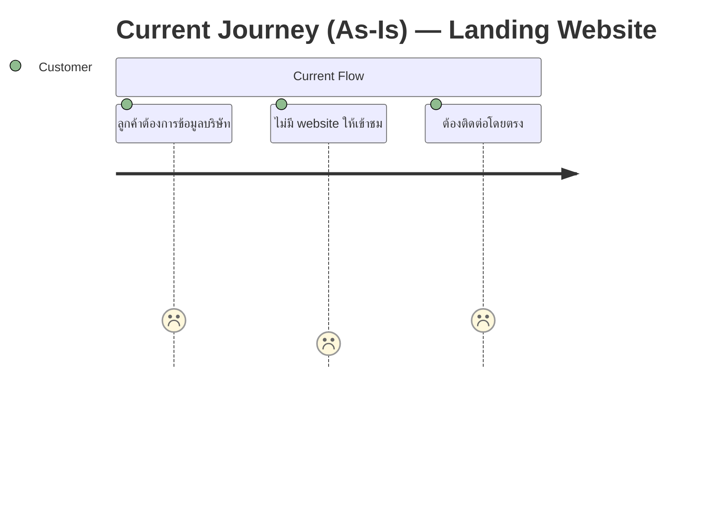

# disc-001 — Landing Website

## Metadata

| Field            | Value       |
| ---------------- | ----------- |
| **Discovery ID** | disc-001    |
| **Status**       | backlog     |
| **Date**         | 2026-03-18  |
| **Requester**    | -           |
| **Facilitator**  | Claude Code |

---

## 1. Problem Statement

**Problem:** บริษัท tech ไม่มี landing website สำหรับแนะนำตัวเองต่อลูกค้า

**Who is affected:** ลูกค้าที่ต้องการข้อมูลเกี่ยวกับบริษัท

**Current workaround (if any):** ไม่มี

---

## 2. Affected Users & Stakeholders

| Role              | Impact | Notes                            |
| ----------------- | ------ | -------------------------------- |
| ลูกค้า (Customer) | สูง    | ผู้ใช้หลักที่เข้าชม landing page |
| ทีม tech          | กลาง   | ผู้พัฒนาและดูแลระบบ              |

---

## 3. Goals & Success Criteria

| Goal                         | Success Metric                 | How to Measure                 |
| ---------------------------- | ------------------------------ | ------------------------------ |
| มี landing page ที่ใช้งานได้ | หน้าเว็บ deploy แล้วเข้าถึงได้ | ตรวจสอบ URL ที่ใช้งานได้       |
| ทดสอบ Claude workflow        | ผ่านครบทุก step ของ workflow   | ครบ /discovery → /retro-sprint |

---

## 4. Current User Journey (As-Is)

**Pain points identified:**

- ไม่มีช่องทางออนไลน์สำหรับลูกค้าใหม่

---

## 5. Context & Background

ไม่มีประวัติที่เกี่ยวข้อง เป็นโปรเจกต์ใหม่ทั้งหมด ใช้เพื่อทดสอบ Claude Code workflow

---

## 6. Constraints

- **Technical:** ไม่มีข้อจำกัด
- **Business:** ไม่มีข้อจำกัด
- **Timeline:** 1 sprint
- **UX:** ไม่มีข้อจำกัด

---

## 7. Proposed Approaches

### Option A: Static Landing Page (HTML/CSS/JS)

- **Description:** สร้าง landing page แบบ static ด้วย HTML, CSS, และ JavaScript พื้นฐาน
- **Pros:** เร็ว, ง่าย, ไม่ต้องการ backend, deploy ง่าย
- **Cons:** ปรับแต่งยากในอนาคต, ไม่มี CMS
- **Estimated effort:** 1-2 วัน

### Option B: Next.js / React Landing Page

- **Description:** สร้างด้วย Next.js เพื่อความยืดหยุ่นในอนาคต
- **Pros:** scalable, component-based, รองรับการขยายในอนาคต
- **Cons:** ซับซ้อนกว่า Option A, ต้องการ Node.js environment
- **Estimated effort:** 2-3 วัน

---

## 8. Decision

**Chosen approach:** TBD — ต้องตัดสินใจก่อน sprint planning
**Rationale:** -
**Approved by:** -
**Date decided:** -

---

## 9. Unknowns & Open Questions

- Q1: เลือก tech stack ไหน? (Static HTML vs Next.js vs อื่นๆ)
  - html css
- Q2: มี content/copy ที่ต้องการแสดงบน landing page อะไรบ้าง? (hero, features, about, contact)
  - คิดให้เลย landing เกี่ยวการใช่การ claude code workflow นี้
- Q3: มี design หรือ brand guideline ที่ต้องทำตามไหม?
  - สีส้ม claude code

---

## 10. Risks

| Risk                | Likelihood | Impact | Mitigation                   |
| ------------------- | ---------- | ------ | ---------------------------- |
| ไม่มี content พร้อม | med        | med    | ใช้ placeholder content ก่อน |
| scope creep         | low        | low    | กำหนด scope ชัดเจนใน sprint  |

---

## 11. Scope Estimate

- **Estimated sprints:** 1
- **v1 scope (must-have):** Hero section, About section, Contact/CTA
- **v2 scope (nice-to-have):** Animation, Blog section, Multi-language
- **Explicitly out of scope:** Backend, CMS, User authentication

---

## 12. Next Steps

- ตัดสินใจเรื่อง tech stack
- เตรียม content สำหรับ landing page
- Update status to `backlog` when ready
- When ready → run `/new-sprint sprint-01 "Simple landing website for tech company"`

