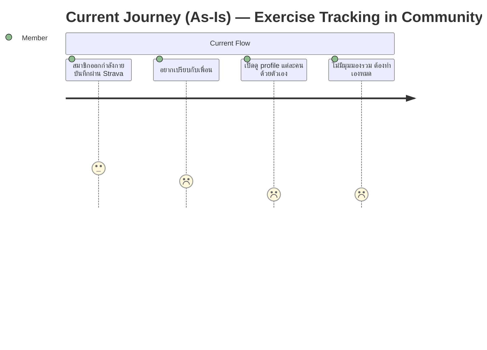
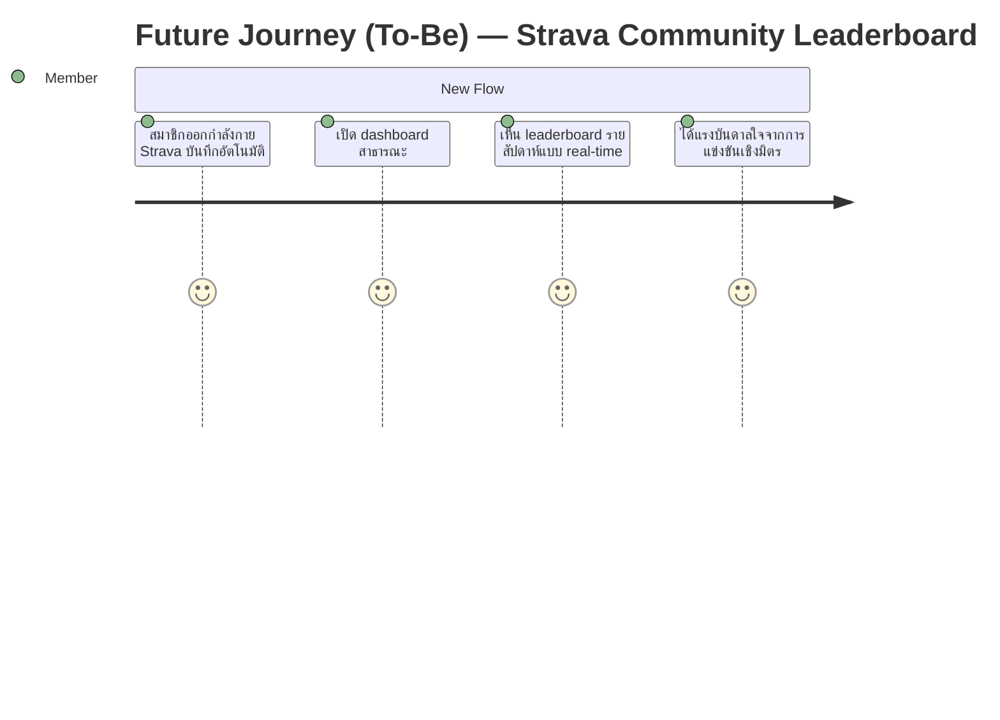
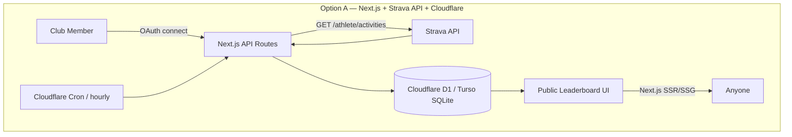
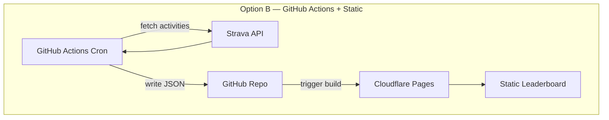

# disc-001 — Strava Community Leaderboard

## Metadata
| Field | Value |
|-------|-------|
| **Discovery ID** | disc-001 |
| **Status** | backlog ✓ all questions resolved |
| **Date** | 2026-03-24 |
| **Requester** | Club organizer (self) |
| **Facilitator** | - |

---

## 1. Problem Statement

**Problem:** สมาชิกในกลุ่มออกกำลังกายและบันทึกผ่าน Strava แต่ไม่มี dashboard รวมที่ทุกคนเห็นได้ว่าแต่ละคนออกกำลังกายไปเท่าไหร่แล้ว ทำให้ขาดแรงจูงใจจากการแข่งขันที่เป็นมิตร

**Who is affected:** สมาชิกในชมรม/กลุ่มเพื่อน 20 คน ที่ใช้ Strava อยู่แล้ว

**Current workaround (if any):** ดูโปรไฟล์ Strava ของแต่ละคนเอง ไม่มีมุมมองรวม

---

## 2. Affected Users & Stakeholders

| Role | Impact | Notes |
|------|--------|-------|
| Club Members (20 คน) | Primary — ดู leaderboard และถูก motivate | ต้อง authorize Strava OAuth ครั้งแรก |
| Club Organizer (ผู้พัฒนา) | Secondary — register Strava API app, deploy | เป็นเจ้าของ Strava Developer App |
| Public visitors | View-only — เห็น dashboard แบบไม่ต้อง login | Read-only access |

---

## 3. Personas

| Persona | Role / Description | Goal | Key Pain Point | Frequency of Use |
|---------|--------------------|------|----------------|------------------|
| Club Member | นักออกกำลังกายในชมรม | เห็นอันดับตัวเองและเพื่อน, สร้างแรงใจ | ไม่มี leaderboard รวม | daily / weekly |
| Club Organizer | ผู้ดูแลระบบ + นักพัฒนา | Deploy และดูแล app | ต้องจัดการ Strava OAuth token ของทุกคน | weekly |
| Public Visitor | คนนอกที่อยากดู | ดู leaderboard โดยไม่ต้อง login | — | occasional |

---

## 4. Goals & Success Criteria

| Goal | Success Metric | How to Measure |
|------|---------------|----------------|
| แสดง leaderboard รายสัปดาห์จากข้อมูล Strava จริง | Dashboard โหลดได้พร้อม rank สมาชิก | Manual check |
| รองรับ activity ทุกประเภท (Run, Ride, Walk, Weight, Other) | ทุก type แสดงผลถูกต้อง | Manual check |
| Sync ข้อมูลทุก 1 ชั่วโมงอัตโนมัติ | ข้อมูลล่าช้าไม่เกิน 1 ชั่วโมง | Check timestamp |
| Public dashboard ไม่ต้อง login ดูได้ | เปิด URL ได้โดยตรง | Manual check |
| Deploy บน Cloudflare Pages ฟรี | ไม่มีค่าใช้จ่าย | Billing check |

---

## 5. Current User Journey (As-Is)

**Pain points identified:**
- ไม่มี shared leaderboard
- ต้องเข้าไปดู Strava profile ทีละคนด้วยตัวเอง
- ขาดแรงจูงใจจากการแข่งขันที่เป็นมิตร

---

## 6. Future User Journey (To-Be)

**Improvements over As-Is:**
- Dashboard รวมที่ดึงข้อมูลจาก Strava จริง
- Sync อัตโนมัติทุก 1 ชั่วโมง ไม่ต้องทำอะไรเพิ่ม
- Public URL — ใครก็เปิดดูได้

---

## 7. Context & Background

- กลุ่มสมาชิก 20 คน ใช้ Strava อยู่แล้ว
- ผู้พัฒนาเป็นคนลงทะเบียน Strava Developer App เอง
- Tech stack: Next.js + Tailwind CSS + SQLite
- Hosting: Cloudflare Pages (free tier)
- ไม่มี deadline — พัฒนาแบบ iterative จนเสร็จ

---

## 8. Constraints

- **Technical:** Next.js, Tailwind CSS, SQLite DB; deploy บน Cloudflare Pages
- **Business:** Strava API free tier — rate limit 100 req/15min, 1000 req/day per app; sync ทุก 1 ชั่วโมง (20 members × sync = 20 req/hr ปลอดภัย)
- **Timeline:** ไม่กำหนด — เสร็จเมื่อพร้อม
- **UX:** Public dashboard, ไม่ต้อง login เพื่อดู; สมาชิกต้อง connect Strava ครั้งแรกเท่านั้น
- **Budget:** Free tier เท่านั้น — Cloudflare Pages free, SQLite (no extra cost), Strava API free

---

## 9. Event Storming

### Domain Events (orange)
| Event | Trigger | Aggregate | Data Produced |
|-------|---------|-----------|---------------|
| `MemberConnected` | สมาชิก authorize Strava OAuth | Member | athlete_id, access_token, refresh_token |
| `ActivitiesSynced` | Cron job ทุก 1 ชั่วโมง | Member | activities (type, distance, duration, calories) |
| `LeaderboardComputed` | หลัง ActivitiesSynced | Leaderboard | ranked list สำหรับสัปดาห์ปัจจุบัน |

### Commands (blue)
| Command | Actor | Triggers Event | Input |
|---------|-------|----------------|-------|
| `ConnectStrava` | Member | MemberConnected | OAuth code |
| `SyncMemberActivities` | Cron (hourly) | ActivitiesSynced | member access_token |
| `ViewWeeklyLeaderboard` | Anyone (public) | — | week range |

### Aggregates (yellow)
| Aggregate | Key Entities | Invariants / Rules |
|-----------|-------------|-------------------|
| Member | athlete_id, name, avatar, tokens | ต้องมี valid Strava OAuth |
| Activity | id, type, distance_km, duration_sec, calories, date | type ∈ {Run, Ride, Walk, WeightTraining, Other} |
| WeeklyLeaderboard | member rankings | คำนวณจาก activities ในสัปดาห์ปัจจุบัน (Mon–Sun) |

---

## 10. SIPOC — Process Boundaries

| Suppliers | Inputs | Process Step | Outputs | Customers |
|-----------|--------|-------------|---------|-----------|
| Strava API | Activity data (JSON) | Hourly sync job | Stored activities in SQLite | Leaderboard engine |
| Club Members | Strava OAuth consent | Member onboarding | Authenticated member record | Dashboard |
| SQLite DB | Activity records | Leaderboard computation | Weekly ranked list | Public dashboard |

---

## 11. Proposed Approaches

### Option A: Strava Official API + Next.js API Routes (Recommended)
- **Description:** ใช้ Strava OAuth 2.0 ให้สมาชิก connect ครั้งแรก จากนั้น Next.js API routes ทำ cron sync ทุก 1 ชั่วโมง ดึง activities เก็บใน SQLite (via Cloudflare D1 หรือ Turso) แสดงผล leaderboard สาธารณะ
- **Pros:** Official API, reliable, webhook support, free tier รองรับ 20 คนสบายมาก, Next.js รองรับ API routes ใน Cloudflare Pages ได้
- **Cons:** Strava OAuth flow ต้องทำครั้งแรกสำหรับทุกคน; token refresh ต้องจัดการ; Cloudflare Pages + SQLite ต้องใช้ D1 หรือ Turso แทน local SQLite
- **Estimated effort:** 2–3 sprints

### Option B: Strava Official API + Static Export (Simpler)
- **Description:** ใช้ GitHub Actions เป็น cron ทุกชั่วโมง ดึงข้อมูลจาก Strava แล้ว generate static JSON → push to repo → Cloudflare Pages rebuild อัตโนมัติ ไม่ต้องมี DB จริง
- **Pros:** ง่ายมาก, ไม่ต้องดูแล DB, ฟรี 100%, build fast
- **Cons:** ข้อมูลล่าช้ากว่า (ขึ้นอยู่กับ build time); ไม่ flexible ถ้าอยากเพิ่ม feature; GitHub Actions minutes limit
- **Estimated effort:** 1–2 sprints

---

## 12. Decision Log

| # | Date | Decision | Rationale | Alternatives Rejected | Decided by |
|---|------|----------|-----------|----------------------|------------|
| 1 | 2026-03-24 | Option A (Next.js API Routes + Cloudflare D1) | รองรับ dynamic data, token refresh, และ future features ได้ดีกว่า | Option B (too static, limited flexibility) | Discovery |

**Current chosen approach:** Option A — Next.js + Strava Official API + Cloudflare D1

---

## 13. Unknowns & Open Questions

- [x] Q1: สมาชิกกี่คน → 20 คน
- [x] Q2: Tech stack → Next.js, Tailwind CSS, SQLite
- [x] Q3: Hosting → Cloudflare Pages (free)
- [x] Q4: Metrics → Run, Ride, Walk, Weight, Other; แสดง calories, km, time
- [x] Q5: Time range → รายสัปดาห์ (weekly)
- [x] Q6: Sync frequency → ทุก 1 ชั่วโมง
- [x] Q7: Strava API app owner → ผู้พัฒนา (self)
- [x] Q8: Visibility → Public (ไม่ต้อง login)
- [x] Q9: Budget → Free tier เท่านั้น
- [x] Q10: Timeline → ไม่กำหนด
- [x] Q11: SQLite บน Cloudflare → ใช้ **Cloudflare D1** ✓
- [x] Q12: สมาชิกแต่ละคน **เปิด link OAuth เอง** (self-service onboarding) ✓

---

## 14. Risks

| Risk | Likelihood | Impact | Mitigation |
|------|-----------|--------|------------|
| Cloudflare D1 ไม่รองรับ standard SQLite driver | med | high | ใช้ Cloudflare D1 SDK หรือเปลี่ยนเป็น Turso |
| Strava token หมดอายุ / refresh ล้มเหลว | med | high | Store refresh_token, implement auto-refresh ก่อน sync |
| สมาชิกไม่ยอม authorize OAuth | med | med | อธิบายว่าขอ read-only scope เท่านั้น |
| Rate limit 1000 req/day (20 members × 24 syncs = 480/day) | low | med | ปลอดภัย — อยู่ใน limit; monitor usage |
| Strava API เปลี่ยน schema หรือ deprecate endpoint | low | high | Abstract API layer, pin version |

---

## 15. Scope Estimate

- **Estimated sprints:** 3
- **v1 scope (must-have):**
  - Strava OAuth connect flow สำหรับสมาชิก
  - Hourly sync activities → SQLite (D1/Turso)
  - Weekly leaderboard แสดง: ชื่อ, avatar, total km, total calories, total time
  - Filter by activity type (Run, Ride, Walk, Weight, Other)
  - Public dashboard ไม่ต้อง login
  - Deploy บน Cloudflare Pages
- **v2 scope (nice-to-have):**
  - Monthly / all-time leaderboard toggle
  - Streak tracking (consecutive days)
  - Activity feed / timeline
  - Badges / achievements
  - Mobile responsive improvements
- **Explicitly out of scope:**
  - GPS route visualization
  - Workout coaching / planning
  - Non-Strava integrations (Garmin, Apple Health)
  - Member-only private dashboard

---

## 16. Glossary / Ubiquitous Language

| Term | Definition | Also Known As | NOT the Same As |
|------|-----------|---------------|-----------------|
| Activity | การออกกำลังกายหนึ่งครั้งที่บันทึกใน Strava | Workout | Strava Segment |
| Weekly Leaderboard | อันดับสมาชิกตาม metric ในสัปดาห์ปัจจุบัน (Mon–Sun) | Dashboard ranking | Strava Club Leaderboard |
| Member | สมาชิกชมรมที่ connect Strava OAuth แล้ว | Athlete | Strava follower |
| Sync | ดึง activities ใหม่จาก Strava API ทุก 1 ชั่วโมง | Fetch, Pull | Webhook |
| OAuth Token | access_token + refresh_token ของสมาชิก | Strava credentials | API Key |
| D1 / Turso | SQLite-compatible database บน Cloudflare / edge | SQLite | Local file DB |

---

## 17. Next Steps

- [x] ตอบคำถามทั้งหมด (Q1–Q10)
- [x] ยืนยัน Q11: ใช้ Cloudflare D1
- [x] ยืนยัน Q12: สมาชิก self-service OAuth
- [ ] Register Strava API app ที่ developers.strava.com
- [ ] เมื่อพร้อม → `/new-sprint SP1 "Strava Community Leaderboard — v1"`
