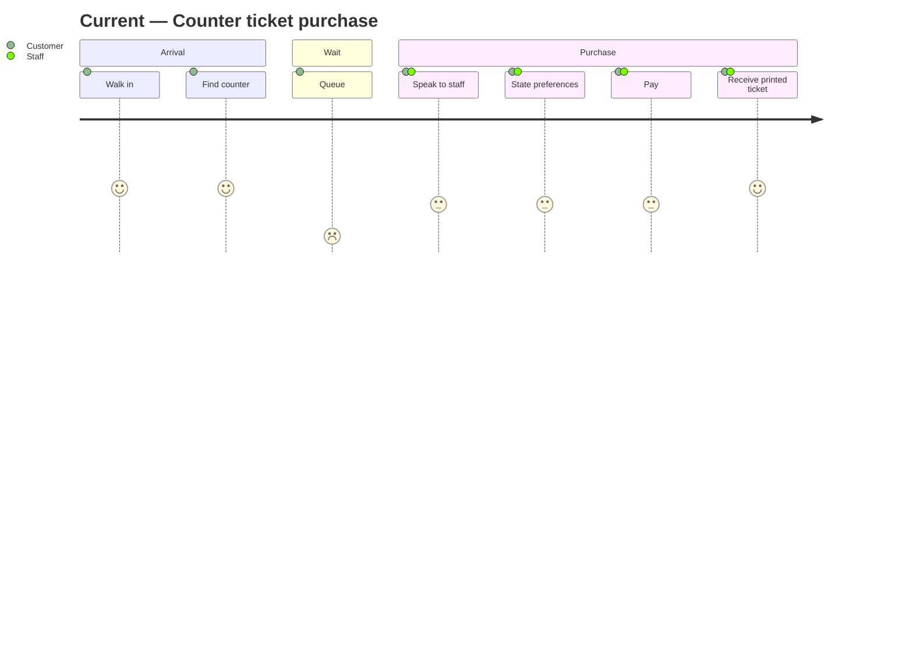
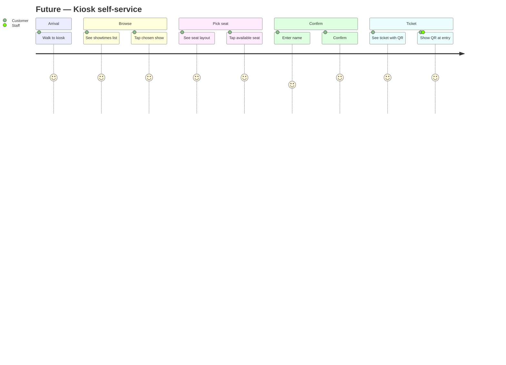

# disc-002 — Kiosk Ticket Booking (Self-Service, No Login)

## Metadata
| Field | Value |
|-------|-------|
| **Discovery ID** | disc-002 |
| **Status** | backlog |
| **Date** | 2026-05-07 |
| **Requester** | Workflow-template smoke-test (test drive of `/dev`) |
| **Facilitator** | Autopilot — `/dev` Stage 1 |
| **Estimated sprints** | 1 (single-epic scope; admin/payment out of v1) |

---

## 1. Problem Statement

**Problem:** Walk-in customers at a small venue (cinema, theater, event) wait in line at a single staffed counter to buy tickets. Queues build during peak hours; staff time is spent on transactional tasks instead of higher-value service.

**Who is affected:**
- Walk-in customers waiting > 5 min during peaks
- Front-desk staff (1 person, sequential service)
- Venue operations (queue blocks lobby flow)

**Current workaround:** Increase staff during peaks (cost), or accept the queue (lost customers who walk away).

---

## 2. Affected Users & Stakeholders

| Role | Impact | Notes |
|------|--------|-------|
| Walk-in customer | High — wait time, abandonment | Any age, possibly first-time kiosk user |
| Front-desk staff | High — frees them for service tasks | Will still handle exceptions (refunds, group bookings) |
| Venue operator | Medium — needs to configure showtimes | Once-per-event setup |

---

## 3. Personas

| Persona | Role / Description | Goal | Key Pain Point | Frequency of Use |
|---------|--------------------|------|----------------|------------------|
| Walk-in customer | Adult buying ticket on arrival | Get seat for the showing starting soon | Queue at counter | Per visit |
| Venue operator | Sets up showtimes the night before | Configure shows + seat layout once | Manual ticket counts at end of show | Daily |

---

## 4. Goals & Success Criteria

| Goal | Success Metric | How to Measure |
|------|---------------|----------------|
| Reduce queue at counter | Self-service share ≥ 60% during peak | Daily kiosk vs counter ticket counts |
| Zero-login UX | Median time-to-ticket ≤ 90s | Track session start → ticket print |
| Reliable seat allocation | 0 double-bookings | DB + audit log |

---

## 5. Current User Journey (As-Is)



**Pain points:**
- Queue wait time during peaks
- Customer must verbally describe show + seat preferences (slow, error-prone)
- Single point of failure when staff member is on break
- Walk-aways cost revenue

---

## 6. Future User Journey (To-Be)



**Improvements:**
- No queue (parallel kiosks possible)
- Visual seat picking eliminates verbal back-and-forth
- QR code = no paper required (or print as backup)

---

## 7. Constraints & Assumptions

| Constraint | Notes |
|---|---|
| **No login** | Guest flow only; no user accounts in v1 |
| **No payment integration** | v1 is reservation-only — payment handled at entry/separate POS |
| **Single venue** | Multi-venue out of scope |
| **Touch UX** | Buttons ≥ 48×48px, no hover, single-task focus per screen |
| **Sandbox** | Built under `tmp/kiosk-test/` to avoid polluting template |
| **Stack** | Next.js 14 App Router + TypeScript + SQLite (better-sqlite3) |

---

## 8. Out of Scope (v1)

- User accounts, login, booking history
- Payment processing (cash, card, e-wallet)
- Refunds, exchanges, transfers
- Multi-venue / multi-location
- Group bookings (> 4 seats together)
- Email/SMS confirmation
- Admin web UI for show creation (use seed JSON for v1)
- Real QR validation (just generate + display; entry validation is out)

---

## 9. Risks

| # | Risk | Likelihood | Severity | Mitigation |
|---|------|-----------|----------|------------|
| R1 | Two kiosks select same seat simultaneously | Med | High | DB-level unique constraint on (showtimeId, seatId) + transaction |
| R2 | Customer walks away mid-flow → seat held forever | High | Med | TTL on tentative selection (60s); auto-release |
| R3 | Long names break ticket layout | Low | Low | Cap input at 60 chars |
| R4 | Kiosk loses network | Med | High | v1 single-host; document as known limitation |

---

## 10. Open Questions

None for v1 — scope deliberately narrowed (no payment, no admin UI, no auth).

If this proves successful, follow-up discoveries should cover:
- Payment integration (separate epic / sprint)
- Admin web UI (separate epic / sprint)
- Multi-venue support (separate epic / sprint)

---

## 11. Epic Breakdown

Per `.claude/rules/discovery-epic-mapping.md` — single-sprint scope, table empty.

**Estimated sprints:** 1

---

## 12. Shared Entities / Cross-Epic Concerns

Single sprint; no cross-epic concerns. The data model (Showtime, Seat, Booking, Ticket) is owned entirely by SP2.

---

## 13. Next Steps

```
/new-sprint SP2 "Kiosk customer booking flow — showtimes → seat → name → QR ticket"
```
