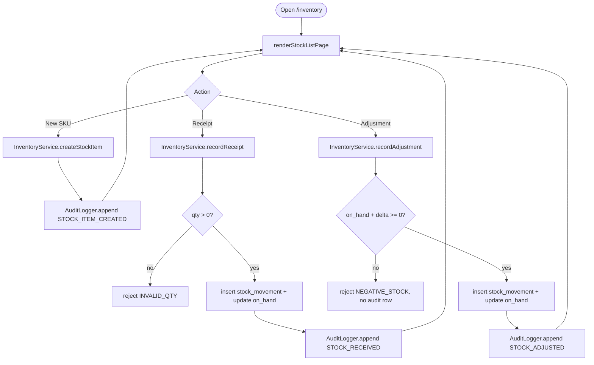
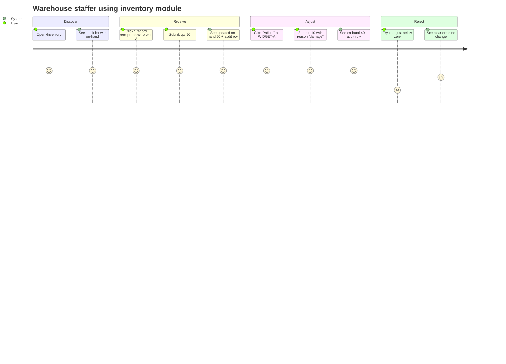
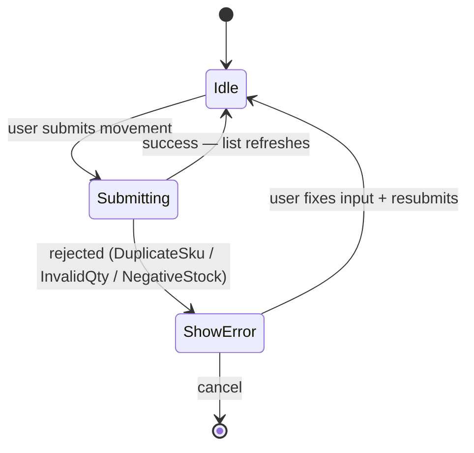
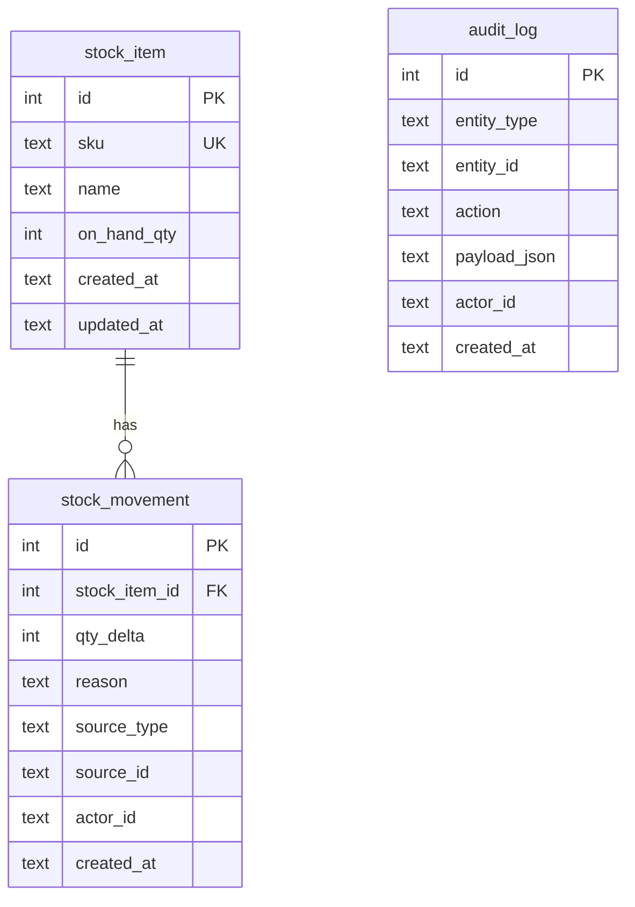

# SP1-T001 — As a warehouse staffer, I want to register stock items and record receipts/adjustments so that the system holds a single source of truth for stock levels with a full audit trail.

> **1 task = 1 user story = 1 doc.** This is the single source of truth for the story.

## Metadata
| Field | Value |
|-------|-------|
| **Sprint** | SP1 |
| **Task Type** | fullstack |
| **Points** | 5 |
| **Estimate** | 2 days (workflow-test pace) |
| **Priority** | high |
| **Assignee** | Simulated dev |
| **Requester** | Simulated user |
| **Status** | review |

> **Brain consult (Step 0):** No matching LES/PAT for "inventory" or "audit" keywords; LES-002 (mock-vs-real-db) reinforced — using real SQLite per `.claude/rules/testing.md`. PAT-001 (TDD flow) applied throughout. *Brain: 1 reusable — PAT-001-tdd-flow.*

---

# 1 · Story & Requirements

## Problem Statement
Stock counts kept in the warehouse spreadsheet drift from physical inventory because there is no enforced way to record every receipt and adjustment. The lack of an audit trail means month-end reconciliation can identify a discrepancy but never the root cause. This task introduces the canonical `stock_item` + `stock_movement` model and the shared `audit_log` table that downstream tasks (T002 and beyond) reuse.

## Overview
Warehouse staff get a "stock list" view (presenter `renderStockListPage`) and a "stock detail" view (`renderStockDetailPage`) that show all SKUs with current on-hand quantity. They can register a new SKU, record a receipt (qty > 0), or record an adjustment (positive or negative) with a reason code. The system rejects movements that would drive on-hand negative, and writes an `audit_log` row for every state change. T001 owns the `audit_log` schema and `AuditLogger` service interface; T002 will reuse both unchanged.

## Value
- **User impact:** Warehouse staff get a single source of truth for stock — no more reconciliation against private spreadsheets, every change is recorded with who/when/why.
- **Business outcome:** Eliminates one of three sources of monthly discrepancy; foundation for the PO approval flow in T002 (which depends on `applyReceipt`).
- **Why now:** Blocks SP1-T002 — PO `RECEIVED` transition writes through `InventoryService.applyReceipt` introduced here.

## User Stories
| # | Story | Maps to AC |
|---|-------|-----------|
| US-1 | As a warehouse staffer, I want to register a new SKU and record a receipt so that on-hand reflects what I just received. | AC-1 |
| US-2 | As a warehouse staffer, I want to record an adjustment with a reason so that physical-vs-system mismatches get logged. | AC-2 |
| US-3 | As a warehouse staffer, I want the system to reject a movement that would make on-hand negative so that the system never lies about stock. | AC-3 |
| US-4 | As a warehouse staffer, I want unique SKU codes so that two items can't collide. | AC-4 |
| US-5 | As a warehouse staffer, I want receipts to require a positive quantity so that data entry mistakes are caught. | AC-5 |

## Feature Flow



## System Behavior
| Trigger | System Response | Side Effects | Timing |
|---------|----------------|-------------|--------|
| `createStockItem(sku, name)` with new sku | Returns `{id, sku, name, on_hand: 0}` | Insert `stock_item`, append `audit_log STOCK_ITEM_CREATED` | sync |
| `createStockItem` with existing sku | Throws `DuplicateSkuError` | None | sync |
| `recordReceipt(itemId, qty)` with qty > 0 | Returns `StockMovement` | Insert `stock_movement(qty_delta=+qty)`, increment `stock_item.on_hand`, append `audit_log STOCK_RECEIVED` | sync |
| `recordReceipt` with qty <= 0 | Throws `InvalidQtyError` | None | sync |
| `recordAdjustment(itemId, delta, reason)` resulting in `on_hand >= 0` | Returns `StockMovement` | Insert `stock_movement`, update `stock_item.on_hand`, append `audit_log STOCK_ADJUSTED` | sync |
| `recordAdjustment` resulting in `on_hand < 0` | Throws `NegativeStockError` | None — no audit row | sync |
| `applyReceipt(stockItemId, qty, sourceType=PO_RECEIPT, sourceId)` (used by T002) | Same as `recordReceipt` but tags movement with `source_type='PO_RECEIPT'` and `source_id=<po_line_id>` | Same as receipt + audit row carries `source_id` | sync |

## Review Summary
**Date:** 2026-05-05 · **Result:** APPROVED (after C1 fix landed)
- AC-1 ✓ — covered by 6 tests (service + presenter + detail). Audit chain verified.
- AC-2 ✓ — covered by 3 tests. Adjustment payload includes qty_delta + reason.
- AC-3 ✓ — covered by 3 tests. Negative-stock guard rejects, no audit row, on_hand unchanged.
- AC-4 ✓ — covered by 2 tests. Duplicate SKU rejected, no extra audit row.
- AC-5 ✓ — covered by 2 tests. qty=0 and qty=-1 both rejected.
- C1 (audit append outside txn — R-2 violation) — found in code review, fixed via TDD, see [`SP1-T001-issues.md`](./SP1-T001-issues.md).
- M1 (redundant ternary) and M2 (SELECT outside txn) — fixed in same diff.
- Tests: 35 passing, 0 failing. Typecheck: exit 0.

## Acceptance Criteria

- [x] **AC-1: Register SKU and record initial receipt**
  GIVEN no `stock_item` row exists for SKU "WIDGET-A"
  WHEN warehouse staff calls `createStockItem({sku: "WIDGET-A", name: "Widget A"})` and then `recordReceipt({stockItemId, qty: 50})`
  THEN `getStockItem(id)` returns `on_hand_qty = 50` AND `audit_log` contains exactly one `STOCK_ITEM_CREATED` row and one `STOCK_RECEIVED` row for that item, in chronological order.

- [x] **AC-2: Adjust with reason logs an audit row**
  GIVEN WIDGET-A has `on_hand_qty = 50`
  WHEN warehouse staff calls `recordAdjustment({stockItemId, qtyDelta: -10, reason: "damage"})`
  THEN `getStockItem(id)` returns `on_hand_qty = 40` AND `audit_log` gains a row with `action='STOCK_ADJUSTED'`, `payload_json` containing `qtyDelta=-10` and `reason="damage"`.

- [x] **AC-3: Reject adjustment that would go negative**
  GIVEN WIDGET-A has `on_hand_qty = 0`
  WHEN warehouse staff calls `recordAdjustment({stockItemId, qtyDelta: -5, reason: "damage"})`
  THEN the call throws `NegativeStockError` (HTTP code `BUSINESS_RULE_VIOLATION` if surfaced via API) AND `on_hand_qty` is unchanged at 0 AND no new `stock_movement` row exists AND no new `audit_log` row exists.

- [x] **AC-4: Reject duplicate SKU**
  GIVEN WIDGET-A is already registered
  WHEN `createStockItem({sku: "WIDGET-A", name: "Whatever"})` is called again
  THEN it throws `DuplicateSkuError` AND no second row is inserted AND no audit row is appended.

- [x] **AC-5: Reject non-positive receipt qty**
  GIVEN WIDGET-A exists
  WHEN `recordReceipt({stockItemId, qty: 0})` or `recordReceipt({stockItemId, qty: -5})` is called
  THEN it throws `InvalidQtyError` AND no movement, no audit row.

## Data & Business Rules
| Rule ID | Rule | Example | Applies to AC |
|---------|------|---------|--------------|
| R-1 | `stock_item.on_hand_qty` is the canonical stock level — never derived ad-hoc from movements. | Updated atomically with each movement insert. | AC-1, AC-2, AC-3 |
| R-2 | Every state-changing call writes exactly one `audit_log` row. Failed calls write zero. | AC-3 has zero audit rows on rejection. | AC-1..5 |
| R-3 | `on_hand_qty` MUST NOT go below 0 — enforced by service layer guard, NOT by DB CHECK constraint (so we can return a typed error). | AC-3. | AC-3 |
| R-4 | SKU is unique (DB UNIQUE constraint + service-level pre-check for friendlier error). | AC-4. | AC-4 |
| R-5 | Receipt `qty` strictly > 0; adjustments allow any non-zero integer (positive or negative). | AC-5. | AC-5 |
| R-6 | All quantities are integers. No fractions, no float math. | THB integer constraint from sprint overview. | All |

## Success Metrics
- [ ] Metric-1: 100 % of stock state changes have a corresponding `audit_log` row (verified by integration test counting both tables after a scenario run).
- [ ] Metric-2: Negative-stock attempts rejected and produce zero audit-log entries (verified by AC-3 test).
- [ ] Metric-3: Public service interface stable enough for T002 — `InventoryService.applyReceipt` signature locked here, T002 only consumes it.

## Out of Scope
- Authentication / RBAC — `actorId` is a free-form string, supplied by caller (will become real user id in v2 once auth lands).
- Multi-warehouse — single implicit warehouse.
- Stock transfers between warehouses — not needed for v1.
- Reporting (cycle-count, low-stock alerts) — out per sprint scope.
- Soft-delete / archival — physical INSERT only.
- HTTP API — this task is library-level; HTTP wrapping (if added) is via thin routing in T002 or later. Presenter functions return view-models, not Response objects.

## Dependencies
- None within sprint (T001 is the foundational task).
- External: `better-sqlite3` runtime (already installed in `tmp/erp-test/`).

## Definition of Done
- [ ] Code reviewed and approved (`/code-review`)
- [ ] All 5 acceptance criteria verified via TDD tests
- [ ] Tests pass (unit + integration; no E2E browser — see Out of Scope)
- [ ] No regressions in existing tests (toolchain smoke still green)
- [ ] `audit_log`, `stock_item`, `stock_movement` schemas added to `src/db/schema.sql` with header comment
- [ ] `InventoryService` and `AuditLogger` interfaces exported from `src/inventory/index.ts` and `src/audit/index.ts`
- [ ] Branch merged to `claude/test-erp-workflow-iD5fZ` (workflow-test branch)

---

# 2 · Existing Code Context

## [FE] Components available
| Component | File path | Notes |
|-----------|-----------|-------|
| (none) | — | Greenfield — no presenter components exist yet |

## [FE] Hooks available
*N/A — no React/hooks runtime in this slice.*

## [BE] Services / Repositories available
| Class / Function | File path | Notes |
|------------------|-----------|-------|
| (none) | — | Greenfield |

## Project patterns to follow
- TS strict mode, ES module syntax (`type: "module"` in `package.json`).
- DB access via `better-sqlite3`, prepared statements, no ORM.
- Tests co-located: `src/inventory/inventory.service.test.ts` next to `src/inventory/inventory.service.ts`.
- Errors are typed classes extending a base `DomainError` so callers can branch on `error.code`.
- Time stamps stored as ISO-8601 UTC strings (`new Date().toISOString()`).
- Following PAT-001-tdd-flow (Red → Green → Refactor) per session.

---

# 3 · Frontend Design
<!-- "FE" layer in this slice = thin presenter functions returning JSON view-models, exercised by Vitest. No browser. See SP1-overview Technical Constraints. -->

## Approach
Two presenter functions in `src/web/`:
- `renderStockListPage(opts: { db, role }): StockListView` — returns `{ items: StockItemRow[], canCreate: boolean, canRecordMovement: boolean }`.
- `renderStockDetailPage(opts: { db, role, stockItemId }): StockDetailView | NotFoundView` — returns `{ item, movements, auditEntries, actions }` or `{ kind: "not-found" }`.

Role gating: only `role=warehouse` sees create/movement actions in v1; other roles get `canCreate=false` (still readable). Role parsed from caller (would be query string in real Next.js, here passed as arg).

## Design References
- N/A — no Figma per sprint overview.

## UI/UX Overview
View-models are JSON-serialisable. A future Next.js page renders them; for the workflow test, Vitest asserts the shape directly. This proves the presenter is decoupled from the rendering layer.

## User Journey Map



**Entry point:** `renderStockListPage` (think `/inventory`).
**Exit point:** Updated stock list view — same presenter re-rendered.

## Behavior Mapping

### Entry Paths
| Entry path | How they get here | Pre-loaded state / context |
|------------|-------------------|----------------------------|
| Direct nav to stock list | `/inventory?role=warehouse` (logical) | Loads all stock items + their current on-hand |
| Stock detail | `/inventory/[stockItemId]?role=warehouse` (logical) | Loads item + last 50 movements + audit log entries for that entity |

### Behavior Flow
*See Feature Flow §1 — same diagram.*

### Fail State Summary
| Fail state | What user sees | Feeling | Can recover? |
|------------|----------------|---------|--------------|
| Duplicate SKU on create | Inline error: "SKU 'WIDGET-A' already exists" | annoyed | yes — change SKU |
| Negative stock attempted | Inline error: "Adjustment would make stock negative (on-hand: 0)" | informed | yes — adjust differently or skip |
| Non-positive receipt qty | Inline error: "Receipt quantity must be > 0" | informed | yes — fix qty |
| Stock detail not found | `{ kind: "not-found" }` view-model | mildly confused | yes — back to list |

## State Inventory
| Component | Loading | Empty | Error | Success | Partial / Stale | Notes |
|-----------|---------|-------|-------|---------|-----------------|-------|
| StockListView | `{ kind: "loading" }` while DB query runs (sync in this stack — typically skipped) | `{ items: [] }` shown when no SKUs | N/A — DB read can't fail in normal use; thrown errors bubble | `{ items: [...], canCreate, canRecordMovement }` | N/A — no caching layer | Items sorted by `created_at DESC` |
| StockDetailView | same as list | `{ movements: [], auditEntries: [] }` for a freshly created SKU | `{ kind: "not-found" }` if id missing | `{ item, movements, auditEntries, actions }` | N/A | last 50 movements + audit |
| MovementForm (logical) | submitting=true while service call runs | N/A | inline error string | dismissed + list re-render | N/A | optimistic update NOT used (sync stack) |

### State Transitions



## Routing & Navigation
| Route | Component | Auth required | Notes |
|-------|-----------|---------------|-------|
| `/inventory` (logical) | StockListView | role≠none | role from query string `?role=warehouse|...` |
| `/inventory/[id]` (logical) | StockDetailView | role≠none | shows movements + audit |

## Component Breakdown
| Component | File path | Type | Description |
|-----------|-----------|------|-------------|
| StockListView | `src/web/inventory.presenter.ts` (`renderStockListPage`) | new | View-model for stock list |
| StockDetailView | `src/web/inventory.presenter.ts` (`renderStockDetailPage`) | new | View-model for stock detail w/ audit |

## Async Interaction Sequence

```mermaid
sequenceDiagram
  participant U as User
  participant P as Presenter
  participant S as InventoryService
  participant A as AuditLogger
  participant DB as SQLite

  U->>P: action: recordReceipt(itemId, 50)
  P->>S: recordReceipt(itemId, 50, actorId)
  S->>DB: SELECT stock_item WHERE id=?
  DB-->>S: row
  S->>DB: BEGIN; INSERT stock_movement; UPDATE stock_item SET on_hand=on_hand+50; COMMIT
  S->>A: append({entity_type:'stock_item', entity_id:itemId, action:'STOCK_RECEIVED', payload})
  A->>DB: INSERT audit_log
  S-->>P: StockMovement
  P-->>U: list refreshed
```

## State & Data Flow
DB → InventoryService.list/get → StockListView/StockDetailView (presenter) → caller (test or route handler).

## API Contracts Consumed
*N/A — no HTTP layer in this slice. Presenter calls services directly. Section §4 documents the service contract instead.*

## Loading & Skeleton States
| State | Behavior |
|-------|----------|
| Initial load | Synchronous in this stack — the caller awaits the presenter, which returns full view-model |
| Submitting | Caller toggles `submitting` flag — presenter has no async state |
| Error | Service throws typed error; caller catches and shows inline message |
| Empty | `{ items: [] }` — UI shows "No stock items yet" |

## Responsive Behavior
*N/A — view-models are layout-agnostic.*

## Analytics Events
*N/A — out of scope for v1.*

## FE Environment / Config
| Variable | Purpose | Required | Default |
|----------|---------|----------|---------|
| `ERP_DB_PATH` | SQLite path; `:memory:` for tests | yes | `./erp.db` |

## FE Fail Cases & Fail Flows

### Fail Case Matrix
| Action | Fail Scenario | Presentation | Error Message | Recovery CTA | Input Preserved? |
|--------|---------------|--------------|---------------|--------------|------------------|
| Create SKU | duplicate sku | inline | `"SKU '[sku]' already exists"` | edit SKU | yes |
| Record receipt | qty ≤ 0 | inline | `"Receipt quantity must be > 0"` | fix qty | yes |
| Record adjustment | would go negative | inline | `"Adjustment would make on-hand negative (current: [n])"` | reduce magnitude | yes |
| View detail | id not found | view-level | view-model `{ kind: "not-found" }` rendered as "Stock item not found" | back to list | n/a |

### Optimistic Update Rollback
- **Used:** no
- **Rollback trigger:** —
- **Rollback behavior:** —

### Partial Success Handling
- **Scenario:** N/A — operations are atomic single-aggregate writes.
- **UI behavior:** —

## FE Edge Cases & Error States
- Empty stock list: `{ items: [] }`, presenter shows "No stock items yet — register one above".
- DB read returns row with `on_hand_qty = 0`: rendered normally as "0", NOT as "out of stock" warning (that's v2).
- 401/500: N/A — no HTTP in slice.

## Accessibility Notes
View-models include semantic labels (e.g. `actions[].label`); a future renderer is responsible for ARIA. No a11y assertions in this slice.

## FE Performance Considerations
- Stock list LIMIT 1000 (hard cap) to keep view-model small. v2 will paginate.

## FE Design Decisions
*N/A at 5pt — see ADR-1 in sprint overview.*

---

# 4 · Backend Design

## API Endpoints
*Service-level interface in lieu of HTTP endpoints — see "Service / Layer Breakdown" below. Documenting service signatures with the same rigor expected of REST endpoints.*

### `InventoryService.createStockItem({sku, name, actorId}) → StockItem`
- **Purpose:** Register a new SKU.
- **Auth required:** N/A — actorId injected.
- **Roles allowed:** warehouse (enforced at presenter, not service).
- **Idempotent:** no — second call with same sku throws.
- **Rate limit:** N/A.

**Request shape:**
```ts
{ sku: string, name: string, actorId: string }
```

**Schema:**
| Field | Type | Required | Constraints | Description |
|-------|------|----------|-------------|-------------|
| sku | string | yes | non-empty, unique, ≤ 64 chars | SKU code |
| name | string | yes | non-empty, ≤ 200 chars | Display name |
| actorId | string | yes | non-empty | who performed the action |

**Response:**
```ts
{ id: number, sku: string, name: string, on_hand_qty: 0, created_at: string, updated_at: string }
```

**Errors:**
| Code | Condition | Throws |
|------|-----------|--------|
| `DUPLICATE_SKU` | SKU already exists | `DuplicateSkuError` |
| `VALIDATION_ERROR` | sku/name empty | `ValidationError` |

### `InventoryService.recordReceipt({stockItemId, qty, actorId, sourceType?, sourceId?}) → StockMovement`
- **Purpose:** Increment on-hand for an item.
- **Idempotent:** no.

**Schema:**
| Field | Type | Required | Constraints |
|-------|------|----------|-------------|
| stockItemId | number | yes | must reference existing item |
| qty | integer | yes | > 0 |
| actorId | string | yes | non-empty |
| sourceType | enum `'RECEIPT'` \| `'PO_RECEIPT'` | no, default `'RECEIPT'` | T002 passes `'PO_RECEIPT'` |
| sourceId | string | no | required if `sourceType='PO_RECEIPT'` |

**Errors:**
| Code | Condition |
|------|-----------|
| `INVALID_QTY` | qty ≤ 0 |
| `STOCK_ITEM_NOT_FOUND` | stockItemId doesn't exist |

### `InventoryService.recordAdjustment({stockItemId, qtyDelta, reason, actorId}) → StockMovement`
- **Purpose:** Adjust on-hand by a positive or negative integer.

**Schema:**
| Field | Type | Required | Constraints |
|-------|------|----------|-------------|
| stockItemId | number | yes | must exist |
| qtyDelta | integer | yes | ≠ 0 |
| reason | string | yes | non-empty, ≤ 200 chars |
| actorId | string | yes | non-empty |

**Errors:**
| Code | Condition |
|------|-----------|
| `INVALID_QTY` | qtyDelta == 0 |
| `NEGATIVE_STOCK` | resulting on-hand < 0 |
| `STOCK_ITEM_NOT_FOUND` | stockItemId doesn't exist |

### `InventoryService.applyReceipt({stockItemId, qty, sourceId, actorId}) → StockMovement`
*Public interface for cross-module use (T002 calls this when a PO is marked received). Internally delegates to `recordReceipt` with `sourceType='PO_RECEIPT'`.*

### `InventoryService.listStock(): StockItem[]`, `getStockItem(id): StockItem | null`
*Read-only.*

### `AuditLogger.append(entry: AuditEntry) → void`, `AuditLogger.list(filter?) → AuditEntry[]`
*Generic audit interface. Used by InventoryService and (in T002) PurchaseOrderService.*

```ts
type AuditEntry = {
  entity_type: 'stock_item' | 'stock_movement' | 'purchase_order' | 'po_line' | 'po_approval';  // T001 uses first two; T002 adds the rest
  entity_id: string;
  action: string;  // SCREAMING_SNAKE
  payload: Record<string, unknown>;  // serialised to JSON
  actor_id: string;
};
```

## API Versioning Strategy
- **Version:** library v1 (no HTTP).
- **Versioning approach:** breaking changes require a new module export name; for v1 we lock the signatures listed above.
- **Deprecation plan:** N/A v1.

## Data Contracts
*N/A v1 — single-process, no inter-service contracts.*

## Authorization & Roles
| Operation | warehouse | purchasing | finance |
|-----------|-----------|------------|---------|
| createStockItem | yes | no | no |
| recordReceipt | yes | no | no |
| recordAdjustment | yes | no | no |
| applyReceipt | (internal — called by PurchaseOrderService) | (internal) | (internal) |
| listStock / getStockItem | yes | yes | yes |
| AuditLogger.list | yes | yes | yes |

*Enforcement: presenter checks role; service does not (services trust their callers in v1; v2 will add a check).*

## Input Validation Rules
| Field | Type | Required | Rules | Error message |
|-------|------|----------|-------|---------------|
| sku | string | yes | trim, non-empty, ≤ 64 chars, `[A-Z0-9-]+` recommended (not enforced v1) | "SKU is required" / "SKU too long" |
| name | string | yes | trim, non-empty, ≤ 200 chars | "Name is required" |
| qty | int | yes | > 0 | "Receipt qty must be > 0" |
| qtyDelta | int | yes | ≠ 0 | "Adjustment must be non-zero" |
| reason | string | yes | trim, non-empty, ≤ 200 chars | "Reason is required" |
| actorId | string | yes | non-empty | "actorId required" |

## Data Models



**Indexes:**
- `stock_item.sku` UNIQUE
- `stock_movement(stock_item_id, created_at DESC)` for movement listing
- `audit_log(entity_type, entity_id, created_at DESC)` for entity audit listing

## Sequence Diagram
*See §3 Async Interaction Sequence — same diagram.*

## Service / Layer Breakdown
| Layer | Responsibility |
|-------|----------------|
| **Presenter** (`src/web/inventory.presenter.ts`) | Role gating, view-model assembly. No business logic. |
| **Service** (`src/inventory/inventory.service.ts`) | Validation, transactions, business rules (R-1..R-6). |
| **Repository** (inline in service file) | `better-sqlite3` prepared statements. |
| **AuditLogger** (`src/audit/audit.service.ts`) | Append + list audit rows. |
| **DB schema** (`src/db/schema.sql`) | DDL — tables + indexes. |
| **DB bootstrap** (`src/db/db.ts`) | Open DB, run schema, return `Database` instance. |

## Class Diagram
*N/A at 5pt; service interfaces above are the contract.*

## Business Logic
1. `createStockItem`: trim sku/name → check non-empty → SELECT existing by sku → if exists throw DuplicateSku → INSERT → audit STOCK_ITEM_CREATED → return row.
2. `recordReceipt`: validate qty > 0 → SELECT item (throw if not found) → BEGIN → INSERT stock_movement(qty_delta=+qty, source_type=sourceType ?? 'RECEIPT') → UPDATE stock_item SET on_hand = on_hand + qty → COMMIT → audit STOCK_RECEIVED → return movement.
3. `recordAdjustment`: validate qtyDelta ≠ 0, reason non-empty → SELECT item → if `item.on_hand + qtyDelta < 0` throw NegativeStock → BEGIN → INSERT stock_movement(qty_delta=qtyDelta, reason, source_type='ADJUSTMENT') → UPDATE on_hand → COMMIT → audit STOCK_ADJUSTED → return movement.
4. `applyReceipt`: call `recordReceipt` with `sourceType='PO_RECEIPT'`, `sourceId=<po_line_id>`.
5. Audit append: serialise `payload` to JSON; INSERT into audit_log with current ISO timestamp.

## Event Publishing
*N/A v1 — no event bus. T002 calls `applyReceipt` directly.*

## Error Handling Strategy

### Error Response Envelope
*N/A — library-level. Errors are typed classes:*
```ts
class DomainError extends Error { code: string; }
class DuplicateSkuError extends DomainError { code = 'DUPLICATE_SKU'; }
class NegativeStockError extends DomainError { code = 'NEGATIVE_STOCK'; }
class InvalidQtyError extends DomainError { code = 'INVALID_QTY'; }
class StockItemNotFoundError extends DomainError { code = 'STOCK_ITEM_NOT_FOUND'; }
class ValidationError extends DomainError { code = 'VALIDATION_ERROR'; fields: {field:string, message:string}[]; }
```

### Error Code Catalog
| Code | Thrown by | When |
|------|-----------|------|
| `VALIDATION_ERROR` | service | empty/invalid input |
| `DUPLICATE_SKU` | service | sku exists |
| `INVALID_QTY` | service | qty ≤ 0 (receipt) or qtyDelta = 0 |
| `NEGATIVE_STOCK` | service | adjustment would go below 0 |
| `STOCK_ITEM_NOT_FOUND` | service | no row for id |

### Per-Layer Error Responsibility
| Layer | Throws |
|-------|--------|
| Presenter | wraps service errors into view-model error strings |
| Service | all DomainError subclasses |
| Repository | re-throws as `RepositoryError` (subclass of DomainError, code `INTERNAL_ERROR`) |

## Security Considerations
- [x] All input trimmed + length-bounded (SQL via prepared statements, no injection).
- [ ] Rate limiting — N/A library; deferred to HTTP layer (out of v1 scope).
- [x] Sensitive fields — none stored.
- [x] PII fields — none.

## Logging & Observability
| Event | Level | Fields logged |
|-------|-------|---------------|
| service call entered | `debug` | service, method, actorId |
| validation error | `warn` | service, method, fields |
| domain error (negative stock, duplicate sku) | `info` | service, method, code |
| repository error | `error` | service, method, error.message |

*v1 logs to `console.*`; structured logger swap-in deferred.*

## BE Environment Variables
| Variable | Description | Required | Default |
|----------|-------------|----------|---------|
| `ERP_DB_PATH` | SQLite path | yes | `./erp.db` |

## Caching Strategy
*N/A — synchronous SQLite reads are fast enough.*

## Database Migrations
**Up:**
```sql
-- T001: introduce stock_item, stock_movement, audit_log
CREATE TABLE IF NOT EXISTS stock_item (
  id            INTEGER PRIMARY KEY AUTOINCREMENT,
  sku           TEXT NOT NULL UNIQUE,
  name          TEXT NOT NULL,
  on_hand_qty   INTEGER NOT NULL DEFAULT 0,
  created_at    TEXT NOT NULL,
  updated_at    TEXT NOT NULL
);

CREATE TABLE IF NOT EXISTS stock_movement (
  id             INTEGER PRIMARY KEY AUTOINCREMENT,
  stock_item_id  INTEGER NOT NULL REFERENCES stock_item(id),
  qty_delta      INTEGER NOT NULL,
  reason         TEXT,
  source_type    TEXT NOT NULL,           -- 'RECEIPT' | 'ADJUSTMENT' | 'PO_RECEIPT'
  source_id      TEXT,                    -- PO line id when source_type='PO_RECEIPT'
  actor_id       TEXT NOT NULL,
  created_at     TEXT NOT NULL
);
CREATE INDEX IF NOT EXISTS idx_stock_movement_item_created
  ON stock_movement(stock_item_id, created_at DESC);

CREATE TABLE IF NOT EXISTS audit_log (
  id            INTEGER PRIMARY KEY AUTOINCREMENT,
  entity_type   TEXT NOT NULL,
  entity_id     TEXT NOT NULL,
  action        TEXT NOT NULL,
  payload_json  TEXT,
  actor_id      TEXT NOT NULL,
  created_at    TEXT NOT NULL
);
CREATE INDEX IF NOT EXISTS idx_audit_log_entity_created
  ON audit_log(entity_type, entity_id, created_at DESC);
```

**Down (rollback):**
```sql
DROP INDEX IF EXISTS idx_audit_log_entity_created;
DROP TABLE IF EXISTS audit_log;
DROP INDEX IF EXISTS idx_stock_movement_item_created;
DROP TABLE IF EXISTS stock_movement;
DROP TABLE IF EXISTS stock_item;
```

## External Dependencies
| Service | Purpose | Failure behavior | Timeout |
|---------|---------|------------------|---------|
| `better-sqlite3` | DB | sync errors propagate as RepositoryError | n/a (sync) |

## BE Performance & Scalability Notes
| Concern | Detail |
|---------|--------|
| Expected data volume | < 10K stock items, < 100K movements, < 1M audit rows in v1 |
| Query N+1 risk | None — single statements only |
| Index strategy | covered above; `audit_log(entity_type, entity_id, created_at DESC)` is the hot path |

## BE Design Decisions
*N/A at 5pt — see ADR-1 in sprint overview (two domain modules + shared audit).*

---

# 5 · Scope Overview & Implementation Plan

## Scope Overview

### [FE] Scope
- **Presenters:** Build `renderStockListPage` and `renderStockDetailPage` returning typed view-models.
- **Role gating:** Compute `canCreate` / `canRecordMovement` from role param.
- **Tests (FE-side):** Vitest unit tests asserting view-model shape against fixtures from real DB seeded by service calls.

### [BE] Scope
- **DB schema:** Create `src/db/schema.sql` with three tables + indexes; `src/db/db.ts` opens DB, applies schema idempotently.
- **AuditLogger:** Implement `append` + `list`; tests using real in-memory SQLite.
- **InventoryService:** Implement `createStockItem`, `recordReceipt`, `recordAdjustment`, `applyReceipt`, `listStock`, `getStockItem` with all error classes.
- **Tests (BE-side):** Unit tests per service method + integration tests covering each AC end-to-end against real DB.

## Implementation Plan (engineering tasks + subtasks)

### [FE] Plan

| # | Phase | File path | Action | What to implement | References |
|---|-------|-----------|--------|-------------------|------------|
| 1 | Presenter | `src/web/inventory.presenter.ts` | create | `renderStockListPage`, `renderStockDetailPage` view-model fns | §3 Component Breakdown |
| 2 | Tests | `src/web/inventory.presenter.test.ts` | create | view-model shape assertions seeded via real service calls | TDD plan below |

**[FE] Subtasks (in order):**
- [ ] Write failing test for AC-1 view-model (list shows new SKU after receipt) → `src/web/inventory.presenter.test.ts` → run: `npm test -- inventory.presenter`
- [ ] Run test — confirm RED → `npm test -- inventory.presenter`
- [ ] Implement `renderStockListPage` minimally → `src/web/inventory.presenter.ts`
- [ ] Run test — confirm GREEN
- [ ] Add tests for AC-2 (detail page shows movements + audit) → same file
- [ ] Implement `renderStockDetailPage` → same file
- [ ] Run test — confirm GREEN
- [ ] Add test for `canCreate=false` for non-warehouse role
- [ ] Implement role gating
- [ ] Run test — confirm GREEN
- [ ] Commit: `SP1-T001 test: add inventory presenter tests`
- [ ] Commit: `SP1-T001 feat: implement inventory presenters`

### [BE] Plan

| # | Phase | File path | Action | What to implement | References |
|---|-------|-----------|--------|-------------------|------------|
| 1 | Schema | `src/db/schema.sql` | create | DDL for stock_item, stock_movement, audit_log + indexes | §4 DB Migrations |
| 2 | DB bootstrap | `src/db/db.ts` | create | `openDb(path)` returns `Database`, runs schema idempotently | — |
| 3 | Audit | `src/audit/audit.service.ts` | create | `AuditLogger.append`, `list` | §4 AuditLogger |
| 4 | Inventory errors | `src/inventory/errors.ts` | create | DomainError + 5 subclasses | §4 Error Catalog |
| 5 | Inventory service | `src/inventory/inventory.service.ts` | create | All service methods + repo statements | §4 Business Logic |
| 6 | BE tests | `src/audit/audit.service.test.ts`, `src/inventory/inventory.service.test.ts` | create | Unit + integration tests vs real DB | TDD plan below |

**[BE] Subtasks (in order):**
- [ ] Write `schema.sql` (skeleton — header comment, no DDL yet) → run: nothing
- [ ] Write failing audit test: `append` then `list` returns the entry → `src/audit/audit.service.test.ts` → run: `npm test -- audit.service`
- [ ] Run test — confirm RED
- [ ] Add DDL for `audit_log` to `schema.sql`
- [ ] Implement `openDb` (loads schema) and `AuditLogger.append`/`list`
- [ ] Run test — confirm GREEN
- [ ] Write failing test AC-1: createStockItem then recordReceipt → on_hand=50 + 2 audit rows → `src/inventory/inventory.service.test.ts`
- [ ] Run test — confirm RED
- [ ] Add DDL for `stock_item`, `stock_movement` to `schema.sql`
- [ ] Implement `createStockItem` + `recordReceipt` minimally + audit calls
- [ ] Run test — confirm GREEN
- [ ] Write failing test AC-2: adjustment with reason → on_hand updated, audit row carries reason
- [ ] Implement `recordAdjustment`
- [ ] Run test — confirm GREEN
- [ ] Write failing test AC-3: adjustment to negative → throws NegativeStockError, no audit row
- [ ] Add guard
- [ ] Run test — confirm GREEN
- [ ] Write failing test AC-4: duplicate SKU
- [ ] Implement DuplicateSkuError check
- [ ] Run test — confirm GREEN
- [ ] Write failing test AC-5: receipt qty ≤ 0
- [ ] Add InvalidQtyError check
- [ ] Run test — confirm GREEN
- [ ] Write failing test for `applyReceipt` (used by T002): same as receipt but with sourceType='PO_RECEIPT' + sourceId
- [ ] Implement `applyReceipt` (delegate to recordReceipt)
- [ ] Run test — confirm GREEN
- [ ] Run full suite — confirm 0 failures
- [ ] Commit: `SP1-T001 test: add inventory + audit service tests` then `SP1-T001 feat: implement inventory + audit services`

---

# 6 · Test Plans

## TDD Test Plan

### [FE] TDD Tests
| Test Case | AC | Type | Description |
|-----------|----|------|-------------|
| `renderStockListPage returns items with on_hand` | AC-1 | integration (real DB) | Seed via service calls, assert view-model |
| `renderStockListPage role=warehouse → canCreate=true` | — | unit | Pure function, mocked DB row |
| `renderStockListPage role=purchasing → canCreate=false` | — | unit | Same |
| `renderStockDetailPage returns item + movements + audit` | AC-1, AC-2 | integration | Seed: create, receipt, adjust, then assert |
| `renderStockDetailPage with bad id → not-found view-model` | — | integration | Seed nothing, query missing id |

### [BE] TDD Tests
| Test Case | AC | Type | Description |
|-----------|----|------|-------------|
| `AuditLogger append then list returns entry` | foundation | integration | Real in-memory SQLite |
| `AuditLogger list filters by entity_type+entity_id` | foundation | integration | Seed multiple, filter |
| `createStockItem returns new row with on_hand=0` | AC-1 | integration | Real DB |
| `createStockItem appends STOCK_ITEM_CREATED audit row` | AC-1 | integration | Verify audit count grows |
| `recordReceipt(50) sets on_hand=50` | AC-1 | integration | Real DB |
| `recordReceipt appends STOCK_RECEIVED audit row` | AC-1 | integration | Verify audit count + payload |
| `recordAdjustment(-10, "damage") sets on_hand=40` | AC-2 | integration | Real DB |
| `recordAdjustment audit payload contains qtyDelta + reason` | AC-2 | integration | Parse payload_json |
| `recordAdjustment(-5) when on_hand=0 throws NegativeStockError` | AC-3 | integration | Real DB |
| `recordAdjustment rejection writes 0 audit rows` | AC-3 | integration | Audit count unchanged |
| `recordAdjustment rejection leaves on_hand unchanged` | AC-3 | integration | Stock count unchanged |
| `createStockItem duplicate sku throws DuplicateSkuError` | AC-4 | integration | Second call throws |
| `createStockItem duplicate writes 0 second audit rows` | AC-4 | integration | Audit count unchanged after dup |
| `recordReceipt(0) throws InvalidQtyError` | AC-5 | unit | No DB needed |
| `recordReceipt(-1) throws InvalidQtyError` | AC-5 | unit | Same |
| `recordReceipt for missing item throws StockItemNotFoundError` | edge | integration | Real DB |
| `applyReceipt tags movement with source_type=PO_RECEIPT and sourceId` | edge (T002 prep) | integration | Real DB |

## E2E Test Plan
*N/A — no browser. Integration tests with real SQLite cover end-to-end behavior at the service+presenter layer.*

| Scenario | AC | Steps | Expected Outcome |
|----------|----|-------|------------------|
| Sprint E2E #1 (T001 portion) | AC-1 | Open DB, call createStockItem("WIDGET-A"), recordReceipt(50), then renderStockListPage | view-model items[0].on_hand_qty === 50, audit count == 2 |
| Sprint E2E #2 (T001 portion) | AC-2 | After E2E #1: recordAdjustment(-10, "damage"), then renderStockListPage | items[0].on_hand_qty === 40, audit gained 1 STOCK_ADJUSTED row with reason |
| Sprint E2E #3 (T001 portion) | AC-3 | recordAdjustment(-5) on item w/ on_hand=0 | throws NegativeStockError, on_hand unchanged, no new audit |

## Test Data / Seed Requirements
| What | Value / Setup | Who sets it up |
|------|---------------|----------------|
| Test DB | `:memory:` per test, schema applied via `openDb` | test setup helper `test/helpers/db.ts` |
| Default actorId | `"warehouse-1"` | each test |

---

# 7 · Non-Functional, Rollout, and Open Items

## Non-Functional Requirements
| Category | Requirement | Target | How to Verify |
|----------|-------------|--------|---------------|
| Performance | listStock + 1000 items | < 50 ms p95 | benchmark deferred to v2 |
| Security | SQL injection | none | prepared statements only |
| Accessibility | view-models layout-agnostic | n/a | review presenter return shape |

## UI Copy
| Location | Copy |
|----------|------|
| Page heading (list) | "Stock items" |
| Empty state | "No stock items yet — register one above." |
| Submit (create) | "Register SKU" |
| Submit (receipt) | "Record receipt" |
| Submit (adjust) | "Record adjustment" |
| Error: duplicate sku | "SKU '{sku}' already exists" |
| Error: invalid qty | "Receipt quantity must be greater than 0" |
| Error: negative stock | "Adjustment would make on-hand negative (current: {n})" |
| Error: not found | "Stock item not found" |

## DO / DON'T
| DO | DON'T |
|----|-------|
| Use prepared statements for every query | use string interpolation in SQL |
| Wrap movement + on_hand update in a single transaction | update on_hand without inserting a movement |
| Append exactly one audit_log row per state change | append audit rows from inside the repository layer |
| Throw typed `DomainError` subclasses | throw plain `Error("something")` |
| Use ISO-8601 UTC timestamps via `new Date().toISOString()` | use `Date.now()` numbers or local time |

## Rollout / Release Strategy
- **Strategy:** all-at-once (sandbox project, no users yet)
- **Feature flag name:** none
- **Rollback plan:** `git revert` + `DROP TABLE` in down-migration

## Open Questions
| # | Question | Owner | Deadline | Decision |
|---|----------|-------|----------|----------|
| 1 | Should `actor_id` be FK to a `user` table in v2? | simulated user | v2 planning | Defer — string in v1 |
| 2 | Should we add a `version` integer for optimistic concurrency? | simulated user | v2 planning | Defer — single-writer in v1 |
