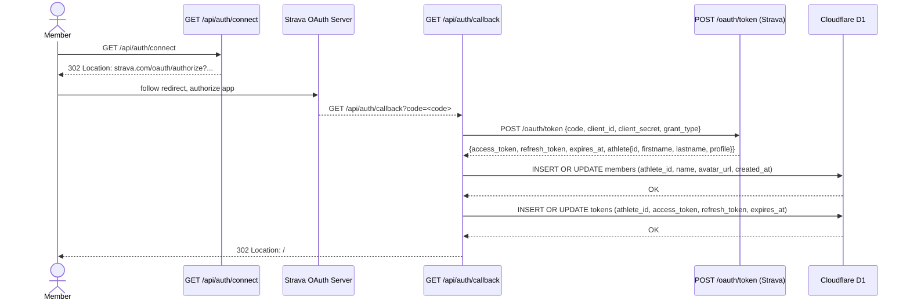
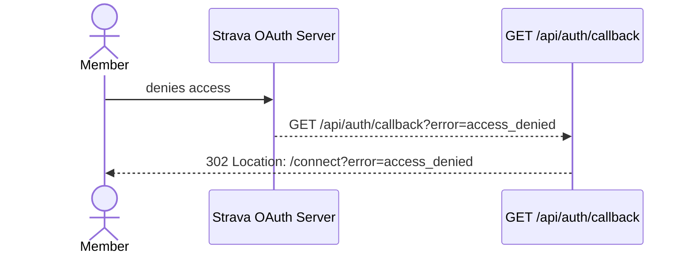

# SP1-T002 — Backend Design: Strava OAuth Member Connect

## Metadata
| Field | Value |
|-------|-------|
| **Requirement** | `docs/sprints/SP1/SP1-T002/SP1-T002-requirement.md` |
| **Points** | 5 |
| **Status** | draft |

---

## Approach

Two Edge Runtime API route handlers implement the Strava OAuth 2.0 Authorization Code flow:

1. **`GET /api/auth/connect`** — builds the Strava authorization URL and returns a 302 redirect. No D1 interaction. Stateless.
2. **`GET /api/auth/callback`** — receives the `?code=` from Strava, exchanges it for tokens via Strava's token endpoint, upserts member + token rows into D1, and redirects to `/`.

All logic runs in Cloudflare's Edge Runtime. No Node.js APIs. No session or cookie management. Tokens are stored exclusively server-side in D1 — never returned to the client.

---

## Existing Code Context

T001 delivered:
- `wrangler.toml` with D1 binding `DB` (`env.DB`)
- D1 schema: `members`, `tokens`, `activities` tables (see cross-task-context.md for column definitions)
- Next.js app scaffold with Edge Runtime
- No API routes yet

T002 adds:
- `app/api/auth/connect/route.ts`
- `app/api/auth/callback/route.ts`
- `lib/strava.ts` — shared Strava token exchange helper

No existing auth middleware, no session library, no cookie handling.

---

## Endpoint Specifications

### `GET /api/auth/connect`

**Purpose:** Build and return a redirect to the Strava authorization URL.

| Field | Value |
|-------|-------|
| Method | GET |
| Path | `/api/auth/connect` |
| Auth required | No |
| Runtime | Edge |
| Side effects | None |

**Request:** No query params, no body.

**Response:**
```
HTTP 302
Location: https://www.strava.com/oauth/authorize?client_id=<STRAVA_CLIENT_ID>&redirect_uri=<NEXT_PUBLIC_APP_URL>/api/auth/callback&response_type=code&scope=activity:read_all
```

**Error responses:**

| Condition | Response |
|-----------|----------|
| `STRAVA_CLIENT_ID` not set | 302 → `/connect?error=configuration_error` |
| `NEXT_PUBLIC_APP_URL` not set | 302 → `/connect?error=configuration_error` |

**Implementation notes:**
- `response_type` is always `code`
- `scope` is always `activity:read_all` — hardcoded, not configurable
- `redirect_uri` = `${process.env.NEXT_PUBLIC_APP_URL}/api/auth/callback`
- No `state` param in v1

---

### `GET /api/auth/callback`

**Purpose:** Exchange the OAuth code for tokens, upsert member + tokens into D1, redirect to leaderboard.

| Field | Value |
|-------|-------|
| Method | GET |
| Path | `/api/auth/callback` |
| Auth required | No |
| Runtime | Edge |
| Side effects | UPSERT `members` (1 row), UPSERT `tokens` (1 row) |

**Request query params:**

| Param | Type | Required | Notes |
|-------|------|----------|-------|
| `code` | string | Yes (success path) | Authorization code from Strava |
| `error` | string | Yes (failure path) | e.g. `access_denied` |

**Success flow:**
1. Extract `code` from query params.
2. `POST https://www.strava.com/oauth/token` with `client_id`, `client_secret`, `code`, `grant_type=authorization_code`.
3. Parse response: `{ access_token, refresh_token, expires_at, athlete: { id, firstname, lastname, profile } }`.
4. Build member: `athlete_id = athlete.id`, `name = "${athlete.firstname} ${athlete.lastname}"`, `avatar_url = athlete.profile`.
5. UPSERT into `members`.
6. UPSERT into `tokens`.
7. Return `302 → /`.

**Success response:**
```
HTTP 302
Location: /
```

**Error responses:**

| Condition | Response |
|-----------|----------|
| `?error=access_denied` (or any `?error` param) | 302 → `/connect?error=access_denied` |
| Missing `?code` param | 302 → `/connect?error=token_exchange_failed` |
| Strava token endpoint returns non-2xx | 302 → `/connect?error=token_exchange_failed` |
| Strava response missing required fields | 302 → `/connect?error=token_exchange_failed` |
| D1 write fails | 302 → `/connect?error=token_exchange_failed` |

---

## Data Models

Schema is owned by T001. T002 does not redefine tables — it reads and writes the existing schema.

Reference: `docs/sprints/SP1/cross-task-context.md` — Shared Schema section.

```
members   (athlete_id INTEGER PK, name TEXT, avatar_url TEXT, created_at INTEGER)
tokens    (athlete_id INTEGER PK FK→members, access_token TEXT, refresh_token TEXT, expires_at INTEGER)
```

T002 writes to `members` and `tokens` only. Does not touch `activities`.

---

## Service Layer

### `lib/strava.ts` — `exchangeCodeForTokens(code: string)`

Encapsulates the Strava token exchange HTTP call. Separated from the route handler for testability.

```typescript
interface StravaTokenResponse {
  access_token: string;
  refresh_token: string;
  expires_at: number;
  athlete: {
    id: number;
    firstname: string;
    lastname: string;
    profile: string;       // avatar URL (full size)
  };
}

async function exchangeCodeForTokens(code: string): Promise<StravaTokenResponse>
```

- Makes `POST https://www.strava.com/oauth/token`
- Body (application/x-www-form-urlencoded): `client_id`, `client_secret`, `code`, `grant_type=authorization_code`
- Throws on non-2xx response
- Returns parsed `StravaTokenResponse`

### `lib/db/members.ts` — `upsertMember(db: D1Database, member: MemberRow)`

```typescript
interface MemberRow {
  athlete_id: number;
  name: string;
  avatar_url: string;
  created_at: number;   // Unix epoch seconds — set on INSERT, preserved on UPDATE
}

async function upsertMember(db: D1Database, member: MemberRow): Promise<void>
```

SQL:
```sql
INSERT INTO members (athlete_id, name, avatar_url, created_at)
VALUES (?, ?, ?, ?)
ON CONFLICT (athlete_id) DO UPDATE SET
  name = excluded.name,
  avatar_url = excluded.avatar_url
```

Note: `created_at` is NOT updated on conflict — preserves original connect timestamp (Business Rule R-2).

### `lib/db/tokens.ts` — `upsertToken(db: D1Database, token: TokenRow)`

```typescript
interface TokenRow {
  athlete_id: number;
  access_token: string;
  refresh_token: string;
  expires_at: number;   // Unix epoch seconds from Strava response
}

async function upsertToken(db: D1Database, token: TokenRow): Promise<void>
```

SQL:
```sql
INSERT INTO tokens (athlete_id, access_token, refresh_token, expires_at)
VALUES (?, ?, ?, ?)
ON CONFLICT (athlete_id) DO UPDATE SET
  access_token = excluded.access_token,
  refresh_token = excluded.refresh_token,
  expires_at = excluded.expires_at
```

---

## Business Logic

| Rule | Where enforced | Detail |
|------|---------------|--------|
| Scope locked to `activity:read_all` | `connect/route.ts` | Hardcoded — not derived from env or input |
| `created_at` set once (INSERT only) | `upsertMember()` | ON CONFLICT excludes `created_at` from UPDATE |
| `avatar_url` from `athlete.profile` (full size) | `callback/route.ts` | Not `athlete.profile_medium` |
| `name` = `firstname + " " + lastname` | `callback/route.ts` | Space-joined; handles empty lastname gracefully |
| All timestamps in Unix epoch seconds | `callback/route.ts` | `expires_at` already in epoch from Strava; `created_at = Math.floor(Date.now() / 1000)` |
| `athlete_id` is INTEGER | `callback/route.ts` | `Number(athlete.id)` — Strava returns numbers, but defensive cast applied |

---

## Error Handling

All errors in the callback route result in a redirect to `/connect?error=<reason>` — never a 5xx response visible to the user.

| Error class | Caught where | Action |
|------------|-------------|--------|
| Missing `?code` param | `callback/route.ts` top of handler | `302 → /connect?error=token_exchange_failed` |
| Strava `?error` param present | `callback/route.ts` top of handler | `302 → /connect?error=access_denied` |
| `fetch` to Strava throws (network) | `exchangeCodeForTokens()` — caught in handler | `302 → /connect?error=token_exchange_failed` |
| Strava returns non-2xx | `exchangeCodeForTokens()` — throws | `302 → /connect?error=token_exchange_failed` |
| Strava response missing fields | Validation after parse — throws | `302 → /connect?error=token_exchange_failed` |
| D1 `upsertMember` throws | try/catch in handler | `302 → /connect?error=token_exchange_failed` |
| D1 `upsertToken` throws | try/catch in handler | `302 → /connect?error=token_exchange_failed` |
| Env vars missing in `connect` route | Guard at route start | `302 → /connect?error=configuration_error` |

Errors are logged to `console.error` for Cloudflare Workers log visibility. No external error tracking in v1.

---

## Implementation Plan

| Step | File | Description |
|------|------|-------------|
| 1 | `lib/strava.ts` | Implement `exchangeCodeForTokens()` |
| 2 | `lib/db/members.ts` | Implement `upsertMember()` with UPSERT SQL |
| 3 | `lib/db/tokens.ts` | Implement `upsertToken()` with UPSERT SQL |
| 4 | `app/api/auth/connect/route.ts` | Build Strava auth URL, return 302 |
| 5 | `app/api/auth/callback/route.ts` | Orchestrate: parse params → exchange → upsert → redirect |
| 6 | Tests | Write all tests before step 1 (TDD) |

---

## TDD Test Plan

Tests are written **before** implementation. Integration tests use **real Cloudflare D1** (local via wrangler) — no mocks.

### Unit Tests — `lib/strava.ts`

| Test ID | AC | Test description | Pass condition |
|---------|----|-----------------|----------------|
| BE-T001 | AC-2, AC-3 | `exchangeCodeForTokens` sends correct POST body | Intercept fetch: body contains `grant_type=authorization_code`, `code=<test_code>`, `client_id`, `client_secret` |
| BE-T002 | AC-2 | `exchangeCodeForTokens` returns parsed token response | Returns object with `access_token`, `refresh_token`, `expires_at`, `athlete.id` |
| BE-T003 | AC-8 | `exchangeCodeForTokens` throws on non-2xx response | Function throws when Strava returns 400 |
| BE-T004 | AC-8 | `exchangeCodeForTokens` throws on network error | Function throws when fetch rejects |

_Unit tests for the Strava HTTP call use fetch interception (MSW or global fetch override) — acceptable at unit level to avoid real HTTP. Integration tests use real Strava._

### Unit Tests — `lib/db/members.ts`

| Test ID | AC | Test description | Pass condition |
|---------|----|-----------------|----------------|
| BE-T005 | AC-5 | `upsertMember` inserts row into real local D1 | Row present in `members` with correct fields after call |
| BE-T006 | AC-7 | `upsertMember` updates `name` + `avatar_url` on re-insert, preserves `created_at` | Second upsert changes name/avatar; `created_at` unchanged |
| BE-T007 | AC-7 | `upsertMember` does not create duplicate rows | `SELECT COUNT(*)` = 1 after two upserts with same `athlete_id` |

### Unit Tests — `lib/db/tokens.ts`

| Test ID | AC | Test description | Pass condition |
|---------|----|-----------------|----------------|
| BE-T008 | AC-6 | `upsertToken` inserts row into real local D1 | Row present in `tokens` with correct fields after call |
| BE-T009 | AC-7 | `upsertToken` updates all token fields on re-insert | Second upsert reflects new `access_token`, `refresh_token`, `expires_at` |
| BE-T010 | AC-7 | `upsertToken` does not create duplicate rows | `SELECT COUNT(*)` = 1 after two upserts with same `athlete_id` |

### Integration Tests — `GET /api/auth/connect`

| Test ID | AC | Test description | Pass condition |
|---------|----|-----------------|----------------|
| BE-T011 | AC-2 | Returns 302 with `Location` pointing to Strava | Status 302; `Location` starts with `https://www.strava.com/oauth/authorize` |
| BE-T012 | AC-3 | Strava URL includes `scope=activity:read_all` | `Location` URL has `scope=activity:read_all` |
| BE-T013 | AC-2 | Strava URL includes correct `client_id` | `Location` URL has `client_id=<STRAVA_CLIENT_ID>` |
| BE-T014 | AC-2 | Strava URL includes correct `redirect_uri` | `Location` URL has `redirect_uri=<APP_URL>/api/auth/callback` |

### Integration Tests — `GET /api/auth/callback`

Uses **real local D1**. Strava token exchange is tested with real credentials in integration environment (or stubbed at HTTP level for CI).

| Test ID | AC | Test description | Pass condition |
|---------|----|-----------------|----------------|
| BE-T015 | AC-4 | Successful callback redirects to `/` | Status 302; `Location` = `/` |
| BE-T016 | AC-5 | `members` row exists after successful callback | D1 query returns row with `athlete_id`, `name`, `avatar_url`, `created_at` |
| BE-T017 | AC-6 | `tokens` row exists after successful callback | D1 query returns row with `access_token`, `refresh_token`, `expires_at` |
| BE-T018 | AC-7 | Second callback with same athlete_id does not duplicate rows | `COUNT(*)=1` in both `members` and `tokens` |
| BE-T019 | AC-8 | `?error=access_denied` redirects to `/connect?error=access_denied` | Status 302; `Location` = `/connect?error=access_denied` |
| BE-T020 | AC-8 | Missing `?code` redirects to `/connect?error=token_exchange_failed` | Status 302; `Location` = `/connect?error=token_exchange_failed` |
| BE-T021 | AC-8 | D1 write failure redirects to `/connect?error=token_exchange_failed` | Status 302 (simulated by using invalid D1 binding in test) |

---

## Auth Matrix

| Route | Auth required | Notes |
|-------|--------------|-------|
| `GET /api/auth/connect` | No | Initiates public OAuth flow |
| `GET /api/auth/callback` | No | Called by Strava's server — can't require prior auth |

No middleware needed. No JWT, session, or cookie. This matches the cross-task-context.md auth requirements table.

---

## Sequence Diagram



**Error path:**



---

## Data Contracts

### Strava Token Endpoint Request

```
POST https://www.strava.com/oauth/token
Content-Type: application/x-www-form-urlencoded

client_id=<STRAVA_CLIENT_ID>
&client_secret=<STRAVA_CLIENT_SECRET>
&code=<code>
&grant_type=authorization_code
```

### Strava Token Endpoint Response (relevant fields)

```json
{
  "access_token": "a4b945687g...",
  "refresh_token": "fc2c...",
  "expires_at": 1800000000,
  "athlete": {
    "id": 12345678,
    "firstname": "John",
    "lastname": "Doe",
    "profile": "https://dgalywyr863hv.cloudfront.net/pictures/athletes/12345678/full.jpg"
  }
}
```

Fields used by T002:
- `access_token` → `tokens.access_token`
- `refresh_token` → `tokens.refresh_token`
- `expires_at` → `tokens.expires_at`
- `athlete.id` → `members.athlete_id`, `tokens.athlete_id`
- `athlete.firstname` + `athlete.lastname` → `members.name`
- `athlete.profile` → `members.avatar_url`

### D1 Write: `members` INSERT/UPDATE

```sql
INSERT INTO members (athlete_id, name, avatar_url, created_at)
VALUES (12345678, 'John Doe', 'https://...', 1711234567)
ON CONFLICT (athlete_id) DO UPDATE SET
  name = excluded.name,
  avatar_url = excluded.avatar_url
```

### D1 Write: `tokens` INSERT/UPDATE

```sql
INSERT INTO tokens (athlete_id, access_token, refresh_token, expires_at)
VALUES (12345678, 'a4b945687g...', 'fc2c...', 1800000000)
ON CONFLICT (athlete_id) DO UPDATE SET
  access_token = excluded.access_token,
  refresh_token = excluded.refresh_token,
  expires_at = excluded.expires_at
```

---

## Security

| Concern | Mitigation |
|---------|-----------|
| `STRAVA_CLIENT_SECRET` exposure | Server-side env var only — never in client bundle, never in response body |
| Token stored client-side | Tokens are only in D1 — not returned in any response, not set in cookies |
| OAuth code replay | Strava codes are single-use — replaying returns an error from Strava |
| CSRF on callback | No `state` param in v1 (acceptable at 20-member scale); add in v2 |
| Open redirect | `redirect_uri` is hardcoded from `NEXT_PUBLIC_APP_URL` — not user-supplied |
| Strava response injection | Response is parsed to a typed interface; unexpected fields are ignored |

---

## Environment Variables

| Variable | Required | Where used | Set by |
|----------|----------|-----------|--------|
| `STRAVA_CLIENT_ID` | Yes | `connect/route.ts` (build auth URL) | Developer — Strava API app settings |
| `STRAVA_CLIENT_SECRET` | Yes | `callback/route.ts` (token exchange) | Developer — Strava API app settings |
| `NEXT_PUBLIC_APP_URL` | Yes | `connect/route.ts` (build `redirect_uri`) | Developer — `.env.local` or Cloudflare Pages env |

**Notes:**
- `NEXT_PUBLIC_APP_URL` is used server-side in the API route (to construct `redirect_uri`), despite the `NEXT_PUBLIC_` prefix. The prefix allows it to also be used in client-side code if needed in future tasks.
- All three vars must be set in both `.env.local` (local dev) and Cloudflare Pages environment settings (production).
- The `redirect_uri` registered in the Strava API app settings must exactly match `${NEXT_PUBLIC_APP_URL}/api/auth/callback`.

---

## Migrations

No new migrations required. T001 already created `members` and `tokens` tables.

T002 reads/writes the schema as defined. Do not alter tables in this task.

Reference migration: `migrations/0001_init.sql` (T001).
