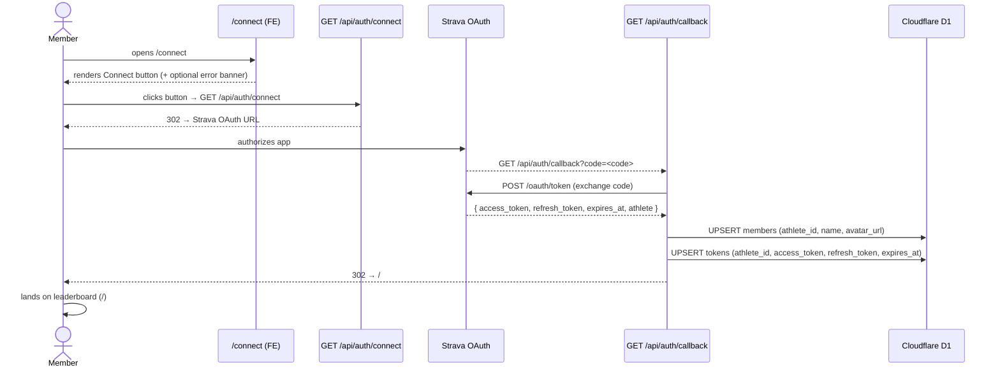

# SP1-T002 — Frontend Design: Strava OAuth Member Connect

## Metadata
| Field | Value |
|-------|-------|
| **Requirement** | `docs/sprints/SP1/SP1-T002/SP1-T002-requirement.md` |
| **Points** | 5 |
| **Status** | draft |

---

## Approach

Minimal frontend: a single static page at `/connect` with a "Connect with Strava" button that navigates the user to `GET /api/auth/connect`. No client-side JavaScript state management or data fetching is required for the happy path — the entire OAuth flow is driven by server-side redirects.

The only client-side concern is reading the `?error=` query param on return from a failed flow and displaying the appropriate error message. This is handled with a lightweight React client component reading `useSearchParams`.

The `/connect` page is a **public route** — no authentication middleware, no session check.

---

## Existing Code Context

T001 delivered:
- `app/page.tsx` — bare index placeholder (heading only)
- Tailwind CSS configured
- Edge Runtime set on Next.js

T002 adds:
- `app/connect/page.tsx` — new route
- `app/connect/ConnectButton.tsx` — client component for error display + button

No existing component library. Tailwind utility classes only.

---

## UI/UX Overview

### `/connect` page — happy path

```
┌─────────────────────────────────────────┐
│                                         │
│   Connect Your Strava Account           │  ← h1
│                                         │
│   Join the leaderboard — authorize      │  ← p (subheading)
│   read-only access to your Strava       │
│   activities.                           │
│                                         │
│   ┌─────────────────────────────────┐   │
│   │  🟠  Connect with Strava        │   │  ← <a href="/api/auth/connect">
│   └─────────────────────────────────┘   │
│                                         │
└─────────────────────────────────────────┘
```

### `/connect?error=access_denied` — error state

```
┌─────────────────────────────────────────┐
│                                         │
│   Connect Your Strava Account           │
│                                         │
│   ⚠ You declined access. Click below   │  ← error banner (conditional)
│     to try again.                       │
│                                         │
│   ┌─────────────────────────────────┐   │
│   │  🟠  Connect with Strava        │   │
│   └─────────────────────────────────┘   │
│                                         │
└─────────────────────────────────────────┘
```

**Styling notes:**
- Background: dark/neutral to match leaderboard page tone
- Button: Strava orange `#FC4C02` with white text, rounded, full-width on mobile
- Error banner: amber/yellow background, visible above button
- Centered layout, max-width ~400px, vertically centered on page
- Responsive: full-width button on mobile, constrained on desktop

---

## Routing

| Path | Component | Notes |
|------|-----------|-------|
| `/connect` | `app/connect/page.tsx` | Public, no auth required |
| `/api/auth/connect` | `app/api/auth/connect/route.ts` | Server — handled by BE design |
| `/api/auth/callback` | `app/api/auth/callback/route.ts` | Server — handled by BE design |

The FE page links to `/api/auth/connect` via a plain anchor tag (not a Next.js `<Link>`) to ensure a full navigation (not a client-side prefetch).

---

## Component Breakdown

### `app/connect/page.tsx`

- **Type:** Server Component (Next.js default)
- **Runtime:** `export const runtime = 'edge'`
- **Responsibility:** Page shell — renders heading, subheading, and `<ConnectButton>`
- **Props:** none
- **Data fetching:** none

```
ConnectPage (server)
└── ConnectButton (client — reads searchParams)
```

### `app/connect/ConnectButton.tsx`

- **Type:** Client Component (`'use client'`)
- **Responsibility:**
  - Reads `?error` query param via `useSearchParams()`
  - Conditionally renders error banner
  - Renders `<a href="/api/auth/connect">` styled as button
- **Props:** none (reads URL directly)
- **State:** none (URL-driven)

**Error message map:**

| `?error` value | Message shown |
|---------------|---------------|
| `access_denied` | "You declined access. Click below to try again." |
| `token_exchange_failed` | "Something went wrong. Please try connecting again." |
| any other / missing | No error banner shown |

---

## API Contracts

T002 FE only calls one endpoint (via anchor navigation, not fetch):

| Method | Path | Trigger | Expected response |
|--------|------|---------|-------------------|
| GET | `/api/auth/connect` | Click "Connect with Strava" | 302 redirect to Strava OAuth URL |

No JSON fetch calls are made from this page. The callback path is handled entirely server-side and returns a redirect; the browser follows it automatically.

---

## State & Data Flow

```
User lands on /connect
        │
        ▼
ConnectButton reads window.location.search
        │
        ├── ?error=access_denied ──────► render error banner
        ├── ?error=token_exchange_failed ► render error banner
        └── (no error param) ──────────► no banner
        │
        ▼
User clicks "Connect with Strava"
        │
        ▼
Browser navigates to /api/auth/connect (full page nav)
        │
        ▼
Server returns 302 → https://www.strava.com/oauth/authorize?...
        │
        ▼
User authorizes on Strava.com
        │
        ▼
Strava redirects to /api/auth/callback?code=<code>
        │
        ▼
Server exchanges code, writes D1, returns 302 → /
        │
        ▼
User lands on / (leaderboard)
```

No Redux, Zustand, or React Context needed. All state lives in the URL.

---

## Loading States

| Scenario | UI behavior |
|----------|-------------|
| Clicking "Connect with Strava" | Full page navigation begins — browser shows native loading indicator. No spinner needed in the app. |
| Strava authorization page loads | External — outside app control |
| `/api/auth/callback` processing (< 2s) | Browser loading indicator. No in-app spinner (server redirect is fast). |

No skeleton loaders or async loading states required for this page.

---

## Fail State Table

| Scenario | How it surfaces | UI response |
|----------|----------------|-------------|
| Member denies on Strava | `GET /connect?error=access_denied` | Error banner above button: "You declined access. Click below to try again." |
| Token exchange fails (network/server error) | `GET /connect?error=token_exchange_failed` | Error banner: "Something went wrong. Please try connecting again." |
| Unknown error param value | `GET /connect?error=<unknown>` | No banner — silently ignored (safe fallback) |
| `/api/auth/connect` returns non-302 (server error) | Browser shows native error / blank | Out of scope for FE — BE must not return 500 here |
| D1 write fails during callback | BE returns redirect to `/connect?error=token_exchange_failed` | Error banner shown |
| Member visits `/connect` already connected | No detection in v1 — page shows button again (idempotent re-connect is safe) |

---

## Async Sequence



---

## TDD Test Plan

Tests are written before implementation. All tests use real rendering (React Testing Library) or real HTTP (integration). No mocks at the integration layer.

### Unit Tests — `ConnectButton.tsx`

| Test ID | AC | Test description | Pass condition |
|---------|----|-----------------|----------------|
| FE-T001 | AC-1 | Renders "Connect with Strava" anchor element | `getByRole('link', { name: /connect with strava/i })` exists |
| FE-T002 | AC-1 | Anchor `href` is `/api/auth/connect` | `link.href` ends with `/api/auth/connect` |
| FE-T003 | AC-8 | No error banner when no `?error` param | error message container absent from DOM |
| FE-T004 | AC-8 | `?error=access_denied` renders correct message | "You declined access" text visible |
| FE-T005 | AC-8 | `?error=token_exchange_failed` renders correct message | "Something went wrong" text visible |
| FE-T006 | AC-8 | Unknown `?error` value renders no banner | No error container in DOM |

### Unit Tests — `app/connect/page.tsx`

| Test ID | AC | Test description | Pass condition |
|---------|----|-----------------|----------------|
| FE-T007 | AC-1 | Page renders heading "Connect Your Strava Account" | `getByRole('heading', { name: /connect your strava account/i })` exists |
| FE-T008 | AC-1 | Page renders `ConnectButton` component | `ConnectButton` subtree present |

### Smoke / Integration Tests

| Test ID | AC | Test description | Pass condition |
|---------|----|-----------------|----------------|
| FE-T009 | AC-1 | `GET /connect` returns HTTP 200 | Status 200, HTML contains button text |
| FE-T010 | AC-2 | `GET /api/auth/connect` returns 302 | Location header starts with `https://www.strava.com/oauth/authorize` |
| FE-T011 | AC-3 | Strava redirect URL includes `scope=activity:read_all` | URL query param `scope` equals `activity:read_all` |

---

## Environment / Config Dependencies

| Variable | Required by | Notes |
|----------|------------|-------|
| `STRAVA_CLIENT_ID` | `GET /api/auth/connect` | From Strava API app settings; server-side only |
| `STRAVA_CLIENT_SECRET` | `GET /api/auth/callback` | Server-side only — never exposed to client |
| `NEXT_PUBLIC_APP_URL` | `GET /api/auth/connect` | Used to construct `redirect_uri`; must match Strava app settings |

`ConnectButton.tsx` reads only `window.location.search` — no env vars needed client-side.

---

## Edge Cases

| Case | Handling |
|------|---------|
| User navigates directly to `/api/auth/callback` without `?code` | BE redirects to `/connect?error=token_exchange_failed` (handled in BE design) |
| User opens `/connect` on mobile | Tailwind responsive classes ensure full-width button, readable layout |
| Strava returns `?error=` param (e.g. `access_denied`) directly to callback | BE redirects to `/connect?error=access_denied`; FE shows error banner |
| User re-connects (already in D1) | Same flow, UPSERT is idempotent — no special FE handling needed |
| `NEXT_PUBLIC_APP_URL` not set | `GET /api/auth/connect` returns 500 — BE must validate and return error redirect, not crash |
| Rapid double-click on "Connect" button | Two navigations race — harmless, Strava deduplicates at their end |
