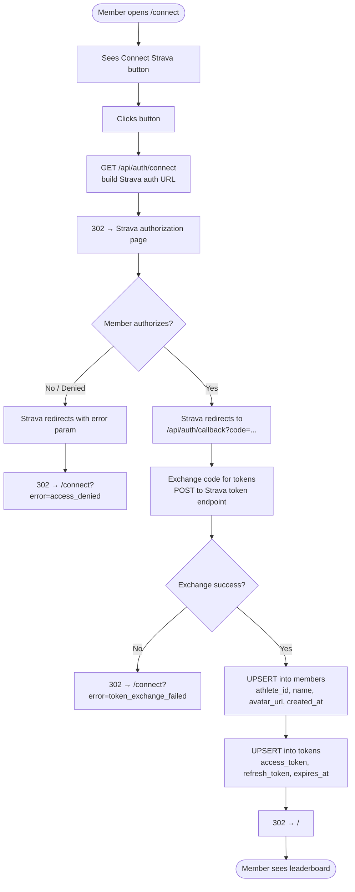

# SP1-T002 — Strava OAuth Member Connect

## Metadata
| Field | Value |
|-------|-------|
| **Sprint** | SP1 |
| **Points** | 5 |
| **Priority** | high |
| **Assignee** | - |
| **Requester** | Club Organizer (self) |
| **Status** | done |
| **Depends on** | SP1-T001 (infra + D1 schema ready) |

---

## Problem Statement

Club members use Strava to track exercise but the leaderboard app needs permission to read their activity data. Before any sync or ranking can happen, each member must authorize the app via Strava OAuth 2.0. There is currently no connect flow — no page, no API route, no token storage.

This task delivers the self-service OAuth onboarding experience: a public `/connect` page with a "Connect Strava" button, the OAuth redirect and callback handlers, and storage of member profile + tokens into Cloudflare D1.

---

## Overview

Implement Strava OAuth 2.0 Authorization Code flow for member onboarding.

1. Member opens `/connect` — public page, no login required.
2. Member clicks "Connect Strava" → browser redirects to Strava authorization URL with scope `activity:read_all`.
3. Member authorizes on Strava.com → Strava redirects to `/api/auth/callback?code=<code>`.
4. Callback handler exchanges the code for tokens via Strava's token endpoint.
5. Handler upserts member profile (`athlete_id`, `name`, `avatar_url`) into `members` table.
6. Handler upserts tokens (`access_token`, `refresh_token`, `expires_at`) into `tokens` table.
7. Member is redirected to `/` (leaderboard).

---

## Feature Flow

---

## User Stories

| # | Story | Maps to AC |
|---|-------|-----------|
| US-1 | As a club member, I want to open `/connect` and see a clear "Connect Strava" button, so that I know how to authorize the app. | AC-1 |
| US-2 | As a club member, I want clicking "Connect Strava" to take me directly to Strava's official authorization page, so that I trust the process. | AC-2 |
| US-3 | As a club member, I want the app to request only read-only access (`activity:read_all`) so that I feel safe authorizing. | AC-3 |
| US-4 | As a club member, after I authorize on Strava, I want to be automatically redirected to the leaderboard, so that I can immediately see results. | AC-4 |
| US-5 | As a club organizer, I want the member's `name` and `avatar_url` stored in D1 so that the leaderboard can display them. | AC-5 |
| US-6 | As a club organizer, I want `access_token`, `refresh_token`, and `expires_at` stored in D1 so that T003 (sync cron) can pull activities without re-authorization. | AC-6 |
| US-7 | As a club member, if I re-authorize (second connect), I want my tokens to be updated (not duplicated), so that the latest valid tokens are always used. | AC-7 |
| US-8 | As a club member, if I deny access on Strava or an error occurs, I want to be shown a friendly error on `/connect`, not a broken page. | AC-8 |

---

## System Behavior

| Trigger | System Response | Side Effects | Timing |
|---------|----------------|-------------|--------|
| `GET /api/auth/connect` | Build Strava OAuth URL with client_id, redirect_uri, scope=`activity:read_all`, response_type=code | None | sync, < 50ms |
| Strava authorization granted | Strava calls `GET /api/auth/callback?code=<code>` | None until handler runs | external |
| `GET /api/auth/callback?code=<code>` | Exchange code → tokens; UPSERT members + tokens; redirect to `/` | D1 writes: 1 row members, 1 row tokens | async, < 2s |
| `GET /api/auth/callback?error=access_denied` | Redirect to `/connect?error=access_denied` | None | sync, < 50ms |
| Token exchange HTTP error (non-2xx from Strava) | Redirect to `/connect?error=token_exchange_failed` | None | async, < 5s |
| Re-connect (existing athlete_id) | UPSERT members + tokens — updates existing rows | D1 write: updates existing rows | async, < 2s |

---

## Acceptance Criteria

- [x] **AC-1: `/connect` page renders with "Connect Strava" button**
  GIVEN any user opens `/connect` in a browser
  WHEN the page loads
  THEN a "Connect Strava" button (or link styled as button) is visible
  AND the page does not require any prior login or authentication

- [x] **AC-2: Clicking "Connect Strava" redirects to Strava's authorization URL**
  GIVEN a user is on `/connect`
  WHEN they click "Connect Strava"
  THEN the browser navigates to `GET /api/auth/connect`
  AND the response is a 302 redirect to `https://www.strava.com/oauth/authorize`
  AND the URL includes `client_id`, `redirect_uri`, `response_type=code`, `scope=activity:read_all`

- [x] **AC-3: OAuth scope is read-only (`activity:read_all`)**
  GIVEN the Strava authorization URL is built
  WHEN inspected
  THEN the `scope` parameter is exactly `activity:read_all`
  AND no write scopes are requested

- [x] **AC-4: Successful authorization redirects member to `/`**
  GIVEN a member has authorized on Strava
  WHEN Strava calls `/api/auth/callback?code=<code>`
  AND the token exchange succeeds
  THEN the response is a 302 redirect to `/`

- [x] **AC-5: Member profile stored in D1 `members` table**
  GIVEN a member has completed the OAuth flow successfully
  WHEN the `members` table is queried by `athlete_id`
  THEN a row exists with `athlete_id` (INTEGER), `name` (TEXT), `avatar_url` (TEXT), `created_at` (INTEGER Unix epoch seconds)

- [x] **AC-6: Tokens stored in D1 `tokens` table**
  GIVEN a member has completed the OAuth flow successfully
  WHEN the `tokens` table is queried by `athlete_id`
  THEN a row exists with `access_token` (TEXT), `refresh_token` (TEXT), `expires_at` (INTEGER Unix epoch seconds)

- [x] **AC-7: Re-authorization updates existing rows (upsert, not duplicate)**
  GIVEN a member with `athlete_id` X already exists in D1
  WHEN they complete the OAuth flow again
  THEN the `members` row for athlete_id X is updated (not a second row added)
  AND the `tokens` row for athlete_id X is updated with the new tokens

- [x] **AC-8: Denied access or error shows friendly message on `/connect`**
  GIVEN a member denies access on Strava (or an exchange error occurs)
  WHEN they are redirected back to the app
  THEN they land on `/connect?error=<reason>`
  AND the page displays a friendly error message
  AND the "Connect Strava" button remains available to retry

---

## Data & Business Rules

| Rule ID | Rule | Example |
|---------|------|---------|
| R-1 | `athlete_id` is the Strava athlete's INTEGER ID — used as PK in `members` and `tokens` | `athlete_id: 12345678` |
| R-2 | `created_at` is set on INSERT only; not updated on UPSERT | Initial connect timestamp |
| R-3 | `expires_at` comes from Strava's token response as Unix epoch seconds | `expires_at: 1800000000` |
| R-4 | Strava OAuth scope must be exactly `activity:read_all` — no write scopes | T003 only needs read access |
| R-5 | UPSERT on `members`: conflict on `athlete_id` updates `name`, `avatar_url` only (not `created_at`) | Re-connect keeps original `created_at` |
| R-6 | UPSERT on `tokens`: conflict on `athlete_id` updates all token fields | New tokens always replace old ones |
| R-7 | `redirect_uri` must match exactly what is registered in the Strava API app settings | Mismatch causes Strava error |
| R-8 | The OAuth `state` parameter is NOT required for v1 (single-user CSRF not a concern at this scale) | Can be added in v2 |
| R-9 | `avatar_url` comes from `athlete.profile` in Strava token response | Strava returns full/thumb sizes — use `athlete.profile` (full) |
| R-10 | `name` is constructed as `"${athlete.firstname} ${athlete.lastname}"` | "John Doe" |

---

## Success Metrics

- [ ] 20/20 club members successfully complete the OAuth flow (manual tracking)
- [ ] 0 duplicate rows in `members` or `tokens` tables after re-authorization
- [ ] Callback handler completes (token exchange + D1 writes + redirect) in < 2 seconds p95
- [ ] Error paths (denied, exchange failure) land on `/connect` with visible error — not a 500

---

## Design References

- Figma: TBD — button style follows Strava brand orange (`#FC4C02`) or neutral CTA
- Strava OAuth documentation: https://developers.strava.com/docs/authentication/
- Sprint architecture: `docs/sprints/SP1/SP1-overview.md`

---

## Analytics & Tracking

| Event | When | Properties |
|-------|------|-----------|
| `member_connect_started` | User clicks "Connect Strava" on `/connect` | `{ timestamp }` |
| `member_connect_success` | Callback handler completes successfully | `{ athlete_id, timestamp }` |
| `member_connect_error` | Denied or exchange failure | `{ error_reason, timestamp }` |

_Analytics implementation deferred to v2 — log to console in v1 for observability._

---

## UI Copy

| Element | Copy |
|---------|------|
| Page heading | "Connect Your Strava Account" |
| Subheading | "Join the leaderboard — authorize read-only access to your Strava activities." |
| CTA button | "Connect with Strava" |
| Error: access_denied | "You declined access. Click below to try again." |
| Error: token_exchange_failed | "Something went wrong. Please try connecting again." |
| Success redirect note | (implicit — user is sent to `/` immediately) |

---

## DO / DON'T

| DO | DON'T |
|----|-------|
| Request only `activity:read_all` | Request write scopes (`activity:write`, etc.) |
| UPSERT (not INSERT) on existing athlete_id | INSERT and risk duplicate rows |
| Store tokens in `tokens` table (server-side only) | Expose tokens to the client / browser |
| Redirect to `/` on success | Redirect to an external URL |
| Show user-friendly error and retry button | Show raw error messages or stack traces to users |

---

## Out of Scope

- Activity sync (T003) — tokens stored here are consumed there
- Token refresh logic (T003)
- Leaderboard display (T004)
- CSRF `state` param (v2 — acceptable risk at 20-member scale)
- Member-only dashboard / session management
- Admin OAuth flow (organizer connects separately if needed)

---

## Dependencies

| Dependency | Type | Notes |
|-----------|------|-------|
| SP1-T001 | Task | D1 schema (`members`, `tokens`) must exist before T002 can write |
| Strava Developer App | External | `STRAVA_CLIENT_ID` and `STRAVA_CLIENT_SECRET` must be registered at developers.strava.com before implementing |
| Cloudflare D1 binding `DB` | Infra | Configured in `wrangler.toml` by T001 |
| `NEXT_PUBLIC_APP_URL` | Env var | Used to construct `redirect_uri` (e.g. `https://yourdomain.pages.dev`) |

---

## Test Data / Seed Requirements

| What | Value | Who sets it up |
|------|-------|----------------|
| Strava test athlete account | Real Strava account used for integration testing | Developer |
| `STRAVA_CLIENT_ID` | From Strava API app settings | Developer (in `.env.local`) |
| `STRAVA_CLIENT_SECRET` | From Strava API app settings | Developer (in `.env.local`) |
| `NEXT_PUBLIC_APP_URL` | `http://localhost:3000` (local) or Pages URL (prod) | Developer |

---

## Rollout Strategy

- **Strategy:** All-at-once — single `/connect` page, no feature flag needed
- **Rollout order:** Deploy → share `/connect` URL with all 20 members → they connect individually (self-service)
- **Rollback:** Revert commit; Cloudflare Pages auto-reverts to prior deployment. D1 rows remain but are harmless without token exchange working.
- **Communication:** Club organizer sends `/connect` URL to members via group chat with explanation of read-only scope.

---

## Review Summary

| Date | Result | Notes |
|------|--------|-------|
| 2026-03-24 | APPROVED | All 8 ACs implemented and passing. Minor fix applied: connect route error path switched from `Response.redirect()` to `new Response()` helper for relative-URL compatibility. Unused `d1` variable removed from test. |

| AC | Status | Tests |
|----|--------|-------|
| AC-1 | ✓ | FE-T001, FE-T002, FE-T007, FE-T008 |
| AC-2 | ✓ | BE-T011, BE-T013, BE-T014 |
| AC-3 | ✓ | BE-T012 |
| AC-4 | ✓ | BE-T015 |
| AC-5 | ✓ | BE-T005, BE-T016 |
| AC-6 | ✓ | BE-T008, BE-T017 |
| AC-7 | ✓ | BE-T006, BE-T007, BE-T009, BE-T010, BE-T018 |
| AC-8 | ✓ | FE-T003–T006, BE-T019, BE-T020, BE-T021 |

---

## Definition of Done

- [ ] All 8 ACs pass — verified against real Strava OAuth (not mocked)
- [ ] `/connect` page renders correctly on both mobile and desktop
- [ ] `GET /api/auth/connect` returns 302 to Strava with correct params
- [ ] `GET /api/auth/callback` correctly upserts `members` + `tokens` in D1
- [ ] Re-authorization (second connect) does not create duplicate rows
- [ ] Error paths (`access_denied`, `token_exchange_failed`) render friendly messages on `/connect`
- [ ] Integration tests pass against real local D1 (no mocks)
- [ ] `npm run lint` and `npm run typecheck` pass with zero errors
- [ ] No tokens exposed to client-side code or response bodies
- [ ] BACKLOG.md updated to `done`
