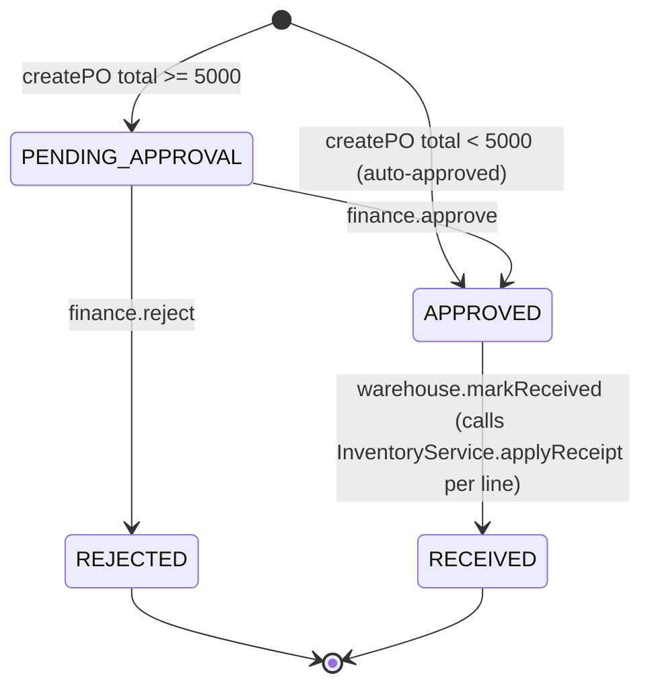
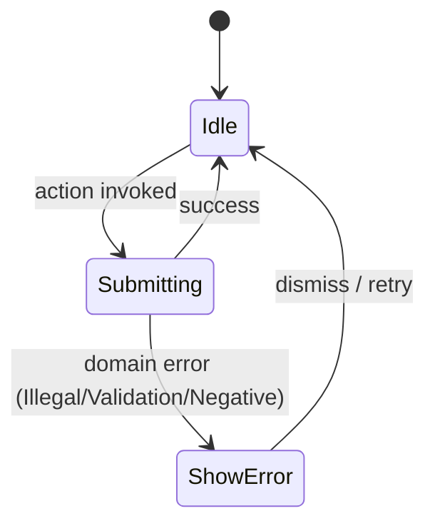
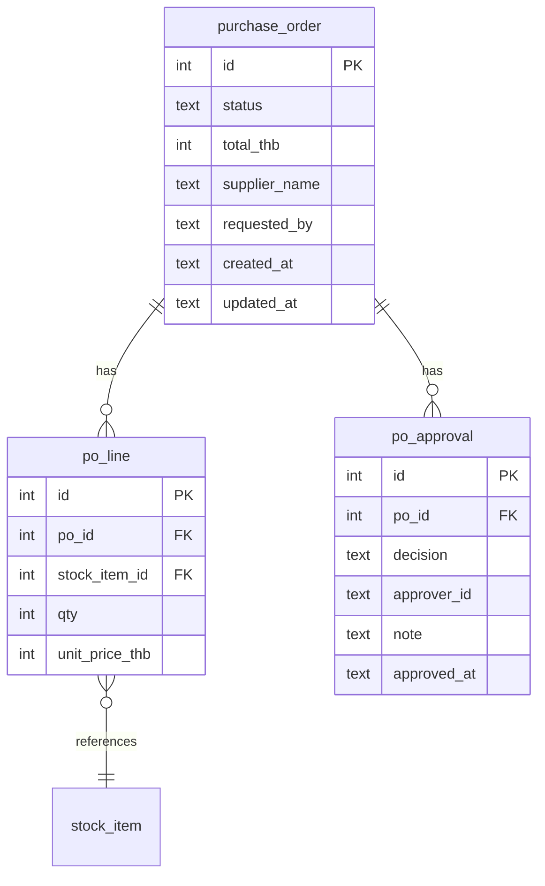

# SP1-T002 — As a purchasing officer, I want to raise purchase orders that route to finance for approval when total ≥ ฿5,000 and that auto-increment stock when warehouse marks them received, so that approvals are auditable and stock stays in sync with PO activity.

> **1 task = 1 user story = 1 doc.** Single source of truth for the story.

## Metadata
| Field | Value |
|-------|-------|
| **Sprint** | SP1 |
| **Task Type** | fullstack |
| **Points** | 5 |
| **Estimate** | 2 days |
| **Priority** | high |
| **Assignee** | Simulated dev |
| **Requester** | Simulated user |
| **Status** | done |

> **Brain consult (Step 0):** Reusing PAT-001 (TDD flow) and **PAT-008 (audit-in-transaction)** — every state change in the PO lifecycle MUST run inside the same transaction as its audit append. LES-004 is the warning that motivated PAT-008. *Brain: 2 reusable — PAT-001-tdd-flow, PAT-008-audit-in-transaction.*

---

# 1 · Story & Requirements

## Problem Statement
T001 established the canonical stock model + audit log. Purchasing still has no system: POs are tracked in a separate spreadsheet and approved by email, with no enforcement of the ฿5,000 finance-approval threshold and no link between an approved PO and the actual stock change when goods arrive. T002 adds the PO state machine, the approval queue, and the warehouse "mark received" action — all wired to the inventory module via `InventoryService.applyReceipt`.

## Overview
A purchasing officer creates a PO with one or more lines; the service computes the total and either auto-approves (`< ฿5,000`) or routes to finance (`≥ ฿5,000`). Finance can approve or reject from a queue; warehouse can mark an `APPROVED` PO as received, which triggers `applyReceipt` per line through the cross-module service interface introduced in T001. Every transition writes one `audit_log` row in the same transaction as the state change (PAT-008).

## Value
- **User impact:** Purchasing gets an end-to-end PO with live total, finance approval, and a closing "received" step that updates stock without a separate handoff.
- **Business outcome:** 100 % enforcement of the ฿5K approval rule (success metric SP1.M2); eliminates the second source of monthly reconciliation drift (the email-approved spreadsheet PO).
- **Why now:** Closes SP1's three goals — combined with T001, the sprint's DoD becomes verifiable.

## User Stories
| # | Story | Maps to AC |
|---|-------|-----------|
| US-1 | As a purchasing officer, I want a PO under ฿5K to be auto-approved so I can move fast on small orders. | AC-1 |
| US-2 | As a purchasing officer, I want POs ≥ ฿5K routed to finance so the approval rule is enforced. | AC-2 |
| US-3 | As a finance approver, I want a queue of pending POs so I can act on them. | AC-3 |
| US-4 | As a warehouse staffer, I want "Mark Received" to update stock atomically so my counts match without a separate step. | AC-4 |
| US-5 | As any role, I want illegal transitions blocked (re-approving an APPROVED PO, receiving a REJECTED PO) so the state machine stays consistent. | AC-5, AC-6 |

## Feature Flow



## System Behavior
| Trigger | System Response | Side Effects | Timing |
|---------|----------------|-------------|--------|
| `createPO(lines)` total < ฿5K | Returns `{status:'APPROVED'}` | INSERT po + lines + po_approval(approver=SYSTEM); audit `PO_CREATED` + `PO_AUTO_APPROVED` (in one txn) | sync |
| `createPO(lines)` total ≥ ฿5K | Returns `{status:'PENDING_APPROVAL'}` | INSERT po + lines; audit `PO_CREATED` (in one txn) | sync |
| `createPO` empty/missing lines | Throws `ValidationError` | None | sync |
| `approvePO(id)` on PENDING | Returns updated PO | UPDATE status; INSERT po_approval; audit `PO_APPROVED` (one txn) | sync |
| `approvePO` on non-PENDING | Throws `IllegalTransitionError` | None | sync |
| `rejectPO(id, note)` on PENDING | Returns updated PO | UPDATE status to REJECTED; INSERT po_approval(decision=REJECTED); audit `PO_REJECTED` (one txn) | sync |
| `markReceived(id)` on APPROVED | Returns updated PO | UPDATE status to RECEIVED; for each line: `inventory.applyReceipt(...)` (which writes movement+audit); audit `PO_RECEIVED` (all in one outer txn) | sync |
| `markReceived` on non-APPROVED | Throws `IllegalTransitionError` | None | sync |

## Acceptance Criteria

- [ ] **AC-1: Create PO under ฿5,000 auto-approves**
  GIVEN stock item WIDGET-A exists
  WHEN purchasing calls `createPO({lines: [{stockItemId, qty:10, unitPriceThb:200}]})` (total ฿2,000)
  THEN PO is persisted with `status='APPROVED'`, a `po_approval` row exists with `approver_id='SYSTEM'`, and `audit_log` has `PO_CREATED` then `PO_AUTO_APPROVED` rows for the PO entity.

- [ ] **AC-2: Create PO ≥ ฿5,000 enters PENDING_APPROVAL**
  GIVEN WIDGET-A exists
  WHEN purchasing creates a PO totalling ฿10,000
  THEN PO `status='PENDING_APPROVAL'`, no `po_approval` row, finance approval queue lists the PO, and `audit_log` has a single `PO_CREATED` row.

- [ ] **AC-3: Finance approves a PENDING_APPROVAL PO**
  GIVEN PO is `PENDING_APPROVAL`
  WHEN finance calls `approvePO({poId, approverId:'finance-1'})`
  THEN PO `status='APPROVED'`, `po_approval` row carries `approver_id='finance-1'` and `decision='APPROVED'`, audit `PO_APPROVED` row appended in the same transaction.

- [ ] **AC-4: Warehouse marks APPROVED PO received → stock incremented**
  GIVEN PO with line `WIDGET-A × 10` is `APPROVED` and WIDGET-A `on_hand_qty=0`
  WHEN warehouse calls `markReceived({poId, actorId:'warehouse-1'})`
  THEN PO `status='RECEIVED'`, WIDGET-A `on_hand_qty=10`, a `stock_movement` row exists with `source_type='PO_RECEIPT'` and `source_id=<po_line_id>`, audit_log gains `PO_RECEIVED` (entity=purchase_order) AND `STOCK_RECEIVED` (entity=stock_item) rows.

- [ ] **AC-5: Cannot approve a PO that is not PENDING_APPROVAL**
  GIVEN PO is `APPROVED`
  WHEN finance calls `approvePO`
  THEN throws `IllegalTransitionError`, no audit row appended.

- [ ] **AC-6: Cannot mark a PO received unless APPROVED**
  GIVEN PO is `PENDING_APPROVAL` or `REJECTED` or already `RECEIVED`
  WHEN warehouse calls `markReceived`
  THEN throws `IllegalTransitionError`, no stock change, no audit.

- [ ] **AC-7: createPO with empty lines is rejected**
  WHEN `createPO({lines: []})`
  THEN throws `ValidationError`, no PO row, no audit.

- [ ] **AC-8: Multi-line PO marks-received increments each item**
  GIVEN PO has lines `[A×5, B×3]` and is APPROVED
  WHEN warehouse marks received
  THEN A.on_hand grows by 5 AND B.on_hand grows by 3, two `stock_movement` rows with `source_type='PO_RECEIPT'`.

- [ ] **AC-9: Finance rejects a PENDING_APPROVAL PO**
  GIVEN PO is `PENDING_APPROVAL`
  WHEN finance calls `rejectPO({poId, approverId, note:'over budget'})`
  THEN PO `status='REJECTED'`, `po_approval` row with `decision='REJECTED'` and the note, audit `PO_REJECTED`, NO stock change.

- [ ] **AC-10: Audit-in-transaction (PAT-008): if audit.append throws inside any transition, the state change rolls back**
  GIVEN any PO transition (create / approve / reject / receive)
  WHEN `audit.append` is monkey-patched to throw
  THEN PO row is unchanged, no `po_approval` row, no `stock_movement` row.

## Data & Business Rules
| Rule ID | Rule | Applies to AC |
|---------|------|--------------|
| R-1 | `total_thb = SUM(line.qty × line.unit_price_thb)` — computed at create time, stored on header | AC-1, AC-2 |
| R-2 | Approval threshold `APPROVAL_THRESHOLD_THB = 5000` lives in `src/po/config.ts` (per ADR-2) | AC-1, AC-2 |
| R-3 | `qty` and `unit_price_thb` are positive integers | AC-7 + edge |
| R-4 | The state machine is exactly: PENDING_APPROVAL→{APPROVED,REJECTED} ; APPROVED→RECEIVED. No other transitions allowed. | AC-5, AC-6 |
| R-5 | Every transition + its audit row writes inside one transaction (PAT-008) | AC-10 + every transition |
| R-6 | `applyReceipt` for each line runs inside the outer `markReceived` transaction so a partial multi-line failure rolls back the entire PO transition | AC-4, AC-8 |
| R-7 | Auto-approval (R-2 < threshold path) writes `po_approval` with `approver_id='SYSTEM'` and `decision='APPROVED'` to keep the audit-completeness query simple | AC-1 |

## Success Metrics
- [ ] Metric-1: 100 % of POs ≥ ฿5K go through the PENDING_APPROVAL state before APPROVED — verified by SQL `SELECT COUNT(*) FROM purchase_order WHERE total_thb >= 5000 AND status='APPROVED' AND id NOT IN (SELECT po_id FROM po_approval WHERE decision='APPROVED' AND approver_id != 'SYSTEM')` returns 0.
- [ ] Metric-2: 100 % of `RECEIVED` POs have matching `stock_movement` rows for every line — verified by SQL.
- [ ] Metric-3: Audit-in-txn rollback test (AC-10) passes — locks PAT-008.

## Out of Scope
- Configurable threshold (per disc-001 §15 — v2).
- Supplier catalog (lookup `supplier_name` is free-form text).
- Partial-receive (line-by-line). v1 is all-or-nothing.
- Cancel/void after RECEIVED.
- Email/notification side-effects.

## Dependencies
- **SP1-T001** — uses `InventoryService.applyReceipt`, `AuditLogger`, `openDb`, error class hierarchy.
- External: none.

## Definition of Done
- [ ] All 10 ACs verified by tests
- [ ] Tests pass (full suite, including T001's 35 tests + new T002 tests)
- [ ] PAT-008 followed for every state transition (verified by AC-10 + code review)
- [ ] Schema additions added to `src/db/schema.sql`
- [ ] `PurchaseOrderService` exported from `src/po/index.ts`
- [ ] PO presenter view-models added under `src/web/po.presenter.ts`

---

# 2 · Existing Code Context

## [BE] Services / Repositories available (from T001)
| Class / Function | File path | Notes |
|------------------|-----------|-------|
| `InventoryService.applyReceipt` | `src/inventory/inventory.service.ts` | T002 calls this for each line in markReceived; locked contract |
| `AuditLogger.append` / `.list` | `src/audit/audit.service.ts` | Reuse — must call `append` from inside the PO transaction (PAT-008) |
| `openDb` | `src/db/db.ts` | Reuse; T002 adds tables to `src/db/schema.sql` |
| `DomainError` + subclasses | `src/inventory/errors.ts` | T002 adds `IllegalTransitionError`, `POLineValidationError` to a sibling `src/po/errors.ts` (not extending the inventory module's error file — keeps modules decoupled) |

## Project patterns to follow
- PAT-008 (audit-in-transaction) — REQUIRED for every transition.
- Co-located tests; integration tests use `freshDb()` helper.
- Typed errors extending `DomainError` from `src/inventory/errors.ts` (re-export the base for cross-module use).
- ISO-8601 timestamps; THB integer.

---

# 3 · Frontend Design

## Approach
Three presenter functions in `src/web/po.presenter.ts`:
- `renderPOListPage({svc, role})` — purchasing sees own + all; finance sees PENDING; warehouse sees APPROVED.
- `renderPODetailPage({svc, audit, role, poId})` — PO + lines + approvals + audit; role-appropriate actions.
- `renderApprovalQueuePage({svc, role})` — finance only; lists `PENDING_APPROVAL` POs sorted by created_at ASC (oldest first).

## State Inventory
| Component | Loading | Empty | Error | Success | Partial / Stale | Notes |
|-----------|---------|-------|-------|---------|-----------------|-------|
| POListView | sync, skipped | `{ items: [], empty_message: ... }` | bubbles via throw | `{ items: [...], canCreate, canMarkReceived }` | N/A — no caching | filter by role |
| ApprovalQueueView | sync | `{ items: [], empty_message: "No POs awaiting approval" }` | bubbles | `{ items: [...], canApprove: true, canReject: true }` | N/A | finance-only render |
| PODetailView | sync | n/a | `{kind:'not-found'}` | `{ po, lines, approvals, audit, actions }` | N/A | actions vary by status × role |
| MarkReceivedAction | submitting=true while txn runs | n/a | inline error | redirect-to-detail | N/A | dispatches markReceived |

### State Transitions



## Behavior Mapping

### Fail State Summary
| Fail state | What user sees | Recover? |
|------------|----------------|----------|
| Approve non-pending PO | inline: "PO is already {status}; cannot approve" | yes — back to list |
| Receive non-approved PO | inline: "Only APPROVED POs can be received" | yes |
| Empty lines on create | inline: "PO must have at least one line" | yes |
| Negative-stock during multi-line receive | inline; entire markReceived rolled back; user sees "Receipt rejected: line {i} would make WIDGET-X negative" | yes |

## API Contracts Consumed
*N/A — same as T001, presenter calls services directly. Service signatures documented in §4.*

## Component Breakdown
| Component | File path | Type | Description |
|-----------|-----------|------|-------------|
| POListView | `src/web/po.presenter.ts` (`renderPOListPage`) | new | view-model |
| ApprovalQueueView | same | new | finance-only |
| PODetailView | same | new | actions vary by status × role |

## Routing & Navigation (logical)
| Route | Component | Auth |
|-------|-----------|------|
| `/purchase-orders?role=...` | POListView | role required |
| `/purchase-orders/[id]?role=...` | PODetailView | role required |
| `/purchase-orders/queue?role=finance` | ApprovalQueueView | finance only |

## FE Environment / Config
| Variable | Required | Default |
|----------|----------|---------|
| `ERP_DB_PATH` | yes | `./erp.db` |

Other 5pt FE sections (Loading & Skeleton, Responsive, Analytics, Accessibility, Performance, Edge Cases): **N/A — same reasons as T001 (view-models are layout-agnostic, sync, no analytics in v1).**

---

# 4 · Backend Design

## API Endpoints (service-level, mirroring T001's pattern)

### `PurchaseOrderService.createPO({lines, supplierName, requestedBy, actorId}) → PurchaseOrder`
- Validates lines non-empty, qty > 0, unit_price_thb > 0, stockItemId references existing item.
- Computes `total_thb = SUM(line.qty * line.unit_price_thb)`.
- Determines status: `total_thb < APPROVAL_THRESHOLD_THB` → `APPROVED` (auto), else `PENDING_APPROVAL`.
- For auto-approval, also writes a `po_approval` row with `approver_id='SYSTEM'`.
- Audit: `PO_CREATED` always; `PO_AUTO_APPROVED` only on auto-approval.
- All in ONE transaction (PAT-008).

**Errors:**
| Code | Condition |
|------|-----------|
| `VALIDATION_ERROR` | empty lines, qty/price ≤ 0, missing fields |
| `STOCK_ITEM_NOT_FOUND` | line.stockItemId doesn't exist |

### `PurchaseOrderService.approvePO({poId, approverId, note?}) → PurchaseOrder`
- Loads PO, asserts `status='PENDING_APPROVAL'` (else `IllegalTransitionError`).
- UPDATE status → APPROVED.
- INSERT po_approval(decision='APPROVED', approver_id, note?, approved_at).
- Audit `PO_APPROVED` (entity_type='purchase_order').
- One txn.

### `PurchaseOrderService.rejectPO({poId, approverId, note}) → PurchaseOrder`
- `note` REQUIRED.
- Same as approve, but decision='REJECTED', status → REJECTED, audit `PO_REJECTED`.
- One txn.

### `PurchaseOrderService.markReceived({poId, actorId}) → PurchaseOrder`
- Asserts status='APPROVED'.
- For each line: `inventoryService.applyReceipt({stockItemId, qty, sourceId: String(line.id), actorId})` — runs inside the same outer transaction so a per-line failure (e.g., would-go-negative — should not happen for receipts, but defensive) rolls the whole receive back.
- UPDATE status → RECEIVED.
- Audit `PO_RECEIVED` (entity_type='purchase_order').
- One outer txn enclosing all the inner `applyReceipt` calls.

### `PurchaseOrderService.listAll() → PurchaseOrder[]`, `listPendingApproval()`, `getPO(id)`, `listLines(poId)`, `listApprovals(poId)`

## Authorization & Roles (presenter-level)
| Operation | warehouse | purchasing | finance |
|-----------|-----------|------------|---------|
| createPO | no | yes | no |
| approvePO / rejectPO | no | no | yes |
| markReceived | yes | no | no |
| list/get | yes | yes | yes |

## Input Validation Rules
| Field | Rules |
|-------|-------|
| lines | array, length ≥ 1 |
| line.stockItemId | int, must reference existing stock_item |
| line.qty | int, > 0 |
| line.unit_price_thb | int, > 0 |
| supplierName | string, non-empty, ≤ 200 |
| requestedBy | string, non-empty |
| actorId | non-empty |
| approverId | non-empty |
| note (reject) | non-empty, ≤ 500 |

## Data Models



**Indexes:**
- `purchase_order(status, created_at DESC)` — for the approval queue + role filtering
- `po_line(po_id)` — for line listing
- `po_approval(po_id, approved_at DESC)` — for approval history

## Service / Layer Breakdown
| Layer | Responsibility |
|-------|----------------|
| Presenter | role gating + view-model assembly |
| Service | state machine, R-1..R-7, transactions |
| Repository | inline prepared statements |
| AuditLogger | reused from T001, called from inside service transactions |
| InventoryService | reused (`applyReceipt` only) |

## Business Logic
1. `createPO`: validate; compute `total_thb`; open txn → INSERT po (status TBD) → INSERT po_lines → if `total < threshold`: UPDATE status=APPROVED, INSERT po_approval(approver=SYSTEM,decision=APPROVED), audit PO_AUTO_APPROVED → audit PO_CREATED → commit.
2. `approvePO`: txn → SELECT po (must be PENDING_APPROVAL) → UPDATE → INSERT approval → audit PO_APPROVED → commit.
3. `rejectPO`: same but decision=REJECTED, status=REJECTED, audit PO_REJECTED.
4. `markReceived`: txn → SELECT po (must be APPROVED) → SELECT lines → for each line: `inventory.applyReceipt(...)` → UPDATE po.status=RECEIVED → audit PO_RECEIVED → commit.

## Error Handling Strategy

### Error classes (in `src/po/errors.ts`)
```ts
class IllegalTransitionError extends DomainError { code='ILLEGAL_TRANSITION'; }
class POLineValidationError extends DomainError { code='VALIDATION_ERROR'; }  // wraps line-level fields
```

Reuses `DomainError`, `ValidationError`, `StockItemNotFoundError` from `src/inventory/errors.ts` (re-exported from `src/po/errors.ts` for module-internal use).

## Database Migrations
**Up:**
```sql
-- T002: introduce purchase_order, po_line, po_approval
CREATE TABLE IF NOT EXISTS purchase_order (
  id            INTEGER PRIMARY KEY AUTOINCREMENT,
  status        TEXT NOT NULL,
  total_thb     INTEGER NOT NULL,
  supplier_name TEXT NOT NULL,
  requested_by  TEXT NOT NULL,
  created_at    TEXT NOT NULL,
  updated_at    TEXT NOT NULL
);
CREATE INDEX IF NOT EXISTS idx_purchase_order_status_created
  ON purchase_order(status, created_at DESC);

CREATE TABLE IF NOT EXISTS po_line (
  id              INTEGER PRIMARY KEY AUTOINCREMENT,
  po_id           INTEGER NOT NULL REFERENCES purchase_order(id),
  stock_item_id   INTEGER NOT NULL REFERENCES stock_item(id),
  qty             INTEGER NOT NULL,
  unit_price_thb  INTEGER NOT NULL
);
CREATE INDEX IF NOT EXISTS idx_po_line_po ON po_line(po_id);

CREATE TABLE IF NOT EXISTS po_approval (
  id          INTEGER PRIMARY KEY AUTOINCREMENT,
  po_id       INTEGER NOT NULL REFERENCES purchase_order(id),
  decision    TEXT NOT NULL,
  approver_id TEXT NOT NULL,
  note        TEXT,
  approved_at TEXT NOT NULL
);
CREATE INDEX IF NOT EXISTS idx_po_approval_po ON po_approval(po_id, approved_at DESC);
```

**Down:**
```sql
DROP INDEX IF EXISTS idx_po_approval_po;
DROP TABLE IF EXISTS po_approval;
DROP INDEX IF EXISTS idx_po_line_po;
DROP TABLE IF EXISTS po_line;
DROP INDEX IF EXISTS idx_purchase_order_status_created;
DROP TABLE IF EXISTS purchase_order;
```

Other 5pt BE sections (Versioning, Caching, Event Publishing, Logging, External Deps, Performance): **N/A — same reasons as T001.**

---

# 5 · Scope Overview & Implementation Plan

## Scope Overview

### [BE] Scope
- **Schema:** Add three tables to `src/db/schema.sql`.
- **Errors:** Add `IllegalTransitionError`, `POLineValidationError` (`src/po/errors.ts`).
- **Service:** Implement `PurchaseOrderService` with all 7 methods, every transition wrapped per PAT-008.
- **Tests:** 14+ integration tests covering AC-1..10 + edges + multi-line happy/sad paths.

### [FE] Scope
- **Presenters:** `renderPOListPage`, `renderApprovalQueuePage`, `renderPODetailPage` returning view-models.
- **Tests:** Vitest tests asserting view-model shape under each role × status combination.

## Implementation Plan

### [BE] Plan

| # | Phase | File path | Action |
|---|-------|-----------|--------|
| 1 | Schema | `src/db/schema.sql` | extend |
| 2 | Errors | `src/po/errors.ts` | create |
| 3 | Config | `src/po/config.ts` | create (`APPROVAL_THRESHOLD_THB = 5000`) |
| 4 | Service | `src/po/po.service.ts` | create |
| 5 | Tests | `src/po/po.service.test.ts` | create |

**[BE] Subtasks (in order):**
- [ ] Add new tables to `schema.sql`
- [ ] Write failing test AC-1 (auto-approve under threshold) → run RED → run GREEN
- [ ] Write failing test AC-2 (PENDING ≥ threshold) → RED → GREEN
- [ ] Write failing test AC-3 (approve PENDING) → RED → GREEN
- [ ] Write failing test AC-4 (markReceived increments stock + cross-module via applyReceipt) → RED → GREEN
- [ ] Write failing tests AC-5/AC-6 (illegal transitions) → RED → GREEN
- [ ] Write failing test AC-7 (empty lines) → RED → GREEN
- [ ] Write failing test AC-8 (multi-line) → RED → GREEN
- [ ] Write failing test AC-9 (reject) → RED → GREEN
- [ ] Write failing test AC-10 (PAT-008 rollback) → RED → GREEN
- [ ] Run full suite — confirm 0 regressions in T001 tests
- [ ] Commit: `SP1-T002 test: add purchase order service tests` + `SP1-T002 feat: implement purchase order service`

### [FE] Plan

| # | Phase | File path | Action |
|---|-------|-----------|--------|
| 1 | Presenter | `src/web/po.presenter.ts` | create |
| 2 | Tests | `src/web/po.presenter.test.ts` | create |

**[FE] Subtasks:**
- [ ] Write failing test for `renderPOListPage` shape per role → RED → GREEN
- [ ] Write failing test for `renderApprovalQueuePage` (finance only, sorted oldest first) → RED → GREEN
- [ ] Write failing test for `renderPODetailPage` actions per (status × role) → RED → GREEN
- [ ] Write failing test for not-found view-model → RED → GREEN

---

# 6 · Test Plans

## TDD Test Plan (BE)

| Test | AC | Type |
|------|----|------|
| createPO under threshold returns APPROVED + auto po_approval row | AC-1 | integration |
| createPO under threshold writes `PO_CREATED` then `PO_AUTO_APPROVED` audit rows | AC-1 | integration |
| createPO at exactly threshold (₿5,000) goes to PENDING (boundary) | AC-2 | integration |
| createPO ≥ threshold goes to PENDING, no po_approval, audit has only PO_CREATED | AC-2 | integration |
| approvePO moves PENDING → APPROVED + writes po_approval + audit PO_APPROVED | AC-3 | integration |
| approvePO on APPROVED throws IllegalTransitionError | AC-5 | integration |
| approvePO on REJECTED throws IllegalTransitionError | AC-5 | integration |
| approvePO on RECEIVED throws IllegalTransitionError | AC-5 | integration |
| markReceived on APPROVED transitions to RECEIVED + applyReceipt called per line | AC-4 | integration |
| markReceived increments stock_item.on_hand_qty AND writes stock_movement(source_type=PO_RECEIPT,source_id=<po_line_id>) | AC-4 | integration |
| markReceived on PENDING/REJECTED/RECEIVED throws IllegalTransitionError | AC-6 | integration |
| createPO with empty lines throws ValidationError, no rows | AC-7 | integration |
| createPO with line.qty=0 throws ValidationError | edge | integration |
| createPO with line.unit_price_thb=0 throws ValidationError | edge | integration |
| createPO with bad stockItemId throws StockItemNotFoundError | edge | integration |
| Multi-line PO (A×5 + B×3) markReceived increments both | AC-8 | integration |
| rejectPO requires non-empty note | edge | integration |
| rejectPO with note: status=REJECTED, po_approval has decision=REJECTED+note, audit PO_REJECTED, no stock change | AC-9 | integration |
| **PAT-008**: audit.append throws inside createPO → no PO row, no lines | AC-10 | integration |
| **PAT-008**: audit.append throws inside approvePO → status unchanged, no po_approval | AC-10 | integration |
| **PAT-008**: audit.append throws inside markReceived → status unchanged, no stock_movement | AC-10 | integration |

## TDD Test Plan (FE)

| Test | AC |
|------|----|
| renderPOListPage shows POs filtered for purchasing role | — |
| renderPOListPage warehouse role sees APPROVED/RECEIVED only | — |
| renderApprovalQueuePage finance role lists PENDING POs oldest first | AC-3 prep |
| renderApprovalQueuePage non-finance role returns empty + canApprove=false | — |
| renderPODetailPage finance + PENDING shows approve/reject actions | AC-3 |
| renderPODetailPage warehouse + APPROVED shows mark-received action | AC-4 |
| renderPODetailPage purchasing + any status shows no destructive actions | — |
| renderPODetailPage with bad id returns not-found | — |
| renderPODetailPage shows lines + approvals + audit chronologically | AC-1..4 |

## E2E Test Plan
*N/A — same as T001; integration tests against real SQLite are end-to-end at the service+presenter layer.*

## Test Data / Seed
| What | Setup |
|------|-------|
| Test DB | `:memory:` per test, schema applied |
| Pre-seeded stock | helper `seedItems(svc, [{sku, name}])` returns map sku→id |

---

# 7 · Non-Functional, Rollout, Open Items

## Non-Functional Requirements
| Category | Requirement | Target |
|----------|-------------|--------|
| Performance | createPO with 10 lines | < 50 ms |
| Security | SQL injection | none — prepared statements |

## UI Copy
| Location | Copy |
|----------|------|
| Heading | "Purchase Orders" |
| Approval queue heading | "POs awaiting your approval" |
| Empty (queue) | "No POs awaiting approval." |
| Submit (approve) | "Approve" |
| Submit (reject) | "Reject (requires note)" |
| Mark received | "Mark Received" |
| Error: illegal transition | "PO is {status} — {action} is not allowed." |
| Error: empty lines | "PO must have at least one line." |
| Error: missing reject note | "Rejection requires a note explaining why." |

## DO / DON'T
| DO | DON'T |
|----|-------|
| Wrap every transition + audit in one txn (PAT-008) | call audit.append outside the txn |
| Pass actorId/approverId from caller | hardcode "SYSTEM" except for auto-approval |
| Use prepared statements | string-interpolate SQL |
| Re-use InventoryService.applyReceipt | reach into stock_item / stock_movement directly |

## Rollout
- All-at-once on the sandbox.

## Open Questions
| # | Question | Decision |
|---|----------|----------|
| 1 | Boundary case — total exactly 5000 THB: auto-approve or pending? | **Pending** (`>=` threshold goes to PENDING — explicit in test). |
| 2 | Should auto-approval write a `po_approval` row or skip? | **Yes — write with approver=SYSTEM** for query simplicity (R-7). |
