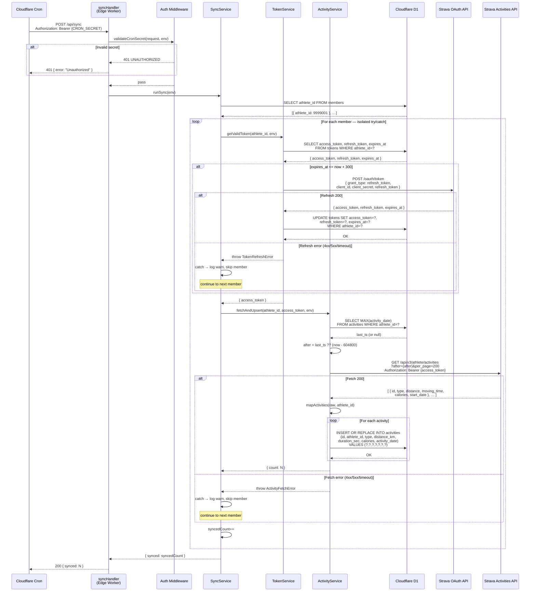
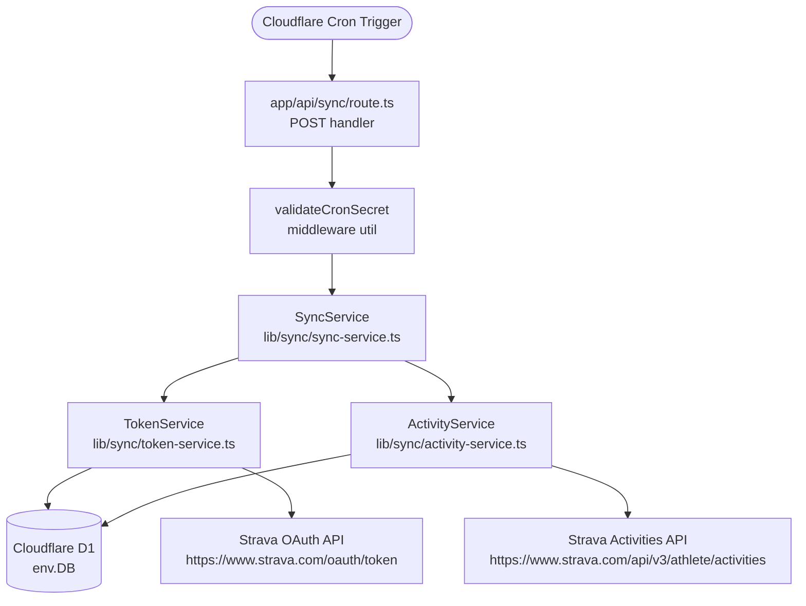

# SP1-T003 — Hourly Activity Sync Cron Job — Backend Design

## Metadata
| Field | Value |
|-------|-------|
| **Requirement** | `docs/sprints/SP1/SP1-T003/SP1-T003-requirement.md` |
| **FE Design** | `docs/sprints/SP1/SP1-T003/SP1-T003-frontend.md` |
| **Points** | 5 |
| **Assignee** | - |
| **Status** | draft |

<!-- Required sections by points — 5pt:
  API Endpoints, Existing Code Context, TDD Test Plan
  + API Versioning Strategy, Input Validation Rules, full TDD Test Plan
  + Data Models, Service/Layer Breakdown, Business Logic, Error Handling, Impl Plan
  + Auth Matrix, Sequence Diagram, Data Contracts, Events, Security, Logging, Env Vars, Migrations, Ext Deps
-->

---

## Cron Architecture — IMPORTANT

Cloudflare Pages + `@cloudflare/next-on-pages` does **not** invoke a Next.js API route directly via HTTP for cron triggers. Instead, Cloudflare fires a `scheduled` event on the Worker.

### How it works

```
Cloudflare Cron Scheduler
  → fires scheduled event on Cloudflare Pages Worker
  → functions/scheduled.ts exports `scheduled` handler
  → handler calls runSync(env) directly (no HTTP)
```

**Two entry points:**

| Entry point | Trigger | Auth | Purpose |
|-------------|---------|------|---------|
| `functions/scheduled.ts` | Cloudflare Cron (scheduled event) | None needed — not a public route | Hourly automated sync |
| `POST /api/sync` | Manual HTTP call | `Authorization: Bearer {CRON_SECRET}` | Manual trigger for debugging / admin |

Both call the same `runSync(env)` function from `src/lib/sync.ts` — no logic duplication.

### `functions/scheduled.ts` (new file — Cloudflare Pages Function)

```ts
import { runSync } from '../src/lib/sync'

export const onScheduled: ExportedHandlerScheduledHandler = async (event, env) => {
  await runSync(env)
}
```

### `wrangler.toml` cron config (added in T003)

```toml
[triggers]
crons = ["0 * * * *"]
```

---

## API Endpoints

### `POST /api/sync`

- **Purpose:** Manual trigger for the same sync logic as the cron handler. Useful for debugging and admin.
- **Auth required:** yes — `Authorization: Bearer {CRON_SECRET}` header
- **Roles allowed:** Admin / developer only — no public access
- **Idempotent:** yes — upsert by activity `id`

**Request body:** None

**Request headers:**
| Header | Type | Required | Constraints |
|--------|------|----------|-------------|
| `Authorization` | string | yes | `Bearer {CRON_SECRET}` |

**Response (200):**
```json
{ "synced": 18 }
```
`synced` = members successfully processed. Failed members excluded.

**Error responses:**

| Code | Condition | Response body |
|------|-----------|---------------|
| 401 | Missing or invalid `Authorization` header | `{ "error": "Unauthorized", "code": "UNAUTHORIZED" }` |
| 500 | Unexpected top-level error | `{ "error": "Internal server error", "code": "INTERNAL_ERROR" }` |

---

## API Versioning Strategy

Internal endpoint only — no versioning prefix needed.

---

## Data Contracts

### Inbound: Strava `GET /athlete/activities` response item

Each element in the array returned by Strava:

```json
{
  "id": 12345678901,
  "type": "Run",
  "distance": 5432.1,
  "moving_time": 1800,
  "elapsed_time": 1950,
  "calories": 312,
  "start_date": "2026-03-24T06:00:00Z",
  "athlete": { "id": 9999001 }
}
```

| Field | Type | Used | Mapped to |
|-------|------|------|-----------|
| `id` | integer | yes | `activities.id` (PK) |
| `type` | string | yes | `activities.type` (normalised — see R-5) |
| `distance` | float (meters) | yes | `activities.distance_km` = value / 1000 |
| `moving_time` | integer (seconds) | yes | `activities.duration_sec` |
| `calories` | integer or null | yes | `activities.calories` (0 if null) |
| `start_date` | ISO-8601 string | yes | `activities.activity_date` (Unix epoch seconds) |
| `elapsed_time` | integer | no | Ignored — use `moving_time` only |
| `athlete.id` | integer | no | Already known from current member iteration |

### Inbound: Strava `POST /oauth/token` refresh response

```json
{
  "access_token": "new_access_token_string",
  "refresh_token": "new_refresh_token_string",
  "expires_at": 1742820000
}
```

| Field | Type | Mapped to |
|-------|------|-----------|
| `access_token` | string | `tokens.access_token` |
| `refresh_token` | string | `tokens.refresh_token` (update if new value returned) |
| `expires_at` | integer (Unix seconds) | `tokens.expires_at` |

---

## Authorization & Roles

| Endpoint | public | user | cron (secret header) | notes |
|----------|--------|------|---------------------|-------|
| `POST /api/sync` | no | no | yes | Validated by constant-time comparison of `Authorization: Bearer` value against `CRON_SECRET` env var |

---

## Input Validation Rules

| Field | Type | Required | Rules | Error / behavior |
|-------|------|----------|-------|-----------------|
| `Authorization` header | string | yes | Must equal `Bearer {CRON_SECRET}` | Return 401 immediately |

No request body fields — cron posts with empty body.

---

## Data Models

T003 does not introduce new tables. All writes target tables owned by T001.

**Reference schema (owned by T001 — do not redefine):**

```sql
members   (athlete_id INTEGER PK, name TEXT, avatar_url TEXT, created_at INTEGER, last_synced_at INTEGER)
tokens    (athlete_id INTEGER PK FK→members, access_token TEXT, refresh_token TEXT, expires_at INTEGER)
activities(id INTEGER PK, athlete_id INTEGER FK→members, type TEXT,
           distance_km REAL, duration_sec INTEGER, calories INTEGER, activity_date INTEGER)
-- Index: idx_activities_athlete_date ON activities(athlete_id, activity_date)
```

**D1 queries this task writes:**

1. `SELECT athlete_id FROM members` — load all members
2. `SELECT access_token, refresh_token, expires_at FROM tokens WHERE athlete_id = ?` — per member
3. `UPDATE tokens SET access_token=?, refresh_token=?, expires_at=? WHERE athlete_id=?` — on token refresh
4. `SELECT MAX(activity_date) FROM activities WHERE athlete_id = ?` — determine `after` param
   - If result is NULL (first sync for this member) → use `now - 90 days` as `after` to capture recent history
   - If result is a timestamp → use that value (incremental sync — only fetch newer activities)
5. `INSERT OR REPLACE INTO activities (id, athlete_id, type, distance_km, duration_sec, calories, activity_date) VALUES (?,?,?,?,?,?,?)` — upsert per activity
6. `UPDATE members SET last_synced_at=? WHERE athlete_id=?` — after successful fetch+upsert; records when this member was last synced (used by T004 "Last synced" display)

---

## Sequence Diagram



---

## Existing Code Context

New project — no pre-existing service or repository classes exist yet (T001 is infra only; T002 introduces OAuth helpers). T003 creates the first service-layer modules.

**Patterns established by T001/T002 to follow:**
| Pattern | Notes |
|---------|-------|
| `export const runtime = 'edge'` | All API routes use Edge Runtime |
| `env.DB` | Cloudflare D1 binding — never import DB directly; always receive via Worker `env` |
| `env.CRON_SECRET`, `env.STRAVA_CLIENT_ID`, `env.STRAVA_CLIENT_SECRET` | All secrets via env, never hardcoded |
| Next.js App Router API route in `app/api/sync/route.ts` | Consistent with T002's `app/api/auth/` structure |

---

## Service / Layer Breakdown



| Layer | File | Responsibility |
|-------|------|---------------|
| Route handler | `app/api/sync/route.ts` | Parse request, call `validateCronSecret`, call `SyncService`, format response |
| Auth middleware util | `lib/sync/validate-cron-secret.ts` | Constant-time comparison of `Authorization` header value vs `CRON_SECRET` |
| `SyncService` | `lib/sync/sync-service.ts` | Orchestrates member loop; catches per-member errors; returns `{ synced }` |
| `TokenService` | `lib/sync/token-service.ts` | Reads tokens from D1; calls Strava OAuth refresh; writes updated tokens to D1 |
| `ActivityService` | `lib/sync/activity-service.ts` | Reads last activity date from D1; calls Strava activities endpoint; maps fields; upserts to D1 |
| Type mappers | `lib/sync/mappers.ts` | Pure functions: `normaliseType()`, `metersToKm()`, `isoToUnix()` |

---

## Business Logic

**Rule 1: Token expiry check with 5-minute buffer**
```
now = Math.floor(Date.now() / 1000)
IF token.expires_at <= now + 300:
  → refresh token
ELSE:
  → use token as-is
```

**Rule 2: Token refresh request**
```
POST https://www.strava.com/oauth/token
Body (form-encoded or JSON):
  client_id     = env.STRAVA_CLIENT_ID
  client_secret = env.STRAVA_CLIENT_SECRET
  grant_type    = "refresh_token"
  refresh_token = token.refresh_token

On 200:
  UPDATE tokens SET
    access_token  = response.access_token,
    refresh_token = response.refresh_token,  // Strava may rotate it
    expires_at    = response.expires_at
  WHERE athlete_id = ?

On non-200 or network error:
  THROW TokenRefreshError(athlete_id, statusCode, message)
  → caller catches, logs, skips member
```

**Rule 3: Activity `after` timestamp selection**
```
last_ts = SELECT MAX(activity_date) FROM activities WHERE athlete_id = ?

IF last_ts IS NULL:
  after = Math.floor(Date.now() / 1000) - 604800  // 7 days ago
ELSE:
  after = last_ts  // Strava `after` is exclusive — fetches activities strictly after this ts
```

**Rule 4: Activity type normalisation**
```
ALLOWED_TYPES = { "Run", "Ride", "Walk", "WeightTraining" }

IF stravaActivity.type IN ALLOWED_TYPES:
  type = stravaActivity.type
ELSE:
  type = "Other"
```

**Rule 5: Field mapping from Strava response**
```
distance_km   = stravaActivity.distance / 1000.0           // meters → km
duration_sec  = stravaActivity.moving_time                  // already seconds
calories      = stravaActivity.calories ?? 0                // null-safe
activity_date = Date.parse(stravaActivity.start_date) / 1000  // ISO-8601 → Unix epoch seconds
```

**Rule 6: Upsert strategy**
```
INSERT OR REPLACE INTO activities
  (id, athlete_id, type, distance_km, duration_sec, calories, activity_date)
VALUES
  (?, ?, ?, ?, ?, ?, ?)

-- SQLite INSERT OR REPLACE deletes the conflicting row then inserts the new row.
-- This is acceptable because activity fields on Strava are immutable after recording.
```

**Rule 7: Per-member isolation**
```
FOR each member IN members:
  TRY:
    token    = getValidToken(member.athlete_id)  // may refresh
    count    = fetchAndUpsert(member.athlete_id, token.access_token)
    synced  += 1
  CATCH TokenRefreshError | ActivityFetchError | any:
    log.warn(`[sync] failed for athlete ${member.athlete_id}: ${error.message}`)
    skipped += 1
    CONTINUE  // do NOT rethrow — other members must still run
```

---

## Event Publishing

None — this task does not emit domain events. Sync completion is observable via D1 data and Worker logs only.

---

## Error Handling Strategy

### Error Response Envelope

```json
{
  "error": "Human-readable message — safe to show to callers",
  "code": "SCREAMING_SNAKE_CASE_CODE"
}
```

No `fields` array — this endpoint has no form fields.

### Error Code Catalog

| HTTP | Code | Category | Retryable | When to use |
|------|------|----------|-----------|-------------|
| 401 | `UNAUTHORIZED` | auth | no | Missing or invalid `Authorization` header |
| 500 | `INTERNAL_ERROR` | server | yes — next cron run | Unhandled top-level exception (member errors are caught internally) |

### Per-Layer Error Responsibility

| Layer | Throws | Does NOT |
|-------|--------|----------|
| `validateCronSecret` | `401 UNAUTHORIZED` | Business logic |
| `SyncService` | Catches `TokenRefreshError` + `ActivityFetchError` per member; never rethrows individual errors | Does not throw 4xx |
| `TokenService` | Throws `TokenRefreshError` on Strava OAuth failure | Does not catch — caller's responsibility |
| `ActivityService` | Throws `ActivityFetchError` on Strava API failure | Does not catch — caller's responsibility |
| Route handler | Wraps `SyncService.runSync()` in try/catch; returns `500 INTERNAL_ERROR` on unexpected escape | — |

### External Service Failure Handling

| Scenario | Response |
|----------|----------|
| Strava OAuth token refresh — network timeout (>10s) | Throw `TokenRefreshError`; log `warn`; skip member |
| Strava OAuth token refresh — 4xx/5xx response | Throw `TokenRefreshError`; log `warn`; skip member |
| Strava Activities API — network timeout (>10s) | Throw `ActivityFetchError`; log `warn`; skip member |
| Strava Activities API — 401 (token still expired despite refresh) | Throw `ActivityFetchError`; log `warn`; skip member |
| Strava Activities API — 429 (rate limited) | Throw `ActivityFetchError`; log `warn`; skip member (will retry next hour) |
| D1 write failure (upsert) | Re-throw as-is; caught by member try/catch; log `warn`; skip member |

**Rule:** Never expose raw Strava error messages or D1 error messages in the HTTP response body. Log internally only.

---

## Security Considerations

- [x] `Authorization` header compared using constant-time comparison (`timingSafeEqual` or equivalent) — prevents timing attack on secret
- [x] `CRON_SECRET`, `STRAVA_CLIENT_ID`, `STRAVA_CLIENT_SECRET` accessed from `env` only — never hardcoded or committed
- [x] `access_token` and `refresh_token` never returned in HTTP response body
- [x] `access_token` never logged — log only `athlete_id` and status
- [x] D1 queries use parameterised prepared statements (`env.DB.prepare(...).bind(...)`) — no string interpolation
- [x] No PII beyond `athlete_id` is written in log output

---

## Logging & Observability

| Event | Level | Fields logged |
|-------|-------|--------------|
| Sync started | `info` | `timestamp`, `member_count` |
| Token refreshed | `info` | `athlete_id`, `timestamp` |
| Token refresh failed | `warn` | `athlete_id`, `reason`, `http_status` (from Strava), `timestamp` |
| Activity fetch failed | `warn` | `athlete_id`, `reason`, `http_status` (from Strava), `timestamp` |
| Member skipped (any error) | `warn` | `athlete_id`, `reason`, `timestamp` |
| Sync completed | `info` | `synced_count`, `skipped_count`, `duration_ms`, `timestamp` |
| Unexpected top-level error | `error` | `message`, stack trace (internal only — not in response) |

Log format: `[sync] {message}` prefix for all entries — filterable in Cloudflare Workers dashboard.

---

## Environment Variables

| Variable | Description | Required | Default |
|----------|-------------|----------|---------|
| `CRON_SECRET` | Secret string compared against `Authorization: Bearer` header to authenticate cron calls | yes | none |
| `STRAVA_CLIENT_ID` | Strava OAuth app client ID — used in token refresh POST body | yes | none |
| `STRAVA_CLIENT_SECRET` | Strava OAuth app client secret — used in token refresh POST body | yes | none |

**Declaration location:** `wrangler.toml` (non-secret: `STRAVA_CLIENT_ID`) + Cloudflare dashboard secrets (`CRON_SECRET`, `STRAVA_CLIENT_SECRET`). Never commit secret values to the repo.

---

## Database Migrations

T003 introduces **no new migrations**. All tables were created by T001's `migrations/0001_init.sql`.

**Up:** N/A — no schema changes

**Down:** N/A — no schema changes

---

## Caching Strategy

None — this task does not introduce caching. Every sync call reads live data from D1 and writes fresh data back. The 1-hour cron interval is the implicit "cache TTL" for leaderboard consumers.

---

## Implementation Plan

| # | Phase | File path | Action | What to implement | References |
|---|-------|-----------|--------|-------------------|------------|
| 1 | Route scaffold | `app/api/sync/route.ts` | create | `export const runtime = 'edge'`; `POST` handler skeleton; delegate to `SyncService` | API Endpoints |
| 2 | Auth middleware | `lib/sync/validate-cron-secret.ts` | create | `validateCronSecret(request, env)` — constant-time compare; return `401` response or `null` | Security, Error Handling |
| 3 | Type mappers | `lib/sync/mappers.ts` | create | `normaliseType(stravaType)`, `metersToKm(m)`, `isoToUnix(iso8601)` — pure functions | Business Logic R-4, R-5 |
| 4 | TokenService | `lib/sync/token-service.ts` | create | `getValidToken(athleteId, env)` — reads D1, checks expiry, calls Strava OAuth refresh, updates D1 | Business Logic R-1, R-2 |
| 5 | ActivityService | `lib/sync/activity-service.ts` | create | `fetchAndUpsert(athleteId, accessToken, env)` — reads last_ts from D1, calls Strava activities, maps fields, upserts to D1 | Business Logic R-3, R-5, R-6 |
| 6 | SyncService | `lib/sync/sync-service.ts` | create | `runSync(env)` — loads members, per-member try/catch loop, returns `{ synced }` | Business Logic R-7, Error Handling |
| 7 | Route wiring | `app/api/sync/route.ts` | modify | Wire `validateCronSecret` + `SyncService.runSync`; return `200 { synced }` or `500` | API Endpoints |
| 8 | Wrangler config | `wrangler.toml` | modify | Add `[triggers]` block with `crons = ["0 * * * *"]`; add env var declarations | Feature Flow |
| 9 | Observability | all service files | modify | Add `console.log` / `console.warn` calls per Logging table | Logging & Observability |

---

## TDD Test Plan

_Tests are written before implementation. Integration tests use real Cloudflare D1 — no mocks at the DB layer._

| Test Case | AC | Type | Description |
|-----------|-----|------|-------------|
| `validateCronSecret` returns 401 when header absent | AC-5 | unit | Call util with no `Authorization` header |
| `validateCronSecret` returns 401 when secret does not match | AC-5 | unit | Call with `Bearer wrong-secret` |
| `validateCronSecret` returns null (pass) when secret matches | AC-5 | unit | Call with correct `Bearer {CRON_SECRET}` |
| `normaliseType` maps known types as-is | AC-3 | unit | `Run` → `Run`, `Ride` → `Ride`, `Walk` → `Walk`, `WeightTraining` → `WeightTraining` |
| `normaliseType` maps unknown types to `Other` | AC-3 | unit | `Yoga` → `Other`, `AlpineSki` → `Other`, `""` → `Other` |
| `metersToKm` converts correctly | AC-3 | unit | `5000` → `5`, `100` → `0.1`, `0` → `0` |
| `isoToUnix` converts ISO-8601 to epoch seconds | AC-3 | unit | `"2026-03-24T06:00:00Z"` → `1742796000` |
| Token expiry check — not expired (no refresh call) | AC-2 | unit | `expires_at = now + 7200`; assert Strava OAuth is NOT called |
| Token expiry check — expired (refresh called) | AC-2 | unit | `expires_at = now - 1`; assert Strava OAuth IS called |
| Token expiry check — within buffer (expires_at = now + 100) — refresh called | AC-2 | unit | 100s < 300s buffer → refresh |
| `TokenService` updates D1 after successful refresh | AC-2 | integration | Seed expired token in real D1; mock Strava OAuth to return new token; assert D1 row updated |
| `TokenService` throws `TokenRefreshError` on Strava 400 | AC-4 | integration | Seed expired token; mock Strava OAuth to return 400; assert error thrown |
| `ActivityService` calls Strava with correct `after` param (prior activities exist) | AC-6 | integration | Seed activity with `activity_date=T`; mock Strava API; assert `after=T` in request |
| `ActivityService` calls Strava with `after = now - 7days` when no prior activities | AC-6 | integration | Empty activities table; mock Strava API; assert `after` ≈ `now - 604800` |
| `ActivityService` upserts activity fields correctly to D1 | AC-3 | integration | Mock Strava response with known values; assert D1 row has mapped fields |
| `ActivityService` upserts use `INSERT OR REPLACE` — re-run is idempotent | AC-3 | integration | Run `fetchAndUpsert` twice with same mock data; assert row count unchanged |
| `ActivityService` throws `ActivityFetchError` on Strava 500 | AC-4 | integration | Mock Strava API to return 500; assert error thrown |
| `SyncService` returns `{ synced: 0 }` when no members in D1 | AC-1 | integration | Real D1 with empty members table |
| `SyncService` skips member when `TokenRefreshError` thrown; processes remaining | AC-4 | integration | Seed 3 members: 1 with bad refresh token, 2 with valid tokens; assert `synced: 2` |
| `SyncService` skips member when `ActivityFetchError` thrown; processes remaining | AC-4 | integration | Seed 2 members; mock Strava activities to fail for 1; assert `synced: 1` |
| `POST /api/sync` returns 401 with no Authorization header | AC-5 | integration | HTTP call to handler |
| `POST /api/sync` returns 200 `{ synced: N }` with valid secret and members | AC-1 | integration | Full stack: real D1, mocked Strava APIs |
| `activities.calories` defaults to 0 when Strava returns null | AC-3 | unit | `{ calories: null }` → stored as `0` |

---

## External Dependencies

| Service | Purpose | Failure behavior | Timeout |
|---------|---------|-----------------|---------|
| `POST https://www.strava.com/oauth/token` | Refresh expired member access tokens | Throw `TokenRefreshError`; log warn; skip member | 10 000 ms |
| `GET https://www.strava.com/api/v3/athlete/activities` | Fetch recent activities per member | Throw `ActivityFetchError`; log warn; skip member | 10 000 ms |
| Cloudflare D1 (`env.DB`) | Read members/tokens; write tokens + activities | Re-throw D1 error; caught by member try/catch; skip member | Implicit (D1 managed) |

---

## Performance & Scalability Notes

| Concern | Detail |
|---------|--------|
| Expected data volume | 20 members × ~10 activities/hr = ~200 activity upserts/hr; 480 Strava API calls/day (well within 1000/day limit) |
| Cloudflare Worker timeout | Free tier: 30s CPU time. 20 members × ~2 HTTP calls × ~300ms avg = ~12s sequential. Safe. If member count grows beyond ~40, consider parallelising with `Promise.allSettled`. |
| N+1 DB reads | Members loaded once. Per-member: 2 reads (tokens + max activity_date) + 1 write (token update if needed) + N writes (activity upserts). No N+1 risk at 20 members. |
| Strava rate limit | 100 req/15min per app. 20 members/hr = 20 req/hr — far below limit. |
| D1 write rate | Cloudflare D1 free tier: 50k writes/day. 200 upserts/hr × 24hr = 4800 writes/day. Safe. |
| Index strategy | `idx_activities_athlete_date ON activities(athlete_id, activity_date)` (T001) supports the `MAX(activity_date)` query efficiently. |

---

## Definition of Done (Design)

**"Done" means this design is complete enough that implementation can start without guessing.**

### Coverage
- [x] Every AC in the requirement maps to at least one test case in the TDD Test Plan
- [x] The endpoint has a fully filled error table — no empty rows
- [x] Every error code (`UNAUTHORIZED`, `INTERNAL_ERROR`) maps to a test case
- [x] All input fields (Authorization header) have explicit validation rules and error behavior defined
- [x] Both external dependencies (Strava OAuth + Activities API) have failure behavior and timeout filled

### Correctness
- [x] Error responses follow the standard envelope (`error`, `code`) — no ad-hoc shapes
- [x] No error exposes Strava API error bodies, D1 error messages, or stack traces in the HTTP response
- [x] Each layer only throws errors it is responsible for (per Per-Layer Responsibility table)
- [x] Database Migrations: N/A — no schema changes; documented explicitly

### Alignment
- [x] `POST /api/sync` → `{ synced: N }` matches cross-task-context.md API contracts table
- [x] Auth requirement (cron secret header) matches cross-task-context.md Auth Requirements table
- [x] `env.DB` binding name matches cross-task-context.md shared terminology
- [x] Activity type strings (`Run`, `Ride`, `Walk`, `WeightTraining`, `Other`) match cross-task-context.md shared terminology
- [x] All 3 env vars (`CRON_SECRET`, `STRAVA_CLIENT_ID`, `STRAVA_CLIENT_SECRET`) are listed — no magic strings
