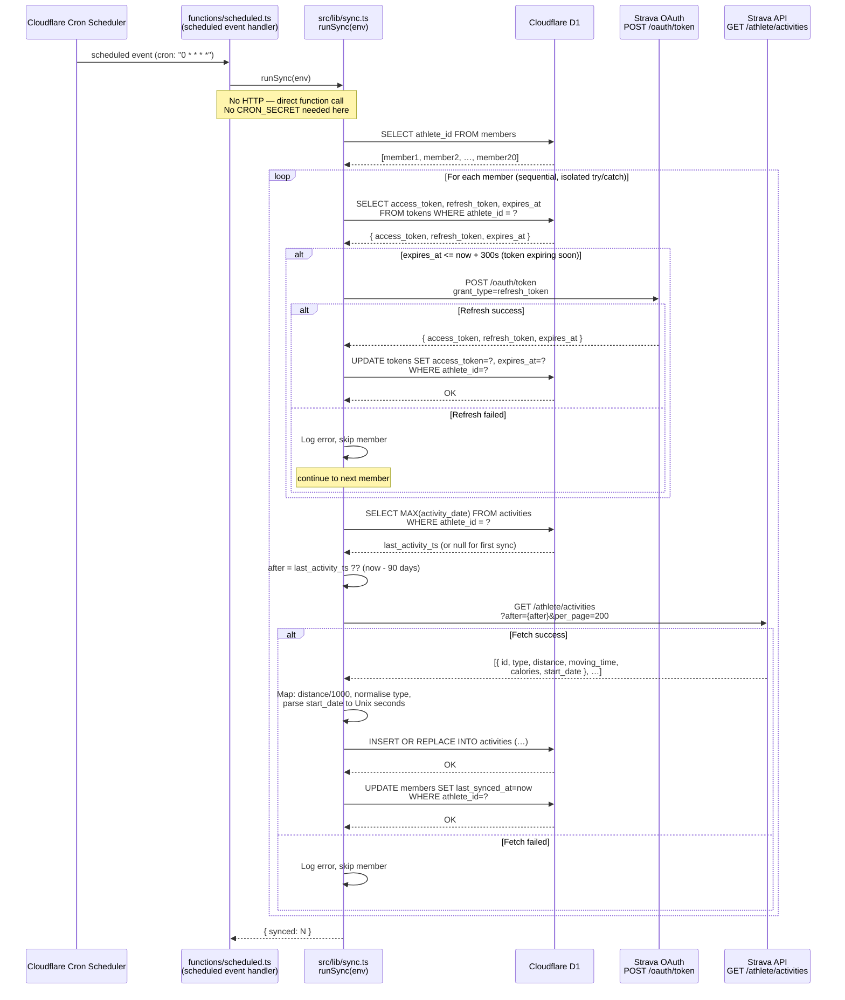

# SP1-T003 — Hourly Activity Sync Cron Job — Frontend Design

## Metadata

| Field           | Value                                                              |
| --------------- | ------------------------------------------------------------------ |
| **Requirement** | `docs/sprints/SP1/SP1-T003/SP1-T003-requirement.md`              |
| **Points**      | 5                                                                  |
| **Assignee**    | -                                                                  |
| **Status**      | draft                                                              |

---

## No UI Delivered — Backend/Infra Only

This task delivers **no user-facing UI**. The cron sync runs entirely as a backend Cloudflare Worker function triggered by a scheduled cron job. There are no new pages, components, or client-side interactions introduced in T003.

The frontend sections in this document cover two concerns:

1. **Downstream contract** — the `last_synced_at` surface that T004 will display on the leaderboard page, defined here so T003 doesn't build in isolation.
2. **Async sequence diagram** — how the Cloudflare Cron trigger flows through the system to the Strava API and back to D1.

---

## Approach

No new React components, routes, or client-side state are created in T003.

T003 delivers two entry points for the same sync logic:
1. **`functions/scheduled.ts`** — Cloudflare scheduled event handler (fires every hour via cron trigger)
2. **`POST /api/sync`** — HTTP endpoint for manual triggering (protected by CRON_SECRET)

Both call `runSync(env)` from `src/lib/sync.ts`.

T003 also updates `members.last_synced_at` after each successful member sync. T004 reads this field to display "Last synced X min ago" — accurate to when the sync actually ran, not when the member last exercised.

---

## Design References

- Figma: N/A — no UI in this task
- Mockup: N/A

---

## Downstream UI Contract (for T004)

T004 will display a "Last synced" indicator on the leaderboard page. T003 provides this via `members.last_synced_at`:

| Data needed by T004 | How T003 provides it | Query T004 will use |
|---------------------|---------------------|---------------------|
| When data was last synced | T003 sets `members.last_synced_at = now` after each successful member sync | `SELECT MAX(last_synced_at) FROM members` |
| Freshness label ("Last synced X min ago") | T004 computes `now - MAX(last_synced_at)` | Derived from above |

`last_synced_at` is NULL for a member until their first sync completes. T004 should handle NULL by showing "Not yet synced".

---

## Async Interaction Sequence — Cron → Strava → D1

The diagram below shows the full timing of the hourly sync: from cron fire to D1 upsert, including the token refresh branch.

---

## Routing & Navigation

| Route | Component | Auth required | Notes |
|-------|-----------|--------------|-------|
| `POST /api/sync` | Edge Worker handler (no React component) | Cron secret header | Not browsable — cron-triggered only |

No new client-side routes are introduced.

---

## Existing Code Context

**Components available (use as-is):** N/A — no React components in this task.

**Project patterns to follow:**
- All API routes follow Next.js Edge Runtime handler pattern (`export const runtime = 'edge'`)
- DB access uses `env.DB` (Cloudflare D1 binding) — never imported directly; passed via Worker `env`
- Env vars accessed as `env.CRON_SECRET`, `env.STRAVA_CLIENT_ID`, `env.STRAVA_CLIENT_SECRET`

---

## Environment / Config Dependencies

| Variable | Purpose | Required | Default |
|----------|---------|----------|---------|
| `CRON_SECRET` | Validates that `POST /api/sync` originates from Cloudflare Cron | yes | none |
| `STRAVA_CLIENT_ID` | Strava OAuth app ID — used in token refresh | yes | none |
| `STRAVA_CLIENT_SECRET` | Strava OAuth app secret — used in token refresh | yes | none |

No `NEXT_PUBLIC_*` variables — this task has no client-side code.

---

## State Inventory

No client-side state introduced by T003.

T004 will manage its own loading/error/loaded state for the leaderboard page. T003 only guarantees the data is in D1.

---

## Edge Cases

- **No members in D1:** sync returns `{ synced: 0 }` immediately — not an error.
- **All tokens expired simultaneously:** each is refreshed independently; if all fail, `{ synced: 0 }` is returned with all errors logged.
- **Strava API rate limit hit (429):** treated as a fetch failure for that member — logged and skipped; Strava rate limit is 100 req/15min and 20 members/hr is well within limit under normal operation.
- **Worker timeout (30s on free tier):** sequential processing of 20 members with ~1 Strava call each (latency ~200–500ms) totals ~4–10s — safely within limit. If member count grows significantly this must be revisited.
- **Duplicate cron fires:** upsert strategy (`INSERT OR REPLACE`) makes sync idempotent — re-running produces the same D1 state.

---

## TDD Test Plan

_Tests are written before implementation code._

| Test Case | AC | Type | Description |
|-----------|-----|------|-------------|
| Returns 401 when `Authorization` header is absent | AC-5 | unit | Call handler with no header; assert 401 response |
| Returns 401 when `Authorization` header has wrong secret | AC-5 | unit | Call handler with `Bearer wrong`; assert 401 response |
| Returns `{ synced: 0 }` when members table is empty | AC-1 | integration | Real D1 with no rows; assert 200 and `synced: 0` |
| Processes member with valid non-expired token — no refresh call | AC-2 | integration | Token `expires_at` = far future; assert Strava OAuth not called |
| Refreshes token when `expires_at <= now + 300` | AC-2 | integration | Seed expired token; assert `tokens` row updated in D1 |
| Skips member when token refresh fails | AC-4 | integration | Mock Strava OAuth to return 400; assert `synced` count excludes failed member |
| Upserts activity with correct field mapping | AC-3 | integration | Seed one member; mock Strava activities response; assert D1 row values |
| Maps unknown activity type to `Other` | AC-3 | unit | Input `{ type: 'Yoga', … }`; assert stored type = `'Other'` |
| Maps `Run`, `Ride`, `Walk`, `WeightTraining` as-is | AC-3 | unit | Assert each known type is stored unchanged |
| Converts distance meters to km correctly | AC-3 | unit | `5000m` → `5.000 km` |
| Skips member when Strava activities fetch fails | AC-4 | integration | Mock Strava API to return 500; assert other members still processed |
| `after` param uses latest `activity_date` from D1 | AC-6 | integration | Seed activity with known date; assert Strava called with `after` = that date |
| `after` param defaults to 7 days ago when no prior activities | AC-6 | integration | Empty activities table; assert `after` ≈ `now - 604800` |
| Sync is idempotent — re-running does not duplicate rows | AC-3 | integration | Run sync twice; assert activity count unchanged |
| Returns `{ synced: N }` equal to members successfully processed | AC-1 | integration | 3 members, 1 fails; assert `synced: 2` |

---

## Definition of Done (Design)

**"Done" means this design is complete enough that implementation can start without guessing.**

### Coverage
- [x] Every AC in the requirement has at least one test case in the TDD Test Plan
- [x] The async sequence diagram covers all branches: valid/invalid secret, token refresh, fetch success/failure
- [x] Downstream UI contract for T004 is documented so T004 can implement "last updated" without guessing
- [x] All edge cases (no members, expired tokens, rate limits, idempotency) are explicitly addressed

### Correctness
- [x] No React components, routes, or client-side code is proposed — this task is backend/infra only
- [x] Env var requirements are listed with no `NEXT_PUBLIC_*` vars (none are needed)
- [x] Optimistic Update Rollback: None — all UI updates are T004's concern
- [x] Partial Success Handling: handled — `synced: N` reflects successful members only; failures are logged

### Alignment
- [x] API contract (`POST /api/sync` → `{ synced: N }`) matches the cross-task-context.md API contracts table
- [x] Sequence diagram is consistent with BE design token refresh and upsert logic
