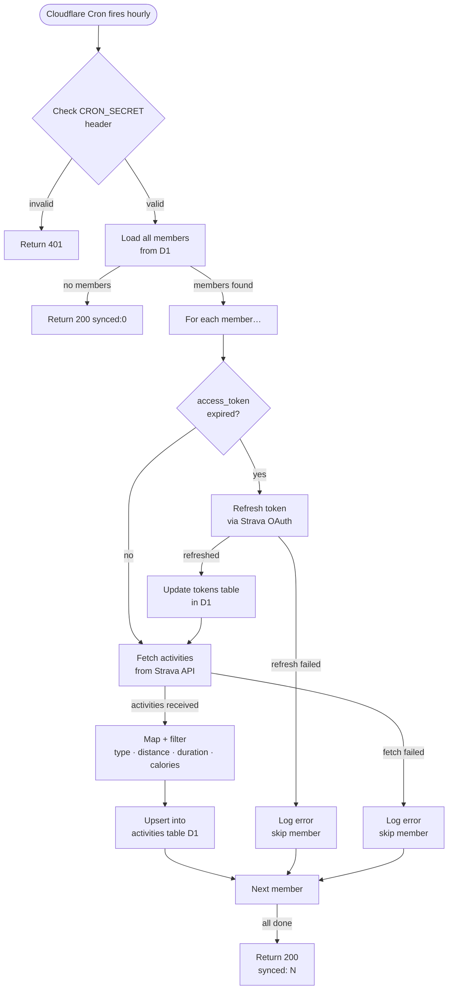

# SP1-T003 — Hourly Activity Sync Cron Job

## Metadata
| Field | Value |
|-------|-------|
| **Sprint** | SP1 |
| **Points** | 5 |
| **Priority** | high |
| **Assignee** | - |
| **Requester** | Club organizer (self) |
| **Status** | in-progress |

<!-- Required sections by points — 5pt:
  Problem Statement, ACs, Out of Scope, Done
  + User Stories, Dependencies, Test Data, Rollout Strategy
  + Feature Flow, System Behavior, Business Rules, Success Metrics
  + Design References, Analytics, UI Copy, DO/DON'T
-->

## Problem Statement

Members' activities are recorded in Strava, but the leaderboard DB has no data unless an automated process pulls them. Without a reliable hourly sync job, leaderboard data would be stale indefinitely. This task delivers the Cloudflare Cron-triggered sync pipeline that: refreshes expired tokens, fetches recent activities from the Strava API per member, and upserts them into the `activities` D1 table so that T004's leaderboard always reflects activity from at most the last hour.

## Overview

A Cloudflare Cron Trigger fires `POST /api/sync` every hour. The handler is protected by a `CRON_SECRET` header so it is unreachable by public callers. For each member in the `members` table the system checks whether the stored access token has expired; if so it refreshes via the Strava OAuth token endpoint and updates `tokens`. It then fetches the member's latest activities from `GET /athlete/activities` and upserts each activity into the `activities` table. Activity types not in the allowed list are normalised to `Other`. One member's failure must not block the remaining members. The endpoint returns `{ synced: N }` where N is the count of members successfully processed.

## Feature Flow

## User Stories

| # | Story | Maps to AC |
|---|-------|-----------|
| US-1 | As the system, I want cron to auto-trigger the sync every hour, so that leaderboard data is always fresh without manual intervention. | AC-1 |
| US-2 | As the system, I want expired access tokens to be refreshed transparently before fetching, so that members never need to re-connect OAuth. | AC-2 |
| US-3 | As the system, I want activities fetched and stored per member, so that T004 can compute accurate weekly leaderboards. | AC-3 |
| US-4 | As the system, I want one member's failure to be isolated, so that a bad token or Strava error for one person does not break everyone else's sync. | AC-4 |
| US-5 | As the system operator, I want the sync endpoint protected by a secret header, so that no public caller can trigger an arbitrary sync. | AC-5 |

## System Behavior

| Trigger | System Response | Side Effects | Timing |
|---------|----------------|-------------|--------|
| Cloudflare Cron (every hour) | Issues `POST /api/sync` with `Authorization: Bearer {CRON_SECRET}` | Token refresh + activity upsert per member | async — completes within Cloudflare Worker 30s timeout |
| `POST /api/sync` with invalid/missing secret | Returns `401 UNAUTHORIZED` | None | sync |
| `POST /api/sync` with valid secret | Iterates all members, refreshes tokens, fetches + upserts activities | Writes to `tokens` and `activities` tables | async |
| Token `expires_at < now` | Calls Strava refresh endpoint; updates `tokens` row | Replaces `access_token`, `expires_at`, (optionally) `refresh_token` | sync per member |
| Token refresh fails | Logs error, skips member | No write | sync |
| Strava `/athlete/activities` returns activities | Upserts each activity into D1 | Inserts new or updates existing rows by `id` | sync per member |
| Strava activity type not in allowlist | Stored as `Other` | None | sync per member |
| Activity fetch fails (HTTP error / timeout) | Logs error, skips member | No write | sync |

## Acceptance Criteria

- [x] **AC-1: Cron triggers the endpoint every hour**
  GIVEN a Cloudflare Cron schedule of `0 * * * *` is configured in `wrangler.toml`
  WHEN the cron fires
  THEN `POST /api/sync` is called with the correct `Authorization` header
  AND the endpoint responds `200 { synced: N }` within the Cloudflare Worker timeout

- [x] **AC-2: Expired tokens are refreshed before fetching**
  GIVEN a member's `tokens.expires_at < Math.floor(Date.now() / 1000)`
  WHEN the sync job processes that member
  THEN the system calls `POST https://www.strava.com/oauth/token` with `grant_type=refresh_token`
  AND `tokens.access_token` and `tokens.expires_at` are updated in D1
  AND the subsequent activity fetch uses the new `access_token`

- [x] **AC-3: Activities are upserted into D1 with correct field mapping**
  GIVEN Strava returns activities for a member
  WHEN activities are processed
  THEN each activity is upserted (INSERT OR REPLACE) into the `activities` table by its `id`
  AND `distance_km` = Strava `distance` (meters) / 1000.0
  AND `duration_sec` = Strava `moving_time`
  AND `calories` = Strava `calories` (0 if absent)
  AND `activity_date` = Strava `start_date` as Unix epoch seconds
  AND `type` = Strava `type` if it is in `{Run, Ride, Walk, WeightTraining}`, else `Other`

- [x] **AC-4: One member failure does not block others**
  GIVEN one member has an invalid refresh token (refresh returns error)
  WHEN the sync job processes all members
  THEN that member's error is logged and skipped
  AND all remaining members are still processed
  AND the final `synced` count reflects only successfully processed members

- [x] **AC-5: Endpoint is protected — not publicly accessible**
  GIVEN a request to `POST /api/sync` with no `Authorization` header (or wrong secret)
  WHEN the request is received
  THEN the endpoint returns `401 { error: "Unauthorized", code: "UNAUTHORIZED" }`
  AND no DB writes are performed

- [x] **AC-6: Activities fetched use `after` unix timestamp to avoid re-fetching old data**
  GIVEN the current time is T
  WHEN the system calls Strava `GET /athlete/activities`
  THEN the `after` query param is set to the Unix timestamp of the most recent `activity_date` in D1 for that member, or `(T - 7 days)` if no activities exist yet
  AND `per_page=200` is included

## Data & Business Rules

| Rule ID | Rule | Example | Applies to AC |
|---------|------|---------|--------------|
| R-1 | `distance_km` = Strava `distance` (meters) / 1000.0, rounded to 3 decimal places | 5000m → 5.000 km | AC-3 |
| R-2 | `duration_sec` = Strava `moving_time` (already in seconds) | 1800 → 1800 | AC-3 |
| R-3 | `calories` = Strava `calories` field; use 0 if field is absent or null | null → 0 | AC-3 |
| R-4 | `activity_date` = Unix epoch seconds parsed from Strava `start_date` (ISO-8601) | `"2026-03-24T06:00:00Z"` → `1742796000` | AC-3 |
| R-5 | Type mapping: `Run`, `Ride`, `Walk`, `WeightTraining` → store as-is; all others → `Other` | `"Yoga"` → `"Other"` | AC-3 |
| R-6 | Token is considered expired if `expires_at <= Math.floor(Date.now() / 1000) + 300` (5-min buffer) | expires_at = now+200 → refresh | AC-2 |
| R-7 | Upsert strategy: `INSERT OR REPLACE INTO activities` on primary key `id` | same activity_id seen again → update | AC-3 |
| R-8 | If member has no prior activities in D1, `after` = current Unix timestamp minus 7 days | fresh member → pull last 7 days | AC-6 |
| R-9 | Max activities per Strava call: `per_page=200`. If exactly 200 returned, no pagination needed (hourly delta is small) | 200 activities/hour unlikely | AC-6 |
| R-10 | `CRON_SECRET` compared via constant-time string comparison to prevent timing attacks | — | AC-5 |

## Success Metrics

- [ ] Sync completes for all 20 members within the Cloudflare Worker 30-second free-tier timeout
- [ ] Zero unhandled exceptions propagated to the response when a single member fails
- [ ] All 5 activity types (Run, Ride, Walk, WeightTraining, Other) correctly stored in D1 after sync
- [ ] Token refresh successfully updates D1 and allows subsequent activity fetch without 401 from Strava
- [ ] No activities are double-inserted; re-running sync is idempotent (upsert)

## Design References

- Figma: N/A — no UI in this task
- Strava API docs: https://developers.strava.com/docs/reference/#api-Activities-getLoggedInAthleteActivities
- Strava OAuth token refresh: https://developers.strava.com/docs/authentication/#refreshingexpiredaccesstokens

## Analytics & Tracking

- [ ] Log `sync_completed` with fields: `{ synced_count, skipped_count, duration_ms, timestamp }` at `info` level per cron run
- [ ] Log `token_refreshed` with `{ athlete_id, timestamp }` at `info` level per token refresh
- [ ] Log `member_sync_failed` with `{ athlete_id, reason, timestamp }` at `warn` level per failure

## UI Copy

N/A — this task delivers no user-facing UI.

The only consumer-visible output is the JSON response to the cron trigger:

| Location | Copy |
|----------|------|
| Success response body | `{ "synced": N }` |
| Auth failure response body | `{ "error": "Unauthorized", "code": "UNAUTHORIZED" }` |
| Internal log — sync complete | `[sync] completed: {N} synced, {M} skipped in {ms}ms` |
| Internal log — token refresh | `[sync] token refreshed for athlete {athlete_id}` |
| Internal log — member failure | `[sync] failed for athlete {athlete_id}: {reason}` |

## DO / DON'T

| DO | DON'T |
|----|-------|
| Use `INSERT OR REPLACE INTO activities` for upsert by primary key `id` | Don't use INSERT + UPDATE — Strava activity IDs are stable |
| Isolate each member's sync in try/catch — continue on error | Don't let one member's exception escape to the top-level handler |
| Store `expires_at` with a 5-minute buffer before calling it expired | Don't check `expires_at === now` — clock skew will cause spurious failures |
| Use `STRAVA_CLIENT_ID` + `STRAVA_CLIENT_SECRET` from env for token refresh | Don't hardcode Strava credentials anywhere in code |
| Validate `Authorization` header against `CRON_SECRET` using constant-time comparison | Don't use `===` for secret comparison — susceptible to timing attacks |
| Log errors per member with `athlete_id` for debuggability | Don't swallow errors silently |
| Use the `after` param to fetch only new activities since last sync | Don't fetch all-time activities on every run |
| Respect Strava's `moving_time` as `duration_sec` — it excludes pauses | Don't use `elapsed_time` — it includes pause time |

## Out of Scope

- No UI — no last-synced-at display (that surface lives in T004)
- No Strava Webhook — cron polling only (ADR-2 from SP1-overview)
- No pagination beyond `per_page=200` — hourly delta is far below this limit for 20 members
- No retry logic for individual member failures — failed members sync on the next hourly run
- No revoking/re-connecting OAuth — that is T002 scope
- No aggregation or leaderboard computation — T004 scope

## Dependencies

- **SP1-T001:** D1 schema migrations must be applied — `members`, `tokens`, `activities` tables must exist
- **SP1-T002:** At least one member row + token row in D1; without members the sync is a no-op
- **Strava Developer App:** `STRAVA_CLIENT_ID` and `STRAVA_CLIENT_SECRET` must be registered and available as env vars
- **Cloudflare Cron Trigger:** configured in `wrangler.toml` with cron schedule `0 * * * *`

## Test Data / Seed Requirements

| What | Value / Setup | Who sets it up |
|------|---------------|----------------|
| D1 `members` row | `athlete_id=9999001, name='Test Runner', avatar_url=null` | Developer (seed script or manual INSERT) |
| D1 `tokens` row — valid | `athlete_id=9999001, access_token='valid_token', refresh_token='valid_refresh', expires_at=<far future>` | Developer |
| D1 `tokens` row — expired | `athlete_id=9999002, access_token='expired_token', refresh_token='valid_refresh', expires_at=<past>` | Developer |
| Strava API test credentials | Real Strava app credentials (`STRAVA_CLIENT_ID`, `STRAVA_CLIENT_SECRET`) | Club organizer |
| `CRON_SECRET` env var | Any non-empty string (e.g. `test-secret-123`) for local/CI; production value from Cloudflare dashboard | Developer |

## Rollout / Release Strategy

- **Strategy:** Internal-only — not user-visible. Deployed as part of the Cloudflare Pages function.
- **Feature flag:** None — cron is enabled by `wrangler.toml` configuration
- **Rollback plan:** Remove or comment out the `[triggers]` cron block in `wrangler.toml` and redeploy to disable the cron. The `/api/sync` route can remain but will not fire automatically.
- **Who gets it first:** All environments simultaneously — the endpoint is protected by `CRON_SECRET`

## Review Summary

| Date | Result | Reviewer |
|------|--------|----------|
| 2026-03-24 | APPROVED | Claude (automated code review) |

| AC | Status | Note |
|----|--------|------|
| AC-1 | ✓ | `wrangler.toml` cron enabled; `functions/scheduled.ts` + `POST /api/sync` both call `runSync`; returns `{ synced: N }` |
| AC-2 | ✓ | 5-min buffer expiry check in `token-service.ts`; D1 tokens row updated after refresh; new token passed to `fetchAndUpsert` |
| AC-3 | ✓ | `metersToKm`, `isoToUnix`, `normaliseType`, `calories ?? 0`; `INSERT OR REPLACE` by PK `id` |
| AC-4 | ✓ | Per-member `try/catch` in `sync-service.ts`; `TokenRefreshError` + `ActivityFetchError` caught; synced count excludes failed members |
| AC-5 | ✓ | Constant-time `validateCronSecret` returns `401 { error, code }`; no DB writes on auth failure |
| AC-6 | ✓ | `MAX(activity_date)` used as `after`; defaults to `now - 90 days` for first sync; `per_page=200` included |

**Minor fix applied during review:** Edge Runtime timing-safe fallback in `validate-cron-secret.ts` updated to avoid early-exit on length mismatch (length leak closed).

---

## Definition of Done

**"Done" means correct — not just complete.**

### Functional Correctness
- [ ] Every AC passes — verified against a real Cloudflare D1 database (not mocked)
- [ ] AC-1: Cron schedule triggers POST /api/sync — verified via Cloudflare dashboard cron test
- [ ] AC-2: Expired token refresh confirmed by checking updated `tokens.expires_at` in D1
- [ ] AC-3: Activity fields correctly mapped — spot-checked against raw Strava API response
- [ ] AC-4: Member isolation confirmed — seeded bad-token member is skipped; others succeed
- [ ] AC-5: Unauthenticated POST to `/api/sync` returns 401
- [ ] AC-6: `after` param verified in Strava API request logs

### Test Coverage
- [ ] Integration tests written and green — real D1, no mocks
- [ ] Unit tests for business logic (type mapping, distance conversion, expiry check)
- [ ] No test is skipped, commented out, or marked `.only`

### Quality Gates
- [ ] Sync of 20 members completes within 30 seconds
- [ ] No unhandled promise rejections in Worker logs
- [ ] Full test suite passes with no regressions

### Delivery
- [ ] Deployed and smoke-tested on Cloudflare Pages with real Strava credentials
- [ ] Cron manually triggered from Cloudflare dashboard — `synced: N` confirmed in response
- [ ] BACKLOG.md updated to `done`
