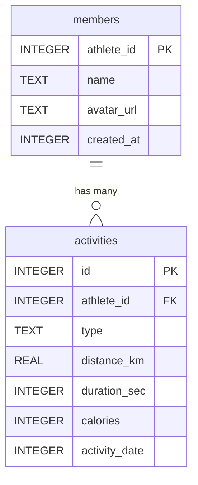
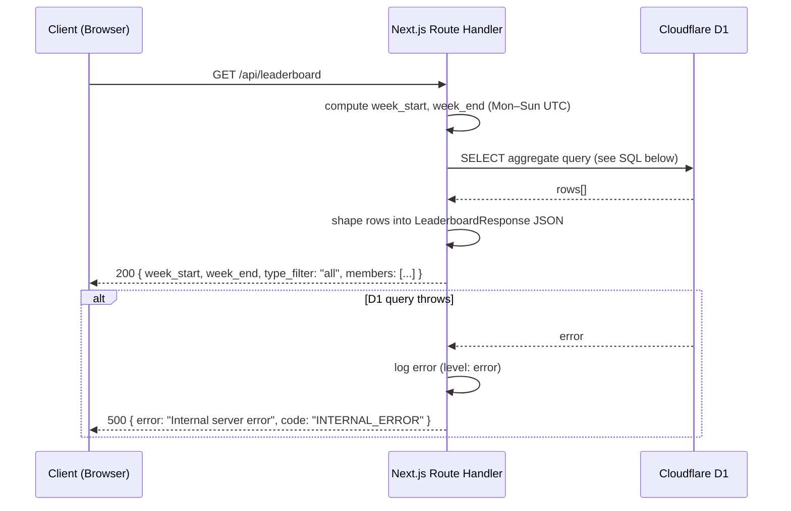

# SP1-T004 — Public Weekly Leaderboard Dashboard — Backend Design

## Metadata
| Field | Value |
|-------|-------|
| **Requirement** | `docs/sprints/SP1/SP1-T004/SP1-T004-requirement.md` |
| **FE Design** | `docs/sprints/SP1/SP1-T004/SP1-T004-frontend.md` |
| **Points** | 5 |
| **Assignee** | - |
| **Status** | draft |

---

## API Endpoints

### `GET /api/leaderboard`

- **Purpose:** Returns the weekly leaderboard — aggregated activity stats per member for the current week (Monday 00:00:00 UTC to Sunday 23:59:59 UTC), sorted by total distance descending.
- **Auth required:** No — public endpoint
- **Roles allowed:** public
- **Idempotent:** Yes (GET, read-only)
- **Rate limit:** None enforced at this stage (read-only, Cloudflare edge caching provides natural protection)

**Query parameters:**

| Parameter | Type | Required | Constraints | Description |
|-----------|------|----------|-------------|-------------|
| `type` | string | no | One of: `Run`, `Ride`, `Walk`, `WeightTraining`, `Other`, `all` | Filter by activity type. Defaults to `all`. **T004 ignores this parameter** — all types returned. T005 will implement filtering. |

**Response (200):**
```json
{
  "week_start": "2026-03-23",
  "week_end": "2026-03-29",
  "type_filter": "all",
  "last_synced_at": 1742800000,
  "members": [
    {
      "athlete_id": 12345678,
      "name": "John Doe",
      "avatar_url": "https://dgalywyr863hv.cloudfront.net/...",
      "total_distance_km": 42.5,
      "total_duration_sec": 18000,
      "total_calories": 1500,
      "activity_count": 7
    }
  ]
}
```

`last_synced_at` — Unix epoch seconds for the most recent member sync (`MAX(members.last_synced_at)`). `null` if no syncs have run yet.
```

**Error responses:**

| Code | Condition | Response body |
|------|-----------|---------------|
| 500 | D1 query fails or unexpected error | `{ "error": "Internal server error", "code": "INTERNAL_ERROR" }` |

_No 400 errors expected — the only query param (`type`) is optional and T004 ignores it. No 401/403 — public endpoint._

---

## API Versioning Strategy

- **Version:** No version prefix — `/api/leaderboard` (not `/api/v1/leaderboard`)
- **Versioning approach:** No versioning at this stage — single internal consumer (the leaderboard UI on the same domain). No external API consumers.
- **Breaking change policy:** If the response shape changes in a breaking way in a future sprint, add a `?v=2` query param or `/api/v2/leaderboard` path at that time.
- **Deprecation plan:** None — new endpoint, no deprecation needed.

---

## Data Contracts

None — single service. The only consumer is the Next.js leaderboard page on the same deployment. No inter-service contracts.

---

## Authorization & Roles

| Endpoint | public | member | admin | Notes |
|----------|--------|--------|-------|-------|
| `GET /api/leaderboard` | ✓ | ✓ | ✓ | No auth check at all — public read |

---

## Input Validation Rules

| Field | Type | Required | Rules | Error message |
|-------|------|----------|-------|---------------|
| `type` (query param) | string | no | Ignored in T004; T005 validates it | N/A |

_No input validation needed for T004 — the endpoint accepts no required parameters and returns computed data._

---

## Data Models

T004 does not create or modify any tables. It reads from the schema created by T001.



**Index used by this query:**
- `idx_activities_athlete_date ON activities(athlete_id, activity_date)` — created by T001; used in the WHERE clause to filter by week range

---

## Sequence Diagram



---

## Existing Code Context

T004 is the first task to add an API route. T001 provides the D1 schema and wrangler.toml binding. T002 and T003 add their own API routes before T004.

**Patterns to follow from T002 and T003 (read their BE design docs):**
| Pattern | Notes |
|---------|-------|
| Next.js Route Handler | API routes live at `src/app/api/[route]/route.ts` using the App Router format |
| D1 access | `env.DB` binding from `wrangler.toml`; accessed via `context.env.DB` in Edge Runtime route handlers |
| Error response shape | `{ error: string, code: string }` — consistent across all API routes |

**No shared service or repository layer exists yet.** At this scale (single D1 query, single route), the query runs directly in the route handler. If a service layer is introduced in a later task, the leaderboard query should be extracted to `src/services/leaderboard.ts`.

---

## Service / Layer Breakdown

For this task, given the simplicity (one read-only query, no mutations, no auth), the architecture is intentionally flat:

```mermaid
flowchart TD
    REQ([GET /api/leaderboard]) --> HANDLER[Route Handler\nsrc/app/api/leaderboard/route.ts]
    HANDLER --> WEEKCALC[Compute week range\ngetCurrentWeekRange()]
    HANDLER --> D1[(Cloudflare D1\nenv.DB)]
    D1 --> HANDLER
    HANDLER --> RESP([JSON Response])
```

| Layer | Responsibility | File |
|-------|---------------|------|
| **Route Handler** | Parse request, compute week range, run query, shape response, handle errors | `src/app/api/leaderboard/route.ts` |
| **Week range utility** | Pure function: compute current Monday and Sunday in UTC as Unix timestamps | `src/lib/getCurrentWeekRange.ts` |
| **D1** | Execute SQL and return rows | Cloudflare D1 via `env.DB` |

_No separate service or repository layer at this stage — extracted if complexity grows._

---

## Business Logic

**Rule 1: Compute current week range (Mon–Sun UTC)**

```
function getCurrentWeekRange():
  now = current UTC datetime
  dayOfWeek = now.getUTCDay()  // 0=Sun, 1=Mon, ..., 6=Sat
  daysFromMonday = (dayOfWeek === 0) ? 6 : dayOfWeek - 1

  weekStart = truncate(now - daysFromMonday days) to Monday 00:00:00 UTC
  weekEnd   = weekStart + 6 days, set time to 23:59:59 UTC

  return {
    weekStartEpoch: weekStart.getTime() / 1000,  // Unix seconds
    weekEndEpoch:   weekEnd.getTime() / 1000,
    weekStartISO:   "YYYY-MM-DD",
    weekEndISO:     "YYYY-MM-DD"
  }
```

**Rule 2: Tie-breaking for equal distance**

```
ORDER BY total_distance_km DESC, total_duration_sec ASC
```
Members with equal total_distance_km are ranked by shorter total_duration_sec (faster = higher rank).

**Rule 3: Only include members with at least 1 activity**

```
The INNER JOIN between members and activities (with HAVING COUNT > 0 or
the implicit filter from JOIN) ensures members with zero activities in the
week are excluded from results.
```

**Rule 4: `total_calories` can be NULL**

```
Some Strava activities do not report calories. Use COALESCE(SUM(calories), 0)
to return 0 instead of NULL.
```

---

## Core SQL Query

```sql
SELECT
    m.athlete_id,
    m.name,
    m.avatar_url,
    ROUND(SUM(a.distance_km), 1)       AS total_distance_km,
    SUM(a.duration_sec)                AS total_duration_sec,
    COALESCE(SUM(a.calories), 0)       AS total_calories,
    COUNT(a.id)                        AS activity_count,
    (SELECT MAX(last_synced_at) FROM members) AS last_synced_at
FROM members m
INNER JOIN activities a ON a.athlete_id = m.athlete_id
WHERE a.activity_date >= ?1    -- weekStartEpoch (Unix seconds)
  AND a.activity_date <= ?2    -- weekEndEpoch   (Unix seconds)
GROUP BY m.athlete_id, m.name, m.avatar_url
ORDER BY total_distance_km DESC, total_duration_sec ASC;
```

`last_synced_at` is a scalar subquery — same value on every row; the route handler reads it from `rows[0]?.last_synced_at ?? null` and surfaces it as a top-level field in the response.

**Parameters:**
- `?1` — `weekStartEpoch` (Monday 00:00:00 UTC as Unix timestamp integer)
- `?2` — `weekEndEpoch` (Sunday 23:59:59 UTC as Unix timestamp integer)

**Execution:**
```typescript
const rows = await env.DB.prepare(`
  SELECT ...
`).bind(weekStartEpoch, weekEndEpoch).all();
```

---

## Event Publishing

None — this task does not emit any domain events. It is a read-only query endpoint.

---

## Error Handling Strategy

### Error Response Envelope

```json
{
  "error": "Human-readable message — safe to show to users",
  "code": "SCREAMING_SNAKE_CASE_CODE"
}
```

### Error Code Catalog

| HTTP | Code | When to use |
|------|------|-------------|
| 500 | `INTERNAL_ERROR` | D1 query throws, unexpected exception in route handler |

_No 400, 401, 403, or 404 codes for this endpoint — it is public, read-only, and has no required parameters._

### Per-Layer Error Responsibility

| Layer | Throws |
|-------|--------|
| **Route Handler** | Catches all — returns `500 INTERNAL_ERROR` for any unhandled exception |

### Error Handling in Route Handler

```
try:
  compute week range
  execute D1 query
  shape and return JSON response
catch (error):
  log(level: error, message: error.message, stack: error.stack)
  return Response(
    JSON({ error: "Internal server error", code: "INTERNAL_ERROR" }),
    status: 500
  )
```

**Rule:** Never expose error.message, stack trace, or D1 error details in the HTTP response body.

---

## Security Considerations

- [x] No user-supplied input is interpolated into the SQL query — only computed Unix timestamp integers are bound via `?1`, `?2` (D1 prepared statement)
- [x] No authentication data (tokens, credentials) is read or returned by this endpoint
- [x] No PII beyond name and avatar_url is returned — both are non-sensitive public Strava profile fields
- [x] Rate limiting: not explicitly enforced; Cloudflare Pages edge handles DDoS protection; the endpoint is read-only
- [x] No file uploads

---

## Logging & Observability

| Event | Level | Fields logged |
|-------|-------|--------------|
| Request received | `info` | `method: GET`, `path: /api/leaderboard`, `week_start`, `week_end` |
| D1 query completed | `info` | `member_count`, `duration_ms` |
| D1 query error | `error` | `message`, `stack`, `week_start`, `week_end` |
| Slow query (> 500ms) | `warn` | `duration_ms`, `week_start`, `week_end` |

_Logging uses `console.info` / `console.error` — Cloudflare Workers captures these in the Workers Logs dashboard._

---

## Environment Variables

| Variable | Description | Required | Default |
|----------|-------------|----------|---------|
| `DB` (D1 binding) | Cloudflare D1 database binding declared in `wrangler.toml` | yes | set by wrangler.toml |

_No new environment variables. The D1 binding `DB` is already configured by T001._

---

## Caching Strategy

None at this stage. The leaderboard data changes at most once per hour (per T003 sync schedule). Future improvement: add `Cache-Control: public, max-age=300` response header (5 minutes) to leverage Cloudflare edge caching. Out of scope for T004.

---

## Database Migrations

None — T004 creates no new tables, columns, or indexes. All schema is owned by T001.

---

## Implementation Plan

| # | Phase | File path | Action | What to implement | References |
|---|-------|-----------|--------|-------------------|------------|
| 1 | Utility | `src/lib/getCurrentWeekRange.ts` | create | `getCurrentWeekRange()` — returns `weekStartEpoch`, `weekEndEpoch`, `weekStartISO`, `weekEndISO` | Business Logic Rule 1 |
| 2 | Types | `src/lib/types.ts` | modify | Add `LeaderboardRow` interface for D1 result rows | Data Contracts |
| 3 | Route Handler | `src/app/api/leaderboard/route.ts` | create | `GET` handler: compute week range, run SQL, shape JSON response, error handling | API Endpoint, Core SQL Query, Error Handling |

---

## TDD Test Plan

Tests are written before implementation. Integration tests use a real D1 database (Cloudflare D1 local via `wrangler dev --local`) — no mocks.

### Unit Tests (`getCurrentWeekRange`)

| Test Case | AC | Type | Description |
|-----------|----|------|-------------|
| Returns correct Monday as week_start on a Wednesday | — | unit | Input: 2026-03-25 (Wed). Expected week_start: `2026-03-23` (Mon), week_end: `2026-03-29` (Sun) |
| Returns correct Monday as week_start on a Monday | — | unit | Input: 2026-03-23 (Mon). Expected week_start: `2026-03-23`, week_end: `2026-03-29` |
| Returns correct Monday as week_start on a Sunday | — | unit | Input: 2026-03-29 (Sun). Expected week_start: `2026-03-23`, week_end: `2026-03-29` |
| weekStartEpoch is Monday 00:00:00 UTC as integer | — | unit | Assert `weekStartEpoch % 86400 === 0` and corresponds to Mon 00:00:00 |
| weekEndEpoch is Sunday 23:59:59 UTC | — | unit | Assert `weekEndEpoch - weekStartEpoch === 604799` (7 days minus 1 second) |

### Unit Tests (Route Handler — mocked D1)

| Test Case | AC | Type | Description |
|-----------|----|------|-------------|
| Returns 200 with correct JSON shape | AC-1, AC-3 | unit | Mock D1 returns 2 rows; assert response keys and types |
| Returns `type_filter: "all"` | — | unit | Assert response always includes `type_filter: "all"` |
| Returns empty members array when D1 returns no rows | AC-6 | unit | Mock D1 returns []; assert `{ members: [] }` |
| Returns 500 when D1 query throws | — | unit | Mock D1 throws; assert 500 + `INTERNAL_ERROR` code |
| Error response does not expose D1 error message | — | unit | Mock D1 throws with internal message; assert response body does not contain that message |

### Integration Tests (real D1 — no mocks)

| Test Case | AC | Type | Description |
|-----------|----|------|-------------|
| Returns members with correct aggregated totals | AC-3 | integration | Insert 3 members + activities in current week; call endpoint; assert `total_distance_km`, `total_duration_sec`, `total_calories`, `activity_count` match expected sums |
| Members sorted by total_distance_km DESC | AC-3 | integration | Insert 3 members at 40 km, 20 km, 30 km; assert response order is 40, 30, 20 |
| Tie-breaking: equal distance sorted by duration ASC | — | integration | Insert 2 members at 40 km but different durations; assert faster (lower duration) ranks first |
| Excludes activities outside the current week | — | integration | Insert 1 activity in the current week, 1 in the previous week; assert only current week activity is counted |
| Excludes members with zero activities in current week | — | integration | Insert 1 member with only last-week activities; assert member not in response |
| `total_calories` is 0 when all activities have NULL calories | — | integration | Insert activities with `calories = NULL`; assert response shows `total_calories: 0` |
| Activity on Mon 00:00:00 UTC is included | — | integration | Insert activity with `activity_date = weekStartEpoch`; assert it appears in results |
| Activity on Sun 23:59:59 UTC is included | — | integration | Insert activity with `activity_date = weekEndEpoch`; assert it appears in results |
| Activity at Mon 00:00:00 UTC - 1s is excluded | — | integration | Insert activity 1 second before week start; assert it does NOT appear |
| Returns 200 with empty members on empty DB | AC-6 | integration | Empty D1 (no members, no activities); assert `{ members: [] }` |
| `total_distance_km` rounded to 1 decimal | — | integration | Insert activities summing to 42.512 km; assert `total_distance_km: 42.5` |

---

## External Dependencies

None — this endpoint only reads from Cloudflare D1, which is part of the same infrastructure. No external API calls.

---

## Performance & Scalability Notes

| Concern | Detail |
|---------|--------|
| Expected data volume | ~20 members × ~7 activities/week = 140 rows per week in activities table; negligible for D1 |
| Query N+1 risk | None — single aggregation query with JOIN; no per-member queries |
| Index strategy | `idx_activities_athlete_date ON activities(athlete_id, activity_date)` from T001 covers the WHERE clause. `athlete_id` in GROUP BY is covered by the same index. |
| D1 read quota | 25M reads/day (free tier). This endpoint reads 140 rows max per request — no concern. |
| Slow query threshold | Log warn if query exceeds 500ms (unlikely given data volume, but monitored) |

---

## Definition of Done (Design)

### Coverage
- [x] Every AC in the requirement maps to at least one test case in the TDD Test Plan
- [x] Every endpoint has a fully filled error table
- [x] Every error code in the Error Code Catalog maps to a test case
- [x] Input validation rules: N/A — no required parameters
- [x] External Dependencies table filled: N/A — no external services

### Correctness
- [x] Error responses follow the standard envelope (`error`, `code`) — no ad-hoc shapes
- [x] No error exposes stack traces or raw D1 error messages to the client
- [x] Each layer only throws errors it is responsible for
- [x] No database migrations needed — T004 reads only from T001's schema

### Alignment
- [x] All endpoints, methods, paths, and response shapes match what the FE design expects (see FE `API Contracts Consumed` section)
- [x] Auth requirements match the Authorization & Roles matrix — endpoint is public, no auth check
- [x] No new env vars — D1 binding `DB` is already declared by T001
