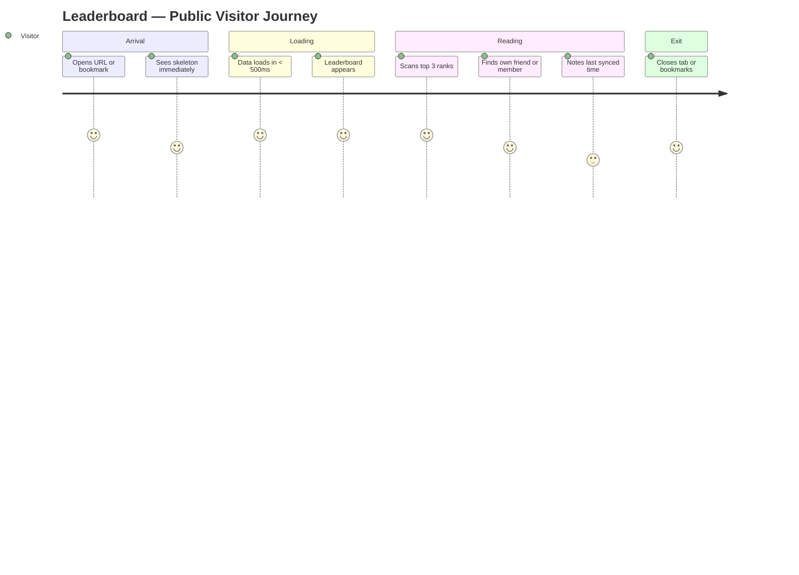
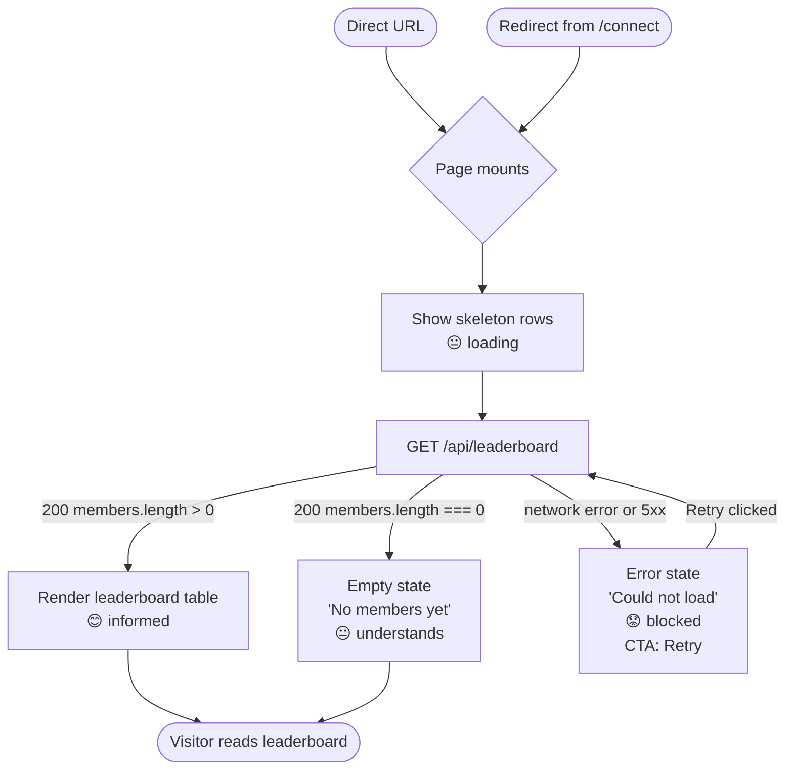
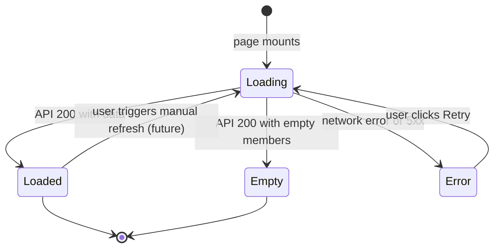
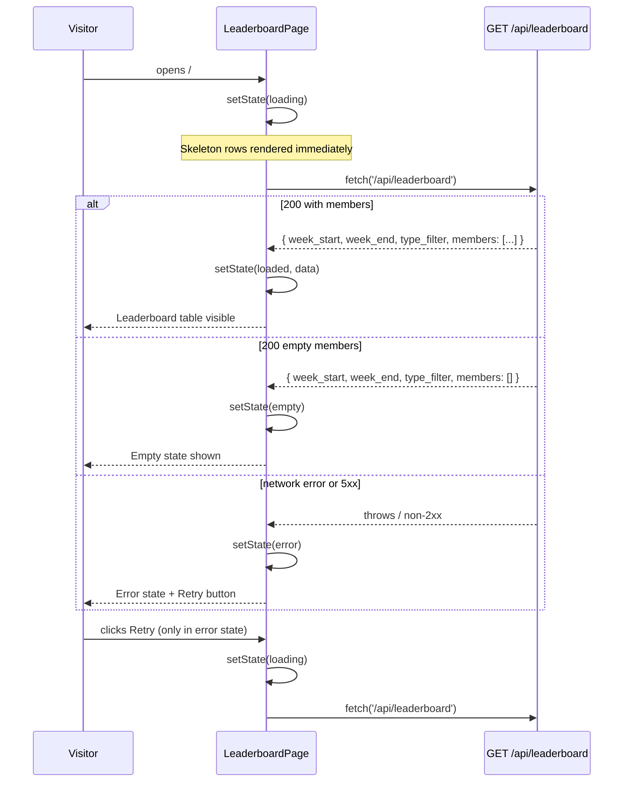
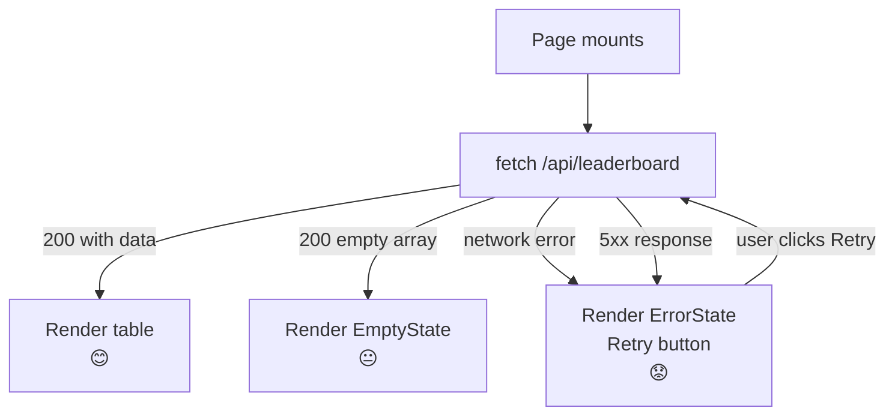

# SP1-T004 — Public Weekly Leaderboard Dashboard — Frontend Design

## Metadata

| Field           | Value                                                              |
| --------------- | ------------------------------------------------------------------ |
| **Requirement** | `docs/sprints/SP1/SP1-T004/SP1-T004-requirement.md`               |
| **Points**      | 5                                                                  |
| **Assignee**    | -                                                                  |
| **Status**      | draft                                                              |

---

## Approach

This is a public read-only page with no authentication. The page is implemented as a Next.js page component at `src/app/page.tsx` (App Router). On mount it fetches `GET /api/leaderboard` and renders a ranked table of members. The data fetch is client-side (not SSR) so the page shell is always served from Cloudflare Pages edge cache instantly; the leaderboard data loads asynchronously.

Key design choices:
- Client-side fetch with React `useState` + `useEffect` — simple, no extra libraries needed for a single endpoint
- Skeleton rows (not a spinner) for loading state — gives the visitor a structural preview while data loads
- Table layout on desktop, card stack on mobile — avoids horizontal scrolling on narrow viewports
- All formatting (duration, distance, calories) is done in dedicated utility functions that are independently testable

---

## Design References

- Figma: TBD — no mockup available; layout described below in UI/UX Overview
- Storybook: TBD

---

## UI/UX Overview

**Page layout (desktop, > 1024px):**

```
┌──────────────────────────────────────────────────────────┐
│  Weekly Leaderboard                                       │
│  Week of Mar 23 – Mar 29, 2026   Last synced: 14 min ago │
├────┬──────────────────────┬──────────┬──────┬────────┬───┤
│ #  │ Member               │ Distance │ Time │ Cal    │ # │
├────┼──────────────────────┼──────────┼──────┼────────┼───┤
│ 1  │ [avatar] John Doe    │ 42.5 km  │ 5:00 │ 1,500  │ 7 │
│ 2  │ [avatar] Jane Smith  │ 38.2 km  │ 4:15 │ 1,200  │ 5 │
│ 3  │ [avatar] Alex Lee    │ 21.0 km  │ 2:30 │  800   │ 3 │
└────┴──────────────────────┴──────────┴──────┴────────┴───┘
```

**Page layout (mobile, < 768px):**

Members displayed as stacked cards instead of table rows. Each card shows:
- Row 1: Rank badge (left) + avatar + name (right)
- Row 2: Stats in a 4-column grid: Distance | Time | Calories | Activities

**Loading state:** 5 skeleton rows with animated pulse, matching the table column structure.

**Empty state:** Centered icon + "No data yet" heading + body copy.

**Error state:** Centered warning icon + "Could not load leaderboard" heading + "Retry" button.

---

## User Journey Map



**Entry point:** Direct URL, shared link, or browser bookmark — no prior navigation required.
**Exit point:** Visitor closes tab, bookmarks the page, or navigates to `/connect` to join the leaderboard.

---

## Behavior Mapping

### Entry Paths

| Entry path | How they get here | Pre-loaded state / context |
| ---------- | ----------------- | -------------------------- |
| Direct URL / bookmark | Typed URL or shared link | No state — fresh load |
| Redirect from `/connect` after OAuth | `router.push('/')` after successful callback | No state — fresh load |

### Behavior Flow



### Fail State Summary

| Fail state | What user sees | Feeling | Can recover? |
| ---------- | -------------- | ------- | ------------ |
| API loading | Skeleton rows with pulse animation | Patient | N/A — resolves automatically |
| Empty members array | "No data yet" + body copy | Understands | No action needed |
| Network error | "Could not load leaderboard" + Retry button | Frustrated | Yes — retry |
| 500 server error | "Could not load leaderboard" + Retry button | Frustrated | Yes — retry |

**Key behavioral goals:**
- The page never shows a blank white screen — skeleton is always shown during fetch
- The retry button re-triggers the exact same fetch — no page reload required
- All fail states are permanent until the user acts (retry) or the issue resolves

---

## State Inventory



| Component | States | Notes |
|-----------|--------|-------|
| `LeaderboardPage` | loading / loaded / empty / error | Top-level state machine |
| `MemberRow` / `MemberCard` | default / skeleton | Skeleton is a separate variant, not a state |
| `StatBadge` | default | Stateless display only |
| `LastSyncedLabel` | default | Formats timestamp, no loading state |

---

## Routing & Navigation

| Route | Component | Auth required | Notes |
| ----- | --------- | ------------- | ----- |
| `/` | `LeaderboardPage` (`src/app/page.tsx`) | No | Public — no middleware auth check |

---

## Existing Code Context

This is a new Next.js project scaffolded by T001. At the time of this design, only the scaffold exists.

**Components available (use as-is):**
| Component | File path | Notes |
|-----------|-----------|-------|
| None yet | — | T001 scaffold only; no shared UI components exist |

**Hooks available:**
| Hook | File path | Notes |
|------|-----------|-------|
| None yet | — | No shared hooks from previous tasks |

**Project patterns to follow:**
- API calls: use native `fetch` directly — no API client wrapper exists yet in this project
- Error boundaries: not yet implemented; handle errors in component state
- Tailwind CSS: utility classes only — no custom CSS files
- File location convention: pages in `src/app/`, components in `src/components/`, utilities in `src/lib/`

---

## Environment / Config Dependencies

| Variable | Purpose | Required | Default |
|----------|---------|----------|---------|
| None — no new env vars | The leaderboard page calls `/api/leaderboard` as a relative path | — | — |

_No new env vars required for this task._

---

## Component Breakdown

| Component | File path | Type | Description |
| --------- | --------- | ---- | ----------- |
| `LeaderboardPage` | `src/app/page.tsx` | new | Top-level page component. Manages fetch state, renders header + table or empty/error state |
| `LeaderboardTable` | `src/components/LeaderboardTable.tsx` | new | Renders the `<table>` with header row and one `MemberRow` per member. Hidden on mobile. |
| `LeaderboardCards` | `src/components/LeaderboardCards.tsx` | new | Renders a stacked list of `MemberCard` components. Shown on mobile only. |
| `MemberRow` | `src/components/MemberRow.tsx` | new | Single table row for desktop: rank, avatar, name, distance, time, calories, activities |
| `MemberCard` | `src/components/MemberCard.tsx` | new | Card layout for mobile: rank badge, avatar, name, 4-stat grid |
| `SkeletonRow` | `src/components/SkeletonRow.tsx` | new | Animated pulse skeleton matching `MemberRow` column widths |
| `SkeletonCard` | `src/components/SkeletonCard.tsx` | new | Animated pulse skeleton matching `MemberCard` layout |
| `EmptyState` | `src/components/EmptyState.tsx` | new | Centered icon + heading + body for empty leaderboard |
| `ErrorState` | `src/components/ErrorState.tsx` | new | Centered icon + heading + body + Retry button for fetch failure |
| `WeekRangeHeader` | `src/components/WeekRangeHeader.tsx` | new | Displays week label ("Week of Mar 23 – Mar 29") and last synced timestamp |
| `formatDuration` | `src/lib/formatDuration.ts` | new | Pure function: `(seconds: number) => string` — returns `"h:mm"` format |
| `formatDistance` | `src/lib/formatDistance.ts` | new | Pure function: `(km: number) => string` — returns `"42.5 km"` |
| `formatCalories` | `src/lib/formatCalories.ts` | new | Pure function: `(cal: number) => string` — returns `"1,500 kcal"` |
| `getWeekRange` | `src/lib/getWeekRange.ts` | new | Pure function: returns `{ week_start: string, week_end: string }` for current Mon–Sun UTC |

---

## Async Interaction Sequence



---

## State & Data Flow

```mermaid
flowchart LR
    API[GET /api/leaderboard] -->|JSON response| State[LeaderboardPage state\n{ status, data, error }]
    State -->|status === loading| Skeleton[SkeletonRow × 5]
    State -->|status === loaded| Table[LeaderboardTable\n+ LeaderboardCards]
    State -->|status === empty| Empty[EmptyState]
    State -->|status === error| Err[ErrorState]
    Table -->|members[]| MemberRow
    Table -->|members[]| MemberCard
    MemberRow -->|total_duration_sec| formatDuration
    MemberRow -->|total_distance_km| formatDistance
    MemberRow -->|total_calories| formatCalories
```

---

## API Contracts Consumed

| Method | Endpoint | Request | Response | Error handling |
| ------ | -------- | ------- | -------- | -------------- |
| GET | `/api/leaderboard` | No params (T004; `?type=` param added in T005) | `{ week_start, week_end, type_filter, members: Member[] }` | Any non-2xx or thrown error → set `status = error`, show ErrorState with Retry |

**Member shape consumed:**
```typescript
interface LeaderboardMember {
  athlete_id: number;
  name: string;
  avatar_url: string;
  total_distance_km: number;
  total_duration_sec: number;
  total_calories: number;
  activity_count: number;
}

interface LeaderboardResponse {
  week_start: string;   // "YYYY-MM-DD"
  week_end: string;     // "YYYY-MM-DD"
  type_filter: string;  // "all"
  members: LeaderboardMember[];
}
```

---

## Loading & Skeleton States

| State | Behavior |
| ----- | -------- |
| Initial load | 5 `SkeletonRow` components shown in table; 5 `SkeletonCard` on mobile; `WeekRangeHeader` shows skeleton placeholders for dates |
| Data loaded | Table / card list replaces skeleton instantly (no fade, no transition) |
| Error state | `ErrorState` component replaces skeleton — "Could not load leaderboard" + Retry button |
| Empty state | `EmptyState` component replaces skeleton — "No data yet" message |

---

## Responsive Behavior

| Breakpoint | Behavior |
| ---------- | -------- |
| Mobile (< 768px) | `LeaderboardTable` hidden; `LeaderboardCards` visible. Each `MemberCard` is full-width. Stats in a 2×2 grid below the member name. |
| Tablet (768–1024px) | `LeaderboardTable` visible. Avatar + name column narrows. Distance, Time, Calories, Activities columns shown. |
| Desktop (> 1024px) | Full table layout. All columns at comfortable widths. Page max-width capped at `max-w-4xl` centered. |

---

## Analytics Events

| Event name | Trigger | Payload |
| ---------- | ------- | ------- |
| `leaderboard_viewed` | After API returns 200 with ≥ 1 member and table is rendered | `{ week_start: string, member_count: number, type_filter: "all" }` |
| `leaderboard_error` | After API returns non-2xx or network error | `{ error_type: "network" \| "server" }` |

_Analytics are sent via a lightweight `trackEvent(name, payload)` utility in `src/lib/analytics.ts`. Implementation fires `console.log` in development and a real event endpoint (TBD) in production. This keeps the component decoupled from the analytics destination._

---

## Implementation Plan

| # | Phase | File path | Action | What to implement | References |
|---|-------|-----------|--------|-------------------|------------|
| 1 | Utilities | `src/lib/formatDuration.ts` | create | `formatDuration(sec: number): string` — `h:mm` format | Business Rules R-3 |
| 2 | Utilities | `src/lib/formatDistance.ts` | create | `formatDistance(km: number): string` — `"42.5 km"` | UI Copy |
| 3 | Utilities | `src/lib/formatCalories.ts` | create | `formatCalories(cal: number): string` — `"1,500 kcal"` with comma separator | UI Copy |
| 4 | Utilities | `src/lib/getWeekRange.ts` | create | `getWeekRange(): { week_start, week_end }` — current Mon–Sun UTC | Business Rules R-1 |
| 5 | Utilities | `src/lib/analytics.ts` | create | `trackEvent(name, payload)` stub | Analytics Events |
| 6 | Types | `src/lib/types.ts` | create | `LeaderboardMember`, `LeaderboardResponse` interfaces | API Contracts Consumed |
| 7 | Components | `src/components/WeekRangeHeader.tsx` | create | Week dates + last synced label | UI/UX Overview, UI Copy |
| 8 | Components | `src/components/SkeletonRow.tsx` | create | Animated pulse skeleton row (desktop) | Loading States |
| 9 | Components | `src/components/SkeletonCard.tsx` | create | Animated pulse skeleton card (mobile) | Loading States |
| 10 | Components | `src/components/MemberRow.tsx` | create | Table row with rank, avatar, name, stats | Component Breakdown |
| 11 | Components | `src/components/MemberCard.tsx` | create | Card layout for mobile | Component Breakdown |
| 12 | Components | `src/components/LeaderboardTable.tsx` | create | Desktop table with header + MemberRow list | Component Breakdown |
| 13 | Components | `src/components/LeaderboardCards.tsx` | create | Mobile card list | Component Breakdown |
| 14 | Components | `src/components/EmptyState.tsx` | create | Empty state UI | UI Copy, AC-6 |
| 15 | Components | `src/components/ErrorState.tsx` | create | Error state UI + Retry button | UI Copy, Fail Cases |
| 16 | Page | `src/app/page.tsx` | modify | `LeaderboardPage` — fetch logic, state machine, render switch | State & Data Flow |

---

## TDD Test Plan

| Test Case | AC | Type | Description |
| --------- | -- | ---- | ----------- |
| `formatDuration(0)` returns `"0:00"` | AC-4 | unit | Edge: zero seconds |
| `formatDuration(540)` returns `"0:09"` | AC-4 | unit | Sub-hour, single digit minutes |
| `formatDuration(3720)` returns `"1:02"` | AC-4 | unit | Over 1 hour with leading zero on minutes |
| `formatDuration(18000)` returns `"5:00"` | AC-4 | unit | Round hour |
| `formatDistance(42.5)` returns `"42.5 km"` | — | unit | Standard case |
| `formatDistance(0)` returns `"0.0 km"` | — | unit | Zero distance |
| `formatCalories(1500)` returns `"1,500 kcal"` | — | unit | Comma separator |
| `formatCalories(800)` returns `"800 kcal"` | — | unit | Under 1000, no comma |
| `LeaderboardPage` shows skeleton on mount before fetch resolves | AC-7 | unit | Mock fetch with delayed promise |
| `LeaderboardPage` renders member rows after successful fetch | AC-3 | unit | Mock fetch returning 3 members |
| `LeaderboardPage` renders members in descending distance order | AC-3 | unit | Mock fetch returning members out of order; assert DOM order |
| `LeaderboardPage` renders `EmptyState` when members array is empty | AC-6 | unit | Mock fetch returning `{ members: [] }` |
| `LeaderboardPage` renders `ErrorState` on fetch network error | AC-7 | unit | Mock fetch throwing an error |
| `LeaderboardPage` retries fetch when Retry is clicked | — | unit | Assert fetch called twice after error + click |
| `MemberRow` renders correct rank number | AC-3 | unit | Pass rank prop, assert visible |
| `MemberRow` renders avatar img with correct src | AC-3 | unit | Pass avatar_url prop |
| `MemberRow` renders duration in h:mm format | AC-4 | unit | Pass total_duration_sec=18000, assert "5:00" |
| `WeekRangeHeader` shows week start and end dates | AC-2 | unit | Pass week_start and week_end strings |
| Page renders without auth redirect | AC-1 | E2E | Navigate to `/` unauthenticated; assert no redirect |
| Full leaderboard renders with real D1 data | AC-3 | E2E | Seed D1, open `/`, assert member names and distances visible |
| Empty state shown when D1 has no members | AC-6 | E2E | Empty D1, open `/`, assert empty state copy visible |
| Error state shown when API returns 500 | — | E2E | Mock `/api/leaderboard` to return 500; assert error copy and Retry button |
| Mobile layout: no horizontal scroll | AC-8 | E2E | Set viewport to 375px, navigate to `/`, assert no horizontal overflow |

---

## E2E Test Plan

| Scenario | AC | Steps | Expected Outcome |
| -------- | -- | ----- | ---------------- |
| Happy path: leaderboard renders | AC-1, AC-2, AC-3, AC-5 | 1. Seed D1 with 3 members + activities. 2. Navigate to `/`. 3. Wait for skeleton to disappear. | Leaderboard table visible; 3 rows in descending distance order; week range shown; last synced visible |
| Duration formatting: h:mm | AC-4 | 1. Seed member with `total_duration_sec = 18000`. 2. Navigate to `/`. | Row shows `5:00` in Time column |
| Empty state | AC-6 | 1. Empty D1 (no members). 2. Navigate to `/`. | "No data yet" heading visible; no table rows |
| Error state and retry | — | 1. Mock API to return 500. 2. Navigate to `/`. 3. Assert error state. 4. Un-mock API. 5. Click Retry. | Error state shown first; after retry, leaderboard renders |
| Mobile responsive | AC-8 | 1. Set viewport to 375×812. 2. Navigate to `/`. 3. Scroll vertically. | No horizontal scrollbar; MemberCard layout visible; all stats legible |

---

## Fail Cases & Fail Flows

### Fail Flow Diagram



### Fail Case Matrix

| Action | Fail Scenario | Presentation | Error Message Shown | Recovery CTA | Input Preserved? |
| ------ | ------------- | ------------ | ------------------- | ------------ | ---------------- |
| Page load fetch | Network error (offline) | page-level (replaces skeleton) | "Could not load leaderboard. Something went wrong. Please try again." | Retry button | N/A |
| Page load fetch | 500 server error | page-level (replaces skeleton) | "Could not load leaderboard. Something went wrong. Please try again." | Retry button | N/A |
| Page load fetch | Empty members array | page-level (replaces skeleton) | "No members have connected their Strava account yet." | None (informational) | N/A |
| Retry fetch | Network error again | page-level (re-shows error) | Same as above | Retry button | N/A |

### Optimistic Update Rollback

None — all UI updates wait for API confirmation. The leaderboard is read-only; no mutations occur on this page.

### Partial Success Handling

None — this flow fetches a single endpoint and renders the result atomically.

### Multi-step / Wizard Rollback

None — single step, no rollback needed.

---

## Edge Cases & Error States

- **Network timeout:** Treated as a network error — `ErrorState` shown with Retry. No timeout timer; browser default applies.
- **Empty list (no members connected):** `EmptyState` shown — distinct from error, no Retry button.
- **Very long member names:** Names truncated with CSS `truncate` (`overflow: hidden; text-overflow: ellipsis`) in both table and card layouts.
- **Missing avatar (broken image URL):** `` fallback via `onError` sets a default placeholder avatar (a neutral silhouette SVG).
- **Zero distance member included in API response:** Business rule R-6 excludes them at the SQL layer, but if a 0-km member appears, they render correctly in last place.
- **Very large numbers (e.g. 1,000+ km):** `formatDistance` handles; `formatCalories` always applies comma separator.
- **`total_duration_sec` is 0:** `formatDuration(0)` returns `"0:00"` — handled explicitly in utility tests.
- **Server error (500):** Same UX as network error — generic message, Retry available.
- **Unauthorized (401):** Not expected on this public endpoint; if received, treated as a generic error (same `ErrorState`).

---

## Accessibility Notes

- All `` avatar tags must have a descriptive `alt` attribute: `alt="{name}'s avatar"`
- Rank column uses `<span aria-label="Rank {n}">` so screen readers announce rank correctly
- The leaderboard table includes a `<caption>` element: "Weekly leaderboard ranked by distance"
- `SkeletonRow` components have `aria-hidden="true"` — screen readers skip them
- `ErrorState` retry button is a `<button>` element, not a `<div>`, for keyboard accessibility
- Color is not the sole indicator of any state — icons and text labels accompany all state changes

---

## Definition of Done (Design)

### Coverage
- [x] Every AC in the requirement has at least one E2E scenario in the E2E Test Plan
- [x] Every entry path in the Entry Paths table is handled in the Behavior Flow
- [x] Every API endpoint consumed has an error handling column filled in
- [x] Every fail scenario in the Fail Case Matrix has: presentation pattern + error copy + recovery CTA

### Correctness
- [x] Error messages are user-friendly — no raw HTTP status codes or stack traces shown to users
- [x] All fail states are reachable and testable
- [x] Optimistic Update Rollback, Partial Success, and Multi-step Rollback sections explicitly filled or marked "None"
- [ ] Design matches Figma/mockup — no mockup exists yet; layout described in prose above

### Alignment
- [x] API contracts in this doc match what the BE design defines
- [x] Routing entries align with the main app router — `/` is the index route
- [x] Analytics events match the Analytics & Tracking section in the requirement
