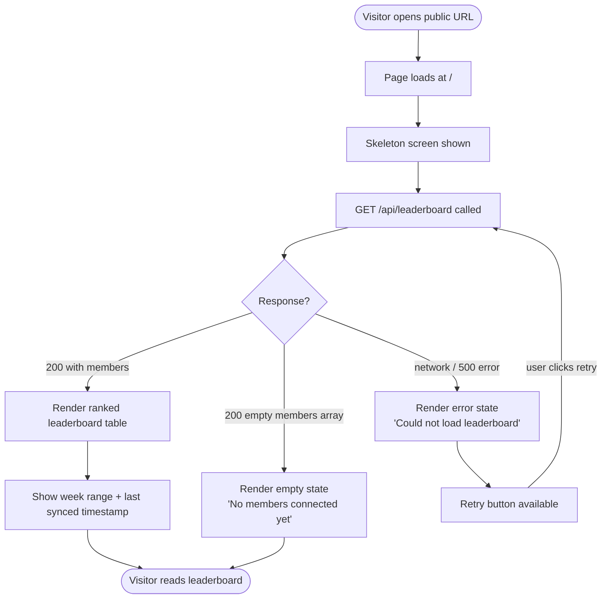

# SP1-T004 — Public Weekly Leaderboard Dashboard

## Metadata
| Field | Value |
|-------|-------|
| **Sprint** | SP1 |
| **Points** | 5 |
| **Priority** | high |
| **Assignee** | - |
| **Requester** | Club organizer |
| **Status** | in-progress |

---

## Problem Statement

Club members exercise and log activities through Strava, but there is no shared dashboard showing how everyone is doing for the current week. Without visibility into relative progress, the friendly competitive motivation that the leaderboard is meant to create does not exist. This task delivers the public-facing weekly leaderboard page — the primary user-facing output of the entire SP1 sprint.

## Overview

Build a public leaderboard page at `/` (the index route) that shows the current week's (Monday 00:00:00 UTC to Sunday 23:59:59 UTC) aggregated activity rankings for all connected members. The page fetches data from `GET /api/leaderboard`, requires no login, and is accessible to anyone with the URL. Members are ranked by total distance (km) descending. Each row shows rank, avatar, name, total distance, total duration (formatted as h:mm), total calories, and activity count. A "last synced" timestamp is shown so visitors know how fresh the data is.

---

## Feature Flow

---

## User Stories

| # | Story | Maps to AC |
|---|-------|-----------|
| US-1 | As a public visitor, I want to open the leaderboard URL without logging in, so that I can see how club members are performing this week. | AC-1, AC-2 |
| US-2 | As a club member, I want to see my rank, avatar, total km, total time, and calories in one view, so that I can compare my progress with others. | AC-3, AC-4 |
| US-3 | As a public visitor, I want to know how fresh the data is, so that I understand whether the numbers reflect today's activities. | AC-5 |
| US-4 | As a public visitor, I want a clear message when no members have connected yet, so that I understand why the leaderboard is empty. | AC-6 |
| US-5 | As a public visitor, I want the page to load quickly and look correct on my phone, so that I can check rankings from anywhere. | AC-7, AC-8 |

---

## System Behavior

| Trigger | System Response | Side Effects | Timing |
|---------|----------------|-------------|--------|
| Visitor opens `/` | Page renders skeleton, fetches `GET /api/leaderboard` | None | sync page render, async fetch |
| `GET /api/leaderboard` succeeds | Leaderboard table rendered with ranked members | None | immediate on response |
| `GET /api/leaderboard` returns empty members | Empty state component shown | None | immediate on response |
| `GET /api/leaderboard` fails (network / 5xx) | Error state shown with retry button | None | immediate on response |
| Visitor clicks retry | `GET /api/leaderboard` is called again | None | async |

---

## Acceptance Criteria

- [ ] **AC-1: Page is publicly accessible without login**
  GIVEN a visitor who is not logged in
  WHEN they open `/` in a browser
  THEN the leaderboard page loads without any auth redirect or login prompt
  AND no authentication cookie or token is required

- [ ] **AC-2: Current week date range is displayed**
  GIVEN the leaderboard page has loaded
  WHEN the data is visible
  THEN the page shows the current week's Monday and Sunday dates (e.g. "Week of Mar 23 – Mar 29, 2026")

- [ ] **AC-3: Members are ranked by total distance descending**
  GIVEN the leaderboard has data for the current week
  WHEN the page renders
  THEN members are displayed in descending order of `total_distance_km`
  AND each row shows a rank number (1, 2, 3…), avatar image, name, total_distance_km, total_duration formatted as h:mm, total_calories, and activity_count

- [ ] **AC-4: Duration is formatted as h:mm**
  GIVEN a member with `total_duration_sec = 18000`
  WHEN the leaderboard row is rendered
  THEN the duration displays as `5:00` (hours:minutes, no seconds)

- [ ] **AC-5: Last synced timestamp is shown**
  GIVEN the leaderboard page has loaded
  WHEN data is visible
  THEN a "Last synced: [time]" indicator is shown reflecting when activities were last fetched from Strava

- [ ] **AC-6: Empty state when no members are connected**
  GIVEN no members have connected their Strava account yet
  WHEN the API returns an empty members array
  THEN the page shows a message: "No members have connected their Strava account yet."
  AND the week range header is still visible

- [ ] **AC-7: Loading skeleton is shown during fetch**
  GIVEN the page has just loaded
  WHEN the API call is in progress
  THEN a skeleton placeholder (not blank white screen) is shown for the leaderboard rows

- [ ] **AC-8: Page is responsive on mobile (< 768px)**
  GIVEN a visitor on a mobile device (viewport < 768px)
  WHEN the leaderboard page loads
  THEN all member data is visible without horizontal scrolling
  AND rank, avatar, name, and key stats are legible

---

## Data & Business Rules

| Rule ID | Rule | Example | Applies to AC |
|---------|------|---------|--------------|
| R-1 | Weekly range = Monday 00:00:00 UTC to Sunday 23:59:59 UTC | Week of 2026-03-23 to 2026-03-29 | AC-2, AC-3 |
| R-2 | Sorting is by `total_distance_km` descending; ties broken by `total_duration_sec` ascending | Two members at 42.5 km — shorter time ranks higher | AC-3 |
| R-3 | Duration formatted as `h:mm` — no seconds, no leading zeros on hours | 18000s → 5:00; 3720s → 1:02; 540s → 0:09 | AC-4 |
| R-4 | All activity types combined — no type filter applied (T005 adds filtering) | Run + Ride + Walk all summed together | AC-3 |
| R-5 | `activity_count` shows total number of individual activities across all types | 3 runs + 2 rides = 5 | AC-3 |
| R-6 | Members with zero activities in the current week are NOT shown in the leaderboard | Only members with ≥ 1 activity appear | AC-3 |
| R-7 | `type_filter` in the API response is always `"all"` for this task | No filter applied | — |

---

## Success Metrics

- [ ] Metric-1: Page loads (first contentful paint) within 2 seconds on a standard connection
- [ ] Metric-2: `GET /api/leaderboard` responds within 500ms under normal D1 load
- [ ] Metric-3: Zero JS errors in browser console during normal leaderboard view
- [ ] Metric-4: Leaderboard correctly reflects activities synced by T003 — same km totals as raw DB rows

---

## Design References

- Figma: TBD — no mockup yet; layout described in FE design doc
- Prototype: TBD

---

## Analytics & Tracking

- [ ] Event: `leaderboard_viewed` — fired when the leaderboard page successfully renders with data (after API response received, not on page mount)
  - Payload: `{ week_start, member_count, type_filter: "all" }`
- [ ] Event: `leaderboard_error` — fired when the API call fails and the error state is shown
  - Payload: `{ error_type: "network" | "server" }`

---

## UI Copy

| Location | Copy |
|----------|------|
| Page title (browser tab) | `Weekly Leaderboard — Strava Club` |
| Page heading | `Weekly Leaderboard` |
| Week range subheading | `Week of [Mon date] – [Sun date]` (e.g. `Week of Mar 23 – Mar 29, 2026`) |
| Last synced label | `Last synced: [relative time or absolute time]` (e.g. `Last synced: 14 minutes ago`) |
| Table header — Rank | `#` |
| Table header — Member | `Member` |
| Table header — Distance | `Distance` |
| Table header — Time | `Time` |
| Table header — Calories | `Calories` |
| Table header — Activities | `Activities` |
| Distance unit | `km` (e.g. `42.5 km`) |
| Calories unit | `kcal` (e.g. `1,500 kcal`) |
| Empty state heading | `No data yet` |
| Empty state body | `No members have connected their Strava account yet.` |
| Error state heading | `Could not load leaderboard` |
| Error state body | `Something went wrong. Please try again.` |
| Error retry button | `Retry` |

---

## DO / DON'T

| DO | DON'T |
|----|-------|
| Show skeleton rows during loading | Show a blank white screen or spinner only |
| Show rank numbers starting at 1 | Use 0-indexed ranks |
| Format duration as h:mm (e.g. 5:00) | Show raw seconds or include seconds |
| Show all activity types combined | Filter by type (that is T005's job) |
| Show members with ≥ 1 activity this week only | Show all connected members including those with 0 km |
| Keep the page public — no auth checks | Add any login wall or redirect |
| Show week date range prominently | Only show "this week" without dates |
| Round distance to 1 decimal place | Show excessive decimal places (42.512 km) |
| Format calories with comma thousands separator | Show unformatted numbers (1500 instead of 1,500) |

---

## Rollout / Release Strategy

- **Strategy:** All-at-once — this is a new public page with no existing users to migrate
- **Feature flag name:** N/A
- **Rollback plan:** Revert the deployed Cloudflare Pages build to the previous version via the Cloudflare dashboard; the page will return 404 until re-deployed
- **Who gets it first:** All visitors (public URL, no restriction)

---

## Out of Scope

- Activity type filter (Run / Ride / Walk / etc.) — that is SP1-T005
- Monthly or all-time leaderboard views
- Member profile pages or per-member activity details
- The `/connect` OAuth flow — that is SP1-T002
- The sync cron job — that is SP1-T003
- Any form of authentication or login wall
- Push notifications or real-time updates (page is read-only, manual refresh)

---

## Dependencies

- **SP1-T001:** D1 schema must exist (`members` and `activities` tables, DB binding `env.DB`)
- **SP1-T002:** At least one member must have connected Strava for meaningful data in staging
- **SP1-T003:** Activities must be synced into D1 for the leaderboard to show real data
- **cross-task-context.md:** API contract for `GET /api/leaderboard` is defined there — this task owns and implements it

---

## Test Data / Seed Requirements

| What | Value / Setup | Who sets it up |
|------|---------------|----------------|
| D1 database with members + activities | At least 3 members with activities in the current week at different distances | Developer (seed script or manual insert via wrangler d1 execute) |
| Member with zero activities this week | 1 member record with no `activities` rows in the current week range | Developer |
| Empty DB scenario | D1 with no rows in members table | Developer (test environment) |
| Week boundary data | Activities with `activity_date` exactly at Mon 00:00:00 UTC and Sun 23:59:59 UTC | Developer |

---

## Definition of Done

**"Done" means correct — not just complete.**

### Functional Correctness
- [ ] Every AC passes — verified in a real browser against a real API and real D1 database
- [ ] Every error scenario in the Fail Case Matrix shows the correct message and behavior
- [ ] No AC is "assumed passing" — each one has a passing E2E test to prove it

### Test Coverage
- [ ] Unit tests written and green
- [ ] Integration tests written and green — real D1, no mocks
- [ ] E2E tests written and green — one scenario per AC + one per key error path
- [ ] No test is skipped, commented out, or marked `.only`

### Quality Gates
- [ ] No console errors or warnings in the browser during normal use
- [ ] Page load within 2s, API response within 500ms (per Success Metrics)
- [ ] No regression in existing flows touched by this task (run full suite)
- [ ] Code reviewed and approved — reviewer confirmed ACs, not just code style

### Design Fidelity
- [ ] All error states render correctly — not just happy path
- [ ] Responsive layout verified on mobile viewport (< 768px)

### Delivery
- [ ] Deployed to staging and smoke-tested end-to-end
- [ ] Analytics events verified firing in staging
- [ ] BACKLOG.md updated to `done`
