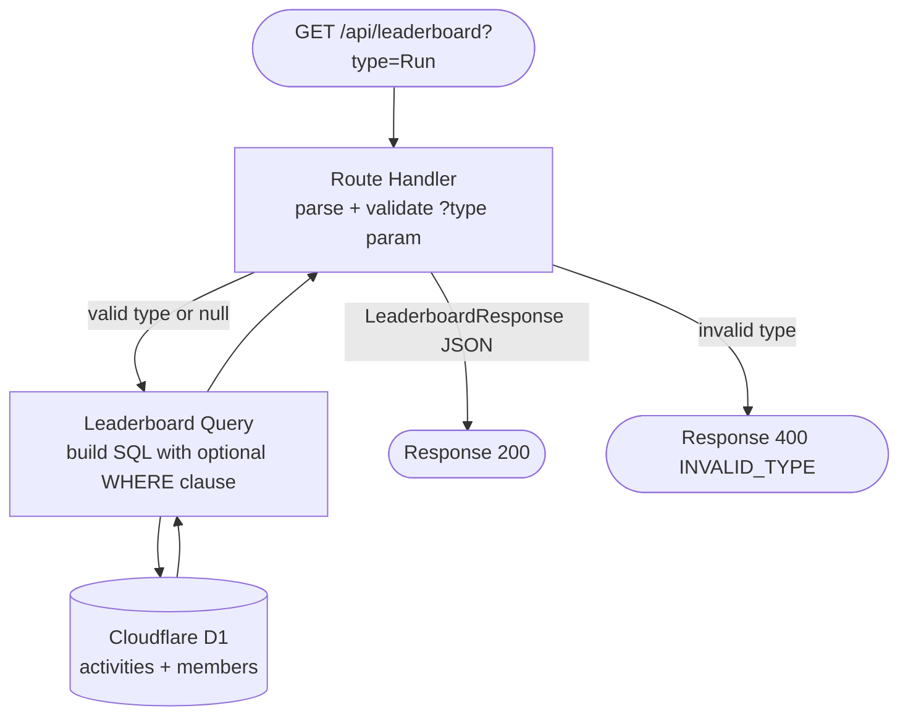

# SP1-T005 — Activity Type Filter — Backend Design

## Metadata
| Field | Value |
|-------|-------|
| **Requirement** | `docs/sprints/SP1/SP1-T005/SP1-T005-requirement.md` |
| **FE Design** | `docs/sprints/SP1/SP1-T005/SP1-T005-frontend.md` |
| **Points** | 3 |
| **Assignee** | - |
| **Status** | draft |

<!-- Required sections at 3pt:
  API Endpoints, Existing Code Context, TDD Test Plan
  + API Versioning Strategy, Input Validation Rules, full TDD Test Plan
  + Data Models, Service/Layer Breakdown, Business Logic, Error Handling, Impl Plan
-->

---

## API Endpoints

### `GET /api/leaderboard`

_This endpoint is owned by T004. T005 extends it with an optional `?type=` query parameter. All existing behavior when the param is absent remains unchanged._

- **Purpose:** Return weekly leaderboard aggregated from the `activities` table in D1. When `?type=` is provided, filter results to that activity type only.
- **Auth required:** No — public endpoint
- **Roles allowed:** public
- **Idempotent:** Yes — read-only
- **Rate limit:** None (public dashboard, low-traffic)

**Query parameters:**
| Param | Type | Required | Constraints | Description |
|-------|------|----------|-------------|-------------|
| `type` | string | No | One of: `Run`, `Ride`, `Walk`, `WeightTraining`, `Other`, `all` | Filter leaderboard to a single activity type. Omitting or passing `all` returns all types. |

**Response (200):**
```json
{
  "week_start": "2026-03-23",
  "week_end": "2026-03-29",
  "type_filter": "Run",
  "members": [
    {
      "athlete_id": 12345678,
      "name": "John Doe",
      "avatar_url": "https://...",
      "total_distance_km": 42.5,
      "total_duration_sec": 18000,
      "total_calories": 1500,
      "activity_count": 7
    }
  ]
}
```

**Error responses:**

| Code | Condition | Response body |
|------|-----------|---------------|
| 400 | `type` param provided but not one of the valid values | `{ "error": "Invalid activity type. Valid types: Run, Ride, Walk, WeightTraining, Other", "code": "INVALID_TYPE" }` |
| 500 | Unexpected D1 query error | `{ "error": "Internal server error", "code": "INTERNAL_ERROR" }` |

---

## API Versioning Strategy

- **Version:** Unversioned (path is `/api/leaderboard`, not `/api/v1/...`) — consistent with T004's established convention
- **Versioning approach:** The addition of an optional query param is a non-breaking change — existing clients that call `/api/leaderboard` without `?type=` receive identical responses
- **Breaking change policy:** New optional params = same endpoint; removing the param or changing the response shape = new version
- **Deprecation plan:** None — additive change only

---

## Data Models

No new tables or schema changes. T005 reads exclusively from the existing schema defined in T001:

```
members   (athlete_id PK, name, avatar_url, created_at)
activities(id PK, athlete_id FK→members, type, distance_km, duration_sec, calories, activity_date)
```

The `activities.type` column already stores the canonical strings (`Run`, `Ride`, `Walk`, `WeightTraining`, `Other`) per the shared schema. No migration is required.

**Existing index used:**
- `idx_activities_athlete_date ON activities(athlete_id, activity_date)` — supports the weekly range filter already in T004's query

**Note:** An additional index on `activities(type, activity_date)` would improve performance for type-filtered queries but is not required at the current scale of 20 members. This is flagged as a future optimization.

---

## Input Validation Rules

| Field | Type | Required | Rules | Error message |
|-------|------|----------|-------|---------------|
| `type` (query param) | string | No | If present, must be one of: `Run`, `Ride`, `Walk`, `WeightTraining`, `Other`, `all` (case-sensitive) | "Invalid activity type. Valid types: Run, Ride, Walk, WeightTraining, Other" |

**Valid type set (constant — do not hardcode inline):**
```
VALID_TYPES = ['Run', 'Ride', 'Walk', 'WeightTraining', 'Other']
```

`all` is accepted as a special alias for "no filter" and is NOT included in `VALID_TYPES` (it is handled as the default/absent case before validation).

---

## Service / Layer Breakdown



| Layer | Responsibility |
|-------|---------------|
| **Route Handler (Controller)** | Parse `?type` from URL; normalize `all` → `null`; validate against `VALID_TYPES`; call query function; format JSON response |
| **Query function (Service)** | Build and execute the D1 SQL query with optional WHERE clause; aggregate and rank members |
| **D1 (Database)** | Execute SQL; return rows |

_In Next.js Edge Runtime API routes there is no separate repository layer — the query function accesses `env.DB` directly, consistent with T004's pattern._

---

## Business Logic

**Rule 1: Normalize `?type` param**
```
typeParam = URL.searchParams.get('type')

IF typeParam is null OR typeParam === '' OR typeParam.toLowerCase() === 'all':
  activeType = null   // no WHERE clause
ELSE:
  activeType = typeParam  // will be validated next
```

**Rule 2: Validate activeType**
```
VALID_TYPES = ['Run', 'Ride', 'Walk', 'WeightTraining', 'Other']

IF activeType is not null AND activeType NOT IN VALID_TYPES:
  RETURN 400 { error: "Invalid activity type...", code: "INVALID_TYPE" }
```

**Rule 3: Build SQL query with optional type filter**

Base query (T004 behavior — unchanged):
```sql
SELECT
  m.athlete_id,
  m.name,
  m.avatar_url,
  ROUND(SUM(a.distance_km), 2) AS total_distance_km,
  SUM(a.duration_sec)          AS total_duration_sec,
  SUM(a.calories)              AS total_calories,
  COUNT(a.id)                  AS activity_count
FROM members m
JOIN activities a ON a.athlete_id = m.athlete_id
WHERE a.activity_date >= {week_start_unix}
  AND a.activity_date <= {week_end_unix}
  /* T005 adds: AND a.type = ? */
GROUP BY m.athlete_id, m.name, m.avatar_url
ORDER BY total_distance_km DESC
```

Type filter clause (added by T005 when `activeType` is not null):
```
IF activeType is not null:
  append "AND a.type = ?" to WHERE clause
  add activeType to query bindings
```

**Rule 4: Set `type_filter` in response**
```
IF activeType is null:
  response.type_filter = "all"
ELSE:
  response.type_filter = activeType
```

---

## Error Handling Strategy

### Error Response Envelope

```json
{
  "error": "Human-readable message — safe to show to users",
  "code": "SCREAMING_SNAKE_CASE_CODE"
}
```

### Error Code Catalog (T005 additions)

| HTTP | Code | Category | Retryable | When to use |
|------|------|----------|-----------|-------------|
| 400 | `INVALID_TYPE` | client | no | `?type` param provided but not in valid set |
| 500 | `INTERNAL_ERROR` | server | yes — retry once | Unexpected D1 error |

### Per-Layer Error Responsibility

| Layer | Throws | Does NOT |
|-------|--------|----------|
| **Route Handler** | `400 INVALID_TYPE` (after normalization) | Business rules |
| **Query function** | Re-throws D1 errors as `500 INTERNAL_ERROR` | Validation |
| **Global handler** | Catches all unhandled → `500 INTERNAL_ERROR`, strips internal details | — |

---

## Existing Code Context

**Functions / modules available (extend, do not rewrite):**
| Function | File path | Notes |
|----------|-----------|-------|
| `GET /api/leaderboard` route handler | `src/app/api/leaderboard/route.ts` | T004 owner — T005 modifies this file to add `?type` param handling |
| Leaderboard SQL query | Inside `route.ts` or extracted helper | T004's weekly aggregation query — T005 adds optional WHERE clause |

**Shared utilities:**
| Utility | File path | Notes |
|---------|-----------|-------|
| `env.DB` binding | `wrangler.toml` | Cloudflare D1 binding — already configured by T001 |

**Project patterns to follow:**
- D1 queries use parameterized bindings (`env.DB.prepare(...).bind(...).all()`) — never string interpolation
- Edge Runtime: no Node.js-only imports
- Error responses follow the standard envelope shape above

---

## Implementation Plan

| # | Phase | File path | Action | What to implement | References |
|---|-------|-----------|--------|-------------------|------------|
| 1 | Validation constant | `src/app/api/leaderboard/route.ts` | modify | Add `VALID_TYPES` constant array | Input Validation Rules |
| 2 | Param parsing | `src/app/api/leaderboard/route.ts` | modify | Read `?type` from `request.nextUrl.searchParams`; normalize `all`/absent → `null` | Business Logic Rule 1 |
| 3 | Validation | `src/app/api/leaderboard/route.ts` | modify | Check `activeType` against `VALID_TYPES`; return 400 `INVALID_TYPE` if invalid | Business Logic Rule 2, Error Handling |
| 4 | SQL query extension | `src/app/api/leaderboard/route.ts` | modify | Conditionally append `AND a.type = ?` to WHERE clause and bind `activeType` | Business Logic Rule 3 |
| 5 | Response update | `src/app/api/leaderboard/route.ts` | modify | Set `type_filter` field in JSON response to `activeType ?? "all"` | Business Logic Rule 4 |
| 6 | Error handler | `src/app/api/leaderboard/route.ts` | modify | Wrap D1 call in try/catch; return 500 `INTERNAL_ERROR` on unexpected errors | Error Handling |

---

## TDD Test Plan

All tests for this route target the `GET /api/leaderboard` handler in `src/app/api/leaderboard/route.ts`.

| Test Case | AC | Type | Description |
|-----------|----|------|-------------|
| Returns 200 with no `?type` param — all members returned | AC-4 | integration (real D1) | Seed 2 members with mixed types; call without `?type`; expect both present, `type_filter: "all"` |
| Returns 200 with `?type=Run` — only running stats | AC-2, AC-5 | integration (real D1) | Seed member with Run + Ride activities; call `?type=Run`; expect only run totals in response |
| Returns 200 with `?type=Ride` | AC-5 | integration (real D1) | Seed member with Ride activity; call `?type=Ride`; expect Ride totals |
| Returns 200 with `?type=Walk` | AC-5 | integration (real D1) | Seed member with Walk activity; call `?type=Walk`; expect Walk totals |
| Returns 200 with `?type=WeightTraining` | AC-5 | integration (real D1) | Seed member with WeightTraining activity; call `?type=WeightTraining`; expect WeightTraining totals |
| Returns 200 with `?type=Other` | AC-5 | integration (real D1) | Seed member with Other activity; call `?type=Other`; expect Other totals |
| Returns 200 with `?type=all` — treated same as no param | AC-4 | unit | Mock D1; call `?type=all`; verify no WHERE type clause in query, `type_filter: "all"` in response |
| Returns 400 INVALID_TYPE for unknown type | AC-6 | unit | Call `?type=Cycling`; expect `{ error: "...", code: "INVALID_TYPE" }` with HTTP 400 |
| Returns 400 INVALID_TYPE for lowercase valid type | R-1 | unit | Call `?type=run` (lowercase); expect 400 INVALID_TYPE — validation is case-sensitive |
| Returns 400 INVALID_TYPE for empty string | — | unit | Call `?type=`; expect 400 INVALID_TYPE |
| `type_filter` in response equals the requested type | AC-2 | unit | Mock D1; call `?type=Run`; response body has `type_filter: "Run"` |
| Members with no matching type are excluded | R-4 | integration (real D1) | Seed member A (Run only) + member B (Ride only); call `?type=Run`; only member A in response |
| Returns 500 INTERNAL_ERROR on D1 failure | — | unit | Mock D1 to throw; expect `{ code: "INTERNAL_ERROR" }` with HTTP 500 |
| Existing T004 behavior unchanged when no `?type` param | AC-4 | integration (real D1) | Regression: call without param; response shape and ranking matches pre-T005 behavior |

---

## Definition of Done (Design)

### Coverage
- [x] Every AC in the requirement maps to at least one test case in the TDD Test Plan
- [x] The endpoint has a fully filled error table — no empty rows
- [x] Every error code (`INVALID_TYPE`, `INTERNAL_ERROR`) maps to a test case
- [x] Every input field (`type` query param) has an explicit error message defined
- [x] External Dependencies: None beyond D1 (already covered by T001/T004)

### Correctness
- [x] Error responses follow the standard envelope (`error`, `code`) — no ad-hoc shapes
- [x] No error exposes stack traces or raw D1 error messages to the client
- [x] Validation is case-sensitive per R-1 (Strava type strings are exact)
- [x] Database Migrations: None required — no schema changes

### Alignment
- [x] Endpoint method, path, query param name, and response shape match the FE design's API Contracts Consumed section
- [x] `type_filter` field in response matches FE expectations
- [x] No new env vars required — D1 binding already exists
