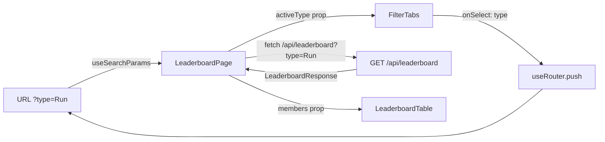
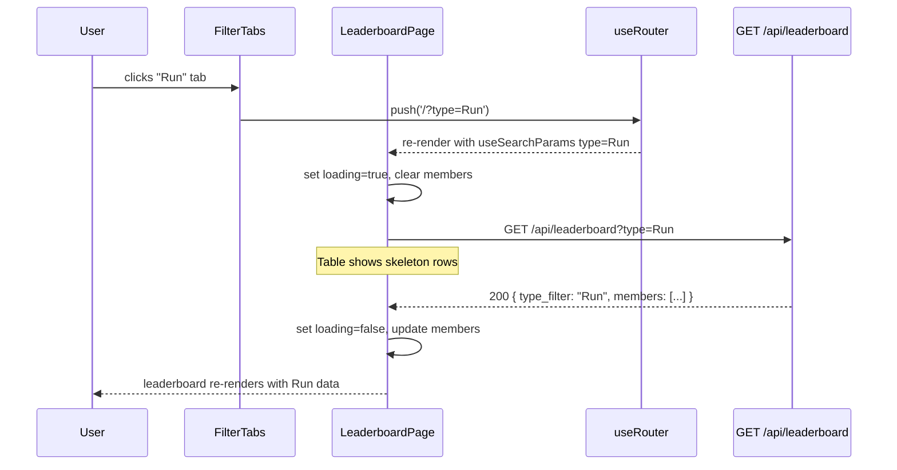

# SP1-T005 — Activity Type Filter — Frontend Design

## Metadata

| Field           | Value                                                              |
| --------------- | ------------------------------------------------------------------ |
| **Requirement** | `docs/sprints/SP1/SP1-T005/SP1-T005-requirement.md`              |
| **Points**      | 3                                                                  |
| **Assignee**    | -                                                                  |
| **Status**      | draft                                                              |

<!-- Required sections at 3pt:
  Approach, Existing Code Context, Component list, TDD Test Plan (min. 1 test/AC)
  + Env/Config Dependencies, Component Breakdown, API Contracts, State & Data Flow, Fail State table
  + UI/UX Overview, Loading States, Impl Plan, E2E Test Plan, Fail Case Matrix, Async Interaction Sequence
-->

---

## Approach

Extend T004's `LeaderboardPage` by adding a `FilterTabs` component above the leaderboard table. Filter state is managed via the URL search param `?type=` using Next.js `useRouter` / `useSearchParams` — this gives shareability for free and avoids a separate client state store. On tab click, the component pushes a new URL param (or removes it for "All") and the page re-fetches leaderboard data with the selected type appended to the API call. No page reload occurs. The API contract extension is minimal: a single optional `?type=` query param added to the existing `GET /api/leaderboard` call that T004 already makes.

---

## Design References

- Figma: TBD
- Storybook: TBD

---

## UI/UX Overview

The filter bar sits directly above the leaderboard ranking table (below the page title / week range header). It is a horizontally scrollable row of pill-shaped tabs on mobile and a static row on desktop. Six tabs appear in fixed order: **All · Run · Ride · Walk · WeightTraining · Other**. The active tab has a filled background (Tailwind `bg-orange-500 text-white`); inactive tabs are outlined (`border border-gray-300 text-gray-600`). Clicking a tab is instant — a loading indicator (skeleton or spinner) replaces the table rows while the API call is in-flight. If the API returns an error, an inline error message replaces the table.

Tab labels match the canonical type strings used in D1 and the API, with one display alias: `WeightTraining` is rendered as **"Weight"** in the UI for brevity.

| Type value (API) | UI label |
|------------------|----------|
| _(no param)_ | All |
| `Run` | Run |
| `Ride` | Ride |
| `Walk` | Walk |
| `WeightTraining` | Weight |
| `Other` | Other |

---

## Existing Code Context

**Components available (use as-is or extend):**
| Component | File path | Notes |
|-----------|-----------|-------|
| `LeaderboardPage` | `src/app/page.tsx` (or `src/components/LeaderboardPage.tsx`) | T004 owner — T005 adds FilterTabs inside it |
| `LeaderboardTable` | `src/components/LeaderboardTable.tsx` | T004 owner — no modification needed; re-renders on new data |

**Hooks available:**
| Hook | File path | Notes |
|------|-----------|-------|
| `useSearchParams` | Next.js built-in | Read `?type=` from URL |
| `useRouter` | Next.js built-in | Push new URL on tab click |

**Project patterns to follow:**
- All API calls use `fetch` directly inside Next.js Server Components or client `useEffect` — no abstraction layer exists yet; follow T004's established pattern
- Tailwind CSS for all styling — no CSS modules or inline styles
- Edge Runtime: no Node.js-only APIs

---

## Environment / Config Dependencies

None — no new env vars required. The filter feature relies solely on the existing API base URL already configured for T004.

---

## Component Breakdown

| Component | File path | Type | Description |
|-----------|-----------|------|-------------|
| `FilterTabs` | `src/components/FilterTabs.tsx` | new | Row of clickable tabs; receives `activeType` prop and `onSelect` callback; renders all 6 filter options |
| `LeaderboardPage` | `src/app/page.tsx` | modify | Add URL param reading (`useSearchParams`), pass `activeType` to `FilterTabs`, pass `type` to leaderboard fetch |

---

## State & Data Flow



- URL is the single source of truth for filter state.
- `LeaderboardPage` reads `useSearchParams().get('type')` on every render; if absent → `null` → treated as "all".
- On tab select, `useRouter().push('/?type=Run')` triggers a re-render; the page re-fetches with the new type.
- `FilterTabs` is a pure presentational component — it receives `activeType: string | null` and `onSelect: (type: string | null) => void`.

---

## API Contracts Consumed

| Method | Endpoint | Request | Response | Error handling |
|--------|----------|---------|----------|----------------|
| GET | `/api/leaderboard` | `?type=Run` (optional) | `LeaderboardResponse` (see below) | Show inline error banner; fall back to "All" on invalid type |

**LeaderboardResponse shape (from cross-task-context.md):**
```json
{
  "week_start": "2026-03-23",
  "week_end": "2026-03-29",
  "type_filter": "Run",
  "members": [
    {
      "athlete_id": 12345678,
      "name": "John Doe",
      "avatar_url": "https://...",
      "total_distance_km": 42.5,
      "total_duration_sec": 18000,
      "total_calories": 1500,
      "activity_count": 7
    }
  ]
}
```

---

## Async Interaction Sequence



---

## Loading & Skeleton States

| State | Behavior |
|-------|----------|
| Initial page load (type from URL) | Full-page skeleton (T004 pattern) — `FilterTabs` renders immediately with active tab from URL; table shows skeleton |
| Tab click (type change) | Table rows replaced with skeleton rows (e.g. 5 placeholder rows); `FilterTabs` updates active tab immediately (optimistic UI) |
| API error | Skeleton replaced with inline error banner; active tab reverts to "All" for invalid-type errors |
| Empty result (0 members for type) | Empty state message: "No activities recorded for [type] this week." |

---

## Implementation Plan

| # | Phase | File path | Action | What to implement | References |
|---|-------|-----------|--------|-------------------|------------|
| 1 | Component | `src/components/FilterTabs.tsx` | create | FilterTabs component with 6 tabs, active state styling, onSelect callback | Component Breakdown, UI/UX Overview |
| 2 | Page wiring | `src/app/page.tsx` | modify | Read `useSearchParams('type')`; pass to FilterTabs; pass to fetch call | State & Data Flow |
| 3 | API integration | `src/app/page.tsx` | modify | Append `?type={type}` to existing `/api/leaderboard` fetch when type is not null/all | API Contracts Consumed |
| 4 | URL routing | `src/app/page.tsx` | modify | On tab select call `router.push('/?type=X')` or `router.push('/')` for All | Routing & Navigation |
| 5 | Loading state | `src/components/LeaderboardTable.tsx` | modify (or new skeleton) | Show skeleton rows while loading=true | Loading & Skeleton States |
| 6 | Error/empty state | `src/app/page.tsx` | modify | Render inline error banner on API error; empty state when members=[] | Fail Case Matrix |

---

## Routing & Navigation

| Route | Component | Auth required | Notes |
|-------|-----------|---------------|-------|
| `/` | `LeaderboardPage` | No | Default — All filter active |
| `/?type=Run` | `LeaderboardPage` | No | Run filter pre-selected |
| `/?type=Ride` | `LeaderboardPage` | No | Ride filter pre-selected |
| `/?type=Walk` | `LeaderboardPage` | No | Walk filter pre-selected |
| `/?type=WeightTraining` | `LeaderboardPage` | No | WeightTraining filter pre-selected |
| `/?type=Other` | `LeaderboardPage` | No | Other filter pre-selected |

No new routes are introduced. All filter states are surfaced via query param on the existing `/` route.

---

## TDD Test Plan

| Test Case | AC | Type | Description |
|-----------|----|------|-------------|
| FilterTabs renders all 6 tabs | AC-1 | unit | Snapshot / label assertion — All, Run, Ride, Walk, WeightTraining (as "Weight"), Other all present |
| FilterTabs highlights active tab | AC-1 | unit | Pass `activeType="Run"` → Run tab has active class; others do not |
| FilterTabs calls onSelect with correct type on click | AC-2 | unit | Click "Ride" → `onSelect` called with `"Ride"` |
| FilterTabs calls onSelect with null when All clicked | AC-4 | unit | Click "All" → `onSelect` called with `null` |
| LeaderboardPage reads type from URL on mount | AC-3, AC-4 | unit | Mock `useSearchParams` returning `"Run"` → fetch called with `?type=Run` |
| LeaderboardPage shows skeleton while fetching | AC-2 | unit | Mock fetch pending → table shows skeleton rows |
| LeaderboardPage shows empty state when members=[] | AC-2 | unit | Mock fetch returning `{ members: [] }` → empty state message visible |
| LeaderboardPage shows error banner on API 400 | AC-6 | unit | Mock fetch returning 400 → error banner rendered; active tab resets to All |
| LeaderboardPage shows error banner on API 500 | — | unit | Mock fetch returning 500 → generic error banner rendered |

---

## E2E Test Plan

| Scenario | AC | Steps | Expected Outcome |
|----------|----|-------|-----------------|
| Default All view | AC-4 | 1. Navigate to `/` | "All" tab active; leaderboard shows combined stats; URL has no `?type` param |
| Select Run filter | AC-1, AC-2, AC-3 | 1. Navigate to `/` 2. Click "Run" tab | Run tab active; URL becomes `/?type=Run`; leaderboard shows only running stats |
| Select each of 5 types | AC-5 | 1. Navigate to `/` 2. Click each tab (Run, Ride, Walk, WeightTraining, Other) | Each tab activates correctly; leaderboard data changes per type |
| Shareable URL loads correct filter | AC-3 | 1. Navigate directly to `/?type=Ride` | "Ride" tab pre-selected; leaderboard shows Ride data without user interaction |
| Return to All | AC-4 | 1. Navigate to `/?type=Run` 2. Click "All" tab | URL becomes `/`; All tab active; full leaderboard restored |
| Invalid type via URL | AC-6 | 1. Navigate to `/?type=Cycling` | Error banner shown; page falls back to All view |
| Empty type result | AC-2 | 1. Ensure no Walk activities in current week 2. Navigate to `/?type=Walk` | Empty state message shown; no table rows |

---

## Fail Case Matrix

| Action | Fail Scenario | Presentation | Error Message Shown to User | Recovery CTA | Input Preserved? |
|--------|--------------|--------------|----------------------------|--------------|-----------------|
| Tab click | API 500 server error | inline banner | "Could not load leaderboard. Try again." | Retry button | Active tab preserved |
| Tab click | Network timeout | inline banner | "No connection. Check your internet and try again." | Retry button | Active tab preserved |
| Page load with `?type=InvalidType` | API 400 INVALID_TYPE | inline banner | "Unknown filter type. Showing all activities." | None — auto-fallback | Resets to All tab |
| Tab click | API 400 INVALID_TYPE (shouldn't happen via UI but defensive) | inline banner | "Unknown filter type. Showing all activities." | None — auto-fallback | Resets to All tab |
| Tab click — empty result | 200 but `members: []` | empty state (not an error) | "No activities recorded for [type] this week." | None | Active tab preserved |

**Presentation pattern guide:**
- **inline banner** — appears above the table, below the filter tabs; replaces skeleton on load error
- **empty state** — replaces table body; not an error condition

### Optimistic Update Rollback

- **Optimistic update used:** yes — active tab updates immediately on click before API responds
- **Rollback trigger:** API returns 4xx or 5xx
- **Rollback behavior:** Active tab reverts to previous value; inline error banner shown

### Partial Success Handling

None — single atomic API call per filter selection.

### Multi-step / Wizard Rollback

None — single step, no rollback needed.

---

## Definition of Done (Design)

### Coverage
- [x] Every AC in the requirement has at least one E2E scenario in the E2E Test Plan
- [x] Every entry path in the URL routing table is handled in the State & Data Flow
- [x] Every API endpoint consumed has an error handling column filled in
- [x] Every fail scenario in the Fail Case Matrix has: presentation pattern + error copy + recovery CTA

### Correctness
- [x] Error messages are user-friendly — no raw HTTP status codes or stack traces shown
- [x] All fail states are reachable and testable
- [x] Optimistic Update Rollback, Partial Success, and Multi-step Rollback sections are explicitly filled
- [x] Design references T004 existing components — no duplicate code

### Alignment
- [x] API contract (`?type=` param, `type_filter` field in response) matches BE design
- [x] Routing entries align with Next.js app router — no orphan routes
- [x] Analytics: N/A at 3pt scope
