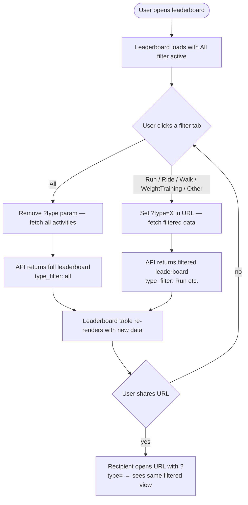

# SP1-T005 — Activity Type Filter

## Metadata
| Field | Value |
|-------|-------|
| **Sprint** | SP1 |
| **Points** | 3 |
| **Priority** | high |
| **Assignee** | - |
| **Requester** | Club organizer |
| **Status** | todo |

<!-- Required sections by points — 3pt:
  Problem Statement, ACs, Out of Scope, User Stories, Dependencies,
  Test Data, Rollout Strategy, Feature Flow, System Behavior, Business Rules, Success Metrics
-->

---

## Problem Statement

The leaderboard page (T004) shows a combined weekly ranking across all activity types. A member who only runs has no way to compare themselves against other runners — their stats are diluted by members who also ride or lift weights. The community needs the ability to filter the leaderboard by a single activity type to enable fair, like-for-like comparison and increase engagement per sport.

---

## Overview

Add a row of filter tabs to the public leaderboard page that lets any visitor narrow the leaderboard to a single activity type: **All | Run | Ride | Walk | Weight | Other**. "Weight" is the display label for the `WeightTraining` value stored in D1 — the `?type=WeightTraining` URL param is used when this tab is active. Selecting a tab refetches the leaderboard data with a `?type=` query param added to the existing `GET /api/leaderboard` endpoint (owned by T004, extended here). The selected filter is reflected in the URL (`?type=Run`) so the view is shareable. "All" is the default and matches the current T004 behavior.

---

## Feature Flow

---

## User Stories

| # | Story | Maps to AC |
|---|-------|-----------|
| US-1 | As a club member, I want to filter the leaderboard by activity type so that I can compare myself fairly against others who do the same sport. | AC-1, AC-2 |
| US-2 | As a public visitor, I want the selected filter to be visible in the URL so that I can share a filtered leaderboard view with others. | AC-3 |
| US-3 | As a public visitor, I want the leaderboard to default to "All" so that I see a complete overview when I first arrive. | AC-4 |
| US-4 | As a club member, I want all 5 activity types to be filterable so that every type of exercise gets fair representation. | AC-5 |

---

## System Behavior

| Trigger | System Response | Side Effects | Timing |
|---------|----------------|-------------|--------|
| User clicks a filter tab | URL updates to `/?type={type}` (or removes param for All); leaderboard data refetches | Browser history entry pushed | Sync (URL) + async (fetch) |
| Page loads with `?type=Run` in URL | "Run" tab highlighted; API called with `?type=Run`; leaderboard shows only running stats | None | On mount |
| Page loads with no `?type` param | "All" tab highlighted; API called without type param; full leaderboard shown | None | On mount |
| API receives `?type=Run` | Adds `WHERE activities.type = 'Run'` to weekly aggregation query | None | Sync |
| API receives invalid `?type=Cycling` | Returns `400 INVALID_TYPE` with valid type list | None | Sync |
| API receives `?type=all` or no param | Returns full leaderboard — no WHERE clause added | None | Sync |

---

## Acceptance Criteria

- [x] **AC-1: Filter tabs render on the leaderboard page**
  GIVEN the user opens the leaderboard page (any URL)
  WHEN the page finishes loading
  THEN a row of filter tabs is visible with labels: All, Run, Ride, Walk, Weight, Other
  AND the currently active tab is visually distinct (e.g. filled/underlined)

- [x] **AC-2: Selecting a filter updates the leaderboard data**
  GIVEN the user is on the leaderboard page with "All" active
  WHEN the user clicks "Run"
  THEN the leaderboard re-renders showing only members' running stats for the current week
  AND members with zero running activities in the current week are either hidden or show 0 km / 0 min / 0 cal

- [x] **AC-3: Selected filter is reflected in the URL**
  GIVEN the user is on the leaderboard page
  WHEN the user clicks the "Ride" tab
  THEN the URL updates to include `?type=Ride` without a full page reload
  AND if the user copies and opens that URL in a new tab, the "Ride" tab is pre-selected and the data is filtered

- [x] **AC-4: Default state is "All" with no URL param**
  GIVEN the user navigates to the leaderboard with no `?type` query param
  WHEN the page loads
  THEN the "All" tab is active
  AND the leaderboard shows combined stats across all activity types (matching T004 baseline behavior)

- [x] **AC-5: All 5 activity type filters return correct data**
  GIVEN at least one member has an activity of each type in the current week
  WHEN the user selects each of Run, Ride, Walk, WeightTraining, Other in turn
  THEN the leaderboard for each type shows only that type's activities
  AND the total_distance_km, total_duration_sec, total_calories, and activity_count for each member reflect only the selected type

- [x] **AC-6: Invalid type param is handled gracefully**
  GIVEN the user manually navigates to `/?type=InvalidType`
  WHEN the page loads
  THEN the API returns a 400 error
  AND the UI falls back to the "All" view and displays an inline notice that the filter was invalid

---

## Data & Business Rules

| Rule ID | Rule | Example | Applies to AC |
|---------|------|---------|--------------|
| R-1 | Valid type values are exactly: `Run`, `Ride`, `Walk`, `WeightTraining`, `Other` — case-sensitive, matching Strava API strings | `Run` is valid; `run`, `running`, `Cycling` are not | AC-2, AC-5, AC-6 |
| R-2 | `type=all` (lowercase) and omitting the param are treated identically — both return unfiltered results | `?type=all` behaves the same as no param | AC-4 |
| R-3 | The weekly time window (Monday 00:00:00 UTC – Sunday 23:59:59 UTC) and aggregation logic remain unchanged; only the WHERE clause for type is added | Changing filter does not change the week range | AC-2, AC-5 |
| R-4 | Members with zero activities for the selected type MAY be omitted from the result (the SQL GROUP BY will naturally exclude them if no matching rows exist) | A member who only rides will not appear on the Run leaderboard | AC-2 |
| R-5 | The `type_filter` field in the API response reflects the active filter value (`"all"` or the type string) | `{ "type_filter": "Run" }` | AC-2, AC-5 |
| R-6 | Sort order (by `total_distance_km DESC`) is preserved for filtered results | Filtered leaderboard is still ranked by km | AC-2, AC-5 |

---

## Success Metrics

- [ ] All 6 ACs pass end-to-end in a real browser with real D1 data
- [ ] Leaderboard refilters within 500ms of tab click (API response time)
- [ ] URL sharability confirmed: copied URL opens correct filtered view in incognito tab
- [ ] All 5 types return correct data (manual spot-check against D1 records)

---

## Rollout / Release Strategy

- **Strategy:** All-at-once — deployed with the leaderboard page
- **Feature flag name:** N/A — no feature flag required
- **Rollback plan:** Revert to previous T004 leaderboard page commit; the endpoint extension is backward-compatible (omitting `?type` restores original behavior)
- **Who gets it first:** All users (public dashboard, no auth required)

---

## Out of Scope

- Combining multiple type filters simultaneously (e.g. `?type=Run,Ride`) — single filter only
- Saving a user's preferred filter across sessions (no auth, no persistence)
- Adding new activity types not in the existing set of 5
- Monthly or all-time leaderboard filtering — weekly window only
- Any changes to the sync cron job, OAuth flow, or DB schema

---

## Dependencies

- **SP1-T004** (must be done / in-progress): `GET /api/leaderboard` endpoint and leaderboard page must exist before T005 can extend them
- **SP1-T001**: D1 schema with `activities.type` column must be in place (already satisfied by T001 prerequisite to T004)
- No external service dependencies beyond what T004 already uses

---

## Test Data / Seed Requirements

| What | Value / Setup | Who sets it up |
|------|---------------|----------------|
| D1 seed: members | At least 3 members in the `members` table | Developer (manual or seed script) |
| D1 seed: activities per type | At least 1 activity of each type (`Run`, `Ride`, `Walk`, `WeightTraining`, `Other`) with `activity_date` in the current ISO week for at least 1 member | Developer (manual INSERT or seed script) |
| D1 seed: mixed member | At least 1 member with activities of 2+ different types in the same week, to verify cross-type isolation | Developer |
| Invalid type test | No seed needed — navigating to `/?type=BadType` is sufficient | Tester |

---

## Review Summary

| Date | Result | Notes |
|------|--------|-------|
| 2026-03-24 | APPROVED | AC-1–AC-6 all implemented and tested. Route validation logic consolidated from two blocks into a single clear if/else-if/else. No critical issues. |

| AC | Status | Note |
|----|--------|------|
| AC-1 | ✓ | FilterTabs renders 6 tabs with active class; wired into LeaderboardPage (FE-T016–T018, FE-T025) |
| AC-2 | ✓ | Fetch URL includes ?type= param; SQL WHERE clause added; BE integration tests confirm type isolation (BE-T070–T078) |
| AC-3 | ✓ | Tab clicks call router.push with correct URL params (FE-T026, FE-T027) |
| AC-4 | ✓ | null activeType → no ?type= in fetch; All tab active; backward compat confirmed (FE-T024, BE-T073) |
| AC-5 | ✓ | All 5 types tested individually via integration tests with real SQLite (BE-T070–T078) |
| AC-6 | ✓ | API returns 400 INVALID_TYPE; FE shows inline "Unknown filter type" banner (FE-T028, BE-T079–T081) |

---

## Definition of Done

**"Done" means correct — not just complete.**

### Functional Correctness
- [ ] Every AC passes — verified in a real browser against a real API and real D1 database
- [ ] AC-6 (invalid type) shows fallback behavior — not a blank page or unhandled error
- [ ] No AC is "assumed passing" — each one has a passing E2E test to prove it

### Test Coverage
- [ ] Unit tests for FilterTabs component written and green
- [ ] Unit tests for API type validation written and green
- [ ] Integration test for filtered SQL query written and green (real D1 / local D1 emulator)
- [ ] E2E test for each filter type written and green
- [ ] No test is skipped, commented out, or marked `.only`

### Quality Gates
- [ ] No console errors or warnings in the browser during tab switching
- [ ] Leaderboard re-renders within 500ms of tab click
- [ ] No regression in T004's unfiltered leaderboard behavior
- [ ] Code reviewed against ACs

### Delivery
- [ ] Deployed to staging and smoke-tested end-to-end
- [ ] BACKLOG.md updated to `done`
