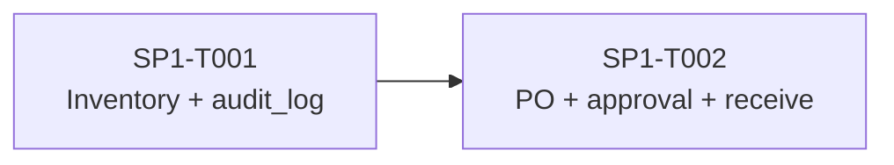
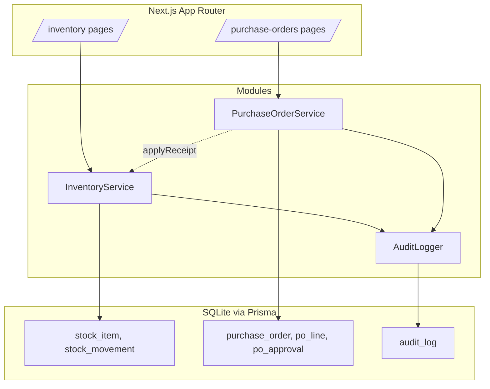

# SP1 — ERP Inventory + Purchase Order Slice (v1)

## Metadata
| Field | Value |
|-------|-------|
| **Sprint** | SP1 |
| **Status** | active |
| **Origin** | docs/discovery/disc-001-erp-inventory-and-purchase-order.md |
| **Start Date** | 2026-05-05 |
| **End Date** | (TBD — workflow-test sprint) |
| **Team** | Workflow-template smoke-test (single dev) |
| **Epic Owner** | Simulated user |

## Team Capacity
| Person | Available days | Notes |
|--------|---------------|-------|
| Sole dev | n/a | Workflow-test pace, not real velocity |

- **Total SP committed:** 10 (2 × 5 pt tasks)
- **Buffer:** N/A — meta-test sprint

## Problem Statement

A mid-sized company tracks inventory and purchase orders in two disconnected spreadsheets. Stock counts drift, POs get approved without visibility into current stock or remaining budget, and there is no audit trail. This sprint delivers a v1 ERP slice (Inventory + Purchase Order with finance approval) under `tmp/erp-test/` that establishes a single source of truth, an approval workflow, and an audit log — using Approach A from disc-001 (two domain modules sharing a common `audit_log` table).

## Goals
1. Single source of truth for stock levels (replace warehouse spreadsheet).
2. Enforce PO approval workflow with a ฿5,000 threshold (replace email approval).
3. Append-only audit log covering stock movements and PO state changes.

## Success Metrics
| Metric | Target | Measurement |
|--------|--------|-------------|
| Stock-count discrepancy | < 2 % / month | Cycle-count vs system query (deferred — measured post-deploy in real use) |
| PO approval enforcement | 100 % of POs ≥ ฿5K require approval before APPROVED | DB query in `/testing`: `SELECT COUNT(*) FROM purchase_order WHERE total_thb >= 5000 AND status = 'APPROVED' AND id NOT IN (SELECT po_id FROM po_approval)` must return 0 |
| Audit completeness | 100 % of stock movements + PO state changes have audit-log row | DB query: `count(stock_movement) == count(audit_log WHERE entity_type='stock_movement')` |
| Counter — PO creation time | ≤ 90 s for typical PO | Manual timing in `/testing` smoke run |

## Design References
- No Figma — minimal Tailwind defaults per disc-001 §8.

## Scope

### In Scope
- Stock items: create, list, view detail.
- Stock movements: receipt (+), adjustment (±) with reason code, hard guard against negative stock.
- Purchase orders: create with header + lines, list, view detail.
- PO state machine: `DRAFT → PENDING_APPROVAL → APPROVED | REJECTED → RECEIVED`. Auto-transition to `APPROVED` if total < ฿5,000.
- Finance approval queue + approve/reject action.
- Warehouse "mark received" action that auto-increments stock and appends audit row.
- Append-only `audit_log` shared by both modules (introduced in T001, consumed by T002).

### Out of Scope
- Authentication / RBAC (role is selected by query string `?role=warehouse|purchasing|finance` for v1).
- Real currency / FX (THB only, integer baht — no decimals).
- Supplier catalog, multi-warehouse, GL posting.
- Reporting, dashboards, mobile-specific UI.
- Configurable approval threshold (hard-coded ฿5,000 for v1).

## Stories

| Task ID | User Story | Type | Depends On | Points | Status |
|---------|-----------|------|------------|--------|--------|
| SP1-T001 | As a warehouse staffer, I want to register stock items and record receipts/adjustments so that the system holds a single source of truth for stock levels with a full audit trail. | feat | — | 5 | `todo` |
| SP1-T002 | As a purchasing officer, I want to raise purchase orders that route to finance for approval when total ≥ ฿5,000 and that auto-increment stock when warehouse marks them received, so that approvals are auditable and stock stays in sync with PO activity. | feat | SP1-T001 | 5 | `todo` |

### E2E Validation Scenarios

**SP1-T001 — Inventory + Audit Log**
1. GIVEN no stock items exist
   WHEN warehouse user creates SKU "WIDGET-A" and records a receipt of 50 units
   THEN the stock list shows WIDGET-A with on-hand 50, and audit log contains one `STOCK_ITEM_CREATED` row and one `STOCK_RECEIVED` row.
2. GIVEN WIDGET-A has on-hand 50
   WHEN warehouse user records an adjustment of −10 with reason "damage"
   THEN the stock list shows WIDGET-A on-hand 40, and audit log contains a `STOCK_ADJUSTED` row with `reason="damage"`.
3. GIVEN WIDGET-A has on-hand 0
   WHEN warehouse user attempts an adjustment of −5
   THEN the system rejects with error "stock cannot go negative", on-hand stays at 0, and no audit row is appended.

**SP1-T002 — Purchase Orders + Approval + Receipt**
1. GIVEN WIDGET-A exists with on-hand 0
   WHEN purchasing officer creates a PO for WIDGET-A × 10 @ ฿200 (total ฿2,000)
   THEN the PO is created with status `APPROVED` (under threshold), audit log contains `PO_CREATED` and `PO_AUTO_APPROVED` rows.
2. GIVEN WIDGET-A exists
   WHEN purchasing officer creates a PO for WIDGET-A × 100 @ ฿100 (total ฿10,000)
   THEN the PO is created with status `PENDING_APPROVAL`, finance approval queue lists this PO, audit log contains `PO_CREATED`.
3. GIVEN a PO is `PENDING_APPROVAL`
   WHEN finance user clicks Approve
   THEN PO status transitions to `APPROVED`, audit log appends `PO_APPROVED` with the approver ID.
4. GIVEN a PO is `APPROVED` with WIDGET-A × 10 and on-hand currently 0
   WHEN warehouse user clicks "Mark Received" on the PO
   THEN PO status becomes `RECEIVED`, on-hand for WIDGET-A becomes 10, audit log appends `PO_RECEIVED` and `STOCK_RECEIVED` rows.

## Architecture Overview

## Architecture Decision Records

### ADR-1: Two domain modules sharing audit_log
- **Status:** accepted
- **Context:** Discovery (disc-001) selected Option A — separate `inventory/` and `purchase-order/` modules with a shared audit table.
- **Decision:** SP1-T001 introduces `audit_log` table, schema, and `AuditLogger` service. SP1-T002 reuses both — does not redefine. Cross-module call goes through `InventoryService.applyReceipt(poLineId, qty)` (one explicit interface).
- **Consequences:** Schema must accommodate both `stock_movement` and `po_*` entity references — a generic `entity_type` + `entity_id` pair satisfies both.

### ADR-2: Hard-coded approval threshold for v1
- **Status:** accepted
- **Context:** Out-of-scope per disc-001 §15 to make threshold configurable.
- **Decision:** Threshold lives in `lib/config.ts` as `APPROVAL_THRESHOLD_THB = 5000`. Single source, easy to change later.
- **Consequences:** No DB migration when threshold changes — code change only.

### ADR-3: Role selection via query string for v1
- **Status:** accepted
- **Context:** No auth in scope.
- **Decision:** Role read from URL `?role=warehouse|purchasing|finance`. Default `warehouse`. Pages render role-appropriate actions.
- **Consequences:** Trivial role-spoof in v1 (acceptable for sandbox); replaced by real auth in v2.

## Technical Constraints
- TypeScript · Node 22 · `better-sqlite3` (real SQLite) · Vitest. *(Deviation from disc-001 §8 — see Change Log entry 2026-05-05 #2.)*
- "FE" layer in this slice = thin presenter functions returning serializable view models, exercised by Vitest under the `[FE]` test split. No browser runtime — out of scope for the workflow-test sandbox.
- All code lives in `tmp/erp-test/`.
- THB integer only (no decimals, no FX).
- Tests must use real SQLite (not mocked) per `.claude/rules/testing.md`.

## Risks & Mitigations
| Risk | Likelihood | Impact | Mitigation |
|------|-----------|--------|------------|
| audit_log schema doesn't fit PO entities once T001 ships | med | med | Design generic `entity_type` + `entity_id` in T001 with PO entity types pre-listed in design doc |
| Cross-module dep in T002 (`applyReceipt`) leaks Inventory internals | med | low | Define `InventoryService` interface in T001; T002 only consumes the interface |
| SP1-T002 too large at 5pt | low | med | Re-evaluate after T001 ships; split if velocity shows otherwise |
| Scope creep into supplier / GL / multi-warehouse | high | high | Out-of-scope list in §Scope; reject in `/requirement` |

## Definition of Done (Sprint Level)
- [ ] SP1-T001 done: stock item + movement + audit log working, all E2E scenarios pass
- [ ] SP1-T002 done: PO + approval + receive working, all E2E scenarios pass
- [ ] All 3 sprint Goals observably achieved (stock SoT, approval enforcement, audit log)
- [ ] All 4 success metrics have an actual result recorded in `/testing` outputs
- [ ] Full regression suite passes (`pnpm test` + `pnpm test:e2e`)
- [ ] Sprint retro written (`docs/sprints/SP1/SP1-retro.md`)

## Change Log
| Date | Change | Reason | Impact | Decided by |
|------|--------|--------|--------|------------|
| 2026-05-05 | Sprint created from disc-001 (Approach A) | Workflow-test sprint | 2 tasks, 10 pts | Simulated user |
| 2026-05-05 | Tech stack simplified: dropped Next.js + Prisma in favour of pure TS + Node + better-sqlite3 + Vitest | Workflow-test goal is to exercise the workflow E2E, not Next.js bootstrap. Real DB + real tests preserved. UI layer becomes presenter functions (still split into [FE] vs [BE] for the multi-agent test) | None on AC coverage; "FE" tests now run in Node, not browser | Simulated user (workflow-test owner) |
