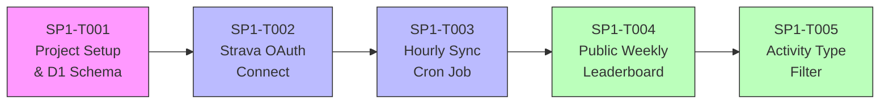
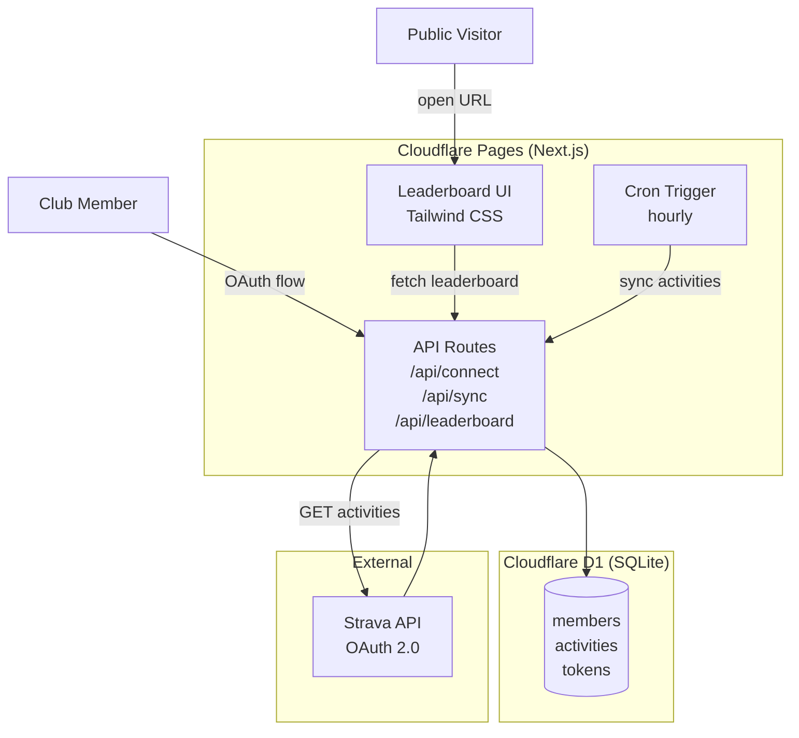

# SP1 — Strava Community Leaderboard — v1

## Metadata
| Field | Value |
|-------|-------|
| **Sprint ID** | SP1 |
| **Status** | planning |
| **Start Date** | 2026-03-24 |
| **End Date** | TBD |
| **Team** | Solo (club organizer / developer) |
| **Epic Owner** | - |

## Team Capacity
| Person | Available days | Notes |
|--------|---------------|-------|
| Developer | TBD | No deadline — iterative delivery |

- **Total SP committed:** 21 pts (T001:3 + T002:5 + T003:5 + T004:5 + T005:3)
- **Buffer:** 20%
- **Over-committed?** no

## Problem Statement

สมาชิกชมรม 20 คนออกกำลังกายและบันทึกผ่าน Strava แต่ไม่มี dashboard รวมที่ทุกคนเห็นได้ ทำให้ขาดแรงจูงใจจากการแข่งขันที่เป็นมิตร เป้าหมายคือสร้าง leaderboard สาธารณะที่ดึงข้อมูลจริงจาก Strava แสดงอันดับรายสัปดาห์

## Goals
1. สมาชิกสามารถ connect Strava และให้สิทธิ์ app ผ่าน OAuth flow ได้เอง
2. ระบบ sync activities จาก Strava อัตโนมัติทุก 1 ชั่วโมง เก็บใน Cloudflare D1
3. Dashboard สาธารณะแสดง weekly leaderboard (km, calories, time) แยกตาม activity type ได้

## Success Metrics
| Metric | Target | Measurement |
|--------|--------|-------------|
| สมาชิก connect Strava ได้สำเร็จ | 20/20 คน | Count records in D1 members table |
| ข้อมูลล่าช้าไม่เกิน 1 ชั่วโมง | ≤ 60 min | Check last_synced_at timestamp |
| Dashboard โหลดได้ไม่ต้อง login | 100% | Manual check public URL |
| ค่าใช้จ่าย | $0 | Cloudflare Pages free tier |

## Design References
- Figma: TBD
- Prototype: TBD

## Scope

### In Scope
- Next.js app scaffold + Cloudflare D1 schema + deploy pipeline
- Strava OAuth 2.0 member connect flow (self-service)
- Hourly cron job sync activities → D1 (with token refresh)
- Weekly leaderboard dashboard: name, avatar, total km, calories, time
- Filter by activity type: Run, Ride, Walk, Weight, Other
- Public URL — ไม่ต้อง login

### Out of Scope
- Monthly / all-time leaderboard
- Streak tracking, badges, achievements
- GPS route visualization
- Non-Strava integrations
- Member-only private dashboard

## Sub-tasks

| Task ID | Title | Type | E2E Scenario | Depends On | Points | Status |
|---------|-------|------|--------------|------------|--------|--------|
| SP1-T001 | Project Setup + Cloudflare D1 Schema | infra | Dev runs `npm run dev`, app loads; D1 migrations run; Cloudflare Pages deploy succeeds | — | 3 | `todo` |
| SP1-T002 | Strava OAuth Member Connect | fullstack | สมาชิกเปิด /connect → authorize Strava → redirected back → name + avatar stored in D1 | SP1-T001 | 5 | `todo` |
| SP1-T003 | Hourly Activity Sync Cron Job | fullstack | Cron triggers → fetches activities for all members → stored in D1 → token auto-refreshed if expired | SP1-T002 | 5 | `todo` |
| SP1-T004 | Public Weekly Leaderboard Dashboard | fullstack | Anyone opens public URL → sees weekly ranking: member name, avatar, total km, calories, time | SP1-T003 | 5 | `todo` |
| SP1-T005 | Activity Type Filter | fullstack | User selects "Run" → leaderboard updates to show only running stats; all 5 types work | SP1-T004 | 3 | `todo` |

## Architecture Overview

## Architecture Decision Records

### ADR-1: Cloudflare D1 over local SQLite
- **Status:** accepted
- **Context:** Cloudflare Pages ไม่รองรับ local file SQLite; ต้องการ persistent DB บน edge
- **Decision:** ใช้ Cloudflare D1 (SQLite-compatible) อยู่ใน free tier
- **Consequences:** ต้องใช้ D1 SDK; schema migrations ผ่าน `wrangler d1 migrations`

### ADR-2: Hourly polling แทน Strava Webhook
- **Status:** accepted
- **Context:** Strava Webhook ต้องการ public HTTPS endpoint validation; ซับซ้อนกว่า
- **Decision:** ใช้ Cloudflare Cron Trigger ทุก 1 ชั่วโมง — simple, reliable, free tier
- **Consequences:** ข้อมูลล่าช้าสูงสุด 1 ชั่วโมง (acceptable per requirement)

## Technical Constraints
- Next.js บน Cloudflare Pages — ใช้ Edge Runtime
- Cloudflare D1 free tier: 5 GB, 25M reads/day, 50k writes/day
- Strava API: 100 req/15min, 1000 req/day — 20 คน × 24 syncs = 480 req/day ✓
- Strava token expires every 6 hours — ต้องมี auto-refresh

## Risks & Mitigations
| Risk | Likelihood | Impact | Mitigation |
|------|-----------|--------|------------|
| Strava token refresh ล้มเหลว | med | high | Implement refresh before each sync; log errors |
| Cloudflare D1 SDK API เปลี่ยน | low | med | Pin wrangler version |
| สมาชิกไม่ยอม authorize OAuth | med | med | อธิบาย read-only scope ก่อนส่ง link |
| Cron job timeout (free tier 30s limit) | low | med | Sync members in batches |

## Definition of Done (Sprint Level)

### Completeness
- [ ] All sub-tasks (T001–T005) are `done`
- [ ] Every in-scope item from disc-001 is covered

### Correctness
- [ ] All 3 sprint Goals observably achieved
- [ ] All Success Metrics show actual results
- [ ] No P0/P1 bugs open
- [ ] Full test suite passes

### Delivery
- [ ] Deployed to Cloudflare Pages (production URL live)
- [ ] Smoke-tested end-to-end with real Strava data
- [ ] Sprint retro written

## Change Log
| Date | Change | Reason | Impact | Decided by |
|------|--------|--------|--------|------------|
| 2026-03-24 | Sprint created | /new-sprint | — | Developer |
