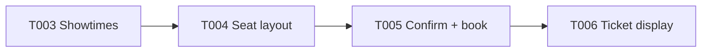
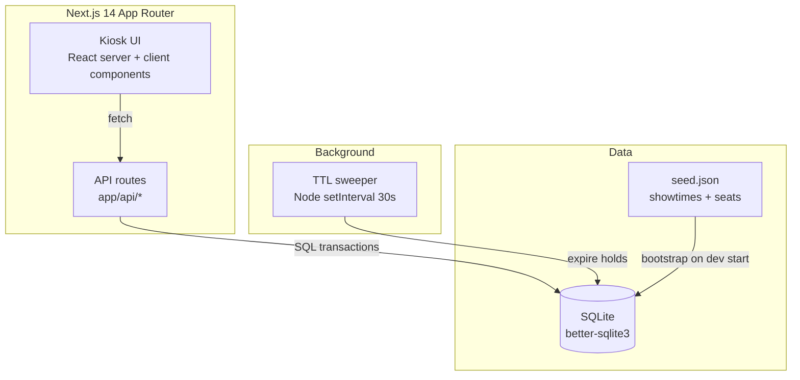

# SP2 — Kiosk Customer Booking Flow (v1)

## Metadata
| Field | Value |
|-------|-------|
| **Sprint** | SP2 |
| **Status** | planning |
| **Origin** | docs/discovery/disc-002-kiosk-ticket-booking.md |
| **Start Date** | 2026-05-07 |
| **End Date** | (test-drive sprint — not executed) |
| **Team** | Workflow-template smoke-test (single dev) |
| **Epic Owner** | Simulated user |

## Team Capacity
| Person | Available days | Notes |
|--------|---------------|-------|
| Sole dev | n/a | Workflow-test pace, not real velocity |

- **Total SP committed:** 16 (3+5+5+3)
- **Buffer:** N/A — meta-test sprint

## Problem Statement

Walk-in customers queue at the staffed counter to buy tickets. Per disc-002 the v1 kiosk slice must let a guest customer self-serve a single-show, single-ticket reservation in ≤ 90s — choose showtime → pick a seat from a visual layout → enter a name → receive a ticket with a QR code. No login, no payment, no admin UI in v1. Built under `tmp/kiosk-test/` with Next.js 14 + TypeScript + SQLite (better-sqlite3).

## Goals
1. Self-serve booking flow runs end-to-end on touch UX (≥ 48px targets, no hover).
2. Zero double-bookings even with two kiosks selecting the same seat at the same instant.
3. Tentatively-held seats auto-release after 60s of inactivity (TTL).

## Success Metrics

Per `.claude/rules/metric-instrumentation.md` Gate 1 — every row names a concrete data source, query, and the task that produces it.

| Metric | Target | Measurement (artifact + query + owning task) |
|--------|--------|-----------------------------------------------|
| Time-to-ticket (median) | ≤ 90s | `audit_log` rows with `event='session_started'` and `event='ticket_issued'` (joined on `session_id`); query: `SELECT median(t2.ts - t1.ts) FROM audit_log t1 JOIN audit_log t2 USING (session_id) WHERE t1.event='session_started' AND t2.event='ticket_issued'`. Owner: SP2-T006 emits `ticket_issued`; SP2-T003 emits `session_started`. |
| Double-booking incidents | 0 | `bookings` table; query: `SELECT showtime_id, seat_id, COUNT(*) FROM bookings WHERE status='booked' GROUP BY 1,2 HAVING COUNT(*) > 1`. Owner: SP2-T005 (creates the row + enforces the unique constraint). |
| Stale seat-hold release | 100% within 65s | `audit_log` rows with `event='hold_released'`; query: `SELECT COUNT(*) FROM audit_log WHERE event='hold_released' AND (release_ts - hold_ts) > 65`. Target = 0 violations. Owner: TTL sweeper (infra inside SP2-T004). |

## Design References
- None for v1 — UI follows reference wireframes inside the requirement docs (one per task).

## Scope

### In Scope
- Showtime listing screen (touch-friendly grid)
- Seat layout screen (visual, available/held/booked states)
- Confirmation screen (name input + ticket preview)
- Ticket screen (QR code + show details)
- Seed JSON for showtimes (no admin UI)
- Seat-hold TTL (60s) with auto-release

### Out of Scope (v1, deferred)
- Payment integration
- Admin web UI for showtime creation
- User accounts / login / history
- Multi-venue
- Email/SMS confirmation
- Real QR validation at entry
- Group bookings (> 1 seat per session)

## Stories

| Task ID | User Story | Type | Depends On | Points | Status |
|---------|-----------|------|------------|--------|--------|
| SP2-T003 | As a walk-in customer, I want to see today's available showtimes on a touch-friendly list so that I can pick the show I want without staff help. | feat | — | 3 | `todo` |
| SP2-T004 | As a walk-in customer, I want to see the seat layout for my chosen showtime with available/held/booked seats clearly distinguished so that I can pick a free seat. | feat | SP2-T003 | 5 | `todo` |
| SP2-T005 | As a walk-in customer, I want to enter my name and confirm my held seat so that the system creates a booking and atomically transitions the seat from held to booked with no double-bookings. | feat | SP2-T004 | 5 | `todo` |
| SP2-T006 | As a walk-in customer, I want to see my ticket with a scannable QR code on the kiosk screen after confirming so that I can show it at entry. | feat | SP2-T005 | 3 | `todo` |

### E2E Validation Scenarios

**SP2-T003 — Showtimes**
1. GIVEN seed data has 5 showtimes today, 2 fully booked
   WHEN customer opens the kiosk
   THEN all 5 showtimes are listed; the 2 fully-booked ones show a "Sold out" badge and are not tappable
2. GIVEN no showtimes scheduled for today
   WHEN customer opens the kiosk
   THEN the screen shows "No shows today" and a Help label

**SP2-T004 — Seat layout**
1. GIVEN customer tapped a non-sold-out showtime
   WHEN the seat layout loads
   THEN available seats are green, held seats are yellow, booked seats are gray; only available seats are tappable
2. GIVEN customer taps an available seat
   WHEN the tap completes
   THEN the seat shows yellow ("Held for you, 60s") with a visible countdown; tapping a different available seat moves the hold

**SP2-T005 — Confirm + book**
1. GIVEN customer is holding seat A5 with 45s left on TTL
   WHEN customer enters name "Somchai" and taps Confirm
   THEN within 1s a booking row exists with status `booked` for (showtimeId, A5); the seat is no longer in the held list
2. GIVEN two kiosks both selected seat A5 at the same instant
   WHEN both tap Confirm within 100ms
   THEN exactly one booking succeeds; the other gets a "Seat taken — please pick another" error and is bounced back to T004

**SP2-T006 — Ticket display**
1. GIVEN customer just confirmed booking
   WHEN the ticket screen loads
   THEN a QR code is visible (≥ 200×200 px), encoding the bookingId, alongside show name, time, seat, and customer name
2. GIVEN customer taps "Done" on the ticket screen
   WHEN the action fires
   THEN the kiosk resets to T003 (showtimes list) within 500ms

## Architecture Overview

## Architecture Decision Records

### ADR-1: Reservation lifecycle = available → held → booked

- **Status:** accepted
- **Context:** Two kiosks could pick the same seat in parallel. We need a state machine that prevents double-booking without forcing a heavyweight queue.
- **Decision:** Three states. `available` is default. A tap on the seat layout creates a `seat_hold` row scoped to a session ID with a 60s expiry. A confirm transitions the hold + writes a `booking` row inside a single SQLite transaction with a unique constraint on `(showtime_id, seat_id, status='booked')`. TTL sweeper releases stale holds.
- **Consequences:** + simple, no extra infra. + DB enforces uniqueness so "winner" is deterministic. − requires periodic sweeper; missed sweep = seat held longer than 60s (tolerable). − session ID lives in cookie/localStorage; if cleared mid-flow, the customer loses their hold (acceptable for a kiosk).

### ADR-2: SQLite over JSON file

- **Status:** accepted
- **Context:** `disc-002` accepted SQLite. Confirming why over a JSON store.
- **Decision:** SQLite via better-sqlite3 — synchronous, in-process, single-file, supports the transactional unique-constraint check that ADR-1 requires.
- **Consequences:** + transactions + indexes for free. + persistence across restarts (vs in-memory). − single-host only; if we go multi-kiosk-with-shared-DB later, swap to Postgres / Mongo (revisit at that scope decision).

### ADR-3: QR encodes bookingId only (not full ticket payload)

- **Status:** accepted
- **Context:** Real QR validation is out of v1, but the QR has to be useful when validation lands.
- **Decision:** Encode just `booking:<bookingId>` (UUID). Validation (out of v1) will look up by ID server-side.
- **Consequences:** + small QR (high contrast, fast to scan). + revoking a booking simply sets status; QR doesn't need re-issue. − leaks no PII even if QR photographed.

## Technical Constraints

- All under `tmp/kiosk-test/` per disc-002 sandbox decision
- Touch UX: minimum tap target 48×48 px, no hover-only states, single primary action per screen
- TypeScript strict; no `any` outside generated types
- Tests: Vitest (unit + integration with real SQLite), Playwright (e2e for the four E2E scenarios above)
- TDD: every AC has a row in the requirement doc's test plan before code is written (per `.claude/rules/testing.md`)

## Risks & Mitigations

| Risk | Likelihood | Impact | Mitigation |
|------|-----------|--------|------------|
| Concurrent seat selection → double booking | Med | High | DB unique constraint + transaction (ADR-1); E2E test SP2-T005 case 2 |
| Customer abandons mid-flow → seat held forever | High | Med | 60s TTL + sweeper job (ADR-1) |
| SQLite file lock under burst load | Low | Med | Better-sqlite3 is in-process; single Node instance — acceptable for single-kiosk v1 |
| Long names break ticket layout | Low | Low | Server-side cap at 60 chars; truncate-with-ellipsis on display |

## Definition of Done (Sprint Level)
- [ ] All 4 stories `done`
- [ ] Sprint Goals 1–3 demonstrably achieved (manual run-through + automated test evidence)
- [ ] Success Metrics: time-to-ticket measured on a real run; 0 double-bookings in a stress test (50 concurrent confirms on the same seat); TTL sweep verified
- [ ] Full Vitest + Playwright suites pass with 0 failures
- [ ] Sprint retro written

## Change Log
| Date | Change | Reason | Impact | Decided by |
|------|--------|--------|--------|------------|
| 2026-05-07 | Sprint created | `/dev` Stage 2 of test-drive run | n/a | Autopilot pipeline (`/dev`) |
