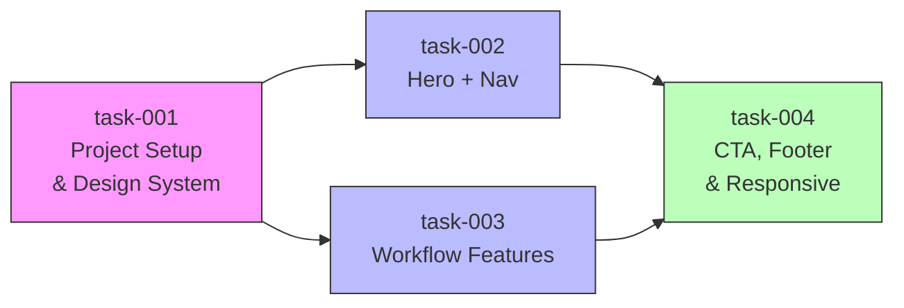

# sprint-01 — Landing Website (Claude Code Workflow)

## Metadata
| Field | Value |
|-------|-------|
| **Sprint ID** | sprint-01 |
| **Status** | planning |
| **Start Date** | 2026-03-18 |
| **End Date** | - |
| **Team** | - |
| **Epic Owner** | - |

## Problem Statement
บริษัท tech ไม่มี landing website สำหรับแนะนำตัวเองต่อลูกค้า — ต้องการสร้าง static landing page ด้วย HTML/CSS ที่แนะนำ Claude Code workflow พร้อม design สีส้มสไตล์ Claude Code

## Goals
1. มี landing page ที่ deploy แล้วเข้าถึงได้
2. แสดง Claude Code workflow อย่างชัดเจนและน่าสนใจ
3. ทดสอบ Claude Code workflow ครบทุก step

## Success Metrics
| Metric | Target | Measurement |
|--------|--------|-------------|
| หน้าเว็บ load ได้ | < 2s | Chrome DevTools |
| Responsive | ใช้งานได้บน mobile/tablet/desktop | Manual test |
| Workflow ครบ | ผ่านทุก step discovery → retro-sprint | Checklist |

## Design References
- Color: Orange (`#E97F45` / Claude Code brand orange)
- Stack: HTML, CSS (no framework), vanilla JS (ถ้าจำเป็น)
- Discovery doc: `docs/discovery/disc-001-landing-website.md`

## Scope

### In Scope
- Hero section + navigation header
- Claude Code workflow features section
- CTA + footer
- Responsive layout (mobile / tablet / desktop)

### Out of Scope
- Backend / server
- CMS
- User authentication
- Blog section
- Multi-language

## Sub-tasks

| Task ID | Title | Depends On | Status |
|---------|-------|------------|--------|
| task-001 | Project setup & design system | — | `todo` |
| task-002 | Hero section + navigation | task-001 | `todo` |
| task-003 | Workflow features section | task-001 | `todo` |
| task-004 | CTA, footer & responsive polish | task-002, task-003 | `todo` |

## Technical Constraints
- Pure HTML/CSS — ไม่ใช้ framework
- ไม่มี build step (ไฟล์เปิดตรงจาก browser ได้)

## Risks & Mitigations
| Risk | Likelihood | Impact | Mitigation |
|------|-----------|--------|------------|
| ไม่มี content พร้อม | med | med | ใช้ placeholder content ก่อน แล้วเติมทีหลัง |
| scope creep | low | low | ยึดตาม In Scope อย่างเคร่งครัด |

## Definition of Done (Sprint Level)
- [ ] All sub-tasks are `done`
- [ ] All success metrics are instrumented and verified
- [ ] Deployed to production
- [ ] Sprint retro written
