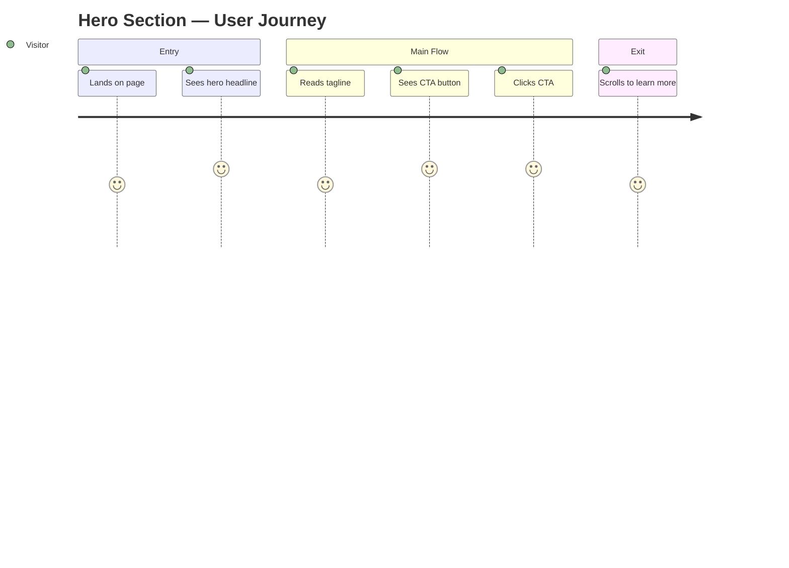
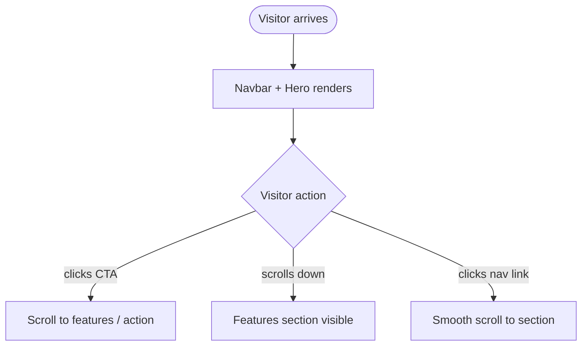

# task-002 — Frontend Design

## Metadata
| Field | Value |
|-------|-------|
| **Requirement** | `docs/sprints/sprint-01/task-002/task-002-requirement.md` |
| **Assignee** | - |
| **Status** | draft |

## Design References
- Inherits CSS variables from task-001
- Orange CTA: `var(--color-primary)` = `#E97F45`

## UI/UX Overview
<!-- Fill in with /fe-design sprint-01 task-002 -->
Navigation + Hero section สำหรับ landing page Claude Code workflow

## User Journey Map

**Entry point:** Direct URL / search / link
**Exit point:** Scroll down to features section หรือ click CTA

## Behavior Mapping

## Routing & Navigation
| Route | Component | Auth required | Notes |
|-------|-----------|---------------|-------|
| `/` | `index.html` | no | Single-page, anchor links |

## Component Breakdown
| Component | File path | Type | Description |
|-----------|-----------|------|-------------|
| `<nav>` | `index.html` | new | Sticky navbar with logo + links |
| `.hero` | `index.html` | new | Full-width hero with H1, subheadline, CTA |
| `.btn-primary` | `styles/main.css` | new | Orange CTA button with hover state |

## State & Data Flow
None — static HTML/CSS.

## API Contracts Consumed
None.

## Loading & Skeleton States
| State | Behavior |
|-------|----------|
| Initial load | Content visible immediately (no async) |

## Responsive Behavior
| Breakpoint | Behavior |
|------------|----------|
| Mobile (< 768px) | Hamburger menu, hero text centered, smaller H1 |
| Tablet (768–1024px) | Same as mobile or condensed layout |
| Desktop (> 1024px) | Full navbar, large hero, centered layout |

## Analytics Events
| Event name | Trigger | Payload |
|------------|---------|---------|
| `cta_hero_click` | Click CTA button | `{}` |

## Performance Considerations
- Inline critical CSS สำหรับ above-the-fold content

## TDD Test Plan
| Test Case | AC | Type | Description |
|-----------|----|------|-------------|
| Navbar renders with links | AC-1 | manual | Visual check |
| Hero H1 + subheadline visible | AC-2 | manual | Visual check |
| CTA button is orange | AC-3 | manual | Color check |
| Navbar sticks on scroll | AC-4 | manual | Scroll test |
| Mobile layout correct | AC-5 | manual | Resize browser |

## Edge Cases & Error States
- Long text: ensure headline ไม่ overflow บน mobile

## Accessibility Notes
- `<nav>` ต้องมี `aria-label="Main navigation"`
- CTA button ต้องมี descriptive text (ไม่ใช่แค่ "Click here")
- Color contrast สีส้มบน dark bg ต้องผ่าน WCAG AA
