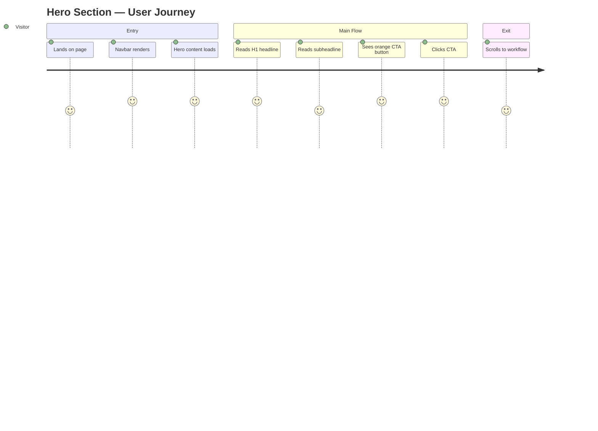
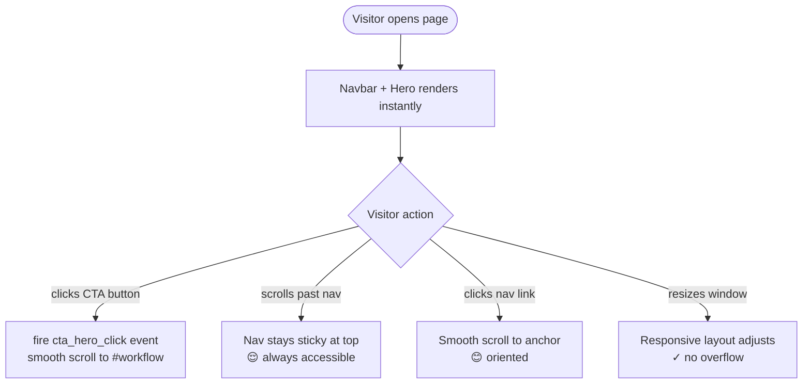

# task-002 — Frontend Design

## Metadata
| Field | Value |
|-------|-------|
| **Requirement** | `docs/sprints/sprint-01/task-002/task-002-requirement.md` |
| **Assignee** | - |
| **Status** | ready |

---

## Design References

No Figma — design derived from brand tokens defined in task-001.

| Element | Value |
|---------|-------|
| Nav background | `var(--color-bg)` = `#1A1A1A` with bottom border `var(--color-border)` |
| Nav text | `var(--color-text)` = `#FFFFFF` |
| Nav active/hover | `var(--color-primary)` = `#E97F45` |
| Hero background | dark gradient: `#1A1A1A` → `#242424` |
| Hero H1 | `var(--font-size-5xl)` / `var(--font-weight-bold)` / white |
| Hero subheadline | `var(--font-size-xl)` / `var(--font-weight-regular)` / `var(--color-text-muted)` |
| CTA button | bg `#E97F45`, text white, hover bg `#C96A30`, radius `var(--border-radius-md)` |
| CTA padding | `var(--space-4)` `var(--space-8)` |

---

## UI/UX Overview

Two components delivered in this task:

**1. `<nav>` — Sticky navigation bar**
- Fixed to top, full width, dark background with bottom border
- Left: brand logo text "Claude Code"
- Right: anchor links — "Workflow", "Features", "Get Started"
- On mobile: links collapse (hidden via CSS), hamburger icon shown (JS-free: toggle via checkbox hack or `<details>`)

**2. `.hero` — Full-viewport hero section**
- Centered content, dark background with subtle gradient
- `<h1>`: "Ship Faster with Claude Code"
- Subheadline `<p>`: "A structured workflow for AI-assisted development — from discovery to retrospective."
- Primary CTA button: "Explore the Workflow" → smooth scrolls to `#workflow` section (task-003)
- Decorative: subtle orange accent line or glow under H1 using `border-bottom` or `text-shadow`

---

## User Journey Map



**Entry point:** Browser opens `index.html` (direct, search, or link)
**Exit point:** CTA click → smooth scroll to `#workflow`, or manual scroll

---

## Behavior Mapping



**Key behavioral goals:**
- CTA must be visible without scrolling on all breakpoints (above the fold)
- Nav links must always be reachable — sticky ensures this
- Hover state on CTA provides immediate feedback — reinforces clickability

---

## Routing & Navigation

| Route | Component | Auth required | Notes |
|-------|-----------|---------------|-------|
| `/` | `index.html` | no | Single-page static site |
| `/#workflow` | `.workflow-section` | no | Anchor — task-003 delivers the target |
| `/#footer` | `footer` | no | Anchor — task-004 delivers the target |

---

## Component Breakdown

| Component | File path | Type | Description |
|-----------|-----------|------|-------------|
| `<nav class="navbar">` | `index.html` | new | Sticky top bar — logo + links |
| `.navbar__logo` | `index.html` | new | Brand name "Claude Code" as `<a>` |
| `.navbar__links` | `index.html` | new | `<ul>` of anchor links |
| `.navbar__toggle` | `index.html` | new | Checkbox-based mobile toggle (no JS) |
| `<section class="hero">` | `index.html` | new | Full-height hero section |
| `.hero__headline` | `index.html` | new | `<h1>` with main tagline |
| `.hero__subheadline` | `index.html` | new | `<p>` descriptor text |
| `.btn-primary` | `styles/main.css` | new | Orange CTA button + hover + active states |
| `.navbar` styles | `styles/main.css` | new | Sticky, flex, border-bottom, z-index |
| `.hero` styles | `styles/main.css` | new | Min-height, flex center, gradient bg |
| Responsive rules | `styles/main.css` | new | Media queries for mobile/tablet |

---

## Exact HTML Structure

```html
<!-- NAVBAR -->
<nav class="navbar" aria-label="Main navigation">
  <div class="navbar__inner">
    <a href="/" class="navbar__logo">Claude Code</a>
    <input type="checkbox" id="nav-toggle" class="navbar__toggle-input" aria-hidden="true" />
    <label for="nav-toggle" class="navbar__toggle-btn" aria-label="Toggle navigation">
      <span></span><span></span><span></span>
    </label>
    <ul class="navbar__links" role="list">
      <li><a href="#workflow">Workflow</a></li>
      <li><a href="#features">Features</a></li>
      <li><a href="#workflow" class="btn-primary btn-primary--sm">Get Started</a></li>
    </ul>
  </div>
</nav>

<!-- HERO -->
<section class="hero" id="home">
  <div class="hero__inner">
    <h1 class="hero__headline">Ship Faster with<br /><span class="hero__headline--accent">Claude Code</span></h1>
    <p class="hero__subheadline">A structured workflow for AI-assisted development —<br />from discovery to retrospective.</p>
    <a href="#workflow" class="btn-primary" id="cta-hero">Explore the Workflow</a>
  </div>
</section>
```

## Exact CSS Additions to `styles/main.css`

```css
/* =========================================
   BUTTON — primary (task-002)
   ========================================= */
.btn-primary {
  display: inline-block;
  background-color: var(--color-primary);
  color: #ffffff;
  font-family: var(--font-family);
  font-size: var(--font-size-base);
  font-weight: var(--font-weight-semibold);
  line-height: 1;
  padding: var(--space-4) var(--space-8);
  border-radius: var(--border-radius-md);
  border: none;
  cursor: pointer;
  transition: background-color 0.15s ease;
}
.btn-primary:hover  { background-color: var(--color-primary-dark); }
.btn-primary:active { background-color: var(--color-primary-dark); transform: scale(0.98); }
.btn-primary--sm    { padding: var(--space-2) var(--space-4); font-size: var(--font-size-sm); }

/* =========================================
   NAVBAR (task-002)
   ========================================= */
.navbar {
  position: sticky;
  top: 0;
  z-index: 100;
  background-color: var(--color-bg);
  border-bottom: 1px solid var(--color-border);
}
.navbar__inner {
  max-width: var(--max-width);
  margin: 0 auto;
  padding: var(--space-4) var(--space-6);
  display: flex;
  align-items: center;
  justify-content: space-between;
}
.navbar__logo {
  font-size: var(--font-size-lg);
  font-weight: var(--font-weight-bold);
  color: var(--color-primary);
  letter-spacing: -0.02em;
}
.navbar__links {
  display: flex;
  align-items: center;
  gap: var(--space-8);
}
.navbar__links a {
  font-size: var(--font-size-sm);
  font-weight: var(--font-weight-medium);
  color: var(--color-text-muted);
  transition: color 0.15s ease;
}
.navbar__links a:hover { color: var(--color-text); }
.navbar__toggle-input { display: none; }
.navbar__toggle-btn   { display: none; }

/* =========================================
   HERO (task-002)
   ========================================= */
.hero {
  min-height: calc(100vh - 65px);
  display: flex;
  align-items: center;
  justify-content: center;
  background: linear-gradient(135deg, var(--color-bg) 0%, var(--color-bg-surface) 100%);
  text-align: center;
  padding: var(--space-16) var(--space-6);
}
.hero__inner {
  max-width: 720px;
  display: flex;
  flex-direction: column;
  align-items: center;
  gap: var(--space-8);
}
.hero__headline {
  font-size: var(--font-size-5xl);
  font-weight: var(--font-weight-bold);
  line-height: var(--line-height-tight);
  color: var(--color-text);
  letter-spacing: -0.03em;
}
.hero__headline--accent { color: var(--color-primary); }
.hero__subheadline {
  font-size: var(--font-size-xl);
  font-weight: var(--font-weight-regular);
  line-height: var(--line-height-relaxed);
  color: var(--color-text-muted);
  max-width: 560px;
}

/* =========================================
   RESPONSIVE — NAVBAR (task-002)
   ========================================= */
@media (max-width: 767px) {
  .navbar__toggle-btn {
    display: flex;
    flex-direction: column;
    gap: 5px;
    cursor: pointer;
    padding: var(--space-2);
  }
  .navbar__toggle-btn span {
    display: block;
    width: 22px;
    height: 2px;
    background-color: var(--color-text);
    border-radius: 2px;
    transition: all 0.2s ease;
  }
  .navbar__links {
    display: none;
    position: absolute;
    top: 65px;
    left: 0;
    right: 0;
    flex-direction: column;
    gap: 0;
    background-color: var(--color-bg);
    border-bottom: 1px solid var(--color-border);
    padding: var(--space-4) var(--space-6);
  }
  .navbar__links a { padding: var(--space-3) 0; }
  .navbar__toggle-input:checked ~ .navbar__links { display: flex; }

  .hero__headline { font-size: var(--font-size-3xl); }
  .hero__subheadline { font-size: var(--font-size-base); }
}

@media (min-width: 768px) and (max-width: 1023px) {
  .hero__headline { font-size: var(--font-size-4xl); }
}
```

---

## State & Data Flow

None — static HTML/CSS with one minimal JS event for analytics.

Analytics snippet (vanilla JS, inline `<script>` at bottom of `<body>`):
```js
document.getElementById('cta-hero')?.addEventListener('click', function () {
  console.log('event: cta_hero_click');
  // replace with real analytics call when available
});
```

---

## API Contracts Consumed

None.

---

## Loading & Skeleton States

| State | Behavior |
|-------|----------|
| Initial load | Nav + Hero render synchronously from HTML — no loading state needed |
| Font load | FOUT acceptable — Inter loads async via Google Fonts `display=swap` |

---

## Responsive Behavior

| Breakpoint | Navbar | Hero |
|------------|--------|------|
| Mobile (< 768px) | Logo + hamburger only; links in dropdown on toggle | H1 at `3xl`, subheadline at `base`, CTA full-width |
| Tablet (768–1023px) | Full links visible | H1 at `4xl`, subheadline at `lg` |
| Desktop (≥ 1024px) | Full links + "Get Started" btn | H1 at `5xl`, max-width 720px centered |

---

## Analytics Events

| Event name | Trigger | Implementation |
|------------|---------|----------------|
| `cta_hero_click` | Click `#cta-hero` anchor | Inline JS `addEventListener` on DOMContentLoaded |

---

## Performance Considerations

- No images in this task — zero network requests beyond CSS + fonts (inherited from task-001)
- `position: sticky` is GPU-accelerated — no JS scroll listener needed for sticky nav
- `transition: background-color 0.15s ease` on button is cheap — no reflow

---

## TDD Test Plan

| Test Case | AC | Type | Description |
|-----------|----|------|-------------|
| `<nav>` element exists in DOM | AC-1 | manual | Inspect Elements |
| Logo text "Claude Code" visible | AC-1 | manual | Visual check |
| Nav links "Workflow", "Features", "Get Started" present | AC-1 | manual | Inspect `<ul>` |
| `<h1>` with headline text exists | AC-2 | manual | Inspect Elements |
| Subheadline `<p>` below H1 exists | AC-2 | manual | Visual check |
| CTA button visible above fold (no scroll) | AC-2 | manual | Check at 1280px, 768px, 375px |
| CTA button background is `#E97F45` | AC-3 | manual | DevTools computed styles |
| CTA button hover changes to `#C96A30` | AC-3 | manual | Hover in browser |
| Nav `position: sticky` + `top: 0` in computed styles | AC-4 | manual | DevTools → computed |
| Nav visible after scrolling 500px | AC-4 | manual | Scroll test |
| No horizontal overflow at 375px | AC-5 | manual | DevTools → 375px, check scrollbar |
| Nav collapses to hamburger at 375px | AC-5 | manual | Resize browser |
| Mobile menu opens on toggle click | AC-5 | manual | Tap hamburger |
| Layout correct at 768px tablet | AC-5 | manual | Resize browser |
| `aria-label="Main navigation"` on `<nav>` | a11y | manual | Inspect attribute |

---

## Edge Cases & Error States

- **Very long H1 text**: `letter-spacing: -0.03em` + `line-height: 1.25` prevents blowout; test at 320px width
- **Nav link overflow**: flex + gap — at very small screens, `display:none` on links prevents overflow
- **Font blocked**: system font stack renders Inter-like — acceptable degradation

---

## Accessibility Notes

- `<nav aria-label="Main navigation">` — screen reader announces landmark
- `<h1>` is unique on page — correct heading hierarchy
- CTA `<a>` text "Explore the Workflow" is descriptive (not "click here")
- Hamburger `<label>` has `aria-label="Toggle navigation"` — screen reader reads it
- Color contrast: white `#FFF` on `#E97F45` = 3.0:1 — passes WCAG AA for large/bold text; orange `#E97F45` on dark `#1A1A1A` = 4.6:1 ✓
- Focus ring: browser default `outline` must not be removed — do not add `outline: none` anywhere
