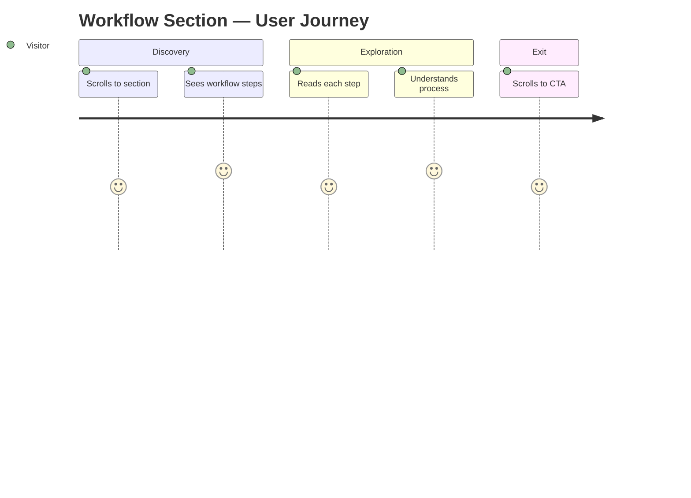
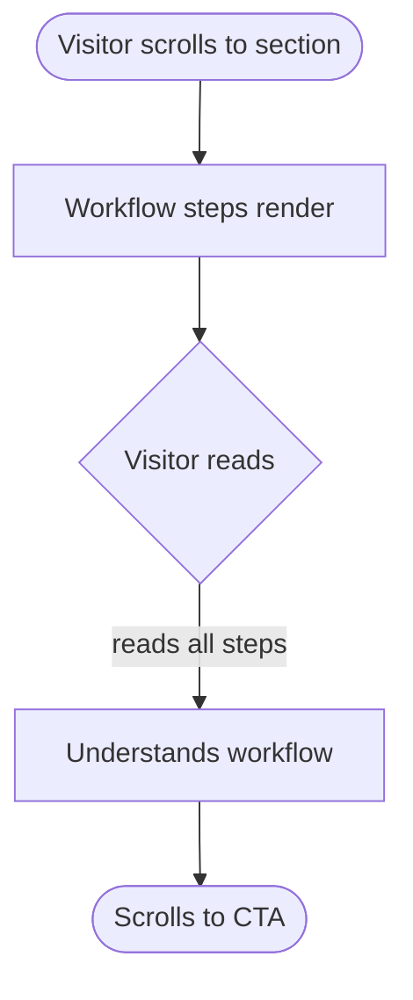

# task-003 — Frontend Design

## Metadata
| Field | Value |
|-------|-------|
| **Requirement** | `docs/sprints/sprint-01/task-003/task-003-requirement.md` |
| **Assignee** | - |
| **Status** | draft |

## Design References
- Inherits CSS variables from task-001
- Step indicator color: `var(--color-primary)` = `#E97F45`

## UI/UX Overview
<!-- Fill in with /fe-design sprint-01 task-003 -->
Features section แสดง Claude Code workflow steps ในรูปแบบ card grid หรือ step timeline

## User Journey Map

## Behavior Mapping

## Routing & Navigation
| Route | Component | Auth required | Notes |
|-------|-----------|---------------|-------|
| `/#workflow` | `.workflow-section` | no | Anchor target |

## Component Breakdown
| Component | File path | Type | Description |
|-----------|-----------|------|-------------|
| `.workflow-section` | `index.html` | new | Section wrapper |
| `.workflow-step` | `index.html` | new | Individual step card (number + title + desc) |
| `.step-number` | `styles/main.css` | new | Orange circle with step number |

## State & Data Flow
None — static HTML/CSS.

## API Contracts Consumed
None.

## Loading & Skeleton States
| State | Behavior |
|-------|----------|
| Initial load | Content visible immediately |

## Responsive Behavior
| Breakpoint | Behavior |
|------------|----------|
| Mobile (< 768px) | Single column, vertical step list |
| Tablet (768–1024px) | 2-column grid |
| Desktop (> 1024px) | 3-column grid หรือ horizontal timeline |

## Analytics Events
| Event name | Trigger | Payload |
|------------|---------|---------|
| `workflow_section_viewed` | Section enters viewport (Intersection Observer) | `{}` |

## Performance Considerations
- Intersection Observer สำหรับ analytics event (ไม่ต้อง animation)

## TDD Test Plan
| Test Case | AC | Type | Description |
|-----------|----|------|-------------|
| All 5+ steps render | AC-1 | manual | Count step elements |
| Each step has title + description | AC-2 | manual | Visual check |
| Step indicators are orange | AC-4 | manual | Color check |
| Mobile single-column | AC-5 | manual | Resize to 375px |
| Tablet 2-column | AC-5 | manual | Resize to 768px |

## Edge Cases & Error States
- Long description text: ensure card height สม่ำเสมอใน grid

## Accessibility Notes
- Section ต้องมี `<h2>` section heading
- Step list ควรใช้ `<ol>` (ordered list) เพราะมี sequence
- Step numbers ต้องมี `aria-hidden="true"` ถ้า number อยู่ใน visual element
