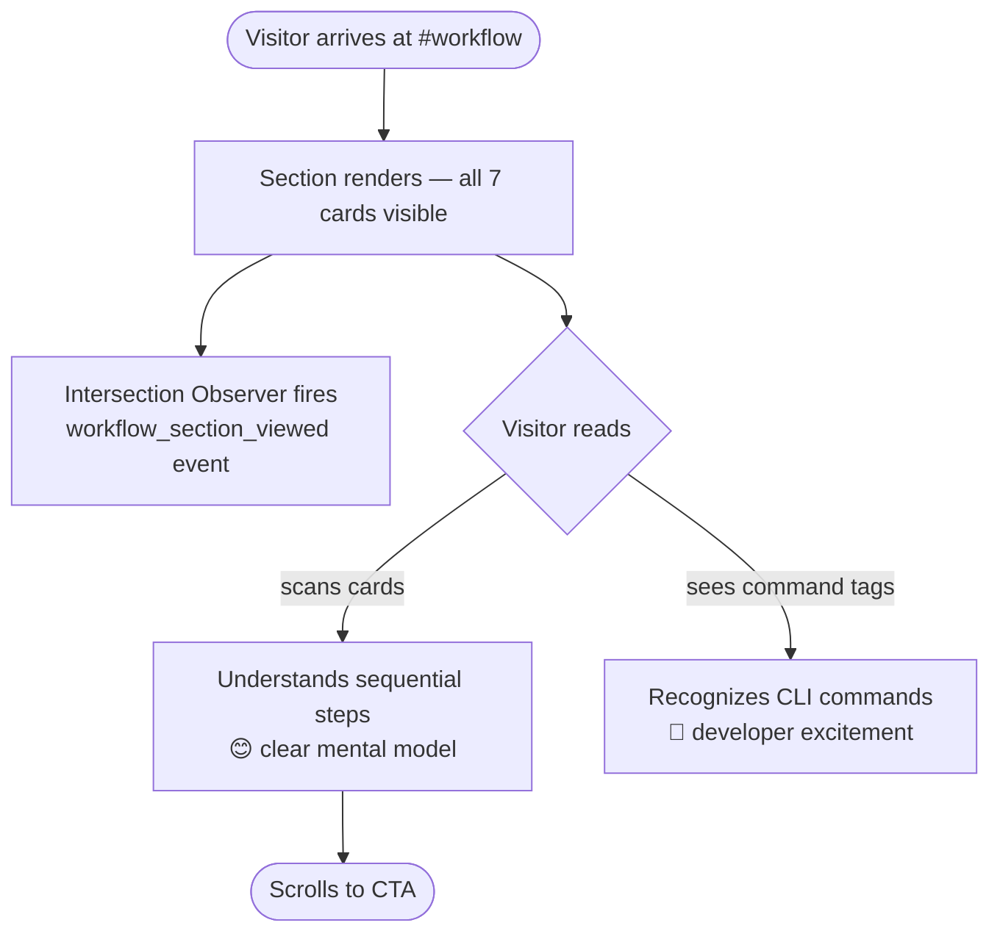

# task-003 — Frontend Design

## Metadata
| Field | Value |
|-------|-------|
| **Requirement** | `docs/sprints/sprint-01/task-003/task-003-requirement.md` |
| **Assignee** | - |
| **Status** | ready |

---

## Design References

No Figma — derived from task-001 design tokens and task-002 patterns.

| Element | Value |
|---------|-------|
| Section background | `var(--color-bg-surface)` = `#242424` |
| Section heading | `var(--font-size-3xl)` / `var(--font-weight-bold)` / white |
| Step number circle | bg `var(--color-primary)` `#E97F45`, white text, 40×40px |
| Step card bg | `var(--color-bg)` = `#1A1A1A` |
| Step card border | `1px solid var(--color-border)` = `#333333` |
| Step title | `var(--font-size-lg)` / `var(--font-weight-semibold)` / white |
| Step description | `var(--font-size-sm)` / `var(--color-text-muted)` |
| Grid gap | `var(--space-6)` = 24px |

---

## UI/UX Overview

One section delivered: **`.workflow-section`** — a 3-column card grid on desktop showing the 7 Claude Code workflow steps in sequence.

**Section structure:**
- Section header: `<h2>` "How Claude Code Works" + subtext
- `<ol>` of 7 step cards, each with: orange numbered circle, step name (title), one-line description, command tag

**The 7 steps (derived from CLAUDE.md workflow):**

| # | Title | Command | Description |
|---|-------|---------|-------------|
| 1 | Discovery | `/discovery` | Understand the problem before planning anything |
| 2 | Sprint Planning | `/new-sprint` | Break epic into tasks with clear dependencies |
| 3 | Design | `/fe-design` `/be-design` | Write design + TDD test plan before any code |
| 4 | Implement | `/implement` | Write failing tests first, then implement |
| 5 | Code Review | `/code-review` | Review every AC against design docs |
| 6 | Testing | `/testing` | Run full suite, cross-check every AC has a test |
| 7 | Retrospective | `/retro-task` | Log learnings, mark done, ship |

---

## User Journey Map

```mermaid
journey
    title Workflow Section — User Journey
    section Entry
        Scrolls from hero via CTA   : 5 : Visitor
        Section heading appears     : 5 : Visitor
    section Exploration
        Scans all 7 step cards      : 4 : Visitor
        Reads step titles           : 5 : Visitor
        Reads descriptions          : 4 : Visitor
        Sees command tags           : 5 : Visitor (developer)
    section Exit
        Scrolls to CTA section      : 4 : Visitor
```

**Entry point:** CTA button in hero (`#workflow` anchor) or manual scroll
**Exit point:** Continues scrolling to CTA/footer (task-004)

---

## Behavior Mapping



**Key behavioral goals:**
- Sequential numbering reinforces that this is a process — not a feature list
- Command tags (`.btn-tag`) create "aha" moment for developers
- No interactivity needed — reading IS the action

---

## Routing & Navigation

| Route | Component | Auth required | Notes |
|-------|-----------|---------------|-------|
| `/#workflow` | `.workflow-section` | no | Anchor target — nav "Workflow" link resolves here |

---

## Component Breakdown

| Component | File path | Type | Description |
|-----------|-----------|------|-------------|
| `<section class="workflow-section">` | `index.html` | new | Full section with `id="workflow"` |
| `.section-header` | `index.html` | new | `<h2>` + subtitle paragraph |
| `<ol class="workflow-grid">` | `index.html` | new | Ordered list, CSS grid layout |
| `<li class="workflow-step">` | `index.html` | new | Step card (×7) |
| `.step-number` | `index.html` | new | Orange circle with step number (aria-hidden) |
| `.step-content` | `index.html` | new | Wrapper for title + description + tag |
| `.step-tag` | `index.html` | new | Monospace command tag (e.g. `/discovery`) |
| `.workflow-section` styles | `styles/main.css` | new | Section padding, bg, header styles |
| `.workflow-grid` styles | `styles/main.css` | new | CSS grid — 3col/2col/1col |
| `.workflow-step` styles | `styles/main.css` | new | Card styles — bg, border, padding, flex |
| `.step-number` styles | `styles/main.css` | new | Orange circle — size, font, border-radius |
| `.step-tag` styles | `styles/main.css` | new | Monospace pill — border, small text |
| Responsive rules | `styles/main.css` | new | 768px → 2-col, 480px → 1-col |

---

## Exact HTML Structure

```html
<!-- WORKFLOW SECTION -->
<section class="workflow-section" id="workflow">
  <div class="section-inner">
    <div class="section-header">
      <h2 class="section-title">How Claude Code Works</h2>
      <p class="section-subtitle">A repeatable, structured process — from problem to shipped code.</p>
    </div>
    <ol class="workflow-grid" role="list">

      <li class="workflow-step">
        <div class="step-number" aria-hidden="true">1</div>
        <div class="step-content">
          <h3 class="step-title">Discovery</h3>
          <p class="step-desc">Understand the problem, users, and constraints before writing a single line of code.</p>
          <span class="step-tag">/discovery</span>
        </div>
      </li>

      <li class="workflow-step">
        <div class="step-number" aria-hidden="true">2</div>
        <div class="step-content">
          <h3 class="step-title">Sprint Planning</h3>
          <p class="step-desc">Break the epic into focused sub-tasks with clear dependencies and estimates.</p>
          <span class="step-tag">/new-sprint</span>
        </div>
      </li>

      <li class="workflow-step">
        <div class="step-number" aria-hidden="true">3</div>
        <div class="step-content">
          <h3 class="step-title">Design</h3>
          <p class="step-desc">Write frontend and backend design docs with a TDD test plan — before any code.</p>
          <span class="step-tag">/fe-design &nbsp;/be-design</span>
        </div>
      </li>

      <li class="workflow-step">
        <div class="step-number" aria-hidden="true">4</div>
        <div class="step-content">
          <h3 class="step-title">Implement</h3>
          <p class="step-desc">Write failing tests first. Implement until all tests pass. Log bugs as issues.</p>
          <span class="step-tag">/implement</span>
        </div>
      </li>

      <li class="workflow-step">
        <div class="step-number" aria-hidden="true">5</div>
        <div class="step-content">
          <h3 class="step-title">Code Review</h3>
          <p class="step-desc">Review every acceptance criterion against the design docs before merging.</p>
          <span class="step-tag">/code-review</span>
        </div>
      </li>

      <li class="workflow-step">
        <div class="step-number" aria-hidden="true">6</div>
        <div class="step-content">
          <h3 class="step-title">Testing</h3>
          <p class="step-desc">Run the full test suite. Every AC must have a passing test before shipping.</p>
          <span class="step-tag">/testing</span>
        </div>
      </li>

      <li class="workflow-step">
        <div class="step-number" aria-hidden="true">7</div>
        <div class="step-content">
          <h3 class="step-title">Retrospective</h3>
          <p class="step-desc">Log learnings, mark the task done, and carry improvements to the next sprint.</p>
          <span class="step-tag">/retro-task</span>
        </div>
      </li>

    </ol>
  </div>
</section>
```

## Exact CSS Additions to `styles/main.css`

```css
/* =========================================
   SHARED SECTION LAYOUT (task-003)
   ========================================= */
.section-inner {
  max-width: var(--max-width);
  margin: 0 auto;
  padding: var(--space-24) var(--space-6);
}
.section-header {
  text-align: center;
  margin-bottom: var(--space-16);
}
.section-title {
  font-size: var(--font-size-3xl);
  font-weight: var(--font-weight-bold);
  color: var(--color-text);
  letter-spacing: -0.02em;
  margin-bottom: var(--space-4);
}
.section-subtitle {
  font-size: var(--font-size-lg);
  color: var(--color-text-muted);
  max-width: 560px;
  margin: 0 auto;
}

/* =========================================
   WORKFLOW SECTION (task-003)
   ========================================= */
.workflow-section {
  background-color: var(--color-bg-surface);
}
.workflow-grid {
  display: grid;
  grid-template-columns: repeat(3, 1fr);
  gap: var(--space-6);
}
.workflow-step {
  background-color: var(--color-bg);
  border: 1px solid var(--color-border);
  border-radius: var(--border-radius-md);
  padding: var(--space-6);
  display: flex;
  gap: var(--space-4);
  align-items: flex-start;
}
.step-number {
  flex-shrink: 0;
  width: 40px;
  height: 40px;
  border-radius: 50%;
  background-color: var(--color-primary);
  color: #ffffff;
  font-size: var(--font-size-sm);
  font-weight: var(--font-weight-bold);
  display: flex;
  align-items: center;
  justify-content: center;
}
.step-content {
  display: flex;
  flex-direction: column;
  gap: var(--space-2);
}
.step-title {
  font-size: var(--font-size-lg);
  font-weight: var(--font-weight-semibold);
  color: var(--color-text);
}
.step-desc {
  font-size: var(--font-size-sm);
  color: var(--color-text-muted);
  line-height: var(--line-height-relaxed);
}
.step-tag {
  display: inline-block;
  margin-top: var(--space-2);
  padding: var(--space-1) var(--space-2);
  background-color: transparent;
  border: 1px solid var(--color-border);
  border-radius: var(--border-radius-sm);
  font-family: 'Courier New', Courier, monospace;
  font-size: var(--font-size-xs);
  color: var(--color-primary);
}

/* =========================================
   RESPONSIVE — WORKFLOW (task-003)
   ========================================= */
@media (max-width: 1023px) {
  .workflow-grid { grid-template-columns: repeat(2, 1fr); }
}
@media (max-width: 599px) {
  .workflow-grid { grid-template-columns: 1fr; }
}
```

---

## Analytics Events

| Event name | Trigger | Implementation |
|------------|---------|----------------|
| `workflow_section_viewed` | `#workflow` section enters viewport | `IntersectionObserver` with `threshold: 0.2` — fires once |

```js
// Analytics: workflow_section_viewed (add to existing <script> block)
(function () {
  var section = document.getElementById('workflow');
  if (!section || !window.IntersectionObserver) return;
  var observer = new IntersectionObserver(function (entries) {
    entries.forEach(function (entry) {
      if (entry.isIntersecting) {
        // analytics: workflow_section_viewed
        observer.disconnect();
      }
    });
  }, { threshold: 0.2 });
  observer.observe(section);
})();
```

---

## State & Data Flow

None — static HTML/CSS + minimal JS for analytics.

---

## API Contracts Consumed

None.

---

## Loading & Skeleton States

| State | Behavior |
|-------|----------|
| Initial load | All 7 cards render synchronously from HTML |

---

## Responsive Behavior

| Breakpoint | Grid columns | Notes |
|------------|-------------|-------|
| Mobile (< 600px) | 1 column | Cards full-width, vertical scroll |
| Tablet (600–1023px) | 2 columns | 3+2+2 arrangement (7 cards) |
| Desktop (≥ 1024px) | 3 columns | 3+3+1 arrangement |

---

## Performance Considerations

- `IntersectionObserver` fires once then disconnects — zero ongoing cost
- No images — pure CSS cards, fast render
- `grid-template-columns: repeat(3, 1fr)` — browser-native layout, no JS

---

## TDD Test Plan

| Test Case | AC | Type | Description |
|-----------|----|------|-------------|
| `#workflow` section exists in DOM | AC-1 | manual | Inspect Elements |
| Exactly 7 `<li class="workflow-step">` elements | AC-1 | manual | Count in DevTools |
| Step 1 title = "Discovery" | AC-1 | manual | Inspect first `<li>` |
| Step 7 title = "Retrospective" | AC-1 | manual | Inspect last `<li>` |
| Each step has `.step-number` element | AC-2 | manual | Inspect all `<li>` |
| Each step has `.step-title` element | AC-2 | manual | Inspect all `<li>` |
| Each step has `.step-desc` element | AC-2 | manual | Inspect all `<li>` |
| Each step has `.step-tag` command | AC-2 | manual | Inspect all `<li>` |
| `.workflow-grid` display is `grid` | AC-3 | manual | DevTools computed layout |
| Desktop: 3 columns visible | AC-3 | manual | Visual check at 1280px |
| `.step-number` bg = `#E97F45` | AC-4 | manual | DevTools computed styles |
| `.step-tag` color = `#E97F45` | AC-4 | manual | DevTools computed styles |
| `.workflow-section` bg = `#242424` | AC-4 | manual | DevTools computed styles |
| Mobile 375px: single column, no overflow | AC-5 | manual | Resize browser |
| Tablet 768px: 2 columns | AC-5 | manual | Resize browser |
| `id="workflow"` resolves nav anchor | AC-1+nav | manual | Click "Workflow" in nav |

---

## Edge Cases & Error States

- **7th card alone in last row (desktop 3-col):** card spans 1/3 width — acceptable; `align-items: flex-start` on grid prevents stretch
- **Long step description:** `line-height: var(--line-height-relaxed)` + no fixed height on cards — content determines height
- **IntersectionObserver not supported:** guarded with `if (!window.IntersectionObserver) return` — analytics silently skipped

---

## Accessibility Notes

- `<section id="workflow">` is a landmark — screen readers can navigate to it
- `<h2>` establishes correct heading hierarchy (H1 in hero → H2 here)
- `<ol role="list">` — ordered list communicates sequence; `role="list"` preserves list semantics in Safari
- `.step-number` has `aria-hidden="true"` — number is decorative; step sequence communicated by `<ol>` order
- `<h3>` inside each `<li>` — correct sub-heading level
- `.step-tag` is `<span>` not `<button>` — non-interactive, no keyboard focus needed
