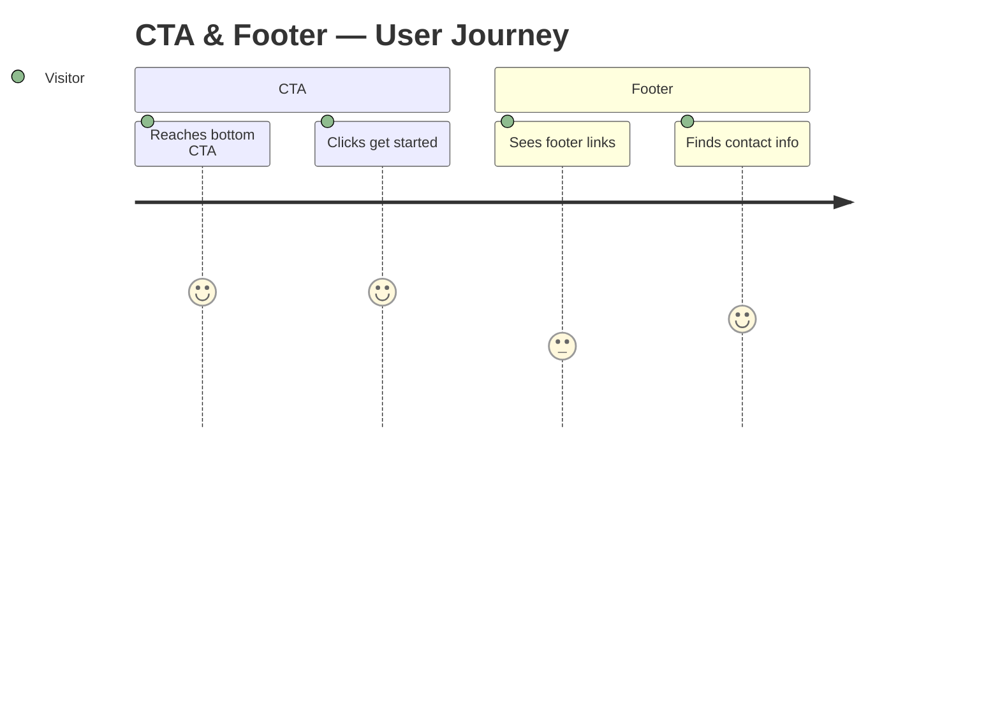
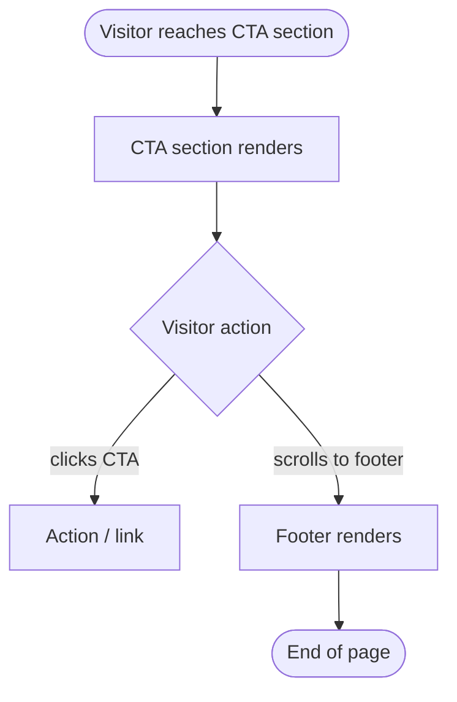

# task-004 — Frontend Design

## Metadata
| Field | Value |
|-------|-------|
| **Requirement** | `docs/sprints/sprint-01/task-004/task-004-requirement.md` |
| **Assignee** | - |
| **Status** | draft |

## Design References
- Inherits all CSS variables from task-001
- CTA section bg: `var(--color-dark)` = `#1A1A1A`
- CTA button: `var(--color-primary)` = `#E97F45`

## UI/UX Overview
<!-- Fill in with /fe-design sprint-01 task-004 -->
Bottom CTA section + footer + responsive polish สำหรับทั้ง landing page

## User Journey Map

## Behavior Mapping

## Routing & Navigation
| Route | Component | Auth required | Notes |
|-------|-----------|---------------|-------|
| `/#cta` | `.cta-section` | no | Anchor target |
| `/#footer` | `footer` | no | Anchor target |

## Component Breakdown
| Component | File path | Type | Description |
|-----------|-----------|------|-------------|
| `.cta-section` | `index.html` | new | Bottom CTA with headline + button |
| `footer` | `index.html` | new | Footer with copyright + links |
| Responsive overrides | `styles/main.css` | new | Media queries for all sections |

## State & Data Flow
None — static HTML/CSS.

## API Contracts Consumed
None.

## Loading & Skeleton States
| State | Behavior |
|-------|----------|
| Initial load | Content visible immediately |

## Responsive Behavior
| Breakpoint | Behavior |
|------------|----------|
| Mobile (< 768px) | Single column, stacked footer links, smaller CTA text |
| Tablet (768–1024px) | 2-column footer, medium CTA |
| Desktop (> 1024px) | Full-width CTA, multi-column footer |

## Analytics Events
| Event name | Trigger | Payload |
|------------|---------|---------|
| `cta_bottom_click` | Click bottom CTA button | `{}` |

## Performance Considerations
- ไม่มี JS ที่ block render
- Images (ถ้ามี) ใช้ `loading="lazy"`

## TDD Test Plan
| Test Case | AC | Type | Description |
|-----------|----|------|-------------|
| CTA section renders with button | AC-1 | manual | Visual check |
| Footer renders | AC-2 | manual | Visual check |
| No horizontal scroll on 375px | AC-4 | manual | Chrome DevTools |
| No layout break on 768px | AC-3 | manual | Resize browser |
| No layout break on 1280px | AC-3 | manual | Resize browser |
| Lighthouse mobile > 80 | AC-5 | tool | Chrome Lighthouse |

## Edge Cases & Error States
- Very small screens (320px): ensure no overflow

## Accessibility Notes
- `<footer>` semantic element
- CTA button text ชัดเจน
- Footer links ต้องมี focus state ที่เห็นได้
