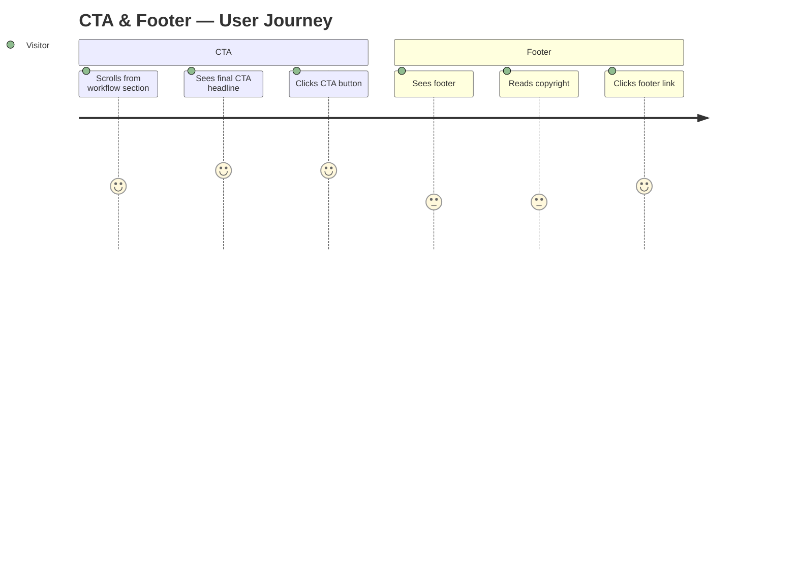
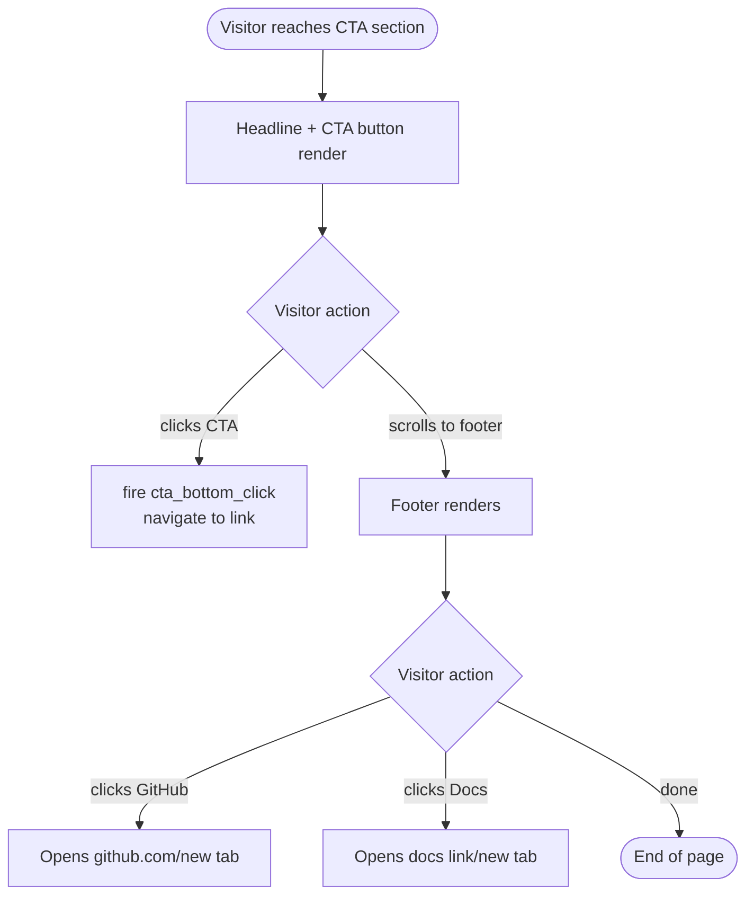

# task-004 — Frontend Design

## Metadata
| Field | Value |
|-------|-------|
| **Requirement** | `docs/sprints/sprint-01/task-004/task-004-requirement.md` |
| **Assignee** | - |
| **Status** | ready |

---

## Design References

No Figma — derived from task-001 tokens; reuses `.section-inner` / `.section-header` from task-003.

| Element | Value |
|---------|-------|
| CTA section bg | `var(--color-bg)` = `#1A1A1A` (distinct from workflow's `#242424`) |
| CTA heading | `var(--font-size-3xl)` / `var(--font-weight-bold)` / white |
| CTA subtext | `var(--font-size-lg)` / `var(--color-text-muted)` |
| CTA button | `.btn-primary` (already defined in task-002) |
| Footer bg | `var(--color-bg)` with top border `var(--color-border)` |
| Footer text | `var(--font-size-sm)` / `var(--color-text-muted)` |
| Footer link hover | `var(--color-text)` |

---

## UI/UX Overview

Two new components + one global polish pass:

**1. `.cta-section`** — Final conversion section before footer
- Reuses `.section-inner` + `.section-header` layout from task-003
- Headline: "Ready to Ship Faster?"
- Subtext: "Start using Claude Code workflow on your next project."
- CTA button: "Get Started with Claude Code" → links to Claude Code docs or `#home`
- Visually distinct from workflow section: uses `var(--color-bg)` (#1A1A1A) vs workflow's `#242424`

**2. `<footer>`** — Site footer
- Single row: left = copyright, right = links (GitHub, Docs)
- Minimal — no multi-column layout needed for this scope

**3. Global responsive polish**
- Add `@media (prefers-reduced-motion: reduce)` to suppress `scroll-behavior` and `transition`
- Add `max-width: 100%` + `overflow-x: hidden` on `body` to prevent horizontal scroll
- Verify spacing consistency across all 3 existing sections

---

## User Journey Map



**Entry point:** Bottom of workflow section (task-003)
**Exit point:** CTA click → external link / top of page, or browser close

---

## Behavior Mapping



**Key behavioral goal:** Visitor who read the workflow steps should feel ready to act — CTA headline confirms that feeling and removes friction.

---

## Routing & Navigation

| Route | Component | Auth required | Notes |
|-------|-----------|---------------|-------|
| `/#cta` | `.cta-section` | no | Optional anchor — not in nav |
| `/` footer links | `<footer>` | no | External links open in new tab |

---

## Component Breakdown

| Component | File path | Type | Description |
|-----------|-----------|------|-------------|
| `<section class="cta-section">` | `index.html` | new | Bottom CTA with id="cta" |
| `.cta-section` styles | `styles/main.css` | new | Section bg, reuses section-inner/header |
| `<footer>` | `index.html` | new | Copyright + external links |
| `footer` styles | `styles/main.css` | new | Border-top, flex row, small text |
| `body` overflow fix | `styles/main.css` | modify | `overflow-x: hidden` to prevent mobile scroll |
| `prefers-reduced-motion` | `styles/main.css` | new | Suppress scroll-behavior + transitions |

---

## Exact HTML Structure

```html
<!-- CTA SECTION -->
<section class="cta-section" id="cta">
  <div class="section-inner">
    <div class="section-header">
      <h2 class="section-title">Ready to Ship Faster?</h2>
      <p class="section-subtitle">Start using Claude Code workflow on your next project.</p>
    </div>
    <a href="#home" class="btn-primary" id="cta-bottom">Get Started with Claude Code</a>
  </div>
</section>

<!-- FOOTER -->
<footer class="site-footer">
  <div class="footer-inner">
    <p class="footer-copy">&copy; 2026 Claude Code Workflow. Built with Claude.</p>
    <ul class="footer-links" role="list">
      <li><a href="https://github.com/anthropics/claude-code" target="_blank" rel="noopener noreferrer">GitHub</a></li>
      <li><a href="https://docs.anthropic.com" target="_blank" rel="noopener noreferrer">Docs</a></li>
    </ul>
  </div>
</footer>
```

## Exact CSS Additions to `styles/main.css`

```css
/* =========================================
   BODY — overflow fix (task-004)
   ========================================= */
body {
  overflow-x: hidden;
}

/* =========================================
   CTA SECTION (task-004)
   ========================================= */
.cta-section {
  background-color: var(--color-bg);
  text-align: center;
}
.cta-section .section-inner {
  display: flex;
  flex-direction: column;
  align-items: center;
  gap: var(--space-8);
}

/* =========================================
   FOOTER (task-004)
   ========================================= */
.site-footer {
  background-color: var(--color-bg);
  border-top: 1px solid var(--color-border);
}
.footer-inner {
  max-width: var(--max-width);
  margin: 0 auto;
  padding: var(--space-8) var(--space-6);
  display: flex;
  align-items: center;
  justify-content: space-between;
  flex-wrap: wrap;
  gap: var(--space-4);
}
.footer-copy {
  font-size: var(--font-size-sm);
  color: var(--color-text-muted);
}
.footer-links {
  display: flex;
  gap: var(--space-6);
}
.footer-links a {
  font-size: var(--font-size-sm);
  color: var(--color-text-muted);
  transition: color 0.15s ease;
}
.footer-links a:hover { color: var(--color-text); }

/* =========================================
   RESPONSIVE — CTA + FOOTER (task-004)
   ========================================= */
@media (max-width: 767px) {
  .footer-inner {
    flex-direction: column;
    align-items: center;
    text-align: center;
  }
}

/* =========================================
   REDUCED MOTION (task-004)
   ========================================= */
@media (prefers-reduced-motion: reduce) {
  html { scroll-behavior: auto; }
  *, *::before, *::after { transition: none !important; }
}
```

---

## State & Data Flow

None — static HTML/CSS + one analytics event.

Analytics addition to existing `<script>` block:
```js
document.getElementById('cta-bottom')?.addEventListener('click', function () {
  // analytics: cta_bottom_click — replace with real analytics call when available
});
```

---

## API Contracts Consumed

None.

---

## Loading & Skeleton States

| State | Behavior |
|-------|----------|
| Initial load | CTA + footer render synchronously |

---

## Responsive Behavior

| Breakpoint | CTA section | Footer |
|------------|------------|--------|
| Mobile (< 768px) | Centered, btn full-width (inherited from task-002) | Stacked: copy above links, centered |
| Tablet (768–1023px) | Same as desktop | Row layout |
| Desktop (≥ 1024px) | Centered, max-width 720px | Row: copyright left, links right |

---

## Analytics Events

| Event name | Trigger | Implementation |
|------------|---------|----------------|
| `cta_bottom_click` | Click `#cta-bottom` | Inline `addEventListener` in existing `<script>` |

---

## Performance Considerations

- No new images or fonts — zero new network requests
- `overflow-x: hidden` on `body` is a layout paint change only — no JS
- `prefers-reduced-motion` override uses CSS-only — no runtime cost
- External footer links use `rel="noopener noreferrer"` — prevents tab-napping security issue

---

## TDD Test Plan

| Test Case | AC | Type | Description |
|-----------|----|------|-------------|
| `<section class="cta-section">` exists | AC-1 | manual | Inspect Elements |
| CTA `<h2>` "Ready to Ship Faster?" present | AC-1 | manual | Inspect heading |
| CTA subtext paragraph present | AC-1 | manual | Inspect `<p>` |
| `#cta-bottom` button exists and is `.btn-primary` | AC-1 | manual | Inspect button |
| `<footer class="site-footer">` exists | AC-2 | manual | Inspect Elements |
| Footer copyright text present | AC-2 | manual | Inspect `.footer-copy` |
| Footer links "GitHub" and "Docs" present | AC-2 | manual | Inspect `<ul>` |
| Footer links open in new tab (`target="_blank"`) | AC-2 | manual | Inspect `<a>` attributes |
| No horizontal scrollbar at 375px | AC-4 | manual | DevTools → 375px, check overflow |
| No horizontal scrollbar at 320px | AC-4 | manual | DevTools → 320px |
| No layout break at 375px | AC-3 | manual | Visual check mobile |
| No layout break at 768px | AC-3 | manual | Visual check tablet |
| No layout break at 1280px | AC-3 | manual | Visual check desktop |
| All sections have visible spacing separation | AC-5 | manual | Scroll full page |
| `overflow-x: hidden` on body | AC-4 | manual | DevTools computed |
| `prefers-reduced-motion` rule present in CSS | polish | manual | Inspect stylesheet |
| `cta_bottom_click` event listener attached | analytics | manual | DevTools → event listeners on #cta-bottom |

---

## Edge Cases & Error States

- **320px very small screen:** `flex-wrap: wrap` on `.footer-inner` prevents overflow; btn is 100% width on mobile (from task-002)
- **External link failure:** Links are `<a href>` — browser handles failures natively (no JS fetch)
- **`prefers-reduced-motion` not supported:** Graceful degradation — transitions still run, just slower

---

## Accessibility Notes

- `<footer>` is a semantic landmark — screen readers can navigate to it
- `<h2>` in CTA maintains H1 → H2 hierarchy (consistent with task-003)
- Footer external links have `rel="noopener noreferrer"` — security + correct behaviour
- `target="_blank"` links: screen readers will announce "opens in new tab" with some AT; acceptable for footer links
- Focus ring: no `outline: none` added — browser default focus style preserved throughout
- `prefers-reduced-motion` benefit: users with vestibular disorders will have transitions disabled
