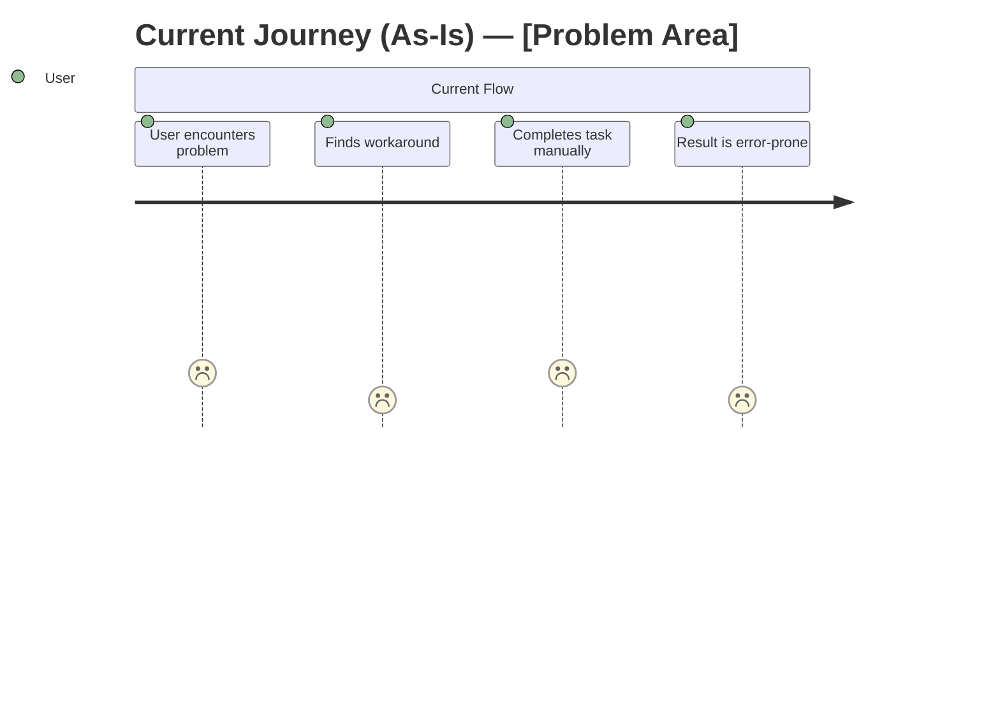
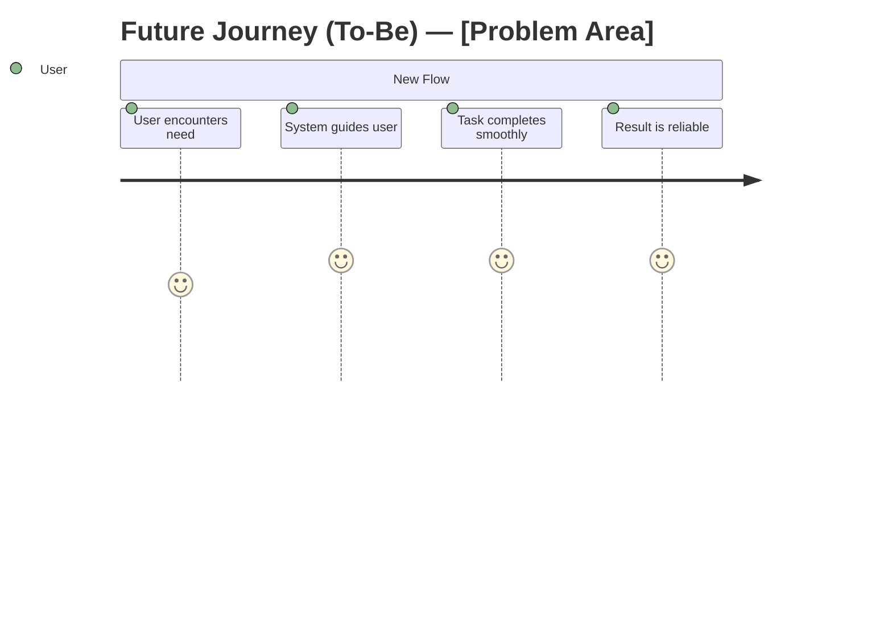

# [disc-id] — [Title]

## Metadata
| Field | Value |
|-------|-------|
| **Discovery ID** | disc-XXX |
| **Status** | discovery / backlog |
| **Date** | YYYY-MM-DD |
| **Requester** | - |
| **Facilitator** | - |

---

## 1. Problem Statement
<!-- What problem are we solving? Who experiences it, how often, and what is the impact? -->

**Problem:**

**Who is affected:**

**Current workaround (if any):**

---

## 2. Affected Users & Stakeholders
<!-- Who are the primary users? Who else is impacted (internal teams, external systems)? -->

| Role | Impact | Notes |
|------|--------|-------|
| - | - | - |

---

## 3. Goals & Success Criteria
<!-- What does success look like? Every goal must have a measurable metric. -->

| Goal | Success Metric | How to Measure |
|------|---------------|----------------|
| - | - | - |

---

## 4. Current User Journey (As-Is)
<!-- Map how users currently solve this problem. Score 1–5: 1=frustrated, 5=delighted. -->

**Pain points identified:**
-

---

## 5. Future User Journey (To-Be)
<!-- Map how users will experience the solved flow. Score 1–5: 1=frustrated, 5=delighted. -->

**Improvements over As-Is:**
-

---

## 6. Context & Background
<!-- Relevant history, existing systems, previous attempts, related decisions. -->

---

## 7. Constraints
<!-- Hard limits that shape the solution space. -->

- **Technical:** (stack, existing systems, APIs)
- **Business:** (budget, compliance, stakeholder requirements)
- **Timeline:** (deadlines, dependencies on other teams)
- **UX:** (design system, accessibility requirements)

---

## 8. Proposed Approaches
<!-- At least 2 options considered. More options = better decision. -->

### Option A: [Name]
- **Description:**
- **Pros:**
- **Cons:**
- **Estimated effort:**

### Option B: [Name]
- **Description:**
- **Pros:**
- **Cons:**
- **Estimated effort:**

---

## 9. Decision
<!-- Which approach was chosen, why, and who approved it. -->

**Chosen approach:**
**Rationale:**
**Approved by:**
**Date decided:**

---

## 10. Unknowns & Open Questions
<!-- What do we not know yet? Each item must be resolved before sprint planning. -->

- [ ] Q1:
- [ ] Q2:

---

## 11. Risks
| Risk | Likelihood | Impact | Mitigation |
|------|-----------|--------|------------|
| - | high / med / low | high / med / low | - |

---

## 12. Scope Estimate
<!-- Rough sizing to help sprint planning. Not a commitment. -->

- **Estimated sprints:** X
- **v1 scope (must-have):**
- **v2 scope (nice-to-have):**
- **Explicitly out of scope:**

---

## 13. Next Steps
<!-- What must happen before this is ready for /new-sprint? -->

- [ ] Resolve all open questions
- [ ] Get stakeholder sign-off on chosen approach
- [ ] Confirm timeline with team
- [ ] Update status to `backlog` when ready
