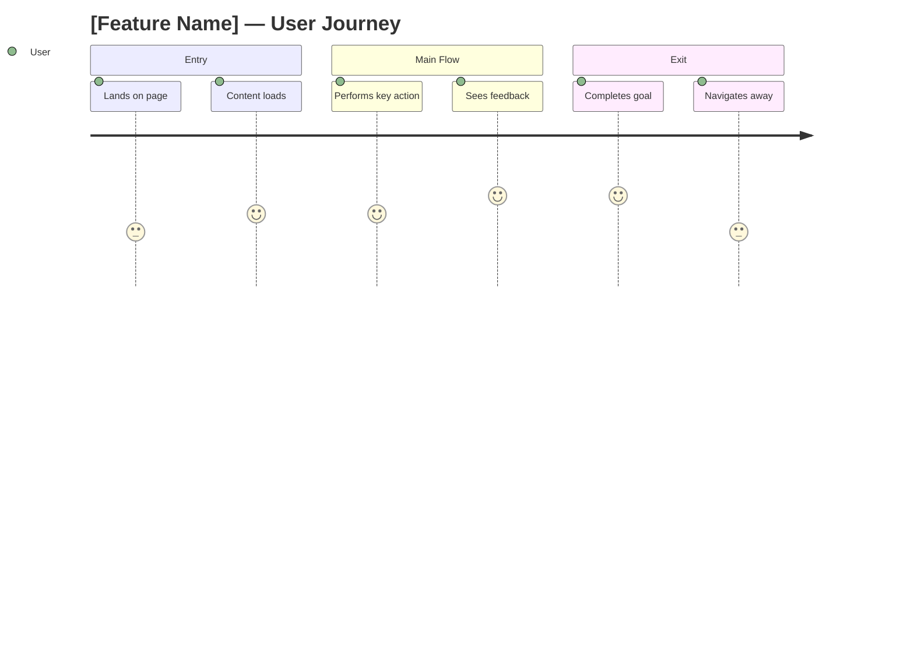
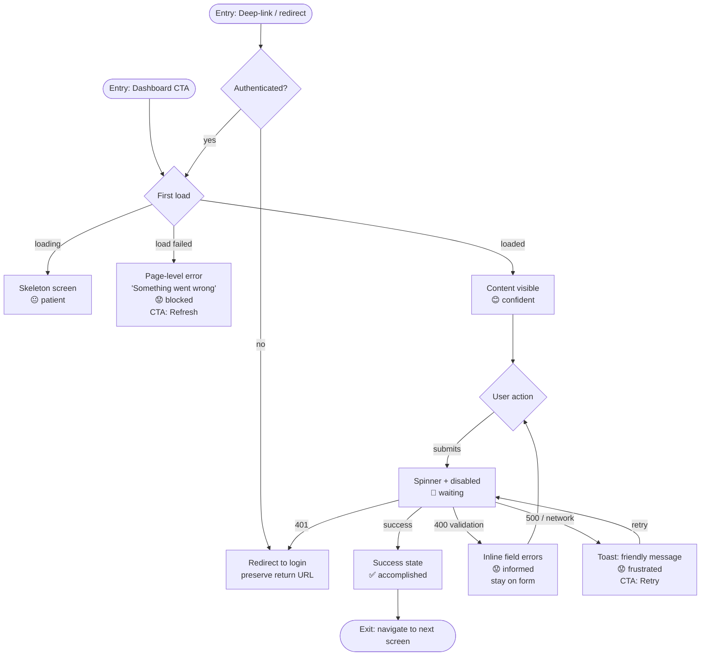
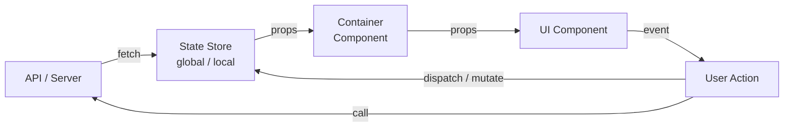
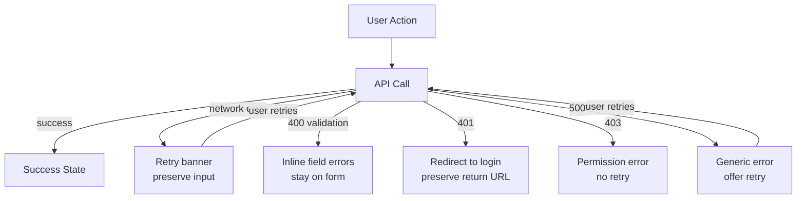

# [task-id] — [Title] — Frontend Design

## Metadata

| Field           | Value                                                         |
| --------------- | ------------------------------------------------------------- |
| **Requirement** | `docs/sprints/[sprint-id]/[task-id]/[task-id]-requirement.md` |
| **Assignee**    | -                                                             |
| **Status**      | draft / ready / implemented                                   |

## Design References

- Figma: [link]
- Storybook: [link]

## UI/UX Overview

## User Journey Map

**Entry point:** where does the user come from before this flow?
**Exit point:** where does the user go after this flow?

## Behavior Mapping

### Entry Paths

| Entry path                          | How they get here          | Pre-loaded state / context      |
| ----------------------------------- | -------------------------- | ------------------------------- |
| e.g. Dashboard → click CTA          | Direct navigation          | Authenticated, no pre-fill      |
| e.g. Email deep-link                | `/path?token=xxx`          | May or may not be authenticated |
| e.g. Back-navigation from next step | Browser back / wizard back | Form state must be preserved    |

*Every entry path must be handled — missing one means the feature is not fully integrated.*

### Behavior Flow

### Fail State Summary

| Fail state     | What user sees                          | Feeling     | Can recover?           |
| -------------- | --------------------------------------- | ----------- | ---------------------- |
| Load failed    | Page-level error + Refresh button       | Blocked     | Yes — refresh          |
| 400 validation | Inline errors on each field             | Informed    | Yes — fix and resubmit |
| 500 / network  | Toast with retry CTA                    | Frustrated  | Yes — retry            |
| 401 mid-flow   | Redirect to login, return URL preserved | Interrupted | Yes — re-login         |

**Key behavioral goals:**

- 

## State Inventory
<!-- Exhaustive list of every UI state per component. No state should be left to imagination. -->

| Component | States | Notes |
|-----------|--------|-------|
| `ComponentName` | default / loading / empty / error | |

## Design Decisions
<!-- Non-obvious choices and WHY they were made. Prevents implementers from "fixing" intentional decisions. -->

| Decision | Why | Alternatives Rejected |
|----------|-----|----------------------|
| | | |

## Routing & Navigation

| Route   | Component       | Auth required | Notes |
| ------- | --------------- | ------------- | ----- |
| `/path` | `PageComponent` | yes / no      |       |

## Component Breakdown

| Component       | File path            | Type         | Description |
| --------------- | -------------------- | ------------ | ----------- |
| `ComponentName` | `src/components/...` | new / modify |             |

## State & Data Flow

## API Contracts Consumed

| Method | Endpoint   | Request | Response  | Error handling        |
| ------ | ---------- | ------- | --------- | --------------------- |
| GET    | `/api/...` | -       | `{ ... }` | show toast / redirect |

## Loading & Skeleton States

| State           | Behavior                       |
| --------------- | ------------------------------ |
| Initial load    | Skeleton screen                |
| Submitting form | Button disabled + spinner      |
| Error           | Inline error message           |
| Empty           | Empty state illustration + CTA |

## Responsive Behavior

| Breakpoint          | Behavior |
| ------------------- | -------- |
| Mobile (< 768px)    |          |
| Tablet (768–1024px) |          |
| Desktop (> 1024px)  |          |

## Analytics Events

| Event name   | Trigger       | Payload           |
| ------------ | ------------- | ----------------- |
| `event_name` | user clicks X | `{ userId, ... }` |

## Performance Considerations

-

## Implementation Plan
<!-- Ordered step-by-step plan. Each step references the design section it implements.
     This is the blueprint /implement follows — do NOT deviate during implementation. -->

| # | Phase | File path | Action | What to implement | References |
|---|-------|-----------|--------|-------------------|------------|
| 1 | Routing | `src/...` | create / modify | ... | Routing & Navigation |
| 2 | Components | `src/...` | create / modify | ... | Component Breakdown |
| 3 | State | `src/...` | create / modify | ... | State & Data Flow |
| 4 | API | `src/...` | create / modify | ... | API Contracts Consumed |
| 5 | Loading/Error | `src/...` | create / modify | ... | Loading & Skeleton States, Fail Cases |
| 6 | Analytics | `src/...` | create / modify | ... | Analytics Events |
| 7 | A11y/Responsive | `src/...` | create / modify | ... | Accessibility, Responsive Behavior |

<!-- Phases: (1) routing/scaffolding (2) components (3) state/data flow (4) API integration
     (5) loading/error states (6) analytics (7) accessibility/responsive.
     Omit phases not relevant to this task. -->

## TDD Test Plan

| Test Case                             | AC   | Type        | Description                  |
| ------------------------------------- | ---- | ----------- | ---------------------------- |
| renders correctly                     | AC-1 | unit        | snapshot or visual assertion |
| shows skeleton while loading          | AC-1 | unit        |                              |
| displays error message on API failure | AC-2 | unit        |                              |
| user action dispatches correct event  | AC-3 | integration |                              |
| mobile layout renders correctly       | -    | unit        |                              |

## E2E Test Plan

| Scenario                           | AC   | Steps (user actions)                                   | Expected Outcome                          |
| ---------------------------------- | ---- | ------------------------------------------------------ | ----------------------------------------- |
| Happy path: [main flow]            | AC-1 | 1. Navigate to [URL] 2. [User action] 3. [User action] | [What user sees / URL / state]            |
| Error path: [fail scenario]        | AC-2 | 1. Navigate to [URL] 2. [Action that triggers error]   | [Error message / behavior]                |
| Auth guard: unauthenticated access | —    | 1. Visit [protected URL] without login                 | Redirected to login, return URL preserved |

## Fail Cases & Fail Flows

### Fail Flow Diagram

### Fail Case Matrix

| Action      | Fail Scenario    | Presentation | Error Message Shown to User                                    | Recovery CTA     | Input Preserved? |
| ----------- | ---------------- | ------------ | -------------------------------------------------------------- | ---------------- | ---------------- |
| Submit form | 400 validation   | inline       | "Please check the highlighted fields."                         | Fix and resubmit | Yes              |
| Submit form | 500 server error | toast        | "Something went wrong. Your changes are saved — try again."    | Retry            | Yes              |
| Submit form | Network timeout  | toast        | "No internet connection. Check your connection and try again." | Retry            | Yes              |
| Load page   | 404 not found    | page-level   | "This page doesn't exist."                                     | Go back / Home   | N/A              |
| Load page   | 500 error        | page-level   | "Something went wrong on our end. Try refreshing."             | Refresh          | N/A              |

**Presentation pattern guide:**

- **toast** — non-blocking, auto-dismiss (4–5s), for background ops or minor errors
- **inline** — field-level or section-level, stays until fixed, for validation
- **modal** — blocking, requires user action, for destructive or unrecoverable errors
- **page-level** — replaces content entirely, for fatal load failures

### Optimistic Update Rollback

- **Optimistic update used:** yes / no
- **Rollback trigger:** [what event causes rollback]
- **Rollback behavior:** [what reverts, what the user sees, any toast/notification]

*If no optimistic updates: write "None — all UI updates wait for API confirmation."*

### Partial Success Handling

- **Scenario:** e.g. uploading 5 files — 3 succeed, 2 fail
- **UI behavior:** show success count + failed items list
- **User path:** retry failed items or cancel remaining

*If no batch operations: write "None — this flow is single atomic operation."*

### Multi-step / Wizard Rollback

| Fails at | Returns to | State preserved | User sees                       |
| -------- | ---------- | --------------- | ------------------------------- |
| Step N   | Step N     | Steps 1–(N-1)   | Error message + option to retry |

*If single-step flow: write "None — single step, no rollback needed."*

## Edge Cases & Error States

- Network timeout:
- Empty list:
- Unauthorized (401):
- Server error (500):
- Session expired mid-flow:
- Concurrent edit (another user modified same data):

## Accessibility Notes

-

## Definition of Done (Design)

**"Done" means this design is complete enough that implementation can start without guessing.**

### Coverage
- [ ] Every AC in the requirement has at least one E2E scenario in the E2E Test Plan
- [ ] Every entry path in the Entry Paths table is handled in the Behavior Flow
- [ ] Every API endpoint consumed has an error handling column filled in
- [ ] Every fail scenario in the Fail Case Matrix has: presentation pattern + error copy + recovery CTA

### Correctness
- [ ] Error messages are user-friendly — no raw HTTP status codes or stack traces shown to users
- [ ] All fail states are reachable and testable (not "TBD" or left blank)
- [ ] Optimistic Update Rollback, Partial Success, and Multi-step Rollback sections are explicitly filled or marked "None"
- [ ] Design matches Figma/mockup (if Design References are provided) — deviations are noted

### Alignment
- [ ] API contracts in this doc match what the BE design defines (or BE design is not yet written — flag misalignment after /be-design)
- [ ] Routing & Navigation entries align with the main app router — no orphan routes
- [ ] Analytics events match the Analytics & Tracking section in the requirement

