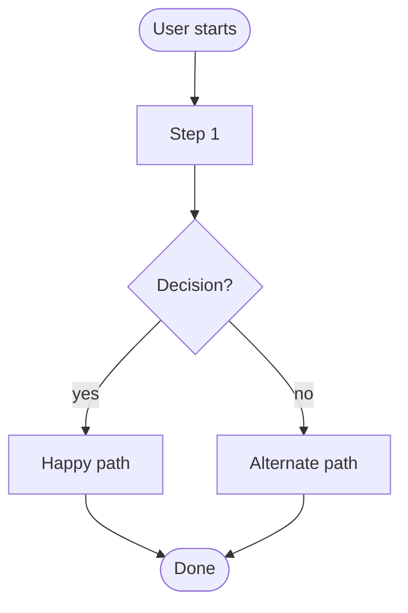

# [task-id] — [Title]

## Metadata
| Field | Value |
|-------|-------|
| **Sprint** | sprint-XX |
| **Priority** | critical / high / medium / low |
| **Estimate** | X days |
| **Assignee** | - |
| **Requester** | - |
| **Status** | todo |

## Problem Statement
<!-- WHY does this task exist? What pain point or opportunity does it address? -->

## Overview
<!-- What does this task deliver? One paragraph summary. -->

## Feature Flow
<!-- High-level flowchart of the main user flow this task enables. -->

## User Stories
| # | Story | Maps to AC |
|---|-------|-----------|
| US-1 | As a __, I want __, so that __. | AC-1, AC-2 |

## System Behavior
| Trigger | System Response | Side Effects | Timing |
|---------|----------------|-------------|--------|
| - | - | - | sync / async |

## Acceptance Criteria
<!-- Each AC must be specific, testable, and user-visible (observable from the browser/client).
     Format: "Given [context], when [user action], then [observable outcome]."
     Every AC must map to at least one E2E test scenario. -->
- [ ] AC-1: Given __, when __, then __.
- [ ] AC-2: Given __, when __, then __.
- [ ] AC-3: Given __, when __, then __.

## Data & Business Rules
| Rule ID | Rule | Example | Applies to AC |
|---------|------|---------|--------------|
| R-1 | - | - | AC-X |

## Success Metrics
<!-- How do we know this task succeeded in production? -->
- [ ] Metric-1: e.g. error rate < 1%
- [ ] Metric-2: e.g. page load < 2s
- [ ] Metric-3: e.g. conversion rate increases by X%

## Design References
<!-- Figma links, mockups, wireframes, or screenshots. -->
- Figma: [link]
- Mockup: [link]

## Analytics & Tracking
<!-- Events, funnels, or metrics to instrument as part of this task. -->
- [ ] Event: e.g. `user_signed_up` — fired when AC-1 completes

## Open Questions
<!-- Questions that MUST be resolved before implementation starts. -->
<!-- Implementation must NOT start until all Open Questions are resolved. -->
| # | Question | Owner | Deadline | Decision |
|---|----------|-------|----------|----------|
| 1 | | | | |

## UI Copy
<!-- Exact strings for all visible text. No guessing during implementation. -->
| Location | Copy |
|----------|------|
| Page heading | |
| Submit button | |
| Empty state | |
| Success message | |
| Confirm dialog | |

## DO / DON'T
| DO | DON'T |
|----|-------|
| - | - |

## Non-Functional Requirements
| Category | Requirement | Target | How to Verify |
|----------|------------|--------|---------------|
| Performance | - | - | - |
| Security | - | - | - |
| Scalability | - | - | - |
| Reliability | - | - | - |

## Out of Scope
<!-- Explicitly list what is NOT included. Prevents scope creep. -->
-

## Dependencies
<!-- Other tasks, services, APIs, or team decisions this task waits on. -->
-

## Definition of Done

**"Done" means correct — not just complete.**

### Functional Correctness
- [ ] Every AC passes — verified in a real browser against a real API and real DB
- [ ] Every error scenario in the Fail Case Matrix shows the correct message and behavior
- [ ] No AC is "assumed passing" — each one has a passing E2E test to prove it

### Test Coverage
- [ ] Unit tests written and green
- [ ] Integration tests written and green — real DB, no mocks
- [ ] E2E tests written and green — one scenario per AC + one per key error path
- [ ] No test is skipped, commented out, or marked `.only`

### Quality Gates
- [ ] No console errors or warnings in the browser during normal use
- [ ] Page load / API response within performance targets in Success Metrics
- [ ] No regression in existing flows touched by this task (run full suite)
- [ ] Code reviewed and approved — reviewer confirmed ACs, not just code style

### Design Fidelity
- [ ] UI matches Figma/mockup (if Design References are provided)
- [ ] All error states render correctly — not just happy path

### Delivery
- [ ] Deployed to staging and smoke-tested end-to-end by the implementer
- [ ] Success metrics instrumented and verified firing in staging
- [ ] BACKLOG.md updated to `done`
