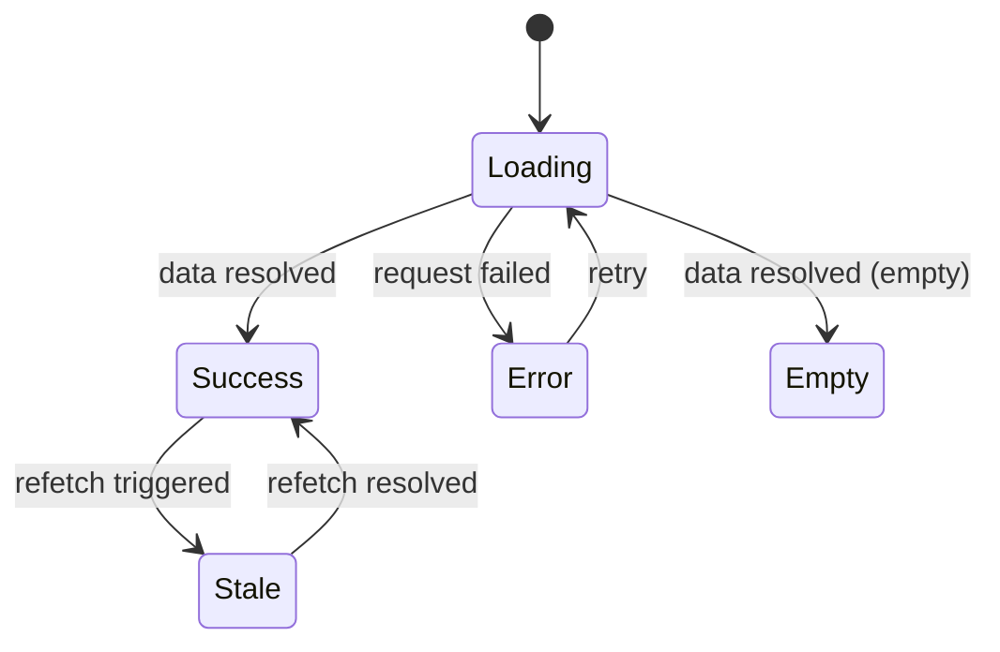

# [task-id] — [User Story]

> **1 task = 1 user story = 1 doc.** This is the single source of truth for the story: requirement, design (FE and/or BE), implementation plan with subtasks, and test plans all live here.

## Metadata
| Field | Value |
|-------|-------|
| **Sprint** | SP[N] |
| **Task Type** | fullstack / fe-only / be-only / infra |
| **Points** | 1 / 2 / 3 / 5 / 8 |
| **Estimate** | ___ days |
| **Priority** | critical / high / medium / low |
| **Assignee** | - |
| **Requester** | - |
| **Status** | todo / in-progress / review / testing / done |

<!-- Section scope by points: see /requirement command. Sections tagged [FE] only fill for fullstack/fe-only. Sections tagged [BE] only fill for fullstack/be-only. -->

---

# 1 · Story & Requirements

## Problem Statement
<!-- 1pt+ -->

## Overview
<!-- 1pt+ — One paragraph. -->

## Value
<!-- 1pt+ — Why this story matters. 1–3 bullets. Concrete; include metric if known. -->
- **User impact:** [what the user gains]
- **Business outcome:** [metric or strategic outcome — e.g. "-20% support tickets", "unlocks premium tier"]
- **Why now:** [optional — urgency or dependency trigger]

## User Stories
<!-- 2pt+ -->
| # | Story | Maps to AC |
|---|-------|-----------|
| US-1 | As a __, I want __, so that __. | |

## Feature Flow
<!-- 3pt+ — mermaid flowchart of main user flow -->

## System Behavior
<!-- 3pt+ -->
| Trigger | System Response | Side Effects | Timing |
|---------|----------------|-------------|--------|
|         |                |             | sync / async |

## Acceptance Criteria
<!-- 1pt+ — Format: GIVEN / WHEN / THEN / AND. Every AC maps to at least one E2E or integration test. -->

- [ ] **AC-1: [scenario title]**
  GIVEN [context]
  WHEN [action]
  THEN [outcome]

- [ ] **AC-2: [scenario title]**
  GIVEN [context]
  WHEN [action]
  THEN [outcome]

- [ ] **AC-3: [scenario title]**
  GIVEN [context]
  WHEN [action]
  THEN [outcome]

## Data & Business Rules
<!-- 3pt+ -->
| Rule ID | Rule | Example | Applies to AC |
|---------|------|---------|--------------|
| R-1     |      |         |              |

## Success Metrics
<!-- 3pt+ -->
- [ ] Metric-1:
- [ ] Metric-2:

## Out of Scope
<!-- 1pt+ -->
-

## Dependencies
<!-- 2pt+ -->
-

## Definition of Done
<!-- 1pt+ -->
- [ ] Code reviewed and approved
- [ ] All acceptance criteria verified
- [ ] Tests pass (unit + integration + E2E where applicable)
- [ ] No regressions in existing tests
- [ ] Documentation updated (if applicable)
- [ ] Branch merged to main

---

# 2 · Existing Code Context
<!-- 1pt+ required. Reuse first, build new second. Fill what applies to Task Type. -->

## [FE] Components available
| Component | File path | Notes |
|-----------|-----------|-------|
|           |           |       |

## [FE] Hooks available
| Hook | File path | Notes |
|------|-----------|-------|
|      |           |       |

## [BE] Services / Repositories available
| Class / Function | File path | Notes |
|------------------|-----------|-------|
|                  |           |       |

## Project patterns to follow
-

---

# 3 · Frontend Design
<!-- [FE] Fill this section for fullstack or fe-only tasks. Mark `N/A — BE-only task` otherwise. -->

## Approach
<!-- 1pt+ -->

## Design References
- Figma: [link]
- Storybook: [link]

## UI/UX Overview
<!-- 3pt+ -->

## User Journey Map
<!-- 5pt+ — entry point → main flow → exit point. Use mermaid journey diagram. -->

**Entry point:**
**Exit point:**

## Behavior Mapping
<!-- 5pt+ -->

### Entry Paths
| Entry path | How they get here | Pre-loaded state / context |
|------------|-------------------|----------------------------|
|            |                   |                            |

### Behavior Flow
<!-- mermaid flowchart showing all interactions including fail states -->

### Fail State Summary
| Fail state | What user sees | Feeling | Can recover? |
|------------|----------------|---------|--------------|
|            |                |         |              |

## State Inventory
<!-- 2pt+ required. Every interactive component must enumerate ALL 5 states. -->
<!-- Mark a cell `N/A — [reason]` only if the state truly cannot occur. Empty cell = gap. -->

| Component | Loading | Empty | Error | Success | Partial / Stale | Notes |
|-----------|---------|-------|-------|---------|-----------------|-------|
|           |         |       |       |         |                 |       |

### State Transitions
<!-- 2pt+ required for any component with > 2 states or async actions. -->
<!-- mermaid stateDiagram-v2 — show every transition: triggers, guards, terminal states. -->


```mermaid
stateDiagram-v2
    [*] --> Loading
    Loading --> Success: data resolved
    Loading --> Error: request failed
    Loading --> Empty: data resolved (empty)
    Error --> Loading: retry
    Success --> Stale: refetch triggered
    Stale --> Success: refetch resolved
```

## Routing & Navigation
<!-- 5pt+ -->
| Route | Component | Auth required | Notes |
|-------|-----------|---------------|-------|
|       |           |               |       |

## Component Breakdown
<!-- 2pt+ -->
| Component | File path | Type | Description |
|-----------|-----------|------|-------------|
|           |           | new / modify |   |

## Async Interaction Sequence
<!-- 3pt+ — mermaid sequenceDiagram: user actions → API calls → state updates -->

## State & Data Flow
<!-- 2pt+ -->
<!-- mermaid flowchart: [API/Store] → [Container] → [Props] → [UI] → [Action] → [Dispatch] -->

## API Contracts Consumed
<!-- 2pt+ — these must match Section 4 API Endpoints exactly -->
| Method | Endpoint | Request | Response | Error handling |
|--------|----------|---------|----------|----------------|
|        |          |         |          |                |

## Loading & Skeleton States
<!-- 3pt+ -->
| State | Behavior |
|-------|----------|
| Initial load | |
| Submitting | |
| Error | |
| Empty | |

## Responsive Behavior
<!-- 5pt+ -->
| Breakpoint | Behavior |
|------------|----------|
| Mobile (< 768px) | |
| Tablet (768–1024px) | |
| Desktop (> 1024px) | |

## Analytics Events
<!-- 5pt+ -->
| Event name | Trigger | Payload |
|------------|---------|---------|
|            |         |         |

## FE Environment / Config
<!-- 2pt+ -->
| Variable | Purpose | Required | Default |
|----------|---------|----------|---------|
|          |         |          |         |

## FE Fail Cases & Fail Flows
<!-- 3pt+ -->

### Fail Case Matrix
| Action | Fail Scenario | Presentation | Error Message | Recovery CTA | Input Preserved? |
|--------|---------------|--------------|---------------|--------------|------------------|
|        |               | toast / inline / modal / page-level | | | |

### Optimistic Update Rollback
- **Used:** yes / no
- **Rollback trigger:**
- **Rollback behavior:**

### Partial Success Handling
- **Scenario:**
- **UI behavior:**

## FE Edge Cases & Error States
<!-- 5pt+ -->
- Network timeout:
- Empty list:
- 401:
- 500:
- Session expired mid-flow:

## Accessibility Notes
<!-- 5pt+ -->
-

## FE Performance Considerations
<!-- 5pt+ -->
-

## FE Design Decisions
<!-- 8pt — ADR entries for non-obvious choices -->
| Decision | Why | Alternatives Rejected |
|----------|-----|-----------------------|
|          |     |                       |

---

# 4 · Backend Design
<!-- [BE] Fill this section for fullstack or be-only tasks. Mark `N/A — FE-only task` otherwise. -->

## API Endpoints
<!-- 1pt+ — repeat block for each endpoint. Must exactly match FE API Contracts Consumed. -->

### `METHOD /api/v1/path`
- **Purpose:**
- **Auth required:** yes / no
- **Roles allowed:** admin / user / public
- **Idempotent:** yes / no
- **Rate limit:** X req/min

**Request body:**
```json
{}
```

**Request schema:**
| Field | Type | Required | Constraints | Description |
|-------|------|----------|-------------|-------------|
|       |      |          |             |             |

**Response (200):**
```json
{}
```

**Error responses:**
| Code | Condition | Response body |
|------|-----------|---------------|
| 400  |           |               |
| 401  |           |               |
| 403  |           |               |
| 404  |           |               |
| 500  |           |               |

## API Versioning Strategy
<!-- 2pt+ -->
- **Version:**
- **Versioning approach:** URL path / header / query param
- **Deprecation plan:**

## Data Contracts
<!-- 5pt+ — inter-service contracts only -->
| Contract | Direction | Format | Version | Owner |
|----------|-----------|--------|---------|-------|
|          |           |        |         |       |

## Authorization & Roles
<!-- 5pt+ -->
| Endpoint | public | user | admin | notes |
|----------|--------|------|-------|-------|
|          |        |      |       |       |

## Input Validation Rules
<!-- 2pt+ -->
| Field | Type | Required | Rules | Error message |
|-------|------|----------|-------|---------------|
|       |      |          |       |               |

## Data Models
<!-- 3pt+ — mermaid erDiagram + state lifecycle if applicable -->

**Indexes:**
-

## Sequence Diagram
<!-- 5pt+ — Client → Middleware → Controller → Service → Repository → DB → response -->

## Service / Layer Breakdown
<!-- 3pt+ -->
| Layer | Responsibility |
|-------|----------------|
| **Middleware** | |
| **Controller** | |
| **Service** | |
| **Repository** | |

## Class Diagram
<!-- 8pt+ — mermaid classDiagram -->

## Business Logic
<!-- 3pt+ — pseudocode rules, not prose -->
1.

## Event Publishing
<!-- 5pt+ -->
| Event | Topic / Queue | Trigger | Payload | Consumer |
|-------|--------------|---------|---------|----------|
|       |              |         |         |          |

## Error Handling Strategy
<!-- 3pt+ -->

### Error Response Envelope
```json
{
  "error": "Human-readable message",
  "code": "SCREAMING_SNAKE_CASE",
  "fields": [{ "field": "name", "message": "detail" }]
}
```

### Error Code Catalog
| HTTP | Code | When to use |
|------|------|-------------|
| 400  | `VALIDATION_ERROR` | |
| 401  | `UNAUTHORIZED` | |
| 403  | `FORBIDDEN` | |
| 404  | `NOT_FOUND` | |
| 422  | `BUSINESS_RULE_VIOLATION` | |
| 429  | `RATE_LIMITED` | |
| 500  | `INTERNAL_ERROR` | |

### Per-Layer Error Responsibility
| Layer | Throws |
|-------|--------|
| **Middleware** | 401, 429 |
| **Controller** | 400 (input shape) |
| **Service** | 400 INVALID_INPUT, 403, 404, 409, 422 |
| **Repository** | Re-throws as 500 |

## Security Considerations
<!-- 5pt+ -->
- [ ] All user input sanitized
- [ ] Rate limiting on write endpoints
- [ ] Sensitive fields never returned in responses
- [ ] PII fields: [list]

## Logging & Observability
<!-- 5pt+ -->
| Event | Level | Fields logged |
|-------|-------|---------------|
| Request received | `info` | method, path, userId, requestId |
| Validation error | `warn` | path, fields, userId |
| Unexpected error | `error` | message, stack, userId |

## BE Environment Variables
<!-- 5pt+ -->
| Variable | Description | Required | Default |
|----------|-------------|----------|---------|
|          |             |          |         |

## Caching Strategy
<!-- 5pt+ -->
| Data | Cache key | TTL | Invalidated when |
|------|-----------|-----|------------------|
|      |           |     |                  |

## Database Migrations
<!-- 5pt+ -->

**Up:**
```sql
-- describe what this migration does
```

**Down (rollback):**
```sql
-- revert the above change exactly
```

## External Dependencies
<!-- 5pt+ -->
| Service | Purpose | Failure behavior | Timeout |
|---------|---------|------------------|---------|
|         |         |                  |         |

## BE Performance & Scalability Notes
<!-- 5pt+ -->
| Concern | Detail |
|---------|--------|
| Expected data volume | |
| Query N+1 risk | |
| Index strategy | |

## BE Design Decisions
<!-- 8pt — ADR entries -->
| Decision | Why | Alternatives Rejected |
|----------|-----|-----------------------|
|          |     |                       |

---

# 5 · Scope Overview & Implementation Plan

## Scope Overview
<!-- 2pt+ — 3–6 bullets. High-level scope for orientation BEFORE the detailed Implementation Plan. Group by layer or feature area (FE: Routing / Components / State / API / E2E. BE: DB / Models / Service / Controller / Tests). Each bullet = one paragraph-level chunk of work, not a micro-step. Bullets must match the Implementation Plan's phases. -->

### [FE] Scope
- **[Area]:** [what gets built at the high level]

### [BE] Scope
- **[Area]:** [what gets built at the high level]

## Implementation Plan (engineering tasks + subtasks)
<!-- 3pt+ — each row is a Scrum engineering task (layer-level). Implementers follow checkboxes in sequence. File paths must be REAL paths from Existing Code Context. `/implement` follows this plan exactly. Every subtask = single action, 2–5 min. -->

### [FE] Plan

| # | Phase | File path | Action | What to implement | References |
|---|-------|-----------|--------|-------------------|------------|
| 1 | Routing | | | | |
| 2 | Components | | | | |
| 3 | State | | | | |
| 4 | API calls | | | | |
| 5 | Loading/Error | | | | |

**[FE] Subtasks (checkboxes — follow in order):**
- [ ] Write failing test for AC-1 → [file path] → run: [test command]
- [ ] Run test — confirm RED → [test command]
- [ ] Implement minimal code → [file path]
- [ ] Run test — confirm GREEN → [test command]
- [ ] Commit: "test: add [X] tests"
- [ ] ...

### [BE] Plan

| # | Phase | File path | Action | What to implement | References |
|---|-------|-----------|--------|-------------------|------------|
| 1 | Migrations | | create | | |
| 2 | Models | | create / modify | | |
| 3 | Repository | | create / modify | | |
| 4 | Service | | create / modify | | |
| 5 | Controller | | create / modify | | |
| 6 | Middleware | | create / modify | | |

**[BE] Subtasks (checkboxes — follow in order):**
- [ ] Write failing test for AC-1 → [file path] → run: [test command]
- [ ] Run test — confirm RED → [test command]
- [ ] Implement minimal code → [file path]
- [ ] Run test — confirm GREEN → [test command]
- [ ] Commit: "test: add [X] tests"
- [ ] ...

---

# 6 · Test Plans

## TDD Test Plan
<!-- 2pt+ — write BEFORE implementing. Min 1 unit + 1 integration per AC. Integration tests use REAL dependencies (real DB/queue/HTTP). No mocks at integration layer. -->

### [FE] TDD Tests
| Test Case | AC | Type | Description |
|-----------|----|------|-------------|
|           |    | unit / integration | |

### [BE] TDD Tests
| Test Case | AC | Type | Description |
|-----------|----|------|-------------|
|           |    | unit / integration | |

## E2E Test Plan
<!-- 3pt+ — minimum 1 scenario per AC. Cross-layer scenarios when both FE and BE exist. -->

| Scenario | AC | Steps | Expected Outcome |
|----------|----|-------|------------------|
|          |    |       |                  |

## Test Data / Seed Requirements
<!-- 3pt+ -->
| What | Value / Setup | Who sets it up |
|------|---------------|----------------|
|      |               |                |

---

# 7 · Non-Functional, Rollout, and Open Items

## Non-Functional Requirements
<!-- 5pt+ -->
| Category | Requirement | Target | How to Verify |
|----------|-------------|--------|---------------|
| Performance | | | |
| Security | | | |
| Accessibility | | | |

## UI Copy
<!-- 5pt+ (FE tasks) -->
| Location | Copy |
|----------|------|
| Page heading | |
| Submit button | |
| Error message | |
| Success message | |

## DO / DON'T
<!-- 5pt+ -->
| DO | DON'T |
|----|-------|
|    |       |

## Rollout / Release Strategy
<!-- 5pt+ -->
- **Strategy:** all-at-once / feature flag / gradual rollout
- **Feature flag name:**
- **Rollback plan:**

## Open Questions
<!-- 5pt+ -->
| # | Question | Owner | Deadline | Decision |
|---|----------|-------|----------|----------|
|   |          |       |          |          |
