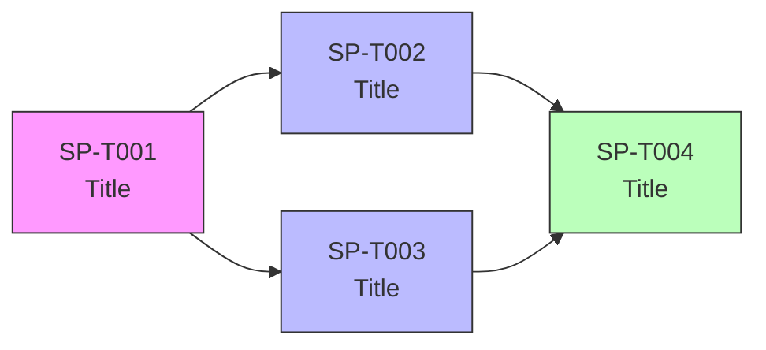
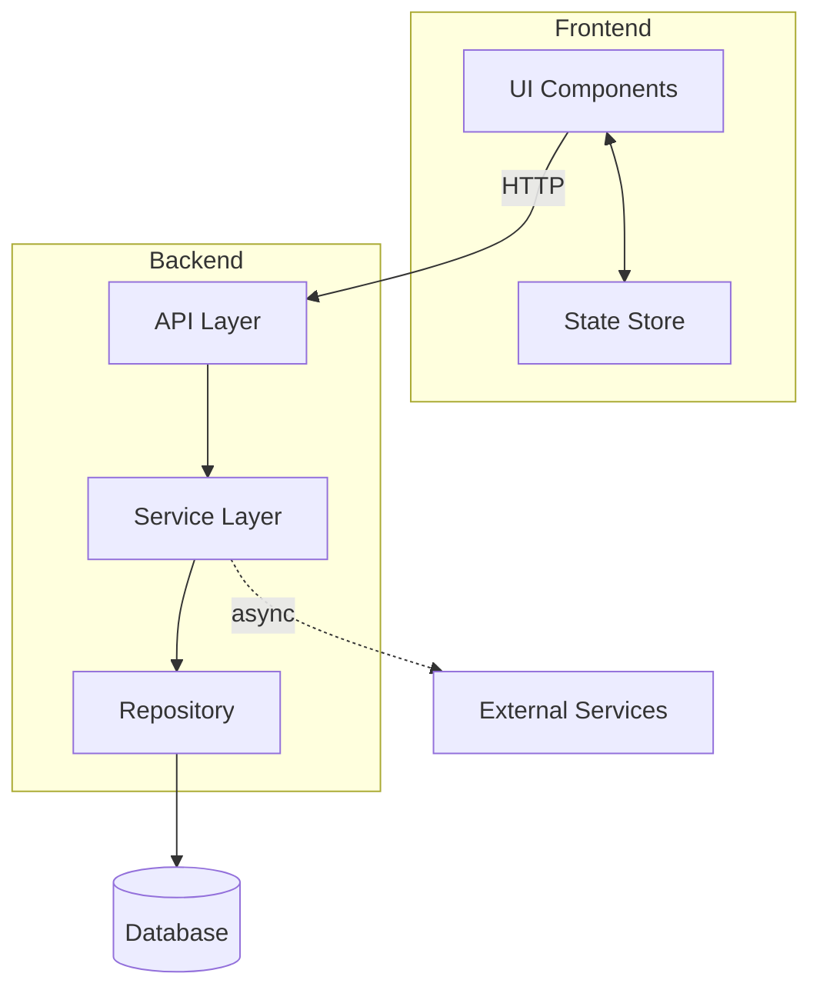

# [sprint-id] — [Epic Title]

## Metadata
| Field | Value |
|-------|-------|
| **Sprint ID** | sprint-XX |
| **Status** | planning / active / done |
| **Start Date** | YYYY-MM-DD |
| **End Date** | YYYY-MM-DD |
| **Team** | - |
| **Epic Owner** | - |

## Problem Statement
<!-- WHY are we building this? What user or business problem does this sprint solve? -->

## Goals
<!-- What does success look like at the end of this sprint? 3–5 clear goals. -->
1.
2.
3.

## Success Metrics
<!-- How do we measure that this sprint delivered value in production? -->
| Metric | Target | Measurement |
|--------|--------|-------------|
| - | - | - |

## Design References
<!-- Overall Figma, wireframes, or prototype links for this epic. -->
- Figma: [link]
- Prototype: [link]

## Scope

### In Scope
-

### Out of Scope
-

## Sub-tasks

| Task ID | Title | Type | E2E Scenario | Depends On | Points | Status |
|---------|-------|------|--------------|------------|--------|--------|
| SP[N]-T001 | - | feat / fix / chore | [brief E2E scenario] | — | 1/2/3/5/8 | `todo` |
| SP[N]-T002 | - | feat / fix / chore | [brief E2E scenario] | SP[N]-T001 | 1/2/3/5/8 | `todo` |
| SP[N]-T003 | - | feat / fix / chore | [brief E2E scenario] | SP[N]-T001 | 1/2/3/5/8 | `todo` |
| SP[N]-T004 | - | feat / fix / chore | [brief E2E scenario] | SP[N]-T002, SP[N]-T003 | 1/2/3/5/8 | `todo` |

## Architecture Overview
<!-- System-level diagram showing how components introduced in this sprint fit together. -->

## Architecture Decision Records
### ADR-1: [Title]
- **Status:** proposed / accepted / superseded
- **Context:** [Why is this decision needed?]
- **Decision:** [What was decided]
- **Consequences:** [Positive and negative outcomes]

## Technical Constraints
<!-- Architectural decisions, existing system limitations, or non-negotiables. -->
-

## Risks & Mitigations
| Risk | Likelihood | Impact | Mitigation |
|------|-----------|--------|------------|
| - | - | - | - |

## Definition of Done (Sprint Level)

**"Done" means the sprint delivered its stated goals — not just that tasks were closed.**

### Completeness
- [ ] All sub-tasks are `done` (each verified against their own task-level DoD)
- [ ] Every in-scope item from the discovery doc is covered — nothing silently dropped

### Correctness
- [ ] All sprint Goals (listed above) are observably achieved — not assumed
- [ ] Every Success Metric shows an actual result (number), not just "instrumented"
- [ ] No P0 or P1 bugs open against this sprint's scope
- [ ] Full regression suite passes — no existing feature broken by this sprint

### Delivery
- [ ] Deployed to production (or staging if prod deploy is gated)
- [ ] Smoke-tested end-to-end in the deployed environment
- [ ] Sprint retro written — includes what went well, what didn't, and follow-up actions

## Change Log
| Date | Change | Reason | Impact | Decided by |
|------|--------|--------|--------|------------|
| YYYY-MM-DD | - | - | - | - |

_If no changes: leave empty — a clean log means the sprint was well-scoped._
